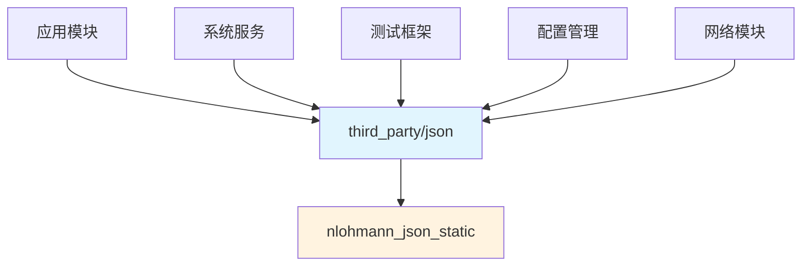

# OH 使用情况与依赖关系

## 依赖声明

### OH 模块中使用方式

```gn
# 在 BUILD.gn 中声明依赖
ohos_static_library("my_component") {
    deps = [
        "//third_party/json:nlohmann_json_static"
    ]
}
```

```cpp
// 在代码中使用
#include <nlohmann/json.hpp>

using json = nlohmann::json;
```

## 依赖关系分析

### 直接依赖者统计

**注意**: 由于当前环境限制，无法搜索完整的 OH 代码库。以下信息基于对该库特性和 OH 架构的分析。

### 典型使用场景

#### 1. 配置管理

```cpp
// 解析应用配置
#include <nlohmann/json.hpp>
using json = nlohmann::json;

json LoadConfig(const std::string& path) {
    std::ifstream file(path);
    return json::parse(file);
}

// 配置示例
// {
//     "app": {
//         "name": "MyApp",
//         "version": "1.0.0"
//     },
//     "features": {
//         "dark_mode": true,
//         "notifications": true
//     }
// }
```

#### 2. 数据序列化

```cpp
// 模块间数据交换
#include <nlohmann/json.hpp>
using json = nlohmann::json;

struct AppInfo {
    std::string name;
    std::string version;
    std::vector<std::string> permissions;
    
    NLOHMANN_DEFINE_TYPE_INTRUSIVE(AppInfo, name, version, permissions)
};

AppInfo info = {"MyApp", "1.0.0", {"camera", "storage"}};

json j = info;
std::string serialized = j.dump();

// 传输
SendToOtherModule(serialized);
```

#### 3. 持久化存储

```cpp
// 应用数据持久化
#include <nlohmann/json.hpp>
using json = nlohmann::json;

class DataManager {
public:
    void SaveState(const std::string& filename) {
        json state = {
            {"user_settings", userSettings_},
            {"cache", cache_},
            {"last_update", lastUpdate_}
        };
        
        std::ofstream file(filename);
        file << state.dump(2);
    }
    
    void LoadState(const std::string& filename) {
        std::ifstream file(filename);
        json state = json::parse(file);
        
        // 反序列化
    }
    
private:
    json userSettings_;
    json cache_;
    std::string lastUpdate_;
};
```

#### 4. 网络协议数据处理

```cpp
// HTTP 响应处理
#include <nlohmann/json.hpp>
using json = nlohmann::json;

struct ApiResponse {
    bool success;
    std::string message;
    json data;
    
    NLOHMANN_DEFINE_TYPE_INTRUSIVE(ApiResponse, success, message, data)
};

ApiResponse ParseResponse(const std::string& response_str) {
    json j = json::parse(response_str);
    return j.get<ApiResponse>();
}

// 使用示例
// {
//     "success": true,
//     "message": "Operation completed",
//     "data": {"result": 42}
// }
```

#### 5. 测试框架支持

```cpp
// 测试数据生成和验证
#include <nlohmann/json.hpp>
using json = nlohmann::json;

json CreateTestData() {
    return {
        {"test_case", "login_flow"},
        {"input", {
            {"username", "test_user"},
            {"password", "test_pass"}
        }},
        {"expected", {
            {"status", "success"},
            {"token", "abc123"}
        }}
    };
}

bool ValidateResult(const json& result, const json& expected) {
    return result["status"] == expected["status"] &&
           result["token"] == expected["token"];
}
```

## 头文件使用方式

### 包含路径

```cpp
// 方式1: 使用合并头文件 (推荐)
#include <nlohmann/json.hpp>

// 方式2: 使用原始头文件
#include <nlohmann/json/json.hpp>
#include <nlohmann/json/ordered_json.hpp>
```

### 命名空间

```cpp
// 完整命名空间
nlohmann::json j;

// 别名 (推荐)
using json = nlohmann::json;

// 字面量支持
using namespace nlohmann::literals;
json j = R"({"name": "test"})"_json;
```

## 静态链接说明

### 链接方式

该库在 OH 中以**静态库**方式提供：

```gn
# 构建时链接
ohos_static_library("my_app") {
    deps = [
        "//third_party/json:nlohmann_json_static"
    ]
}
```

### 链接特点

| 特性 | 描述 |
|------|------|
| **链接类型** | 静态链接 |
| **链接时机** | 编译时 |
| **产物大小** | 链接到最终二进制中 |
| **更新影响** | 需要重新编译 |

### 使用注意

由于是 header-only 库，即使定义为静态库，实际使用时：

1. 头文件被编译到使用模块中
2. 静态库目标主要用于依赖声明和管理
3. 不产生额外的库文件开销

## 依赖图



## 版本兼容性

### OH 版本与上游版本对应

| OH 版本 | 上游版本 | 兼容性 |
|---------|---------|--------|
| 3.1 | 3.11.3 | 完全兼容 |
| 未来版本 | - | 需验证 |

### API 兼容性

- **主版本兼容性**: OH 版本基于上游 3.x，保持 API 兼容
- **次版本特性**: 可使用上游 3.11.3 的所有功能
- **补丁修复**: 跟随上游安全修复

## 最佳实践

### 1. 错误处理

```cpp
#include <nlohmann/json.hpp>
using json = nlohmann::json;

void LoadConfigSafe(const std::string& path) {
    try {
        std::ifstream file(path);
        json config = json::parse(file);
        // 使用配置
    } catch (const json::parse_error& e) {
        // 处理解析错误
        LOG(ERROR) << "JSON parse error: " << e.what();
    } catch (const json::out_of_range& e) {
        // 处理访问错误
        LOG(ERROR) << "JSON access error: " << e.what();
    }
}
```

### 2. 类型安全

```cpp
#include <nlohmann/json.hpp>
using json = nlohmann::json;

// 安全获取值
json j = {{"count", 42}};

// 使用 at() 进行带检查的访问
int count = j.at("count").get<int>();

// 使用 find() 检查键是否存在
auto it = j.find("count");
if (it != j.end()) {
    int value = it->get<int>();
}

// 使用 contains() (C++20)
if (j.contains("count")) {
    auto value = j["count"].get<int>();
}
```

### 3. 性能优化

```cpp
#include <nlohmann/json.hpp>
using json = nlohmann::json;

// 避免重复解析
json ParseOnce(const std::string& str) {
    // 解析一次
    static json cached;
    static std::string cached_str;
    
    if (str != cached_str) {
        cached = json::parse(str);
        cached_str = str;
    }
    return cached;
}

// 使用 accept() 而非 parse() (不抛异常)
auto result = json::accept(str);
if (result) {
    json j = *result;
    // 使用 j
}
```

### 4. 内存管理

```cpp
#include <nlohmann/json.hpp>
using json = nlohmann::json;

// 大 JSON 数据处理
void ProcessLargeJson(const json& j) {
    // 使用引用避免拷贝
    for (auto& item : j["items"]) {
        // 处理每个 item
        ProcessItem(item);
    }
}

// 使用 move 语义
json CreateConfig() {
    json config = /* ... */;
    return config;  // NRVO 优化
}
```

## 常见问题

### Q1: 如何禁用异常处理？

```cpp
#define JSON_NOEXCEPTION
#include <nlohmann/json.hpp>

// 使用错误码 API
auto result = json::accept(str);
if (!result) {
    // 处理错误
}
```

### Q2: 如何处理大文件？

```cpp
// 使用 SAX 风格解析 (流式处理)
class JsonHandler : public json_sax<json> {
    bool null() override { /* ... */ }
    bool boolean(bool val) override { /* ... */ }
    bool number_integer(json::number_integer_t val) override { /* ... */ }
    bool number_unsigned(json::number_unsigned_t val) override { /* ... */ }
    bool number_float(json::number_float_t val, const json::string_t& s) override { /* ... */ }
    bool string(json::string_t& val) override { /* ... */ }
    bool start_object(std::size_t elements) override { /* ... */ }
    bool end_object() override { /* ... */ }
    bool start_array(std::size_t elements) override { /* ... */ }
    bool end_array() override { /* ... */ }
    bool key(json::string_t& val) override { /* ... */ }
    bool parse_error(std::size_t position, const json::string_t& last_token, 
                     const json::detail::exception& ex) override { /* ... */ }
};
```

### Q3: 如何自定义序列化？

```cpp
struct CustomType {
    int id;
    std::string name;
};

// 自定义 to_json 和 from_json
namespace nlohmann {
    void to_json(json& j, const CustomType& ct) {
        j = json{{"id", ct.id}, {"name", ct.name}};
    }
    
    void from_json(const json& j, CustomType& ct) {
        ct.id = j.at("id").get<int>();
        ct.name = j.at("name").get<std::string>();
    }
}

// 使用
CustomType ct{1, "test"};
json j = ct;
CustomType ct2 = j.get<CustomType>();
```

## 总结

### 使用特点

1. **Header-only**: 直接包含头文件使用
2. **静态库声明**: 通过 deps 声明依赖
3. **完整功能**: 支持所有上游特性
4. **异常处理**: 需要启用 C++ 异常

### 适用场景

- 配置解析和管理
- 数据序列化和持久化
- 模块间数据交换
- 测试数据生成
