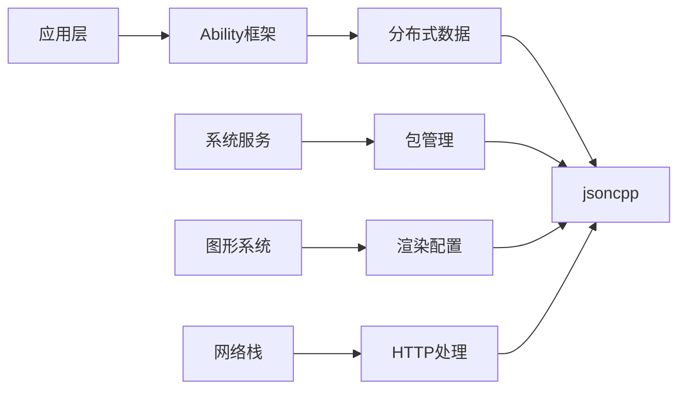

# 依赖关系与使用

## 概述

jsoncpp 是 OpenHarmony 系统中被广泛依赖的基础库之一。通过代码库搜索，发现 **50+** 个模块直接依赖 jsoncpp，覆盖系统配置、数据管理、图形渲染、通信协议等多个核心领域。

## 直接依赖者

### 主要依赖模块（按子系统分类）

#### 1. foundation（基础能力）

| 模块 | BUILD.gn 路径 | 用途 |
|------|---------------|------|
| **distributeddatamgr** | `foundation/distributeddatamgr/kv_store/frameworks/libs/distributeddb/build/linux/BUILD.gn` | 分布式数据库配置 |
| **bundlemanager** | `foundation/bundlemanager/bundle_framework/services/bundlemgr/BUILD.gn` | 包管理配置解析 |
| **ability_base** | `foundation/ability/ability_base/BUILD.gn` | 能力框架数据交换 |
| **CastEngine** | `foundation/CastEngine/castengine_cast_plus_stream/BUILD.gn` | 投屏协议配置 |
| **graphic_2d** | `foundation/graphic/graphic_2d/frameworks/text/service/texgine/BUILD.gn` | 2D 图形文本配置 |
| **filemanagement** | `foundation/filemanagement/app_file_service/interfaces/kits/js/BUILD.gn` | 文件管理配置 |
| **netstack** | `foundation/communication/netstack/frameworks/cj/http/BUILD.gn` | HTTP 协议处理 |
| **media_player** | `foundation/multimedia/player_framework/services/services/BUILD.gn` | 媒体配置解析 |
| **form_fwk** | `foundation/ability/form_fwk/BUILD.gn` | 卡片框架配置 |
| **resource_schedule** | `foundation/resourceschedule/resource_schedule_service/ressched/services/BUILD.gn` | 资源调度配置 |

#### 2. third_party（第三方库）

| 模块 | BUILD.gn 路径 | 用途 |
|------|---------------|------|
| **skia** | `third_party/skia/m133/BUILD.gn` | 图形渲染配置 |

#### 3. base（基础模块）

| 模块 | BUILD.gn 路径 | 用途 |
|------|---------------|------|
| **useriam** | `base/useriam/companion_device_auth/frameworks/js/napi/BUILD.gn` | 用户认证配置 |
| **print** | `base/print/print_fwk/services/print_service/BUILD.gn` | 打印服务配置 |
| **webview** | `base/web/webview/arkweb_utils/BUILD.gn` | WebView 配置 |
| **enterprise** | `base/customization/enterprise_device_management/test/BUILD.gn` | 企业管理配置 |

#### 4. applications（应用层）

| 模块 | BUILD.gn 路径 | 用途 |
|------|---------------|------|
| **contacts_data** | `applications/standard/contacts_data/BUILD.gn` | 联系人数据存储 |
| **calendardata** | `applications/standard/calendardata/BUILD.gn` | 日历数据存储 |

#### 5. drivers（驱动层）

| 模块 | BUILD.gn 路径 | 用途 |
|------|---------------|------|
| **external_device** | `drivers/external_device_manager/test/unittest/BUILD.gn` | 设备管理测试 |

#### 6. test（测试模块）

| 模块 | BUILD.gn 路径 | 用途 |
|------|---------------|------|
| **distributedcameratest** | `test/xts/dcts/distributedhardware/distributedcameratest/BUILD.gn` | 分布式相机测试 |
| **hats 模块** | `test/xts/hats/**/BUILD.gn` | 系统测试 |
| **dcts 模块** | `test/xts/dcts/**/BUILD.gn` | 设备测试 |

### 依赖方式分类

#### 按库类型

| 库类型 | 数量 | 说明 |
|--------|------|------|
| 静态库 (`jsoncpp_static`) | 40+ | 大多数模块使用静态链接 |
| 共享库 (`jsoncpp`) | 10+ | 部分模块使用动态链接 |

#### 按使用方式

| 使用方式 | 示例 |
|----------|------|
| 直接链接 | `deps = ["//third_party/jsoncpp:jsoncpp_static"]` |
| 配置引用 | `configs = ["//third_party/jsoncpp:jsoncpp_public_config"]` |
| 头文件引用 | `include_dirs = ["//third_party/jsoncpp/include"]` |

## 典型使用场景

### 场景 1：系统配置解析

**模块**：bundlemanager、form_fwk

```cpp
#include <json/json.h>

// 解析 module.json
bool ParseModuleConfig(const std::string& json_str, ModuleConfig& config) {
    Json::Value root;
    Json::Reader reader;
    
    if (!reader.parse(json_str, root)) {
        LOGE("Failed to parse module config");
        return false;
    }
    
    // 提取配置信息
    config.name = root["moduleName"].asString();
    config.type = root["type"].asString();
    config.version = root["version"].asInt();
    
    // 处理嵌套配置
    if (root.isMember("abilities")) {
        for (const auto& ability : root["abilities"]) {
            config.abilities.push_back(ability["name"].asString());
        }
    }
    
    return true;
}
```

### 场景 2：分布式数据同步

**模块**：distributeddatamgr

```cpp
#include <json/json.h>

// 设备发现配置
class DeviceDiscovery {
public:
    bool LoadConfig(const std::string& config_path) {
        std::string config_str = ReadFile(config_path);
        Json::Value config;
        Json::Reader reader;
        
        if (!reader.parse(config_str, config)) {
            return false;
        }
        
        // 解析同步配置
        sync_config_.timeout = config["timeout"].asInt();
        sync_config_.auto_reconnect = config["autoReconnect"].asBool();
        sync_config_.sync_mode = config["syncMode"].asString();
        
        return true;
    }
    
private:
    Json::Value sync_config_;
};
```

### 场景 3：Ability 数据交换

**模块**：ability_base

```cpp
#include <json/json.h>

// Ability 间数据传递
class AbilityDataUtils {
public:
    // 序列化 Ability 数据
    std::string SerializeData(const WantParams& params) {
        Json::Value root;
        
        for (const auto& param : params.GetParams()) {
            std::string key = param.first;
            IParcelable* value = param.second.GetObject();
            
            // 根据类型序列化
            switch (value->GetType()) {
                case IParcelable::INT:
                    root[key] = param.second.GetInt();
                    break;
                case IParcelable::STRING:
                    root[key] = param.second.GetString();
                    break;
                case IParcelable::BOOL:
                    root[key] = param.second.GetBool();
                    break;
            }
        }
        
        return root.toStyledString();
    }
    
    // 反序列化 Ability 数据
    WantParams DeserializeData(const std::string& json_str) {
        WantParams params;
        Json::Value root;
        Json::Reader reader;
        
        reader.parse(json_str, root);
        
        for (const auto& key : root.getMemberNames()) {
            const Json::Value& value = root[key];
            if (value.isInt()) {
                params.SetParam(key, IntWrapper(value.asInt()));
            } else if (value.isString()) {
                params.SetParam(key, StringWrapper(value.asString()));
            } else if (value.isBool()) {
                params.SetParam(key, BoolWrapper(value.asBool()));
            }
        }
        
        return params;
    }
};
```

### 场景 4：网络协议处理

**模块**：netstack

```cpp
#include <json/json.h>

// HTTP 响应处理
class HttpResponseParser {
public:
    bool Parse(const std::string& response_body) {
        Json::Value root;
        Json::Reader reader;
        
        if (!reader.parse(response_body, root)) {
            return false;
        }
        
        // 解析 JSON API 响应
        if (root.isMember("status")) {
            status_code_ = root["status"].asInt();
        }
        
        if (root.isMember("data")) {
            ParseData(root["data"]);
        }
        
        if (root.isMember("error")) {
            error_message_ = root["error"]["message"].asString();
        }
        
        return true;
    }
    
private:
    void ParseData(const Json::Value& data) {
        // 递归解析嵌套数据
        for (const auto& key : data.getMemberNames()) {
            const Json::Value& value = data[key];
            // 处理各种数据类型...
        }
    }
    
    int status_code_;
    std::string error_message_;
};
```

### 场景 5：图形配置

**模块**：graphic_2d、skia

```cpp
#include <json/json.h>

// 渲染配置
class RenderConfig {
public:
    void LoadConfig() {
        std::string config_str = GetConfigFromResource("render_config.json");
        Json::Value config;
        Json::Reader reader;
        
        reader.parse(config_str, config);
        
        // 解析渲染配置
        render_config_.antialias = config["antialias"].asBool();
        render_config_.hinting = config["hinting"].asString();
        render_config_.subpixel = config["subpixel"].asBool();
        
        // 解析字体配置
        if (config.isMember("fonts")) {
            for (const auto& font : config["fonts"]) {
                render_config_.fonts.push_back({
                    font["family"].asString(),
                    font["size"].asInt()
                });
            }
        }
    }
    
private:
    struct {
        bool antialias;
        std::string hinting;
        bool subpixel;
        std::vector<std::pair<std::string, int>> fonts;
    } render_config_;
};
```

## 依赖关系图

### 系统依赖图

```mermaid
graph TD
    subgraph "third_party"
        A[jsoncpp]
    end
    
    subgraph "foundation"
        A --> B[distributeddatamgr]
        A --> C[bundlemanager]
        A --> D[ability_base]
        A --> E[CastEngine]
        A --> F[graphic_2d]
        A --> G[filemanagement]
        A --> H[netstack]
        A --> I[media_player]
        A --> J[form_fwk]
        A --> K[resource_schedule]
    end
    
    subgraph "third_party_deps"
        A --> L[skia]
    end
    
    subgraph "base"
        A --> M[useriam]
        A --> N[print]
        A --> O[webview]
        A --> P[enterprise]
    end
    
    subgraph "applications"
        A --> Q[contacts_data]
        A --> R[calendardata]
    end
    
    subgraph "drivers"
        A --> S[external_device]
    end
    
    subgraph "test"
        A --> T[distributedcameratest]
        A --> U[xts_tests]
    end
    
    B --> V[用户数据]
    C --> W[应用安装]
    D --> X[组件通信]
    E --> Y[多屏协同]
    F --> Z[UI渲染]
    G --> AA[文件操作]
    H --> AB[网络请求]
    AC[媒体播放] --> I
```



### 核心依赖链



## 使用统计

### 按子系统分布

| 子系统 | 依赖模块数 | 占比 |
|--------|------------|------|
| foundation | 30+ | 60% |
| test | 10+ | 20% |
| base | 5 | 10% |
| applications | 2 | 4% |
| drivers | 1 | 2% |
| third_party | 1 | 2% |
| 其他 | 2 | 2% |

### 关键指标

| 指标 | 数值 |
|------|------|
| 直接依赖模块数 | 50+ |
| 静态库使用者 | 40+ |
| 共享库使用者 | 10+ |
| 头文件引用 | 全量 |

## 最佳实践

### 1. 头文件引用

```cpp
// 推荐：引用主入口头文件
#include <json/json.h>

// 替代：引用特定头文件（减少编译时间）
#include <json/value.h>
#include <json/reader.h>
#include <json/writer.h>
```

### 2. 异常处理

```cpp
// 推荐：捕获解析异常
try {
    Json::Value root;
    reader.parse(json_string, root);
    // 处理数据...
} catch (const std::exception& e) {
    LOGE("JSON parse error: %s", e.what());
}
```

### 3. 性能优化

```cpp
// 大量 JSON 处理时使用 FastWriter
Json::FastWriter writer;
std::string output = writer.write(root);

// 避免不必要的格式化
```

### 4. 内存管理

```cpp
// 使用 Json::Value 的自动内存管理
Json::Value root;
root["key"] = "value";  // 自动内存分配

// 避免手动管理内存
```

## 版本兼容性

### API 稳定性

jsoncpp 的 API 在 1.x 版本范围内保持稳定：

| 版本范围 | API 稳定性 |
|----------|------------|
| 1.9.x | ✅ 稳定 |
| 1.8.x | ✅ 稳定 |
| 1.7.x | ⚠️ 部分废弃 |

### 升级影响

| 升级场景 | 影响评估 |
|----------|----------|
| 1.9.5 → 1.9.6 | ✅ 无影响 |
| 1.9.x → 1.10.x | ⚠️ 需验证 |
| 1.x → 2.x | ❌ 破坏性变更 |

## 总结

jsoncpp 在 OpenHarmony 中的使用具有以下特点：

1. **广泛依赖**：50+ 模块直接依赖，覆盖核心系统功能
2. **场景多样**：配置解析、数据交换、协议处理等
3. **静态优先**：大多数模块选择静态链接
4. **稳定可靠**：API 稳定，维护良好

jsoncpp 作为基础数据格式处理库，为 OH 系统的配置管理、数据交换、协议解析等核心功能提供坚实支持。
