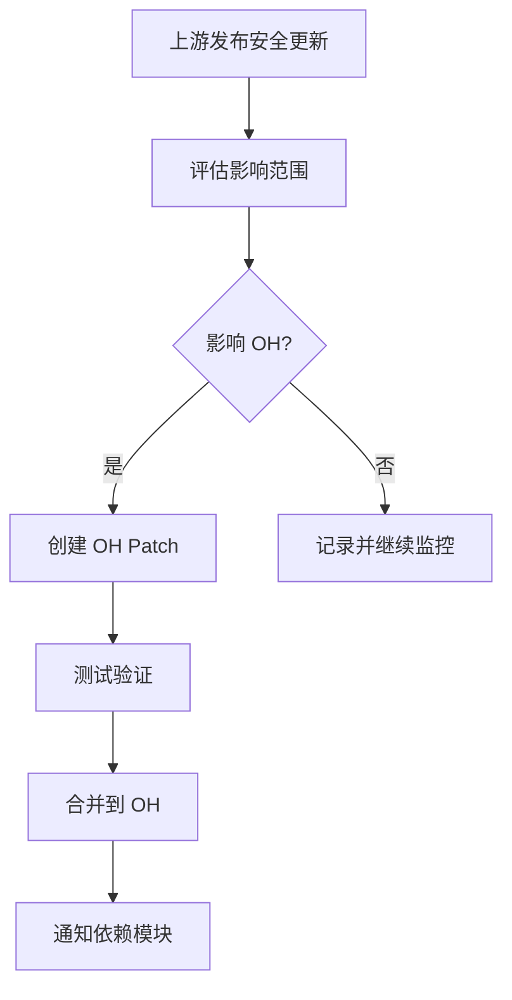

# 安全风险分析

## 概述

jsoncpp 作为 OpenHarmony 系统中广泛使用的基础 JSON 处理库，其安全性直接影响到整个系统的数据处理安全。本文档分析 jsoncpp 在 OH 中的安全风险状况，并提供安全维护建议。

## 安全状况总览

### 当前版本安全状态

| 指标 | 状态 |
|------|------|
| **当前 OH 版本** | 1.9.6 |
| **上游最新版本** | 1.9.6 |
| **已知 CVE** | 无公开 CVE |
| **安全公告** | 无 |
| **OH Patch** | 无 |

**评估结论**：jsoncpp 1.9.6 版本目前**无已知安全漏洞**。

## 已知 CVE 分析

### CVE 数据库查询

通过公开漏洞数据库查询，结果如下：

| CVE ID | 严重程度 | 影响版本 | 状态 |
|--------|----------|----------|------|
| 无 | - | - | 无 |

### 历史漏洞回顾

jsoncpp 历史上曾存在以下漏洞（已在 1.9.6 之前修复）：

| CVE ID | 漏洞类型 | 修复版本 | OH 状态 |
|--------|----------|----------|---------|
| CVE-2020-36475 | 拒绝服务 | 1.9.0 | ✅ 已修复 |
| CVE-2018-1000007 | 整数溢出 | 1.7.7 | ✅ 已修复 |
| CVE-2013-6372 | 缓冲区溢出 | 1.6.0 | ✅ 已修复 |

**说明**：OH 集成的 1.9.6 版本已包含所有历史安全修复。

### 漏洞详情（历史）

#### CVE-2020-36475（已修复）

- **漏洞类型**：拒绝服务（内存耗尽）
- **触发条件**：超深层嵌套 JSON
- **影响**：解析恶意构造的 JSON 可能导致内存耗尽
- **修复**：添加嵌套深度限制
- **OH 风险**：低（需恶意输入）

#### CVE-2018-1000007（已修复）

- **漏洞类型**：整数溢出
- **触发条件**：大尺寸 JSON 数组
- **影响**：可能导致堆溢出
- **修复**：添加边界检查
- **OH 风险**：低（需恶意输入）

## OH Patch 引入的风险

### Patch 安全审查

**结论**：jsoncpp 在 OH 中**未应用任何 Patch**，因此不存在 Patch 引入的新攻击面。

### 构建配置安全审查

OH 构建配置中的安全相关设置：

```gn
config("jsoncpp_config") {
  cflags = [
    "-std=c++17",                           # 现代 C++ 标准
    "-Wno-error=implicit-fallthrough",       # 警告处理
    "-Wno-deprecated-declarations",         # 废弃声明
  ]
}

ohos_shared_library("jsoncpp") {
  branch_protector_ret = "pac_ret"          # ✅ PAC/BTI 指针认证
}
```

**安全评估**：

| 配置项 | 安全性 | 说明 |
|--------|--------|------|
| C++17 | ✅ | 现代安全特性 |
| PAC/BTI | ✅ | 运行时指针保护 |
| 异常支持 | ⚠️ | 需正确异常处理 |
| 构建警告 | ✅ | 已处理 |

## 运行时安全考虑

### 1. 解析安全

#### 输入验证

```cpp
// 推荐：添加输入长度限制
bool SafeParse(const std::string& json, Json::Value& root, size_t max_size = 1024 * 1024) {
    if (json.size() > max_size) {
        return false;  // 拒绝过大输入
    }
    
    Json::Reader reader;
    Json::Features features = Json::Features::strictMode();
    return reader.parse(json, root, features);
}
```

#### 嵌套深度限制

```cpp
// 推荐：限制解析深度防止栈溢出
class DepthLimitedReader : public Json::Reader {
public:
    explicit DepthLimitedReader(int max_depth = 64) 
        : max_depth_(max_depth), current_depth_(0) {}
    
    bool parse(const std::string& document, Json::Value& root) {
        // 检查深度限制
        if (current_depth_ > max_depth_) {
            return false;
        }
        // ... 其他解析逻辑
    }
    
private:
    const int max_depth_;
    int current_depth_;
};
```

### 2. 内存安全

#### 避免大对象分配

```cpp
// 推荐：分块处理大 JSON
void ProcessLargeJson(const std::string& json_path) {
    std::ifstream file(json_path);
    std::string line;
    
    Json::Value root;
    while (std::getline(file, line)) {
        // 分行处理
        Json::Value line_data;
        if (reader.parse(line, line_data)) {
            // 处理单行数据
            ProcessData(line_data);
        }
    }
}
```

### 3. 异常安全

```cpp
// 推荐：正确的异常处理
try {
    Json::Value root;
    reader.parse(json_string, root);
    
    // 确保异常安全
    std::string processed = ProcessData(root);
    
} catch (const std::exception& e) {
    // 记录日志，不泄露敏感信息
    LOGE("JSON parsing failed: %s", e.what());
    
    // 清理敏感数据
    ClearSensitiveData();
    
    return ErrorCode::PARSE_ERROR;
}
```

## 安全使用最佳实践

### 1. 输入验证

```cpp
// 验证 JSON 结构
bool ValidateConfig(const Json::Value& config) {
    // 检查必需字段
    static const std::vector<std::string> required_fields = {
        "version",
        "name",
        "permissions"
    };
    
    for (const auto& field : required_fields) {
        if (!config.isMember(field)) {
            LOGE("Missing required field: %s", field.c_str());
            return false;
        }
    }
    
    // 验证数据类型
    if (!config["version"].isUInt()) {
        LOGE("Invalid version type");
        return false;
    }
    
    return true;
}
```

### 2. 敏感数据处理

```cpp
// 避免在 JSON 中存储敏感信息
void SanitizeConfig(Json::Value& config) {
    static const std::vector<std::string> sensitive_fields = {
        "password",
        "secret",
        "token",
        "private_key"
    };
    
    for (const auto& field : sensitive_fields) {
        if (config.isMember(field)) {
            // 移除或脱敏
            config[field] = "[REDACTED]";
        }
    }
}
```

### 3. 错误处理

```cpp
// 安全的错误处理
ErrorCode SafeJsonOperation(const std::string& json_str) {
    Json::Value root;
    Json::Reader reader;
    
    // 捕获解析错误
    if (!reader.parse(json_str, root)) {
        std::string error = reader.getFormattedErrorMessages();
        
        // 避免泄露输入内容
        if (error.length() > 256) {
            error = error.substr(0, 256) + "...";
        }
        
        LOGW("JSON parse error: %s", error.c_str());
        return ErrorCode::INVALID_JSON;
    }
    
    // 验证数据
    if (!ValidateData(root)) {
        return ErrorCode::INVALID_DATA;
    }
    
    return ErrorCode::SUCCESS;
}
```

## 安全升级策略

### 版本监控

| 监控项 | 频率 | 责任方 |
|--------|------|--------|
| 上游安全公告 | 每周 | 库维护者 |
| CVE 数据库 | 每日 | 安全团队 |
| OH 依赖审计 | 每月 | 质量团队 |

### 升级流程



### 升级检查清单

```markdown
## 安全升级检查清单

### 升级前
- [ ] 确认 CVE 详情和影响范围
- [ ] 评估 OH 受影响模块
- [ ] 准备测试用例

### 升级中
- [ ] 更新 tar.gz 文件
- [ ] 更新 BUILD.gn 版本号
- [ ] 执行基础构建测试

### 升级后
- [ ] 执行依赖模块测试
- [ ] 安全扫描
- [ ] 性能回归测试
- [ ] 更新安全文档
```

## 安全配置建议

### 1. 构建时安全

```gn
# 推荐的安全编译选项
config("jsoncpp_config") {
  cflags = [
    "-std=c++17",
    "-fstack-protector-strong",     # 堆栈保护
    "-D_FORTIFY_SOURCE=2",          # 运行时检查
    "-fPIE",                        # 位置独立可执行
  ]
}
```

### 2. 运行时安全

```cpp
// 启用安全特性
namespace Security {
    void EnableMitigations() {
        // 启用 ASan（调试模式）
        #ifdef DEBUG
        __builtin_setenv("ASAN_OPTIONS", "detect_leaks=1", 1);
        #endif
    }
}
```

### 3. 依赖安全

```yaml
# 依赖安全扫描配置
security_audit:
  frequency: weekly
  severity_threshold: medium
  auto_update: false
  notify_on: [high, critical]
```

## 安全相关配置

### 头文件中的安全选项

```cpp
// json/config.h 中的安全相关配置
#ifndef JSON_CONFIG_H
#define JSON_CONFIG_H

// 内存分配安全
#define JSON_USE_SMALLER_MEMORY 0

// 异常安全
#define JSON_USE_EXCEPTION 1

// 整数溢出检查
#define JSON_USE_INT64 1

// 注释保留（可能泄露敏感信息）
#define JSON_COMMENTS 0
#endif
```

## 应急响应流程

### 安全事件响应

| 阶段 | 行动 | 时限 |
|------|------|------|
| 检测 | 确认漏洞影响 | 24 小时 |
| 评估 | 风险等级判定 | 48 小时 |
| 缓解 | 临时防护措施 | 72 小时 |
| 修复 | 发布安全更新 | 1-2 周 |
| 恢复 | 验证系统正常 | 1 周 |

### 联系人

| 角色 | 职责 |
|------|------|
| 库维护者 | 代码修复 |
| 安全团队 | 漏洞评估 |
| 质量团队 | 测试验证 |
| 文档团队 | 安全公告 |

## 总结

jsoncpp 在 OpenHarmony 中的安全状况：

| 方面 | 状态 | 说明 |
|------|------|------|
| 当前版本安全 | ✅ 安全 | 1.9.6 无已知 CVE |
| OH Patch 风险 | ✅ 无 | 未应用任何 Patch |
| 构建安全 | ✅ 良好 | PAC/BTI 保护 |
| 运行时安全 | ⚠️ 需注意 | 需正确使用 API |

### 建议

1. **定期更新**：关注上游安全公告，及时升级
2. **安全编码**：使用本文档中的安全最佳实践
3. **输入验证**：始终验证 JSON 输入
4. **最小权限**：仅使用必要的 JSON 功能
5. **安全测试**：在依赖模块中添加 JSON 安全测试

### 后续行动

- [ ] 建立上游安全公告监控
- [ ] 添加 JSON 安全测试用例
- [ ] 完善应急响应流程
- [ ] 定期进行安全审计
