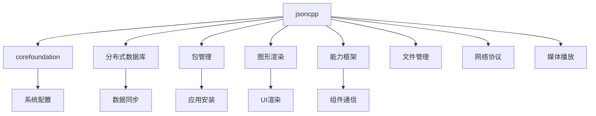

# jsoncpp - OpenHarmony 第三方库 Wiki

## 库概览

jsoncpp 是 OpenHarmony `third_party` 目录下的 JSON 数据处理库，为整个系统提供 JSON 序列化和反序列化能力。

| 属性 | 信息 |
|------|------|
| **上游名称** | jsoncpp |
| **OH 组件名** | @ohos/jsoncpp |
| **上游版本** | 1.9.6 |
| **OH 版本** | 3.1 |
| **许可证** | MIT License |
| **上游地址** | [open-source-parsers/jsoncpp](https://github.com/open-source-parsers/jsoncpp) |
| **所属子系统** | thirdparty |
| **适应系统** | mini / small / standard |

## 核心特征

- **原生兼容**：无需任何 Patch 即可在 OpenHarmony 上运行
- **广泛依赖**：被 50+ 核心模块依赖，包括分布式数据库、包管理、图形渲染等
- **双库支持**：同时提供共享库（jsoncpp）和静态库（jsoncpp_static）
- **C++17**：使用现代 C++ 标准构建

## 文档导航

### 必读文档

| 文档 | 说明 | 优先级 |
|------|------|--------|
| [01_Overview.md](01_Overview.md) | 原始库功能介绍和 OH 定位 | ⭐⭐⭐ |
| [02_Patches.md](02_Patches.md) | Patch 分析（本库无 Patch） | ⭐⭐⭐ |
| [03_Build_Integration.md](03_Build_Integration.md) | OH 构建系统适配详解 | ⭐⭐⭐ |
| [04_Usage_in_OH.md](04_Usage_in_OH.md) | 依赖关系和使用场景 | ⭐⭐⭐ |

### 补充文档

| 文档 | 说明 | 优先级 |
|------|------|--------|
| [05_API_Differences.md](05_API_Differences.md) | API 差异分析 | ⭐⭐ |
| [06_Security.md](06_Security.md) | 安全风险评估 | ⭐⭐ |

### 工作文档

| 文档 | 说明 |
|------|------|
| [_work/ASSESSMENT.md](_work/ASSESSMENT.md) | 项目评估结果 |
| [_work/NOTES.md](_work/NOTES.md) | 分析过程记录 |
| [_work/PLAN.md](_work/PLAN.md) | 任务进度跟踪 |

## 快速了解

### 这个库做什么？

jsoncpp 是一个 C++ 库，用于在 C++ 程序中处理 JSON 数据：

```cpp
// 解析 JSON 字符串
std::string json_str = "{\"name\": \"test\", \"value\": 123}";
Json::Value root;
Json::Reader reader;
reader.parse(json_str, root);

std::string name = root["name"].asString();  // "test"
int value = root["value"].asInt();            // 123

// 生成 JSON 字符串
Json::Value output;
output["name"] = "result";
output["value"] = 456;
std::string output_str = output.toStyledString();
```

### OH 为什么需要它？

JSON 是现代应用开发中最常用的数据格式之一，jsoncpp 为 OH 提供：

1. **配置管理**：解析 `config.json`、`module.json` 等系统配置文件
2. **数据持久化**：存储和读取结构化数据
3. **跨进程通信**：Ability 框架中的数据交换格式
4. **网络协议**：RESTful API 的 JSON 数据处理

### 关键事实

- ✅ **无 Patch**：原生兼容，无需 OH 特定修改
- 📦 **两种形态**：共享库和静态库可选
- 🔗 **广泛依赖**：50+ 模块直接依赖
- 🏷️ **头文件导出**：10 个核心头文件

## 依赖关系图



## 使用建议

### 对于系统开发者

1. **优先使用静态链接**：`jsoncpp_static` 可以减少二进制体积
2. **关注版本更新**：上游安全修复应及时同步
3. **测试覆盖**：确保你的模块正确处理 JSON 异常

### 对于库维护者

1. **升级流程**：更新 tar.gz → 验证构建 → 测试依赖模块
2. **无 Patch 原则**：保持代码纯净，避免引入 OH 特定修改
3. **头文件稳定**：确保 ABI 兼容性

## 版本信息

| 版本 | 日期 | 变更说明 |
|------|------|----------|
| 3.1 | - | OH 版本号，与上游 1.9.6 对应 |
| 1.9.6 | - | 上游版本，MIT 许可证 |

## 相关资源

- [上游仓库](https://github.com/open-source-parsers/jsoncpp)
- [OpenHarmony 贡献指南](https://gitee.com/openharmony/docs/blob/HEAD/zh-cn/contribute/参与贡献.md)
- [Commit Message 规范](https://gitee.com/openharmony/device_qemu/wikis/Commit%20message%E8%A7%84%E8%8C%83)
