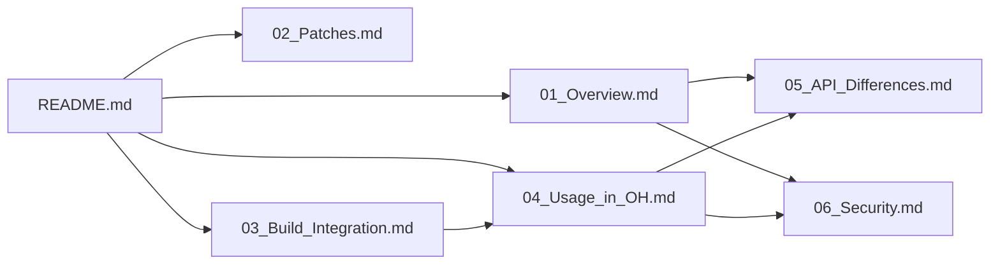

# 阅读路线建议

本文档为 jsoncpp 库在 OpenHarmony 中的集成与适配提供全面的参考指南。根据您的需求，选择不同的阅读路线。

## 路线选择

### 🚀 快速了解（5 分钟）

如果您只想快速了解 jsoncpp 在 OH 中的基本情况：

1. **README.md** - 库概览和核心特征
2. **02_Patches.md** - 确认无 Patch 情况

### 📚 深入理解（30 分钟）

如果您需要全面理解 jsoncpp 的 OH 适配：

1. **01_Overview.md** - 原始库功能和 OH 定位
2. **02_Patches.md** - Patch 分析细节
3. **03_Build_Integration.md** - 构建系统集成
4. **04_Usage_in_OH.md** - 依赖关系和使用场景
5. **05_API_Differences.md** - API 差异（如有）
6. **06_Security.md** - 安全考虑

### 🔧 开发者参考（按需查阅）

如果您是开发者，需要查询具体信息：

| 需求 | 推荐文档 |
|------|----------|
| 如何使用 jsoncpp | [04_Usage_in_OH.md](04_Usage_in_OH.md) |
| 构建配置说明 | [03_Build_Integration.md](03_Build_Integration.md) |
| 查看依赖关系 | [04_Usage_in_OH.md](04_Usage_in_OH.md)#依赖关系图 |
| 安全漏洞信息 | [06_Security.md](06_Security.md) |
| API 差异对比 | [05_API_Differences.md](05_API_Differences.md) |

## 文档依赖关系



## 关键信息速查

### 核心事实

| 问题 | 答案 |
|------|------|
| 有 Patch 吗？ | ❌ 无 |
| 原生支持 OH？ | ✅ 是 |
| 库类型？ | 共享库 + 静态库 |
| C++ 标准？ | C++17 |
| 主要依赖者数量？ | 50+ 模块 |

### 使用方式

```gn
# 共享库依赖
deps = ["//third_party/jsoncpp:jsoncpp"]

# 静态库依赖
deps = ["//third_party/jsoncpp:jsoncpp_static"]

# 头文件引用
include_dirs = ["//third_party/jsoncpp/include"]
```

## 常见问题

### Q: jsoncpp 需要特殊的 OH 适配吗？

**A**: 不需要。jsoncpp 是原生兼容的 OH 第三方库，无需任何 Patch 即可正常运行。

### Q: 应该使用共享库还是静态库？

**A**: 视情况而定：
- **静态库**（推荐）：减少二进制体积，避免符号冲突
- **共享库**：多个模块共享同一份代码，减少内存占用

### Q: 如何升级 jsoncpp 版本？

**A**:
1. 获取新版本 tar.gz 文件
2. 更新 BUILD.gn 中的版本号
3. 验证构建
4. 测试依赖模块

### Q: 发现安全问题怎么办？

**A**: 参考 [06_Security.md](06_Security.md)，关注上游安全公告，及时同步修复。

## 贡献指南

如果您发现文档错误或有改进建议，欢迎提交贡献：

1. Fork 仓库
2. 修改文档
3. 提交 Commit（遵循规范）
4. 创建 Pull Request

参考：[OpenHarmony 贡献指南](https://gitee.com/openharmony/docs/blob/HEAD/zh-cn/contribute/参与贡献.md)
