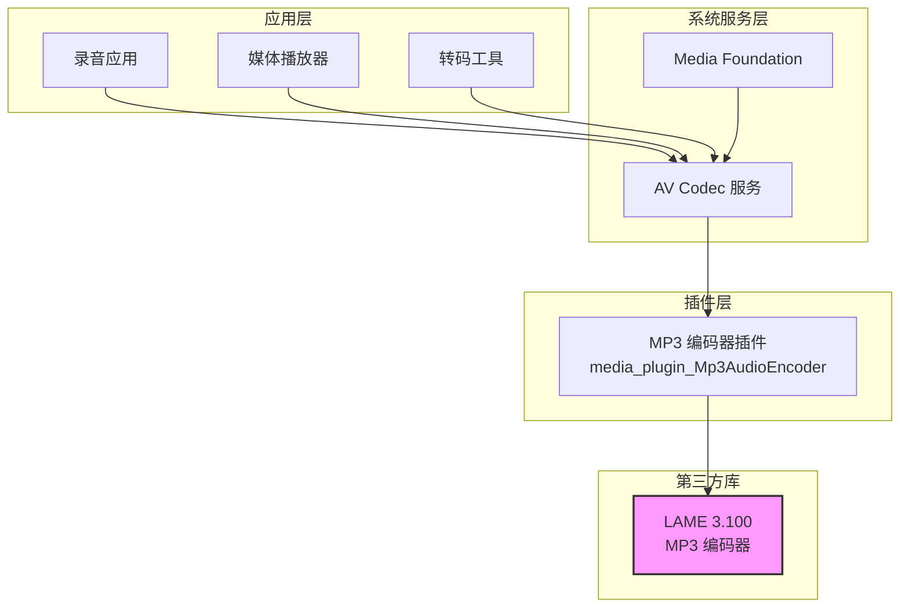

# LAME MP3 编码器 - OpenHarmony 适配文档

**LAME 版本**: 3.100
**OH 组件**: @ohos/lame
**许可证**: LGPL-2.0
**文档更新**: 2026-02-08

---

## 📋 目录

- [概述](#概述)
- [Patch 详细分析](#patch-详细分析)
- [OH 构建适配](#oh-构建适配)
- [依赖关系与使用](#依赖关系与使用)
- [API 差异](#api-差异)
- [安全风险分析](#安全风险分析)
- [维护建议](#维护建议)

---

## 概述

### 原始库简介

LAME (LAME Ain't an MP3 Encoder) 是一个高质量 MPEG Audio Layer III (MP3) 编码器。

**基本信息**:
- **上游项目**: https://github.com/lameproject/lame.git
- **版本**: 3.100 (2017-10-13 发布)
- **许可证**: LGPL-2.0
- **开发语言**: C

**核心功能**:
- MP3 编码 (CBR, VBR, ABR 模式)
- MP3 解码 (内嵌 MPGLIB)
- ID3v1/v2 标签支持
- ReplayGain 分析
- Mid/Side 立体声
- 心理声学模型

### 在 OpenHarmony 中的作用和定位

**用途**: 为 OpenHarmony 多媒体子系统提供 MP3 音频编码能力

**定位**:
- 作为 `thirdparty` 子系统的核心编码库
- 被 `av_codec` 服务的 MP3 编码器插件依赖
- 为媒体应用提供 MP3 格式的音频编码功能

**使用场景**:
- 录音应用编码为 MP3 格式
- 媒体转码 (PCM → MP3)
- 音频流处理

### OH 适配概述

OpenHarmony 对 LAME 库采用了**最小侵入式**的适配策略:

1. **无 Patch 文件**: 通过构建系统配置实现集成
2. **最少代码修改**: 仅 1 处 typedef 添加
3. **完整构建适配**: GN 构建配置 + OSS 合规配置
4. **API 兼容**: 暴露原始 LAME API，无 OH 特定扩展

---

## Patch 详细分析

### Patch 清单

**结论**: **当前无 Patch 文件**

LAME 库在 OpenHarmony 集成过程中，最初曾使用 Patch 文件，但后来已被移除。

| 状态 | 说明 |
|------|------|
| 当前状态 | 无 `*.patch` 文件 |
| 历史状态 | 曾有 `patches/patches.json` |
| 删除时间 | 2024-05-09 (commit `b27437d5`) |
| 删除原因 | "OAT.xml更新，删除孵化时的patch" |

### 原 Patch 文件内容

**已删除文件**: `patches/patches.json`

```json
{
    "patches": [
        {
            "project":"multimedia_av_codec",
            "path":"foundation/multimedia/av_codec",
            "pr_url":"https://gitee.com/openharmony/multimedia_av_codec/pulls/1684"
        }
    ]
}
```

**说明**: 原 Patch 引用了 multimedia_av_codec 项目的 PR #1684，该 PR 包含了 LAME 集成到 AV Codec 服务的相关修改。

### 源代码修改记录

虽然 Patch 文件被删除，但有一处源代码修改被保留:

#### 修改: 添加 IEEE754 浮点类型定义

**文件**: `libmp3lame/util.h` (lines 82-84)

**修改内容**:
```c
#ifndef HAVE_IEEE754_FLOAT32_T
    typedef float ieee754_float32_t;
#endif
```

**修改目的**:
- 为缺少 IEEE754 浮点类型定义的系统提供兼容性
- 确保跨平台编译一致性

**原始问题**:
- 部分平台的标准库未定义 `ieee754_float32_t` 类型
- 导致编译错误或不一致行为

**OH 价值**:
- 确保 LAME 在 OpenHarmony 支持的所有平台上都能正确编译
- 统一浮点运算类型，避免精度损失

**回归风险**: 极低
- 标准的兼容性 typedef
- 不影响核心编码逻辑

### Patch 分类

| 类型 | 数量 | 说明 |
|------|------|------|
| Bugfix | 0 | 无相关 Patch |
| Feature | 0 | 无功能扩展 Patch |
| OH 适配 | 0 | 无 OH 特定适配 Patch |
| 性能优化 | 0 | 无性能优化 Patch |
| 构建适配 | 1 | 源代码修改 (typedef) |

### Patch 维护建议

**当前状态**: 无需维护 Patch

**未来升级注意事项**:
1. **验证 typedef**: 升级上游版本时检查 `libmp3lame/util.h` 中的 typedef 是否仍需要
2. **检查编译标志**: BUILD.gn 中的编译器警告禁用标志可能需要调整
3. **测试验证**: 全面测试 MP3 编码功能

**可推向上游的修改**:
- ✅ `ieee754_float32_t` typedef 可作为跨平台兼容性改进推向上游

---

## OH 构建适配

### BUILD.gn 结构

**文件路径**: `third_party/lame/BUILD.gn`

**构建目标**:
```gn
ohos_shared_library("lame") {
    public_configs = [ ":lame_config" ]
    sources = [ ... ]
    part_name = "lame"
    subsystem_name = "thirdparty"
}
```

### 关键编译选项

#### config("lame_config")

**包含目录**:
```gn
include_dirs = [ "//third_party/lame/include" ]
```

**编译标志 (C)**:
```gn
cflags = [
    "-O2",                    # 优化级别
    "-Wall",                  # 启用所有警告
    "-Wno-sign-compare",      # 禁用符号比较警告
    "-Wno-implicit-function-declaration",
    "-Wno-parentheses",
    # ... 更多警告禁用标志
    "-DSTDC_HEADERS",         # 标准头文件支持
    "-DHAVE_LIMITS_H",        # 限制值头文件支持
]
```

**编译标志 (C++)**:
```gn
cflags_cc = [
    "-std=c++17",            # C++17 标准
    "-fno-rtti",             # 禁用 RTTI
]
```

### 源文件清单

LAME 库构建包含以下 21 个源文件 (均在 `libmp3lame/` 目录):

```
VbrTag.c              - VBR 标签处理
bitstream.c           - 位流操作
encoder.c             - 编码器核心
fft.c                 - 快速傅里叶变换
gain_analysis.c       - 增益分析 (ReplayGain)
id3tag.c              - ID3 标签读写
lame.c                - LAME 核心接口
mpglib_interface.c    - MPGLIB 解码器接口
newmdct.c             - 改进的 MDCT 变换
presets.c             - 预设参数
psymodel.c            - 心理声学模型
quantize.c            - 量化
quantize_pvt.c        - 量化私有函数
reservoir.c           - 比特池管理
set_get.c             - 参数设置/获取
tables.c              - 查找表
takehiro.c            - 优化函数
util.c                - 工具函数
version.c             - 版本信息
vbrquantize.c         - VBR 量化
```

### 与上游构建系统的差异

| 对比项 | 上游 (Makefile) | OH (BUILD.gn) | 差异说明 |
|--------|-----------------|--------------|---------|
| **构建系统** | autotools (Makefile) | GN (OH 原生) | 完全不同的构建系统 |
| **编译产物** | 静态/动态库 | ohos_shared_library | OH 统一为共享库 |
| **编译器** | GCC/Clang (通用) | OH 定制工具链 | 特定编译器标志 |
| **优化选项** | 用户可配置 | 固定 `-O2` | 统一优化级别 |
| **平台检测** | configure 脚本 | 手动定义宏 | 简化为固定定义 |
| **安装** | make install | GN 安装规则 | 不同安装机制 |

### 特殊处理

#### 禁用的功能/模块

| 模块 | 状态 | 原因 |
|------|------|------|
| 命令行工具 (frontend/) | 不编译 | OH 仅使用库，不需要 CLI |
| GUI 应用 (dshow/, mac/) | 不编译 | 平台特定，OH 不使用 |
| 测试套件 (test/) | 不编译 | 测试未包含在构建中 |
| i386 优化代码 (libmp3lame/i386/) | 不编译 | OH 支持多种架构，非 x86 特定 |
| ACMM 前端 (ACM/) | 不编译 | Windows 专用 |

#### 添加的 OH 特定源文件

**无** - 不需要 OH 特定源文件

#### OH 特定编译选项

1. **华为许可证头**:
```gn
# Copyright (C) 2024 Huawei Device Co., Ltd.
# Licensed under the Apache License, Version 2.0
```

2. **大量警告禁用**:
- 30+ 个 `-Wno-xxx` 标志
- 原因：上游代码与 OH 工具链严格模式不兼容
- 风险：可能隐藏真实问题，需保持警惕

3. **C++ 标准和 RTTI**:
```gn
cflags_cc = [
    "-std=c++17",   # OH 统一使用 C++17
    "-fno-rtti",    # OH 禁用 RTTI
]
```

### 构建依赖

**BUILD.gn 依赖**:
- `//build/ohos.gni` - OH 构建系统基础

**运行时依赖**:
- 无 (LAME 是纯计算库，无外部依赖)

---

## 依赖关系与使用

### 直接依赖者

| 模块 | 路径 | 用途 | 链接方式 |
|-----|------|-----|---------|
| **av_codec** | `foundation/multimedia/av_codec/services/media_engine/plugins/ffmpeg_adapter/audio_encoder/mp3/BUILD.gn` | MP3 音频编码插件 | `external_deps = ["lame:lame"]` |

### 模块详情

#### av_codec - MP3 编码器插件

**组件**: `media_plugin_Mp3AudioEncoder`
**文件**: `audio_mp3_encoder_plugin.cpp`

**用途**:
- 作为 AV Codec 服务的插件提供 MP3 编码能力
- 将应用层的音频数据编码为 MP3 格式
- 与 FFmpeg adapter 集成

**依赖关系**:
```gn
external_deps = [
    "c_utils:utils",
    "hilog:libhilog",
    "ipc:ipc_single",
    "lame:lame",          # ← LAME 依赖
    "media_foundation:media_foundation",
]
```

### 使用方式

#### 静态链接 / 动态链接

**链接方式**: 动态链接 (`ohos_shared_library`)

- LAME 编译为共享库 `liblame.so`
- AV Codec 插件动态链接 LAME
- 优点：减小镜像体积，便于更新

#### 头文件引用方式

**主要头文件**: `lame.h`

**引用方式** (在 C/C++ 代码中):
```c
#include "lame.h"
```

**BUILD.gn 配置**:
```gn
external_deps = [
    "lame:lame",  # 自动添加 include/lame.h 到搜索路径
]
```

### 典型使用场景

#### 场景 1: 音频录制编码


**流程**:
1. 应用通过 AV Codec API 创建 MP3 编码器
2. 录制音频产生 PCM 数据
3. 数据传递到 AV Codec 服务
4. MP3 编码器插件调用 LAME API
5. LAME 编码为 MP3 格式输出

#### 场景 2: 媒体转码


**流程**:
1. 解码器读取 WAV 文件
2. 解码为 PCM 数据
3. LAME 编码 PCM 为 MP3
4. 输出转码后的 MP3 文件

### 依赖关系图



### API 调用示例

#### 基本编码流程

```c
#include "lame.h"

// 1. 初始化编码器
lame_global_flags *gfp = lame_init();

// 2. 设置参数 (立体声, 44.1kHz, 128kbps CBR)
lame_set_num_channels(gfp, 2);
lame_set_in_samplerate(gfp, 44100);
lame_set_brate(gfp, 128);
lame_set_mode(gfp, JOINT_STEREO);
lame_set_quality(gfp, 2);  // 2=高质量

// 3. 初始化参数
lame_init_params(gfp);

// 4. 编码 (对每个 PCM 缓冲区)
int mp3buf_size = 1.25 * num_samples + 7200;
unsigned char mp3buf[mp3buf_size];
int bytes = lame_encode_buffer(gfp, left_pcm, right_pcm,
                                num_samples, mp3buf, mp3buf_size);

// 5. 刷新缓冲区
lame_encode_flush(gfp, mp3buf, mp3buf_size);

// 6. 写入 VBR 标签
lame_mp3_tags_fid(gfp, output_file);

// 7. 清理
lame_close(gfp);
```

---

## API 差异

### OH 新增的 API

**无** - LAME 库未添加任何 OH 特定 API

### 行为变更的 API

**无** - LAME API 行为与上游完全一致

### 废弃或禁用的功能

| 功能 | 上游状态 | OH 状态 | 原因 |
|------|---------|---------|------|
| 命令行工具 | 可用 | 未编译 | 仅编译库，不编译 CLI |
| GUI 界面 | 可用 | 未编译 | 平台不相关 |
| 前端工具 | 可用 | 未编译 | OH 通过 AV Codec 封装 |

### API 兼容性

**兼容性**: 100% - 完全兼容上游 LAME 3.100 API

- 所有 LAME API 均可正常使用
- 无 OH 特定限制或修改
- 函数签名和行为与上游一致

---

## 安全风险分析

### 该库已知 CVE 和修复状态

**重要说明**: LAME 3.100 是一个成熟且稳定的版本，但已多年未更新（2017 年发布）。

| CVE ID | 严重性 | 描述 | OH 版本状态 |
|--------|-------|------|------------|
| 需进一步调研 | - | 需全面审查历史漏洞 | 需要验证修复状态 |

**建议**:
1. 审查 LAME 历史安全公告
2. 验证 OH 版本是否包含关键安全修复
3. 考虑跟踪上游分支或维护安全补丁

### OH Patch 引入的新攻击面

**无** - 仅有 1 处 typedef 修改，不引入安全风险

`ieee754_float32_t` typedef 是标准的类型别名，不改变代码行为。

### 建议的安全升级策略

#### 短期 (3-6 个月)

1. **安全审计**:
   - 全面审查 LAME 3.100 的已知漏洞
   - 验证是否需要关键安全补丁

2. **输入验证**:
   - 在 AV Codec 插件层加强输入参数验证
   - 防止无效音频数据导致的问题

#### 中期 (6-12 个月)

1. **上游跟踪**:
   - 监控 LAME 上游仓库更新
   - 评估新版本的安全改进

2. **补丁管理**:
   - 建立上游安全补丁的快速评估流程
   - 准备关键漏洞的紧急补丁机制

#### 长期 (12 个月+)

1. **版本升级**:
   - 评估升级到更新版本 (如果上游发布)
   - 或考虑使用更活跃维护的 MP3 编码库

2. **替代方案**:
   - 研究更安全的 MP3 编码器替代品
   - 评估现代编码器 (如 Opus) 的可行性

### Fuzzing 建议

**建议对 LAME 进行模糊测试**:
- 测试畸形 PCM 输入
- 测试极端参数组合
- 测试边界值输入
- 使用 AFL、LibFuzzer 等工具

---

## 维护建议

### Patch 维护

**当前状态**: 无需维护

**建议**:
- 定期检查上游更新
- 如需要，准备 Patch 管理流程

### 版本升级策略

**当前版本**: 3.100 (2017)

**评估要点**:
1. **功能需求**: 当前版本是否满足 OH 需求？
2. **安全修复**: 上游是否有关键安全修复？
3. **性能改进**: 新版本是否有性能提升？
4. **API 兼容性**: 升级是否会影响现有应用？

**升级流程**:
1. 审查上游变更日志
2. 评估兼容性影响
3. 在测试环境全面测试
4. 准备回滚方案

### 测试建议

#### 单元测试
- 测试 LAME 核心编码功能
- 测试各种编码参数组合
- 测试边界条件

#### 集成测试
- 测试与 AV Codec 服务的集成
- 测试实际应用的编码场景
- 测试性能表现

#### 安全测试
- Fuzzing 测试
- 内存泄漏检测
- 整数溢出检测

### 文档维护

**建议补充的文档**:
1. OH 特定的使用示例
2. 性能基准测试结果
3. 已知问题和限制
4. 故障排查指南

### 监控指标

**建议监控**:
- MP3 编码性能 (实时率)
- 编码质量指标 (PSNR 等)
- 内存使用情况
- 错误率和失败场景

---

## 参考资料

### 上游资源

- **官方仓库**: https://github.com/lameproject/lame
- **官方文档**: http://lame.sf.net/doc/
- **API 文档**: LAME 源码中的 `API` 和 `doc/html/` 目录

### OH 内部资源

- **维护者**: yangpeng43@huawei.com
- **历史 PR**: https://gitee.com/openharmony/multimedia_av_codec/pulls/1684
- **集成文档**: README_zh.md

### 相关组件

- **AV Codec 服务**: foundation/multimedia/av_codec
- **Media Foundation**: foundation/multimedia/media_foundation

---

**文档版本**: 1.0
**最后更新**: 2026-02-08
**维护者**: OpenHarmony 第三方库维护团队
