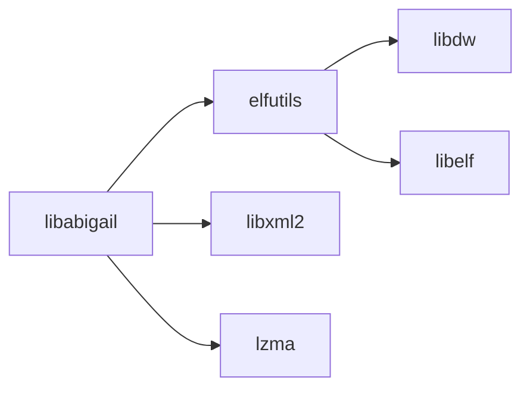

# 01 - 库概览

## 1.1 基本信息

### 1.1.1 原始库信息

| 属性 | 值 |
|------|-----|
| **库名称** | libabigail |
| **版本** | 2.8 |
| **许可证** | Apache 2.0 with LLVM exception |
| **上游地址** | https://sourceware.org/libabigail/ |
| **维护者** | Red Hat / Sourceware 社区 |
| **开发语言** | C++ |

### 1.1.2 OpenHarmony 集成信息

| 属性 | 值 |
|------|-----|
| **OH 组件名** | @ohos/libabigail |
| **OH 版本** | 2.2 (bundle.json) / 2.8 (实际) |
| **所属子系统** | thirdparty |
| **维护者** | zhanghaibo0@huawei.com |
| **引入时间** | 2023年 (从 BUILD.gn 版权信息推断) |

**注意**: bundle.json 中的版本号 2.2 与实际代码版本 2.8 不一致，可能是历史遗留问题。

## 1.2 原始库功能

### 1.2.1 什么是 libabigail？

**libabigail** 全称 **Application Binary Interface Generic Analysis and Instrumentation Library**（应用程序二进制接口通用分析和检测库）。

它是一个用于**构造、操作、序列化和反序列化 ABI 相关制品**的库。

### 1.2.2 核心功能

libabigail 能够处理以下 ABI 相关实体：

| 实体类型 | 说明 | 示例 |
|----------|------|------|
| **Types** | 数据类型 | 结构体、类、枚举、联合体 |
| **Variables** | 全局变量 | 导出的全局符号 |
| **Functions** | 函数 | 导出的函数符号 |
| **Declarations** | 声明信息 | 类型定义、函数声明 |

**术语说明**: 对于给定的库或程序，这些实体的集合称为 **ABI Corpus**（ABI 语料库）。

### 1.2.3 主要工具

libabigail 提供多个命令行工具：

| 工具 | 功能 | OH 中使用 |
|------|------|----------|
| **abidiff** | 比较两个 ABI 的差异 | ✅ 是 |
| **abidw** | 从二进制提取 ABI 信息 | ✅ 是 |
| **abipkgdiff** | 比较软件包的 ABI | ❌ 否 |
| **abilint** | 验证 ABI XML 文件 | ❌ 否 |
| **abicompat** | 检查向后兼容性 | ❌ 否 |
| **abidb** | ABI 数据库工具 | ❌ 否 |
| **fedabipkgdiff** | Fedora 包差异工具 | ❌ 否 |

**OH 仅使用** `abidiff` 和 `abidw` 两个工具。

### 1.2.4 技术能力

1. **ABI 提取**: 从 ELF 二进制文件（含 DWARF 调试信息）提取 ABI
2. **序列化**: 将 ABI 保存为 XML 格式（ABIXML）
3. **反序列化**: 从 ABIXML 恢复 ABI 信息
4. **差异比较**: 详细比较两个 ABI 的差异
5. **兼容性分析**: 判断 ABI 变更是否向后兼容

## 1.3 在 OpenHarmony 中的作用

### 1.3.1 使用场景

libabigail 在 OH 中服务于 **SA (System Ability) 独立升级** 功能：

**背景**: 
- OH 支持 System Ability 的独立升级（不升级整个系统）
- SA 以动态库 (.so) 形式发布
- 升级必须保证向后兼容，否则可能导致系统不稳定

**作用流程**:
```
┌─────────────────────────────────────────────────────────────┐
│  基线版本 (Base)          当前版本 (Current)                │
│                                                             │
│  ┌─────────────┐          ┌─────────────┐                   │
│  │ libabc.so   │          │ libabc.so   │  (新编译)         │
│  │  (旧版本)   │          │  (新版本)   │                   │
│  └──────┬──────┘          └──────┬──────┘                   │
│         │                        │                          │
│         ▼                        ▼                          │
│  ┌─────────────┐          ┌─────────────┐                   │
│  │ 基线 ABI    │          │ 当前 ABI    │                   │
│  │ (预存 XML)  │          │ (abidw 生成)│                   │
│  └──────┬──────┘          └──────┬──────┘                   │
│         │                        │                          │
│         └──────────┬─────────────┘                          │
│                    ▼                                        │
│            ┌─────────────┐                                  │
│            │  abidiff    │                                  │
│            │  对比差异    │                                  │
│            └──────┬──────┘                                  │
│                   │                                         │
│         ┌─────────┴─────────┐                               │
│         ▼                   ▼                               │
│    ┌─────────┐        ┌─────────┐                          │
│    │  兼容   │        │ 不兼容  │ ──────> 编译报错        │
│    │  通过   │        │  失败   │                          │
│    └─────────┘        └─────────┘                          │
└─────────────────────────────────────────────────────────────┘
```

### 1.3.2 在构建系统中的位置

```
OpenHarmony 构建系统
    │
    ├── ohos_module_package 模板
    │       │
    │       ├── check_abi_and_copy_deps
    │       │       ├── abidiff (libabigail)
    │       │       └── abidw (libabigail)
    │       │
    │       └── build_image
    │       └── build_module_package
    │
    └── (其他模板)
```

### 1.3.3 使用特点

| 特点 | 说明 |
|------|------|
| **Host 工具** | 仅在编译主机上运行，不进入设备镜像 |
| **间接使用** | 不直接被模块依赖，通过模板自动调用 |
| **无侵入** | 对开发者透明，无需修改业务代码 |
| **强制检查** | 使用 ohos_module_package 时自动启用 |

## 1.4 与其他 OH 组件的关系

### 1.4.1 依赖组件



| 依赖 | 用途 | 类型 |
|------|------|------|
| elfutils | 读取 ELF 和 DWARF 信息 | 外部组件 |
| libxml2 | XML 序列化/反序列化 | 系统库 |
| lzma | XZ 压缩支持 | 系统库 |

### 1.4.2 被依赖情况

libabigail 被 **build/templates/update/module_update.gni** 中的模板使用：

- `check_abi_and_copy_deps` 模板
- `ohos_module_package` 模板（间接）

任何使用 `ohos_module_package` 的 OH 模块都会间接使用 libabigail。

## 1.5 版本历史

### 1.5.1 上游主要版本

| 版本 | 发布日期 | 主要特性 |
|------|----------|----------|
| 2.8 | 2025 | XZ 压缩支持、C++14、稳定性改进 |
| 2.7 | 2024 | RPM 包比较、Fedora 支持增强 |
| 2.6 | 2024 | 性能优化、新过滤规则 |
| 2.5 | 2023 | 大型项目支持改进 |
| 2.4 | 2023 | 初始 OH 引入版本 |

### 1.5.2 OH 版本状态

当前 OH 使用的上游版本：**2.8**

从 `include/abg-version.h` 确认：
```c
#define ABIGAIL_VERSION_MAJOR "2"
#define ABIGAIL_VERSION_MINOR "8"
#define ABIGAIL_VERSION_REVISION "0"
```

## 1.6 上游资源

### 1.6.1 官方资源

| 资源 | 地址 |
|------|------|
| 官网 | https://sourceware.org/libabigail/ |
| 源码仓库 | git://sourceware.org/git/libabigail.git |
| 文档 | https://sourceware.org/libabigail/manual/ |
| 邮件列表 | libabigail@sourceware.org |
| Bug 追踪 | https://sourceware.org/bugzilla/ |

### 1.6.2 相关标准

- **ELF**: Executable and Linkable Format
- **DWARF**: Debugging With Attributed Record Formats
- **ABIXML**: libabigail 专用的 ABI XML 格式

---

**下一章**: [02_Patches.md](02_Patches.md) - Patch 分析
