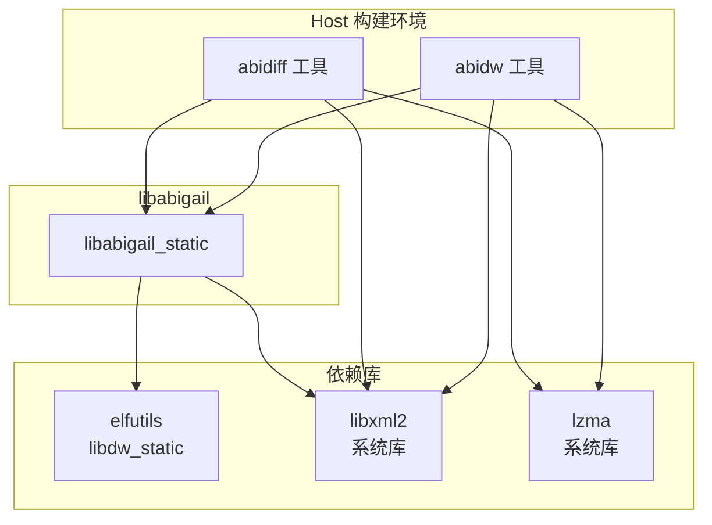
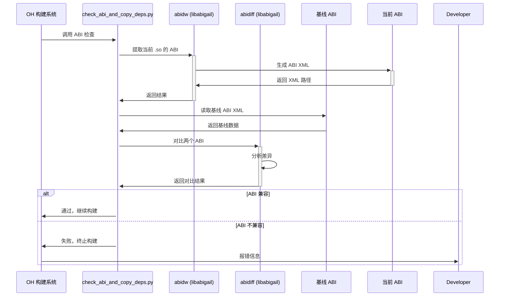
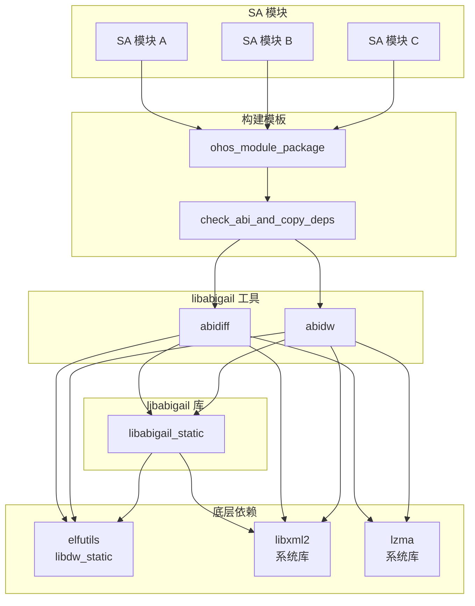

# 04 - 依赖关系与使用

## 4.1 依赖关系概览

### 4.1.1 依赖关系图



### 4.1.2 依赖说明

| 依赖 | 类型 | 用途 | 必需 |
|------|------|------|------|
| elfutils:libdw_static | 外部组件 | DWARF 调试信息解析 | ✅ 是 |
| libxml2 | 系统库 | ABIXML 读写 | ✅ 是 |
| lzma | 系统库 | XZ 压缩文件支持 | ✅ 是 |

## 4.2 OH 中的依赖者

### 4.2.1 直接依赖

通过搜索整个 OH 代码库，发现以下直接引用 `third_party/libabigail` 的文件：

| 文件路径 | 引用内容 | 说明 |
|----------|----------|------|
| `build/templates/update/module_update.gni` | abidiff/abidw 工具 | 核心依赖者 |
| `third_party/libxml2/wiki/04_Usage_in_OH.md` | 文档提及 | 文档引用 |
| `third_party/elfutils/README_OpenHarmony.md` | 配置引用 | 文档引用 |
| `third_party/libabigail/...` | 内部引用 | 自身构建 |

**唯一真正的依赖者是**: `build/templates/update/module_update.gni`

### 4.2.2 间接依赖

libabigail 通过 `ohos_module_package` 模板**间接被所有 SA 模块依赖**。

#### ohos_module_package 模板

**文件**: `build/templates/update/module_update.gni`

```gni
template("ohos_module_package") {
  # ... 模板定义
  
  if (defined(invoker.libraries) && invoker.libraries != []) {
    libraries = invoker.libraries
    check_abi_and_copy_deps("${target_name}_libraries") {
      sources = libraries
      type = "shared_library"
    }
  }
  # ...
}
```

#### check_abi_and_copy_deps 模板

```gni
template("check_abi_and_copy_deps") {
  action(target_name) {
    abidiff_target = "//third_party/libabigail/tools:abidiff($host_toolchain)"
    abidw_target = "//third_party/libabigail/tools:abidw($host_toolchain)"
    
    deps = invoker.sources
    deps += [ abidiff_target ]
    deps += [ abidw_target ]
    
    script = "//build/ohos/update/check_abi_and_copy_deps.py"
    # ...
  }
}
```

### 4.2.3 依赖关系链

```
SA 模块（如某个 System Ability）
    │
    ├── 使用 ohos_module_package 模板
    │       │
    │       └── 声明 libraries (动态库)
    │
    └── 触发 check_abi_and_copy_deps
            │
            ├── 依赖 abidiff (libabigail)
            ├── 依赖 abidw (libabigail)
            └── 运行 check_abi_and_copy_deps.py
                    │
                    ├── 调用 abidw 生成当前 ABI
                    ├── 调用 abidiff 对比 ABI
                    └── 输出检查结果
```

## 4.3 使用场景详解

### 4.3.1 SA 独立升级背景

**OpenHarmony 的 SA 独立升级** 是指：
- System Ability (系统能力) 可以独立升级
- 不随系统版本升级而升级
- 通过独立的 HAP/HSP 包发布

**挑战**：
- SA 以动态库 (.so) 形式存在
- 新版本必须向后兼容旧版本
- 不兼容的变更可能导致系统崩溃

**解决方案**：
- 使用 libabigail 进行 ABI 兼容性检查
- 在编译时检测 ABI 变化
- 不兼容时阻止编译通过

### 4.3.2 ABI 检查工作流程



### 4.3.3 check_abi_and_copy_deps.py 脚本

**路径**: `build/ohos/update/check_abi_and_copy_deps.py`

**主要功能**:
1. 解析输入参数（目标库列表、工具路径等）
2. 对每个目标库：
   - 使用 `abidw` 生成当前 ABI XML
   - 读取基线 ABI XML（从 `prebuilts/abi_dumps`）
   - 使用 `abidiff` 对比两者
3. 生成检查报告
4. 如有不兼容变更，返回错误码

**关键参数**:
- `--clang-readelf`: LLVM readelf 工具路径
- `--target-out-dir`: 目标输出目录
- `--check-datas-file`: 检查数据 JSON 文件
- `--abidiff-target-name`: abidiff 目标名称
- `--abidw-target-name`: abidw 目标名称
- `--abi-dumps-path`: 基线 ABI 文件路径

### 4.3.4 基线 ABI 文件

**位置**: `prebuilts/abi_dumps/`

**结构**:
```
prebuilts/abi_dumps/
├── subsystem_a/
│   ├── module_x_abi.dump
│   └── module_y_abi.dump
├── subsystem_b/
│   └── module_z_abi.dump
└── ...
```

**生成方式**:
- 由发布版本生成并提交到代码库
- 作为 ABI 兼容性的基准
- 升级基线需经过严格的兼容性审查

### 4.3.5 使用示例

#### GN 中使用 ohos_module_package

```gni
# 某个 SA 模块的 BUILD.gn
import("//build/templates/update/module_update.gni")

ohos_module_package("my_sa_module") {
  subsystem_name = "my_subsystem"
  part_name = "my_part"
  
  # 声明需要检查 ABI 的动态库
  libraries = [
    ":libmy_sa",
  ]
  
  # 其他配置...
  module_config = "module_config.json"
  zip_private_key = "//keys/private.pem"
  sign_cert = "//keys/cert.pem"
}

ohos_shared_library("libmy_sa") {
  sources = [ "my_sa.cpp" ]
  # ...
}
```

#### ABI 检查触发条件

当模块使用 `ohos_module_package` 并声明了 `libraries` 时，ABI 检查会自动触发：

```gni
if (defined(invoker.libraries) && invoker.libraries != []) {
  libraries = invoker.libraries
  check_abi_and_copy_deps("${target_name}_libraries") {
    sources = libraries
    type = "shared_library"
  }
}
```

## 4.4 依赖关系详情

### 4.4.1 libabigail 依赖 elfutils

**依赖路径**:
```
libabigail_static
    └── external_deps: elfutils:libdw_static
```

**依赖原因**:
- libabigail 需要读取 ELF 文件的 DWARF 调试信息
- elfutils 的 `libdw` 提供 DWARF 解析功能
- elfutils 的 `libelf` 提供 ELF 文件操作

### 4.4.2 libabigail 依赖 libxml2

**依赖路径**:
```
libabigail_static
    └── ldflags: ["-lxml2"]
    
abidiff / abidw
    └── ldflags: ["-lxml2"]
```

**依赖原因**:
- libabigail 使用 XML 格式（ABIXML）序列化 ABI
- libxml2 提供 XML 解析和生成功能

### 4.4.3 libabigail 依赖 lzma

**依赖路径**:
```
abidiff / abidw
    └── ldflags: ["-llzma"]
```

**依赖原因**:
- 支持 XZ 压缩的 ABI 文件
- libabigail 2.8 新增的功能

## 4.5 依赖图（完整）



## 4.6 依赖统计

### 4.6.1 依赖者数量

| 类型 | 数量 | 说明 |
|------|------|------|
| **直接依赖** | 1 | module_update.gni |
| **间接依赖** | 所有 SA 模块 | 使用 ohos_module_package 的模块 |
| **总影响范围** | 广泛 | 影响所有独立升级的 SA |

### 4.6.2 被依赖方式

| 方式 | 说明 |
|------|------|
| **静态链接** | libabigail_static 静态链接到工具 |
| **动态链接** | 工具动态链接 libxml2、lzma（系统库） |
| **Host 执行** | 工具仅在 host 端执行 |

## 4.7 典型使用场景

### 4.7.1 场景 1: SA 功能更新

**场景**: 某个 SA 模块新增 API

**流程**:
1. 开发者修改 SA 源码
2. 编译时 `ohos_module_package` 触发
3. `check_abi_and_copy_deps` 调用 `abidw` 生成新 ABI
4. `abidiff` 对比发现新增 API（向后兼容）
5. 检查通过，编译成功

### 4.7.2 场景 2: ABI 不兼容变更

**场景**: 某个 SA 模块修改了现有 API 签名

**流程**:
1. 开发者修改 SA 源码（破坏性变更）
2. 编译时触发 ABI 检查
3. `abidiff` 发现不兼容变更（如删除函数、修改参数）
4. 检查失败，编译报错
5. 开发者需要：
   - 回退变更，或
   - 申请基线更新（重大版本升级）

### 4.7.3 场景 3: 基线更新

**场景**: 正式发布新版本 SA，更新基线

**流程**:
1. 兼容性审查通过
2. 生成新的 ABI 基线文件
3. 提交到 `prebuilts/abi_dumps/`
4. 后续编译使用新基线

## 4.8 总结

### 4.8.1 核心结论

| 项目 | 结论 |
|------|------|
| **直接依赖者** | 仅 1 个（module_update.gni） |
| **间接影响** | 所有使用 ohos_module_package 的 SA |
| **使用方式** | 通过模板自动调用，对开发者透明 |
| **核心工具** | abidiff、abidw |
| **核心场景** | SA 独立升级的 ABI 兼容性检查 |

### 4.8.2 关键特性

- ✅ **Host 工具**: 不进入设备镜像
- ✅ **自动触发**: 使用模板时自动启用
- ✅ **强制检查**: 不兼容时阻止编译
- ✅ **透明使用**: 开发者无需关心实现细节

---

**上一章**: [03_Build_Integration.md](03_Build_Integration.md)  
**下一章**: [05_API_Differences.md](05_API_Differences.md)
