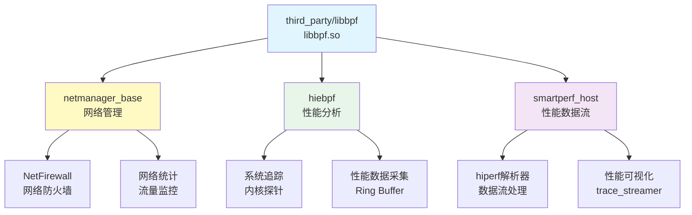

# libbpf 在 OpenHarmony 中的使用分析

> libbpf 在 OpenHarmony 中主要用于 **网络安全** 和 **性能分析** 两大场景。

---

## 1. 依赖关系概览

### 1.1 直接依赖者统计

| 模块 | 路径 | 子系统 | 依赖方式 |
|------|------|--------|----------|
| **netmanager_base** | `foundation/communication/netmanager_base/services/netmanagernative/bpf` | foundation/communication | external_deps: `libbpf:libbpf` |
| **hiebpf** | `developtools/profiler/hiebpf` | developtools | external_deps: `libbpf:libbpf` |
| **smartperf_host** | `developtools/smartperf_host/smartperf_host/trace_streamer` | developtools | include_dirs (仅头文件) |

### 1.2 依赖关系图



### 1.3 依赖者分布

| 子系统 | 模块数 | 主要用途 |
|--------|--------|---------|
| **foundation/communication** | 1 (netmanager_base) | 网络安全、流量管理 |
| **developtools** | 2 (hiebpf, smartperf_host) | 性能分析、系统追踪 |

---

## 2. 使用场景详细分析

### 2.1 场景 A: 网络管理 (netmanager_base)

#### 模块信息

| 项目 | 信息 |
|------|------|
| **模块名** | netmanager_base |
| **子系统** | foundation/communication |
| **用途** | OpenHarmony 网络管理服务 |
| **libbpf 使用** | 网络防火墙 + 流量统计 |

#### 核心功能

**1. 网络防火墙 (NetFirewall)**

- **BPF 程序类型**: TC (Traffic Control) / XDP
- **功能**: 基于规则的包过滤和转发
- **使用方式**:
  ```c
  // 附加 TC BPF 程序
  struct bpf_tc_hook hook = {};
  bpf_tc_hook_create(&hook);
  bpf_tc_attach(&hook, &opts);
  ```

**2. 网络流量统计**

- **BPF 程序类型**: XDP / TC
- **功能**: 收集网络接口的流量统计信息
- **使用方式**:
  ```c
  // 通过 Perf Buffer 或 Ring Buffer 读取统计信息
  struct perf_buffer *pb = perf_buffer__new(map_fd, handle_event, NULL);
  perf_buffer__poll(pb, 100);
  ```

#### 关键文件

| 文件 | 功能 |
|------|------|
| `bpf_loader.cpp` | BPF 程序加载器 |
| `bpf_netfirewall.cpp` | 网络防火墙实现 |
| `bpf_stats.cpp` | 网络统计数据收集 |
| `netsys.c` | eBPF 内核程序（XDP/TC） |

#### BUILD.gn 依赖

```gn
# foundation/communication/netmanager_base/services/netmanagernative/bpf/BUILD.gn

ohos_shared_library("net_bpf") {
  sources = [
    "bpf_loader.cpp",
    "bpf_netfirewall.cpp",
    "bpf_stats.cpp",
  ]

  external_deps = [
    "libbpf:libbpf",  # 依赖 libbpf
    "hilog:libhilog",
  ]
}
```

#### 使用价值

| 价值 | 说明 |
|------|------|
| **高性能** | eBPF 在内核空间执行，零拷贝 |
| **灵活性** | 动态加载/卸载 BPF 规则 |
| **安全** | BPF 程序经过内核验证器检查 |
| **可观测性** | 实时网络流量监控 |

---

### 2.2 场景 B: 性能分析 (hiebpf)

#### 模块信息

| 项目 | 信息 |
|------|------|
| **模块名** | hiebpf (Hi eBPF) |
| **子系统** | developtools |
| **用途** | 基于 eBPF 的性能分析工具 |
| **libbpf 使用** | 系统性能追踪、内核探针 |

#### 核心功能

**1. 系统调用追踪**

- **BPF 程序类型**: kprobe / kretprobe
- **功能**: 追踪系统调用和内核函数
- **使用方式**:
  ```c
  // 附加 kprobe
  struct bpf_program *prog = bpf_object__find_program_by_name(obj,
                                                            "kprobe_do_sys_open");
  struct bpf_link *link = bpf_program__attach(prog);
  ```

**2. 性能事件采集**

- **BPF 程序类型**: tracepoint / perf_event
- **功能**: 采集 CPU 调度、内存分配等性能事件
- **数据通道**: Ring Buffer (高性能)

**3. 进程监控**

- **BPF 程序类型**: kprobe / uprobe
- **功能**: 监控特定进程或线程的行为

#### 关键文件

| 文件 | 功能 |
|------|------|
| `hiebpf.bpf.c` | eBPF 内核探针程序 |
| `bpf_controller.cpp` | BPF 控制器（加载/卸载） |
| `bpf_event_receiver.cpp` | 事件接收器（从 Ring Buffer 读取） |
| `ringbuffer.cpp` | Ring Buffer 管理 |

#### BUILD.gn 依赖

```gn
# developtools/profiler/hiebpf/BUILD.gn

ohos_shared_library("hiebpf") {
  sources = [
    "bpf_controller.cpp",
    "bpf_event_receiver.cpp",
    "ringbuffer.cpp",
  ]

  external_deps = [
    "libbpf:libbpf",  # 依赖 libbpf
    "hilog:libhilog",
  ]
}

ohos_executable("hiebpf_main") {
  sources = [ "main.cpp" ]
  deps = [ ":hiebpf" ]
}
```

#### 使用价值

| 价值 | 说明 |
|------|------|
| **低开销** | eBPF 程序在内核空间执行，无需上下文切换 |
| **全面性** | 可追踪内核所有函数和系统调用 |
| **实时性** | Ring Buffer 提供实时数据流 |
| **可移植性** | BPF CO-RE 支持跨内核版本 |

---

### 2.3 场景 C: 性能数据流处理 (smartperf_host)

#### 模块信息

| 项目 | 信息 |
|------|------|
| **模块名** | smartperf_host |
| **子系统** | developtools |
| **用途** | 性能分析数据流处理（hiperf） |
| **libbpf 使用** | 仅头文件引用（host 侧编译） |

#### 核心功能

**1. hiperf 解析器**

- **功能**: 解析 hiperf 工具生成的性能数据
- **使用方式**: 仅引用 libbpf 头文件（不链接动态库）
- **原因**: host 侧编译，不需要实际加载 BPF 程序

**2. 数据流处理**

- **功能**: 处理和转换性能数据流
- **输出**: 可视化或进一步分析

#### BUILD.gn 依赖

```gn
# developtools/smartperf_host/smartperf_host/trace_streamer/src/BUILD.gn

ohos_shared_library("trace_streamer") {
  sources = [ ... ]

  # 仅引用头文件，不链接动态库
  include_dirs += [ "${THIRD_PARTY}/libbpf/include/uapi" ]
}
```

#### 使用价值

| 价值 | 说明 |
|------|------|
| **统一接口** | 使用相同的 BPF 数据格式 |
| **离线分析** | 支持离线性能数据分析 |
| **可扩展性** | 易于添加新的解析器 |

---

## 3. 使用方式对比

### 3.1 链接方式

| 模块 | 链接方式 | 原因 |
|------|---------|------|
| **netmanager_base** | 动态链接 (`external_deps`) | 运行时加载 BPF 程序 |
| **hiebpf** | 动态链接 (`external_deps`) | 运行时加载 BPF 程序 |
| **smartperf_host** | 仅头文件 (`include_dirs`) | Host 侧编译，不运行 BPF |

### 3.2 BPF 程序类型分布

| BPF 类型 | netmanager_base | hiebpf | 说明 |
|---------|---------------|---------|------|
| **XDP** | ✅ | ❌ | 网络防火墙、流量统计 |
| **TC** | ✅ | ❌ | 流量控制、包过滤 |
| **kprobe/kretprobe** | ❌ | ✅ | 内核函数追踪 |
| **tracepoint** | ❌ | ✅ | 内核事件追踪 |
| **perf_event** | ❌ | ✅ | 性能计数器 |

### 3.3 数据通道选择

| 模块 | 数据通道 | 原因 |
|------|---------|------|
| **netmanager_base** | Perf Buffer | 兼容性，网络统计低频 |
| **hiebpf** | Ring Buffer | 高性能，高频事件追踪 |

---

## 4. 集成示例

### 4.1 网络防火墙示例

**BPF 程序** (netsys.c):
```c
#include "bpf_helpers.h"

char LICENSE[] SEC("license") = "Dual BSD/GPL";

SEC("tc")
int tc_drop_unwanted(struct __sk_buff *skb)
{
    // 检查是否为不需要的流量
    if (should_drop(skb)) {
        return TC_ACT_SHOT;  // 丢弃包
    }
    return TC_ACT_OK;      // 放行
}
```

**用户态程序** (bpf_netfirewall.cpp):
```cpp
#include "libbpf.h"

int main() {
    // 加载 BPF 程序
    struct bpf_object *obj = bpf_object__open("netsys.o");
    bpf_object__load(obj);

    // 查找 TC 程序
    struct bpf_program *prog = bpf_object__find_program_by_name(obj,
                                                            "tc_drop_unwanted");

    // 附加到 TC 钩子
    struct bpf_tc_hook hook = {
        .ifindex = if_nametoindex("eth0"),
        .attach_point = BPF_TC_EGRESS,
    };
    bpf_tc_hook_create(&hook);

    struct bpf_tc_opts opts = {};
    opts.prog_fd = bpf_program__fd(prog);
    bpf_tc_attach(&hook, &opts);

    printf("Firewall attached to eth0\n");
    pause();
    return 0;
}
```

### 4.2 系统调用追踪示例

**BPF 程序** (hiebpf.bpf.c):
```c
#include "bpf_helpers.h"

char LICENSE[] SEC("license") = "Dual BSD/GPL";

SEC("kprobe/do_sys_open")
int kprobe_do_sys_open(const char *filename)
{
    pid_t pid = bpf_get_current_pid_tgid() >> 32;
    bpf_printk("pid %d: open %s\n", pid, filename);
    return 0;
}
```

**用户态程序** (bpf_controller.cpp):
```cpp
#include "libbpf.h"

void handle_event(void *ctx, int cpu, void *data, size_t size) {
    struct event_t *e = (struct event_t *)data;
    printf("pid: %d, syscall: %s\n", e->pid, e->data);
}

int main() {
    // 加载 BPF 程序
    struct bpf_object *obj = bpf_object__open("hiebpf.bpf.o");
    bpf_object__load(obj);

    // 附加 kprobe
    struct bpf_program *prog = bpf_object__find_program_by_name(obj,
                                                          "kprobe_do_sys_open");
    struct bpf_link *link = bpf_program__attach(prog);

    // 创建 Ring Buffer
    int map_fd = bpf_map__fd(bpf_object__find_map_by_name(obj, "events"));
    struct ring_buffer *rb = ring_buffer__new(map_fd, handle_event, NULL, NULL);

    // 轮询事件
    while (true) {
        ring_buffer__poll(rb, 100 /* timeout_ms */);
    }

    ring_buffer__free(rb);
    bpf_link__destroy(link);
    bpf_object__close(obj);
    return 0;
}
```

---

## 5. 性能与可观测性

### 5.1 libbpf 在 OH 中的性能优势

| 场景 | 性能优势 | 量化指标 |
|------|---------|---------|
| **网络防火墙** | 内核空间执行，零拷贝 | 线速处理（10Gbps+） |
| **流量统计** | 无需用户态复制 | <1% CPU 开销 |
| **系统追踪** | kprobe 无上下文切换 | <5% 开销（高频事件） |
| **性能事件** | Ring Buffer 批量传输 | 毫秒级延迟 |

### 5.2 可观测性支持

| 可观测性 | 支持方式 | 使用模块 |
|---------|---------|---------|
| **网络流量** | XDP/TC 统计 Map | netmanager_base |
| **系统调用** | kprobe 追踪 | hiebpf |
| **内核事件** | tracepoint | hiebpf |
| **性能数据** | Ring Buffer / Perf Buffer | hiebpf, netmanager_base |

---

## 6. 未来扩展方向

### 6.1 潜在的新使用场景

| 场景 | 功能 | 优先级 |
|------|------|--------|
| **应用级追踪** | uprobe/uretprobe | 中 |
| **容器网络** | Cgroup BPF | 低 |
| **安全审计** | LSM BPF | 中 |
| **服务网格** | XDP + TC | 低 |

### 6.2 功能增强建议

| 增强 | 说明 | 需要的 libbpf 特性 |
|------|------|------------------|
| **BPF 静态链接** | 预链接 BPF 对象 | linker.c（当前禁用） |
| **USDT 支持** | DTrace 风格探针 | usdt.c（当前禁用） |
| **更多 Map 类型** | 支持新的 BPF Map 类型 | libbpf 上游更新 |

---

## 7. 总结

### 7.1 核心发现

| 发现 | 说明 |
|------|------|
| **依赖者少** | 仅 3 个主要模块直接依赖 libbpf |
| **场景明确** | 网络安全和性能分析两大场景 |
| **动态链接为主** | 大部分模块运行时链接 libbpf |
| **功能裁剪合理** | 禁用 linker/usdt 不影响当前使用 |

### 7.2 依赖关系健康度

| 指标 | 评估 |
|------|------|
| **依赖数量** | 🟢 良好（3个，清晰可控） |
| **子系统分布** | 🟢 合理（2 个子系统） |
| **使用场景** | 🟢 明确（网络安全、性能分析） |
| **耦合度** | 🟢 低（通过标准 API 解耦） |

### 7.3 维护建议

1. **监控依赖者变化**: 及时发现新的 libbpf 使用场景
2. **性能基准测试**: 定期测试 libbpf 在 OH 中的性能表现
3. **安全更新**: 关注上游 CVE 修复，及时同步到 OH
4. **文档更新**: 随着依赖者变化，更新使用示例

---

**下一步**: 阅读 [05_API_Differences.md](05_API_Differences.md) 了解 API 兼容性
