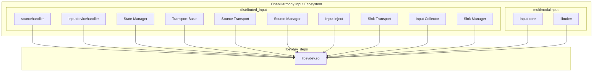

# 04 依赖关系与使用

## 4.1 直接依赖者概览

libevdev 是 OpenHarmony 输入系统的核心依赖库，通过 grep 搜索发现共有 **50+** 个 BUILD.gn 文件直接依赖该库。主要分布在以下子系统：

| 子系统 | 模块数量 | 主要用途 |
|--------|---------|---------|
| **distributed_input** | 40+ | 分布式输入设备共享 |
| **multimodalinput** | 10+ | 多模态输入事件处理 |

---

## 4.2 分布式输入模块 (distributed_input)

### 模块列表

#### 核心服务模块

| BUILD.gn 路径 | 用途 |
|-------------|------|
| `foundation/distributedhardware/distributed_input/sourcehandler/BUILD.gn` | 分布式输入源处理 |
| `foundation/distributedhardware/distributed_input/inputdevicehandler/BUILD.gn` | 输入设备处理 |
| `foundation/distributedhardware/distributed_input/services/state/BUILD.gn` | 状态管理 |
| `foundation/distributedhardware/distributed_input/services/transportbase/BUILD.gn` | 传输基础 |
| `foundation/distributedhardware/distributed_input/services/source/transport/BUILD.gn` | 源端传输 |
| `foundation/distributedhardware/distributed_input/services/source/sourcemanager/BUILD.gn` | 源端管理 |
| `foundation/distributedhardware/distributed_input/services/source/inputinject/BUILD.gn` | 输入注入 |
| `foundation/distributedhardware/distributed_input/services/sink/transport/BUILD.gn` | 接收端传输 |
| `foundation/distributedhardware/distributed_input/services/sink/inputcollector/BUILD.gn` | 输入收集 |
| `foundation/distributedhardware/distributed_input/services/sink/sinkmanager/BUILD.gn` | 接收端管理 |

#### 测试模块

| BUILD.gn 路径 | 用途 |
|-------------|------|
| `foundation/distributedhardware/distributed_input/sourcehandler/test/unittest/BUILD.gn` | 单元测试 |
| `foundation/distributedhardware/distributed_input/services/*/test/*/BUILD.gn` | 各服务测试 |

### 使用场景：分布式输入共享

```c
/*
 * libevdev 在分布式输入中的典型使用流程
 */

// 1. 打开远程设备
int fd = open("/dev/input/event0", O_RDONLY);
struct libevdev *dev = libevdev_new();
libevdev_set_fd(dev, fd);

// 2. 读取设备信息
printf("Device: %s\n", libevdev_get_name(dev));
printf("Bus: 0x%04x\n", libevdev_get_id_bustype(dev));

// 3. 解析输入事件
struct input_event ev;
while (libevdev_next_event(dev, LIBEVDEV_READ_FLAG_NORMAL, &ev) == 0) {
    // 发送到分布式输入总线
    distribute_input_event(&ev);
}

// 4. 清理
libevdev_free(dev);
close(fd);
```

---

## 4.3 多模态输入模块 (multimodalinput)

### 模块列表

| BUILD.gn 路径 | 用途 |
|-------------|------|
| `foundation/multimodalinput/input/BUILD.gn` | 核心输入处理 |
| `foundation/multimodalinput/input/libudev/BUILD.gn` | udev 设备管理 |

### 使用场景：输入事件注入

```c
/*
 * libevdev-uinput 在事件注入中的使用
 */

// 1. 创建 uinput 设备描述符
struct libevdev *dev = libevdev_new();
libevdev_set_name(dev, "OHOS Virtual Touchscreen");

// 2. 设置设备能力
libevdev_enable_event_type(dev, EV_KEY);
libevdev_enable_event_code(dev, BTN_TOUCH, 1);
libevdev_enable_event_type(dev, EV_ABS);
libevdev_enable_event_code(dev, EV_ABS, ABS_X, &abs_info);
libevdev_enable_event_code(dev, EV_ABS, ABS_Y, &abs_info);

// 3. 创建设备
struct libevdev_uinput *uidev;
int fd = open("/dev/uinput", O_RDWR | O_CLOEXEC);
libevdev_uinput_create_from_device(dev, fd, &uidev);

// 4. 注入触摸事件
libevdev_uinput_write_event(uidev, EV_ABS, ABS_X, 500);
libevdev_uinput_write_event(uidev, EV_ABS, ABS_Y, 300);
libevdev_uinput_write_event(uidev, EV_SYN, SYN_REPORT, 0);

// 5. 销毁设备
libevdev_uinput_destroy(uidev);
```

---

## 4.4 依赖关系图



### 依赖层级

```
Level 0: 硬件层
         /dev/input/event*
         
Level 1: libevdev.so
         设备封装、事件解析
         
Level 2: 输入服务层
         distributed_input/*, multimodalinput/input
         
Level 3: 应用框架层
         Ace Engine, 应用框架
```

---

## 4.5 依赖声明方式

### GN 依赖声明

```gn
# 静态链接（通过 deps）
ohos_shared_library("my_input_module") {
  deps = [
    "//third_party/libevdev:libevdev",
  ]
}

# 或通过 public_deps 导出依赖
ohos_shared_library("libdinput_source_handler") {
  public_deps = [
    "//third_party/libevdev:libevdev",
  ]
}
```

### 头文件引用

```c
// 核心 API
#include <libevdev.h>

// uinput 支持
#include <libevdev-uinput.h>

// 工具函数
#include <libevdev-util.h>
```

---

## 4.6 关键使用场景详解

### 场景 1：设备枚举与能力查询

```c
/*
 * 使用 libevdev 查询设备能力
 */

int enumerate_input_devices() {
    DIR *dir = opendir("/dev/input");
    struct dirent *entry;
    
    while ((entry = readdir(dir)) != NULL) {
        if (strncmp(entry->d_name, "event", 5) != 0)
            continue;
            
        char path[256];
        snprintf(path, sizeof(path), "/dev/input/%s", entry->d_name);
        
        int fd = open(path, O_RDONLY | O_CLOEXEC);
        if (fd < 0)
            continue;
            
        struct libevdev *dev = libevdev_new();
        if (libevdev_set_fd(dev, fd) < 0) {
            libevdev_free(dev);
            close(fd);
            continue;
        }
        
        // 查询设备信息
        printf("Device: %s\n", libevdev_get_name(dev));
        printf("Bus: 0x%04x Vendor: 0x%04x Product: 0x%04x\n",
               libevdev_get_id_bustype(dev),
               libevdev_get_id_vendor(dev),
               libevdev_get_id_product(dev));
        
        // 查询支持的事件类型
        if (libevdev_has_event_type(dev, EV_KEY))
            printf("  Supports: EV_KEY\n");
        if (libevdev_has_event_type(dev, EV_ABS))
            printf("  Supports: EV_ABS\n");
        if (libevdev_has_event_type(dev, EV_REL))
            printf("  Supports: EV_REL\n");
        
        libevdev_free(dev);
        close(fd);
    }
    
    closedir(dir);
    return 0;
}
```

### 场景 2：触摸事件处理

```c
/*
 * 多点触控事件处理
 */

#define MAX_TOUCH_POINTS 10

typedef struct {
    int slot;
    int tracking_id;
    int x;
    int y;
    bool active;
} touch_point_t;

int process_touch_events(int fd) {
    struct libevdev *dev = libevdev_new();
    libevdev_set_fd(dev, fd);
    
    touch_point_t touches[MAX_TOUCH_POINTS] = {0};
    
    struct input_event ev;
    do {
        libevdev_next_event(dev, LIBEVDEV_READ_FLAG_BLOCKING, &ev);
        
        if (ev.type == EV_ABS) {
            int slot = libevdev_get_slot(dev);
            if (slot >= 0 && slot < MAX_TOUCH_POINTS) {
                switch (ev.code) {
                    case ABS_MT_POSITION_X:
                        touches[slot].x = ev.value;
                        touches[slot].active = true;
                        break;
                    case ABS_MT_POSITION_Y:
                        touches[slot].y = ev.value;
                        break;
                    case ABS_MT_TRACKING_ID:
                        touches[slot].tracking_id = ev.value;
                        touches[slot].active = (ev.value >= 0);
                        break;
                }
            }
        } else if (ev.type == EV_SYN && ev.code == SYN_REPORT) {
            // 报告所有触摸点
            for (int i = 0; i < MAX_TOUCH_POINTS; i++) {
                if (touches[i].active) {
                    printf("Touch %d: (%d, %d)\n",
                           i, touches[i].x, touches[i].y);
                }
            }
        }
    } while (ev.type != EV_SYN || ev.code != SYN_REPORT ||
             libevdev_get_slot(dev, 0) >= 0);
    
    libevdev_free(dev);
    return 0;
}
```

### 场景 3：虚拟设备创建

```c
/*
 * 使用 libevdev-uinput 创建虚拟键盘
 */

#define VIRTUAL_KEYBOARD_NAME "OHOS Virtual Keyboard"

int create_virtual_keyboard() {
    struct libevdev *dev = libevdev_new();
    libevdev_set_name(dev, VIRTUAL_KEYBOARD_NAME);
    
    // 启用按键事件
    libevdev_enable_event_type(dev, EV_KEY);
    
    // 启用常用键
    libevdev_enable_event_code(dev, EV_KEY, KEY_A, NULL);
    libevdev_enable_event_code(dev, EV_KEY, KEY_B, NULL);
    libevdev_enable_event_code(dev, EV_KEY, KEY_ENTER, NULL);
    libevdev_enable_event_code(dev, EV_KEY, KEY_SPACE, NULL);
    libevdev_enable_event_code(dev, EV_KEY, KEY_ESC, NULL);
    
    // 创建 uinput 设备
    struct libevdev_uinput *uidev;
    int uinput_fd = open("/dev/uinput", O_RDWR | O_CLOEXEC);
    if (uinput_fd < 0) {
        perror("open /dev/uinput");
        libevdev_free(dev);
        return -1;
    }
    
    int err = libevdev_uinput_create_from_device(dev, uinput_fd, &uidev);
    if (err < 0) {
        fprintf(stderr, "Failed to create uinput device: %s\n", strerror(-err));
        close(uinput_fd);
        libevdev_free(dev);
        return -1;
    }
    
    // 注入按键事件：模拟按下 'A'
    libevdev_uinput_write_event(uidev, EV_KEY, KEY_A, 1);  // 按下
    libevdev_uinput_write_event(uidev, EV_SYN, SYN_REPORT, 0);
    usleep(10000);  // 10ms
    libevdev_uinput_write_event(uidev, EV_KEY, KEY_A, 0);  // 释放
    libevdev_uinput_write_event(uidev, EV_SYN, SYN_REPORT, 0);
    
    printf("Virtual keyboard created and key 'A' injected\n");
    
    // 销毁设备
    libevdev_uinput_destroy(uidev);
    libevdev_free(dev);
    
    return 0;
}
```

---

## 4.7 FDSAN 使用说明

### OH 特有的安全机制

libevdev-uinput 在 OpenHarmony 中使用了 FDSAN (File Descriptor Sanitizer) 进行安全加固。

### FDSAN 初始化

```c
#include <fdsan.h>  // OH 特有头文件

// FDSAN 标签常量
static const uint64_t FDSAN_NEW_TAG = 0xD002800;
```

### 安全关闭模式

```c
/*
 * 使用 fdsan_close_with_tag 代替普通的 close()
 * 防止 Use-After-Free 漏洞
 */

// 普通模式
close(fd);

// FDSAN 安全模式
fdsan_close_with_tag(fd, FDSAN_NEW_TAG);
```

### 标签交换

```c
/*
 * 在文件操作前后交换标签
 * 适用于需要临时让出所有权的情况
 */

// 交换前
fdsan_exchange_owner_tag(fd, 0, FDSAN_NEW_TAG);

// ... 执行文件操作 ...

// 交换后（如果需要保留标签）
// fdsan_exchange_owner_tag(fd, FDSAN_NEW_TAG, 0);
```

---

## 4.8 调试技巧

### 事件日志

```c
/*
 * 启用 libevdev 调试日志
 */

#include <stdio.h>

void log_input_events(struct libevdev *dev) {
    struct input_event ev;
    
    while (1) {
        int rc = libevdev_next_event(dev,
                                     LIBEVDEV_READ_FLAG_BLOCKING,
                                     &ev);
        
        if (rc == 0) {
            // 打印事件详情
            printf("[%ld.%06ld] type=0x%02x code=0x%02x value=0x%08x\n",
                   ev.time.tv_sec,
                   ev.time.tv_usec,
                   ev.type,
                   ev.code,
                   ev.value);
        }
    }
}
```

### 设备能力查询

```c
/*
 * 打印设备的完整能力信息
 */

void print_device_capabilities(struct libevdev *dev) {
    printf("=== Device Capabilities ===\n");
    printf("Name: %s\n", libevdev_get_name(dev));
    printf("Bus: 0x%04x Vendor: 0x%04x Product: 0x%04x Version: 0x%04x\n",
           libevdev_get_id_bustype(dev),
           libevdev_get_id_vendor(dev),
           libevdev_get_id_product(dev),
           libevdev_get_id_version(dev));
    
    // 打印支持的事件类型
    printf("\nEvent Types:\n");
    for (int i = 0; i < EV_MAX; i++) {
        if (libevdev_has_event_type(dev, i)) {
            printf("  0x%02x - %s\n", i, event_type_name(i));
        }
    }
    
    // 打印支持的功能键
    printf("\nKeys:\n");
    for (int i = 0; i < KEY_MAX; i++) {
        if (libevdev_has_event_code(dev, EV_KEY, i)) {
            printf("  0x%03x - %s\n", i, key_name(i));
        }
    }
}
```

---

## 4.9 常见问题

### Q1: 如何判断设备是否支持多点触控？

```c
/*
 * 检查设备是否支持多点触控
 */

bool supports_multitouch(struct libevdev *dev) {
    // 方法1：检查 ABS_MT_POSITION_X 是否存在
    if (!libevdev_has_event_code(dev, EV_ABS, ABS_MT_POSITION_X))
        return false;
    
    // 方法2：检查触摸槽数量
    int num_slots = libevdev_get_num_slots(dev);
    if (num_slots <= 0)
        return false;
    
    return true;
}
```

### Q2: 如何区分触摸和鼠标事件？

```c
/*
 * 根据事件类型区分输入设备
 */

enum input_device_type {
    DEVICE_TOUCHSCREEN,
    DEVICE_MOUSE,
    DEVICE_KEYBOARD,
    DEVICE_UNKNOWN
};

enum input_device_type detect_device_type(struct libevdev *dev) {
    if (libevdev_has_event_code(dev, EV_KEY, BTN_TOUCH))
        return DEVICE_TOUCHSCREEN;
    
    if (libevdev_has_event_code(dev, EV_REL, REL_X) &&
        libevdev_has_event_code(dev, EV_REL, REL_Y))
        return DEVICE_MOUSE;
    
    if (libevdev_has_event_code(dev, EV_KEY, KEY_A))
        return DEVICE_KEYBOARD;
    
    return DEVICE_UNKNOWN;
}
```

### Q3: 为什么事件读取会阻塞？

```c
/*
 * 非阻塞模式读取
 */

int read_nonblocking(struct libevdev *dev) {
    struct input_event ev;
    
    // 使用非阻塞标志
    int rc = libevdev_next_event(dev,
                                  LIBEVDEV_READ_FLAG_NORMAL,
                                  &ev);
    
    if (rc == -EAGAIN) {
        // 没有新事件
        return 0;
    } else if (rc < 0) {
        // 错误
        fprintf(stderr, "Read error: %s\n", strerror(-rc));
        return -1;
    }
    
    // 处理事件
    process_event(&ev);
    return 1;
}
```

---

## 4.10 性能考虑

### 批量事件处理

```c
/*
 * 使用批量读取模式提高性能
 */

int batch_read_events(struct libevdev *dev, int max_events) {
    struct input_event ev;
    int count = 0;
    
    do {
        int rc = libevdev_next_event(dev,
                                     LIBEVDEV_READ_FLAG_NORMAL,
                                     &ev);
        
        if (rc == 0) {
            // 处理事件
            process_event(&ev);
            count++;
        }
    } while (count < max_events && rc == 0);
    
    return count;
}
```

### 避免不必要的系统调用

```c
/*
 * 最佳实践：最小化系统调用
 */

// 不好：每次事件都调用
libevdev_uinput_write_event(uidev, EV_ABS, ABS_X, x1);
libevdev_uinput_write_event(uidev, EV_ABS, ABS_Y, y1);
libevdev_uinput_write_event(uidev, EV_SYN, SYN_REPORT, 0);

// 好：批量准备，然后一次性发送
libevdev_uinput_updatesync_context(uidev);  // 准备同步上下文
libevdev_uinput_write_event(uidev, EV_ABS, ABS_X, x1);
libevdev_uinput_write_event(uidev, EV_ABS, ABS_Y, y1);
libevdev_uinput_write_event(uidev, EV_SYN, SYN_REPORT, 0);
```

---

## 4.11 相关文档

### 内部文档

| 文档 | 位置 |
|------|------|
| 构建配置 | [03_Build_Integration.md](./03_Build_Integration.md) |
| Patch 详情 | [02_Patches.md](./02_Patches.md) |
| 库概述 | [01_Overview.md](./01_Overview.md) |

### 外部资源

| 资源 | 链接 |
|------|------|
| libevdev 上游代码 | https://gitlab.freedesktop.org/libevdev/libevdev |
| libevdev API 文档 | http://www.freedesktop.org/software/libevdev/doc/latest/ |
| OH Input 子系统 | ../foundation/multimodalinput/input/README.md |
| OH 分布式输入 | ../foundation/distributedhardware/distributed_input/README.md |

---

## 文档总结

本文档详细介绍了 libevdev 在 OpenHarmony 中的使用场景：

| 方面 | 关键点 |
|------|-------|
| **主要使用者** | distributed_input, multimodalinput |
| **核心功能** | 输入事件解析、虚拟设备创建 |
| **OH 特有** | FDSAN 安全加固 |
| **依赖方式** | 静态链接、头文件引用 |
| **使用难度** | 中等 |

如需进一步了解，请参考相关章节或联系组件负责人。
