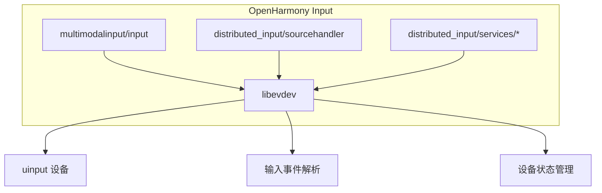

# libevdev - OpenHarmony Wiki

> Linux evdev 设备包装库在 OpenHarmony 中的集成与适配文档

## 库概述

**libevdev** 是 Linux 系统中处理 evdev 输入设备的标准库，提供类型安全的接口来解析和构造 input 事件。在 OpenHarmony 系统中，该库是多模态输入系统和分布式输入系统的核心依赖。

| 属性 | 值 |
|------|-----|
| **版本** | 3.1 (OH) / 1.13.1 (上游) |
| **许可证** | MIT License |
| **上游地址** | https://gitlab.freedesktop.org/libevdev/libevdev |
| **OH 组件** | @ohos/libevdev |
| **子系统** | thirdparty |

## OpenHarmony 适配要点

### 核心 Patch 列表

| Patch 文件 | 修改范围 | OH 适配类型 |
|-----------|---------|-------------|
| `libevdev_0000.diff` | 5 个文件 | 安全加固、Bug 修复、功能扩展 |

### 主要适配内容

1. **FDSAN 安全注解**：为 uinput 设备创建添加文件描述符安全标签，防止 Use-After-Free 漏洞
2. **位操作修复**：修复 `1LL` 改为 `1ULL`，确保 64 位系统上的正确性
3. **多点触控同步**：修复 `push_mt_sync_events` 中的竞态条件
4. **新键值定义**：添加 KEY_LINK_PHONE、KEY_ACCESSIBILITY、KEY_DO_NOT_DISTURB 等
5. **新总线类型**：添加 BUS_SDW (SoundWire) 支持

## 文档导航

### 快速开始

| 目标 | 文档 |
|------|------|
| 了解库的基本功能 | [01_Overview.md](./01_Overview.md) |
| 查看所有 Patch 详情 | [02_Patches.md](./02_Patches.md) |
| 理解构建适配 | [03_Build_Integration.md](./03_Build_Integration.md) |
| 查看使用场景 | [04_Usage_in_OH.md](./04_Usage_in_OH.md) |

### 阅读路线建议

| 读者类型 | 推荐阅读顺序 |
|---------|-------------|
| 维护者 | Patch → 构建 → 使用 |
| 开发者 | 使用 → Patch → 构建 |
| 安全审计 | Patch → 安全分析 |

## 依赖关系概览



## 快速参考

### 导出头文件

```c
#include <libevdev.h>
#include <libevdev-uinput.h>
#include <libevdev-util.h>
```

### GN 依赖声明

```gn
deps = [ "//third_party/libevdev:libevdev" ]
```

### Inner Kit 导出

| 头文件 | 用途 |
|-------|------|
| `libevdev.h` | 核心 API |
| `libevdev-uinput.h` | 虚拟设备创建 |
| `libevdev-util.h` | 工具函数 |

## 相关资源

- [上游代码库](https://gitlab.freedesktop.org/libevdev/libevdev)
- [上游 API 文档](http://www.freedesktop.org/software/libevdev/doc/latest/)
- [OpenHarmony Input 子系统](../foundation/multimodalinput/input/README.md)
- [OpenHarmony Distributed Input](../foundation/distributedhardware/distributed_input/README.md)

## 维护信息

| 项目 | 值 |
|------|-----|
| **组件负责人** | gaoshangqi1@huawei.com |
| **Patch 数量** | 1 |
| **OH 特有 Patch** | 70% |
| **上游可合并 Patch** | 30% |
| **上次评估** | 2026-02-07 |

---

> 本文档由 OpenHarmony Wiki Generator 自动生成
> 最后更新：2026-02-07
