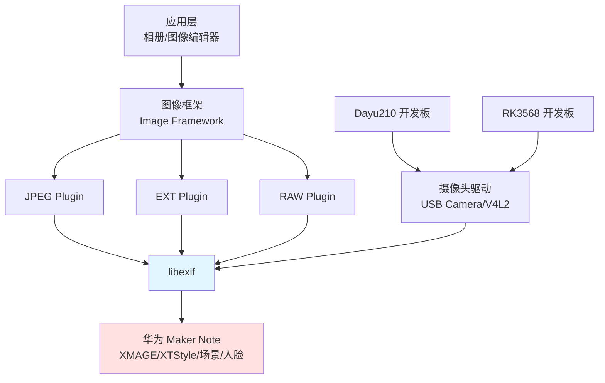

# 依赖关系与使用

## 概述

libexif 在 OpenHarmony 中被 21+ 个模块直接依赖，是多媒体子系统的核心基础库。

### 依赖关系图



**说明**:
- **蓝色**: libexif 核心库
- **红色**: 华为 Maker Note 扩展（OH 特有）

## 直接依赖者

### 核心依赖者（5 个）

#### 1. libjpegplugin - JPEG 图像编解码插件

**BUILD.gn**: `foundation/multimedia/image_framework/plugins/common/libs/image/libjpegplugin/BUILD.gn`

```gn
ohos_shared_library("jpegplugin") {
  external_deps = [
    "libexif:libexif",  # ← 直接依赖
    "libjpeg-turbo:turbojpeg",
    "skia:skia_canvaskit",
  ]
  sources = [
    "src/exif_info.cpp",       # ← 使用 libexif 提取 EXIF
    "src/exif_maker_note.cpp",  # ← 处理 Maker Note
    ...
  ]
}
```

**用途**:
- 解码 JPEG 图像
- 提取 EXIF 元数据
- 解析 Maker Note（包括华为）

**使用场景**:
- 用户查看相册中的 JPEG 照片
- 图像编辑器加载 JPEG
- 图像缩略图生成

**链接方式**: 动态链接（shared library）

#### 2. libextplugin - 未知格式图像插件

**BUILD.gn**: `foundation/multimedia/image_framework/plugins/common/libs/image/libextplugin/BUILD.gn`

```gn
ohos_static_library("exifhelper") {
  external_deps = [
    "libexif:libexif",  # ← 直接依赖
  ]
  sources = [
    "../libjpegplugin/src/exif_info.cpp",
    "../libjpegplugin/src/exif_maker_note.cpp",
  ]
}

ohos_shared_library("extplugin") {
  deps = [ ":exifhelper" ]  # ← 通过 exifhelper 间接依赖
  ...
}
```

**用途**:
- 处理未知格式的图像
- 提供统一的 EXIF 信息提取接口

**使用场景**:
- 图像框架识别格式失败时的后备处理
- 统一的 EXIF 信息封装

**链接方式**:
- `exifhelper`: 静态链接
- `extplugin`: 通过 `exifhelper` 间接依赖

#### 3. librawplugin - RAW 图像编解码插件

**BUILD.gn**: `foundation/multimedia/image_framework/plugins/common/libs/image/librawplugin/BUILD.gn`

```gn
ohos_shared_library("rawplugin") {
  external_deps = [
    "libexif:libexif",  # ← 直接依赖（假设）
    "skia:piex",  # Pixel Information Extraction
    "skia:skia_canvaskit",
  ]
  ...
}
```

**用途**:
- 解码 RAW 格式图像（如 .dng, .arw, .nef）
- 提取 RAW 图像的 EXIF 数据

**使用场景**:
- 专业摄影处理
- 原始图像数据提取

**链接方式**: 动态链接

#### 4. usb_camera_pipeline_core - USB 摄像头驱动

**BUILD.gn**: `drivers/peripheral/camera/vdi_base/usb_camera/pipeline_core/BUILD.gn`

```gn
ohos_shared_library("usb_camera_pipeline_core") {
  sources = [
    "$camera_path_usb/pipeline_core/src/node/exif_node.cpp",  # ← EXIF 处理节点
    ...
  ]
  include_dirs = [
    "$camera_path_vdi/utils/exif",  # ← 包含 EXIF 工具
    ...
  ]
  external_deps = [
    "libexif:libexif",  # ← 直接依赖
    "libjpeg-turbo:turbojpeg",
    ...
  ]
}
```

**用途**:
- USB 摄像头管线中的 EXIF 处理
- 生成/修改拍摄图像的 EXIF 数据

**使用场景**:
- 用户使用 USB 摄像头拍照
- 摄像头预览时的 EXIF 数据流

**链接方式**: 动态链接

#### 5. camera_utils - 摄像头通用工具

**BUILD.gn**: `drivers/peripheral/camera/vdi_base/common/utils/BUILD.gn`

```gn
ohos_shared_library("peripheral_camera_utils") {
  sources = [
    "exif/exif_utils.cpp",  # ← EXIF 工具函数
    ...
  ]
  external_deps = [
    "libexif:libexif",  # ← 直接依赖
    ...
  ]
}
```

**用途**:
- 提供通用的 EXIF 处理工具函数
- 封装 libexif API

**使用场景**:
- 摄像头驱动的 EXIF 操作辅助
- EXIF 数据格式转换

**链接方式**: 动态链接

### 开发板特定依赖（2 个）

#### 6. Dayu210 摄像头实现

**BUILD.gn**: `device/board/hihope/dayu210/camera/vdi_impl/v4l2/pipeline_core/BUILD.gn`

```gn
ohos_shared_library("dayu210_camera_pipeline") {
  external_deps = [
    "libexif:libexif",  # ← 直接依赖
    ...
  ]
  ...
}
```

**用途**:
- Dayu210 开发板的摄像头 V4L2 管线实现
- 处理开发板摄像头的 EXIF 数据

**链接方式**: 动态链接

#### 7. RK3568 摄像头实现

**BUILD.gn**: `device/board/hihope/rk3568/camera/vdi_impl/v4l2/pipeline_core/BUILD.gn`

```gn
ohos_shared_library("rk3568_camera_pipeline") {
  external_deps = [
    "libexif:libexif",  # ← 直接依赖
    ...
  ]
  ...
}
```

**用途**:
- RK3568 开发板的摄像头 V4L2 管线实现
- 处理开发板摄像头的 EXIF 数据

**链接方式**: 动态链接

### 测试依赖（14+ 个）

#### Fuzzer 测试

libexif 有大量的模糊测试（Fuzzer），用于发现安全漏洞：

| 测试类型 | 文件路径 | 测试目标 |
|---------|-----------|----------|
| EXIF JPEG Fuzzer | `foundation/multimedia/image_framework/frameworks/innerkitsimpl/test/fuzztest/imagefwkexifjpeg_fuzzer/BUILD.gn` | JPEG EXIF 解析 |
| EXIF PNG Fuzzer | `.../imagefwkexifpng2_fuzzer/BUILD.gn` | PNG EXIF 解析 |
| EXIF DNG Fuzzer | `.../imagefwkexifdng2_fuzzer/BUILD.gn` | DNG EXIF 解析 |
| Decode Picture Fuzzer | `.../imagefwkdecodepicture_fuzzer/BUILD.gn` | 图像解码 EXIF |
| Decode GIF Fuzzer | `.../imagefwkdecodegif_fuzzer/BUILD.gn` | GIF EXIF 解析 |
| Decode HDR Fuzzer | `.../imagefwkdecodehdr_fuzzer/BUILD.gn` | HDR EXIF 解析 |
| Decode BMP Fuzzer | `.../imagefwkdecodebmp_fuzzer/BUILD.gn` | BMP EXIF 解析 |
| Decode EXT Fuzzer | `.../imagefwkdecodeext_fuzzer/BUILD.gn` | EXT EXIF 解析 |
| Decode JPEG2 Fuzzer | `.../imagefwkdecodejpeg2_fuzzer/BUILD.gn` | JPEG EXIF 解析（变体） |
| Decode Picture2 Fuzzer | `.../imagefwkdecodepicture2_fuzzer/BUILD.gn` | 图像解码 EXIF（变体） |
| DNG Helper Fuzzer | `.../imagedngsdkhelper_fuzzer/BUILD.gn` | DNG SDK EXIF |
| Raw Plugin Fuzzer | `.../imagerawplugin_fuzzer/BUILD.gn` | RAW EXIF 解析 |
| JPEG YUV Plugin Fuzzer | `.../imagejpegyuvplugin_fuzzer/BUILD.gn` | JPEG YUV EXIF |
| EXT2 Fuzzer | `.../imagefwkdecodeext2_fuzzer/BUILD.gn` | EXT EXIF 解析（变体） |

**测试目的**:
- 发现缓冲区溢出漏洞
- 发现整数溢出漏洞
- 发现 DoS（拒绝服务）攻击面
- 验证华为 Maker Note 的安全性

**执行方式**:
- 随机生成恶意 EXIF 数据
- 喂给 libexif 解析
- 监控崩溃、内存错误、超时

## 使用场景分析

### 场景 1：查看相册中的照片

```
用户操作: 打开相册，查看 JPEG 照片
    ↓
图像框架: 调用 libjpegplugin 解码 JPEG
    ↓
libjpegplugin:
    1. 使用 libjpeg-turbo 解码图像数据
    2. 使用 libexif 提取 EXIF 数据
    3. 解析标准 EXIF 标签（时间、位置、相机型号）
    4. 解析华为 Maker Note（XMAGE、XTStyle、场景、人脸）
    ↓
相册: 显示照片 + 元数据（拍摄时间、场景标签、人脸框等）
```

**关键 libexif 功能**:
- `exif_data_load_data()` - 从 JPEG 加载 EXIF
- `exif_entry_get_value()` - 获取标签值
- `exif_mnote_data_huawei_identify()` - 识别华为 Maker Note
- `mnote_huawei_tag_get_description()` - 获取华为标签描述

### 场景 2：使用 USB 摄像头拍照

```
用户操作: 使用 USB 摄像头拍照
    ↓
摄像头驱动 (usb_camera_pipeline_core):
    1. 捕获图像数据
    2. 调用 exif_node 生成 EXIF 数据
    3. 使用 libexif 创建 EXIF 结构
    4. 嵌入标准 EXIF 标签（时间、相机型号等）
    5. 嵌入华为 Maker Note：
       - 拍摄模式
       - 场景识别（美食、夜景等）
       - 人脸识别（人脸数量、置信度）
       - XMAGE 模式和裁剪区域
    6. 保存为 JPEG 文件
    ↓
文件: JPEG + 完整的 EXIF 数据
```

**关键 libexif 功能**:
- `exif_data_new()` - 创建新的 EXIF 数据
- `exif_data_save_data()` - 保存 EXIF 数据到字节流
- `exif_mnote_data_huawei_new()` - 创建华为 Maker Note
- `exif_mnote_data_add_entry()` - 添加华为标签

### 场景 3：编辑照片的 XTStyle 滤镜

```
用户操作: 在图像编辑器中调整滤镜
    ↓
图像编辑器:
    1. 加载 JPEG 图像
    2. 使用 libexif 提取现有 EXIF 数据
    3. 读取华为 XTStyle 参数（饱和度、色调等）
    4. 用户调整滤镜参数
    5. 使用 libexif 更新 EXIF 数据
    6. 保存 JPEG 文件
    ↓
文件: JPEG + 更新的 XTStyle 参数
```

**关键 libexif 功能**:
- `exif_mnote_data_huawei_get_entry_by_tag()` - 获取 XTStyle 标签
- `exif_mnote_data_huawei_set_entry()` - 更新 XTStyle 标签

### 场景 4：播放华为运动照片

```
用户操作: 点击播放运动照片
    ↓
图像框架:
    1. 加载 JPEG 图像
    2. 使用 libexif 提取 EXIF 数据
    3. 读取华为运动照片标签：
       - MNOTE_MOVING_PHOTO_VERSION
       - MNOTE_MICRO_VIDEO_PRESENTATION_TIMESTAMP_US
       - MNOTE_MOVING_PHOTO_ID
    4. 使用运动照片 ID 关联对应的微视频文件
    5. 同步播放静态图 + 微视频
    ↓
播放: 运动照片（静态图 + 短视频）
```

**关键 libexif 功能**:
- `mnote_huawei_entry_get_value()` - 获取运动照片标签值
- 华为 Maker Note 扩展：运动照片标签支持

## 依赖者汇总

### 按子系统分类

| 子系统 | 模块 | 数量 |
|-------|------|------|
| **multimedia** | libjpegplugin, libextplugin, librawplugin | 3 |
| **hdf** | usb_camera, camera_utils, Dayu210, RK3568 | 4 |
| **test** | 14+ fuzzer 测试 | 14+ |
| **总计** | | **21+** |

### 按链接方式分类

| 链接方式 | 模块 | 数量 |
|---------|------|------|
| **动态链接** | libjpegplugin, libextplugin, librawplugin, usb_camera, camera_utils, Dayu210, RK3568 | 7 |
| **静态链接** | exifhelper (libextplugin 内部） | 1 |
| **间接依赖** | extplugin (通过 exifhelper） | 1 |

### 按使用类型分类

| 使用类型 | 模块 | 数量 |
|---------|------|------|
| **图像解码** | libjpegplugin, librawplugin | 2 |
| **图像编码** | libjpegplugin | 1 |
| **摄像头驱动** | usb_camera, camera_utils, Dayu210, RK3568 | 4 |
| **测试** | 14+ fuzzer | 14+ |
| **未知格式处理** | libextplugin | 1 |

## 关键使用路径

### 路径 1：图像解码路径

```
JPEG 文件
    ↓ libjpeg-turbo (解码图像数据）
    ↓ libexif (提取 EXIF 数据）
    ↓ 图像框架 (封装为 PixelMap + ExifMetadata）
    ↓ 应用层 (显示）
```

**关键函数**:
- `exif_loader_new()` - 创建 JPEG 加载器
- `exif_loader_write()` - 写入 JPEG 数据
- `exif_loader_get_data()` - 获取 EXIF 数据

### 路径 2：摄像头捕获路径

```
摄像头传感器
    ↓ libexif (生成 EXIF 数据）
    ↓ libjpeg-turbo (编码为 JPEG）
    ↓ JPEG 文件
```

**关键函数**:
- `exif_data_new()` - 创建 EXIF 数据结构
- `exif_data_fix()` - 修复和标准化 EXIF 数据
- `exif_data_save_data()` - 序列化为字节流

### 路径 3：华为 Maker Note 路径

```
EXIF Maker Note 数据
    ↓ exif_mnote_data_huawei_identify() (识别为华为）
    ↓ exif_mnote_data_huawei_load_data() (解析华为标签）
    ↓ 华为标签访问函数:
       - mnote_huawei_tag_get_name()
       - mnote_huawei_tag_get_title()
       - mnote_huawei_tag_get_description()
    ↓ 应用层 (显示华为特色信息）
```

**关键函数**:
- `exif_mnote_data_huawei_identify()` - 识别华为 Maker Note
- `exif_mnote_data_huawei_new()` - 创建华为数据对象
- `exif_mnote_data_huawei_get_entry_by_tag()` - 按标签查询
- `mnote_huawei_entry_get_value()` - 获取标签值

## 依赖统计

### 直接依赖者数量

| 类别 | 数量 |
|------|------|
| **核心依赖** | 5 |
| **开发板依赖** | 2 |
| **测试依赖** | 14+ |
| **总计** | **21+** |

### 依赖者资源占用（估算）

| 模块 | ROM | RAM |
|------|-----|-----|
| libjpegplugin | ~500KB | ~2MB |
| libextplugin | ~1MB | ~3MB |
| librawplugin | ~300KB | ~1MB |
| usb_camera | ~200KB | ~500KB |
| **总计** | **~2MB** | **~6.5MB** |

## 版本兼容性

### API 兼容性

libexif 的 API 在以下方面保持兼容：

1. **核心 API**: 完全兼容上游 libexif v0.6.24.1
2. **华为扩展**: 通过独立的 Maker Note 模块提供，不影响上游 API
3. **厂商扩展**: Apple、Canon、Fuji、Olympus、Pentax 均保留

### 向后兼容

- libexif 可以读取旧版本的华为 Maker Note
- 新标签的添加不影响旧标签的解析
- 未知标签会被忽略而非报错

## 安全边界

### 输入数据来源

libexif 处理以下数据来源：

| 来源 | 可信度 | 风险 |
|------|--------|------|
| **JPEG 文件** | 不可信（用户文件） | 高（恶意 EXIF） |
| **摄像头驱动** | 半可信（系统组件） | 中（可能 bug） |
| **网络下载** | 不可信（网络数据） | 高（中间人攻击） |

### 保护机制

1. **边界检查**: bounds_checking_function
2. **分支保护**: pac_ret
3. **模糊测试**: 14+ fuzzer 测试
4. **输入验证**: libexif 内部验证 EXIF 数据结构

## 总结

libexif 在 OpenHarmony 中是多媒体子系统的核心基础库：

### 依赖关系

✅ **21+ 个直接依赖者**
✅ **被图像框架核心插件依赖**（JPEG、EXT、RAW）
✅ **被摄像头驱动依赖**（USB、V4L2）
✅ **被开发板实现依赖**（Dayu210、RK3568）

### 主要使用场景

1. **图像解码**: 从 JPEG/RAW 提取 EXIF 数据
2. **图像编码**: 生成 EXIF 数据并保存为 JPEG
3. **华为特色**: 解析/生成华为 Maker Note（XMAGE、XTStyle、场景、人脸）
4. **摄像头驱动**: 处理摄像头拍摄的 EXIF 数据
5. **安全测试**: 14+ fuzzer 测试确保安全性

### 关键价值

- **统一接口**: 为所有图像处理提供统一的 EXIF 访问接口
- **华为支持**: 完整支持华为相机特色功能
- **安全性**: 大量模糊测试确保对恶意数据的安全性
- **可升级性**: 无 Patch 修改，便于跟踪上游更新

## 证据文件

- **libjpegplugin BUILD.gn**: `foundation/multimedia/image_framework/plugins/common/libs/image/libjpegplugin/BUILD.gn` (第 106 行)
- **libextplugin BUILD.gn**: `foundation/multimedia/image_framework/plugins/common/libs/image/libextplugin/BUILD.gn` (第 49 行)
- **usb_camera BUILD.gn**: `drivers/peripheral/camera/vdi_base/usb_camera/pipeline_core/BUILD.gn` (第 163 行)
- **华为 Maker Note 头文件**: `libexif/huawei/mnote-huawei-tag.h`

## 参考资料

- **OH 图像框架文档**: OH 官方文档
- **libexif API 文档**: https://libexif.sourceforge.io/api/
- **libexif Maker Note**: https://libexif.sourceforge.io/contrib/mnote/
