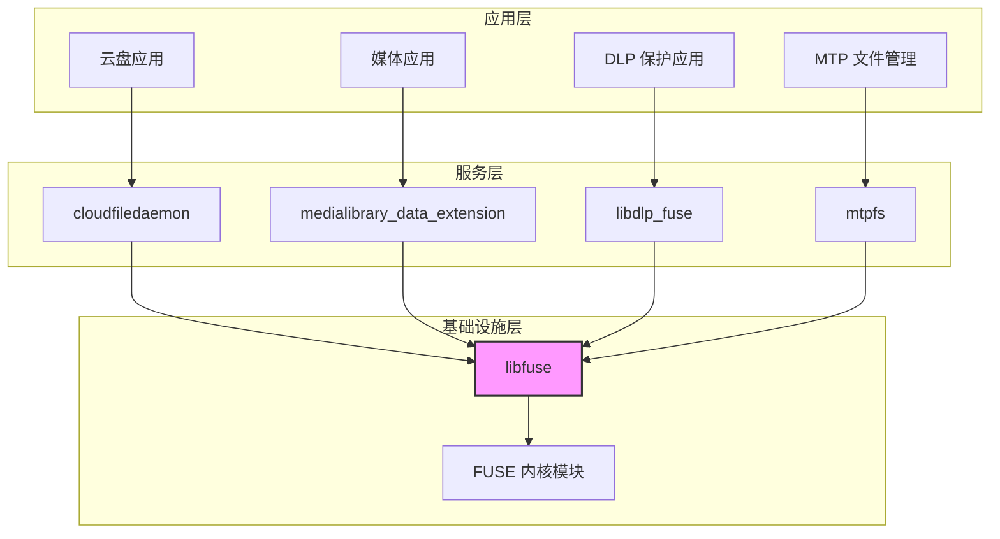

# libfuse 库概览

本文档简要介绍 libfuse 原始功能及其在 OpenHarmony 中的作用和定位。

---

## 原始库简介

### 基本信息

| 属性 | 值 |
|------|-----|
| **库名称** | libfuse |
| **版本** | 3.17.3 |
| **许可证** | LGPL-2.1, GPL-2.0 (双许可) |
| **上游地址** | https://github.com/libfuse/libfuse |
| **官方文档** | https://libfuse.github.io/doxygen/index.html |

### 原始功能一句话描述

libfuse 是 **FUSE (Filesystem in Userspace) 框架的用户态参考实现**，允许在用户空间实现自定义文件系统，通过内核 FUSE 模块进行通信。

### 核心功能

libfuse 提供以下核心功能：

1. **文件系统挂载/卸载**: 提供挂载点管理和文件系统生命周期管理
2. **内核请求解析**: 解析来自内核的文件系统操作请求
3. **响应传递**: 将用户空间的操作结果返回给内核
4. **两级 API**:
   - **高级 API** (`fuse.h`): 同步回调，基于路径/文件名操作
   - **低级 API** (`fuse_lowlevel.h`): 异步回调，基于 inode 操作
5. **多线程支持**: 单线程 (`fuse_loop`) 和多线程 (`fuse_loop_mt`) 事件循环
6. **选项解析**: 统一的命令行选项解析框架 (`fuse_opt`)

### 支持的平台

- **Linux**: 完全支持
- **BSD**: 基本支持（尽力而为）
- **macOS**: 不支持（需使用 OSXFUSE）

---

## OpenHarmony 中的作用和定位

### 在 OH 中的定位

libfuse 在 OpenHarmony 中扮演 **用户态文件系统基础设施** 的角色，为上层应用和服务提供文件系统扩展能力。

### 核心价值

| 价值点 | 说明 |
|--------|------|
| **云盘本地挂载** | 通过 cloudfiledaemon 实现云盘文件的透明访问 |
| **数据安全保护** | 通过 libdlp_fuse 实现透明加解密文件系统 |
| **媒体虚拟化** | 通过 medialibrary 实现媒体文件的虚拟文件系统 |
| **设备扩展** | 通过 mtpfs 实现对 MTP 设备的访问 |

### 与其他组件的关系



---

## OpenHarmony 特点

### 与上游版本的主要差异

1. **构建系统**: 使用 GN 构建系统而非 Meson
2. **文件系统支持**: 添加 HMFS（HarmonyOS 分布式文件系统）支持
3. **平台适配**: 针对 OpenHarmony 系统特性进行优化
4. **许可证**: 仅使用 LGPL-2.1 部分，未使用 GPL-2.0 部分

### OH 特有的使用场景

| 场景 | 模块 | FUSE 用途 |
|------|------|-----------|
| **云盘文件系统** | cloudfiledaemon | 将云端存储挂载为本地文件系统，支持文件的透明同步 |
| **DLP 加密保护** | libdlp_fuse | 透明加密/解密敏感文件，实现数据防泄漏 |
| **媒体库虚拟文件系统** | medialibrary_data_extension | 为媒体文件提供统一访问接口，支持虚拟文件夹等功能 |
| **MTP 设备挂载** | mtpfs | 通过 FUSE 访问 MTP (Media Transfer Protocol) 设备，实现设备文件管理 |

---

## API 概览

### 高级 API (High-Level API)

**头文件**: `include/fuse.h`

**特点**:
- 同步回调模式
- 基于路径和文件名操作
- 更易于使用
- 适合简单的文件系统实现

**主要回调**:
```c
struct fuse_operations {
    int (*getattr) (const char *, struct stat *);
    int (*readdir) (const char *, void *, fuse_fill_dir_t, off_t, struct fuse_file_info *);
    int (*open) (const char *, struct fuse_file_info *);
    int (*read) (const char *, char *, size_t, off_t, struct fuse_file_info *);
    int (*write) (const char *, const char *, size_t, off_t, struct fuse_file_info *);
    // ... 更多操作
};
```

### 低级 API (Low-Level API)

**头文件**: `include/fuse_lowlevel.h`

**特点**:
- 异步回调模式
- 基于 inode 操作
- 更细粒度的控制
- 适合高性能文件系统实现

**主要回调**:
```c
struct fuse_lowlevel_ops {
    void (*init) (void *, struct fuse_conn_info *);
    void (*lookup) (fuse_req_t, fuse_ino_t, const char *);
    void (*getattr) (fuse_req_t, fuse_ino_t, struct fuse_file_info *);
    void (*readdir) (fuse_req_t, fuse_ino_t, size_t, off_t, struct fuse_file_info *);
    // ... 更多操作
};
```

---

## 编译与安装

### 原始构建方式（上游）

libfuse 原生使用 **Meson + Ninja** 构建：

```bash
meson setup build
ninja -C build
sudo ninja -C build install
```

### OpenHarmony 构建方式

使用 **GN 构建系统**，详见 [03_Build_Integration.md](03_Build_Integration.md)。

---

## 学习资源

### 官方资源

- [libfuse 主页](https://github.com/libfuse/libfuse)
- [API 文档](https://libfuse.github.io/doxygen/index.html)
- [示例代码](../example/) - 包含多种文件系统实现示例
- [邮件列表](https://lists.sourceforge.net/lists/listinfo/fuse-devel)

### OpenHarmony 相关

- [README_OpenHarmony.md](../README_OpenHarmony.md) - OH 适配说明
- [04_Usage_in_OH.md](04_Usage_in_OH.md) - OH 中的使用方式
- [02_Patches.md](02_Patches.md) - OH 特有修改

---

## 常见问题

### Q: libfuse 与内核 FUSE 模块的关系？

A: libfuse 是用户态库，与内核 FUSE 模块配合工作。内核 FUSE 模块负责将文件系统操作请求转发给用户态，libfuse 负责处理这些请求并返回结果。

### Q: 高级 API 和低级 API 如何选择？

A:
- **高级 API**: 适合简单的文件系统，易于上手
- **低级 API**: 适合高性能或复杂文件系统，提供更细粒度的控制

在 OpenHarmony 中，`cloudfiledaemon` 使用低级 API 以获得更好的性能。

### Q: FUSE 性能如何？

A: FUSE 的性能主要取决于：
1. 用户态和内核态的上下文切换开销
2. 文件系统实现的效率
3. 使用多线程 (`fuse_loop_mt`) 可以显著提高吞吐量

对于大多数场景，FUSE 的性能是可接受的。

### Q: OpenHarmony 为什么选择使用 libfuse？

A: libfuse 是成熟的开源项目，已经被广泛使用。通过 libfuse，OpenHarmony 可以快速实现云盘、DLP 等需要自定义文件系统功能的服务，无需修改内核。

---

**相关文档**:
- [02_Patches.md](02_Patches.md) - OpenHarmony 特有修改
- [03_Build_Integration.md](03_Build_Integration.md) - 构建系统集成
- [04_Usage_in_OH.md](04_Usage_in_OH.md) - OH 中的使用方式
