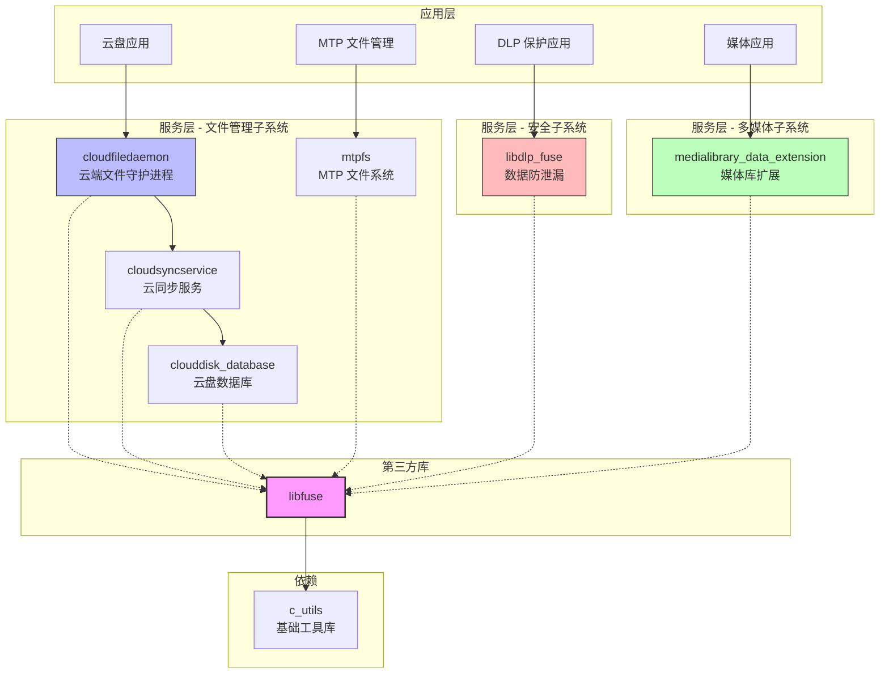

# libfuse 在 OpenHarmony 中的依赖关系与使用

本文档说明 libfuse 在 OpenHarmony 中的依赖关系、使用方式以及典型使用场景。

---

## 概述

libfuse 在 OpenHarmony 中作为**用户态文件系统基础设施**，被多个子系统使用，主要用于云盘挂载、数据加密保护、媒体虚拟化等场景。

---

## 直接依赖者

### 按子系统分类

| 子系统 | 模块数量 | 主要模块 |
|--------|---------|---------|
| **filemanagement** | 5 | cloudfiledaemon, cloudsyncservice, clouddisk_database, mtpfs |
| **security** | 1 | libdlp_fuse |
| **multimedia** | 1 | medialibrary_data_extension |

---

## 核心依赖者详情

### 1. cloudfiledaemon (云端文件守护进程)

**路径**: `foundation/filemanagement/dfs_service/services/cloudfiledaemon/`

**依赖方式**:
```gn
external_deps += [ "libfuse:libfuse" ]
```

**使用场景**: 实现云盘 FUSE 文件系统，支持云端文件本地挂载和访问。

**关键代码**:
- `src/cloud_disk/fuse_operations.cpp` - FUSE 操作回调实现

**功能特点**:
- 云端文件透明挂载
- 文件本地缓存
- 断点续传
- 增量同步

**FUSE API 版本**: `-DFUSE_USE_VERSION=35`

---

### 2. libdlp_fuse (数据防泄漏)

**路径**: `base/security/dlp_permission_service/interfaces/inner_api/dlp_fuse/`

**依赖方式**:
```gn
external_deps += [ "libfuse:libfuse" ]
```

**使用场景**: 透明加解密文件系统，实现敏感文件保护。

**功能特点**:
- 文件透明加密
- 基于权限的访问控制
- 数据防泄漏
- 审计日志

**FUSE API 版本**: `-DFUSE_USE_VERSION=35`

---

### 3. medialibrary_data_extension (媒体库扩展)

**路径**: `foundation/multimedia/media_library/frameworks/innerkitsimpl/medialibrary_data_extension/`

**依赖方式**:
```gn
external_deps += [ "libfuse:libfuse" ]
```

**使用场景**: 为媒体文件提供虚拟文件系统接口。

**功能特点**:
- 媒体文件虚拟化
- 虚拟文件夹支持
- 统一访问接口
- 元数据管理

---

### 4. mtpfs (MTP 文件系统)

**路径**: `foundation/filemanagement/storage_service/services/storage_daemon/mtpfs/`

**依赖方式**:
```gn
external_deps += [ "libfuse:libfuse" ]  # 条件编译
```

**使用场景**: 通过 FUSE 挂载 MTP (Media Transfer Protocol) 设备。

**功能特点**:
- MTP 设备文件访问
- USB 设备支持
- 文件传输
- 设备枚举

**注意**: 条件编译，并非所有构建都包含 mtpfs。

---

### 5. cloudsyncservice (云同步服务)

**路径**: `foundation/filemanagement/dfs_service/services/cloudsyncservice/`

**依赖方式**:
```gn
external_deps += [ "libfuse:libfuse" ]
```

**使用场景**: 云同步服务，处理云文件同步逻辑。

**功能特点**:
- 云文件同步
- 冲突解决
- 同步策略管理
- 网络状态感知

---

### 6. clouddisk_database (云盘数据库)

**路径**: `foundation/filemanagement/dfs_service/services/clouddisk_database/`

**依赖方式**:
```gn
external_deps += [ "libfuse:libfuse" ]
```

**使用场景**: 云盘数据库服务，管理 FUSE 文件索引。

**功能特点**:
- 文件索引管理
- 元数据存储
- 查询优化
- 事务支持

---

## 依赖关系图



---

## 使用方式

### 静态链接 / 动态链接

所有模块均使用**动态链接**方式依赖 libfuse：

```gn
external_deps = [ "libfuse:libfuse" ]
```

编译时链接：
```bash
-lfuse
```

运行时加载：
```
/libfuse.so
```

### 头文件引用方式

#### 基础头文件

```c
// 高级 API
#include <fuse.h>

// 低级 API
#include <fuse_lowlevel.h>

// 公共定义
#include <fuse_common.h>

// 选项解析
#include <fuse_opt.h>
```

#### 完整配置

```gn
include_dirs = [
    "//third_party/libfuse/include",
    "//third_party/libfuse/lib",
]
```

---

## 关键使用场景

### 场景 1: 云盘文件系统 (cloudfiledaemon)

**需求**: 将云端存储挂载为本地文件系统

**实现**:
1. 实现基础 FUSE 操作回调（getattr, readdir, open, read, write 等）
2. 将文件操作映射为云端 API 调用
3. 实现本地缓存机制
4. 处理网络异常和同步冲突

**代码示例**:

```cpp
// 初始化 FUSE
struct fuse_args args = FUSE_ARGS_INIT(argc, argv);
fuse_main(args.argc, args.argv, &operations, NULL);
```

**特点**:
- 透明访问云端文件
- 断点续传
- 增量同步
- 本地缓存

---

### 场景 2: DLP 数据防泄漏 (libdlp_fuse)

**需求**: 保护敏感文件，防止数据泄漏

**实现**:
1. 拦截文件读写操作
2. 根据权限策略决定是否加解密
3. 记录访问审计日志
4. 动态调整权限

**特点**:
- 透明加解密
- 细粒度权限控制
- 审计追踪
- 实时权限调整

---

### 场景 3: 媒体库虚拟文件系统 (medialibrary)

**需求**: 为媒体文件提供虚拟文件夹和统一访问接口

**实现**:
1. 创建虚拟文件夹结构
2. 将物理文件映射到虚拟路径
3. 支持元数据查询
4. 动态更新虚拟结构

**特点**:
- 虚拟文件夹
- 多维度组织
- 统一访问接口
- 元数据管理

---

### 场景 4: MTP 设备文件系统 (mtpfs)

**需求**: 访问连接的 MTP 设备（如手机、相机）

**实现**:
1. 枚举 MTP 设备
2. 将设备文件系统映射为本地路径
3. 实现文件传输
4. 处理设备热插拔

**特点**:
- USB 设备支持
- 设备枚举
- 文件传输
- 热插拔处理

---

## 依赖统计

### 直接依赖者数量

| 类别 | 数量 |
|------|------|
| 生产模块 | 6 |
| 测试模块 | 15+ |
| 总计 | 20+ |

### 模块大小分布

| 模块 | 预估大小 |
|------|---------|
| cloudfiledaemon | 大 |
| cloudsyncservice | 中 |
| libdlp_fuse | 中 |
| medialibrary | 中 |
| mtpfs | 小 |

---

## 测试覆盖

### 单元测试

多个依赖模块包含完整的单元测试：

| 模块 | 测试路径 |
|------|---------|
| cloudfiledaemon | `foundation/filemanagement/dfs_service/test/unittests/` |
| libdlp_fuse | `base/security/dlp_permission_service/test/` |
| medialibrary | `foundation/multimedia/media_library/frameworks/innerkitsimpl/test/unittests/` |
| mtpfs | `foundation/filemanagement/storage_service/services/storage_daemon/mtpfs/test/` |

### 模糊测试

部分模块包含模糊测试：

| 模块 | 测试路径 |
|------|---------|
| cloudfiledaemon | `foundation/filemanagement/dfs_service/test/fuzztest/` |
| medialibrary | `foundation/multimedia/media_library/frameworks/innerkitsimpl/test/fuzztest/` |

---

## 集成建议

### 新模块使用 libfuse

如果您的新模块需要使用 libfuse，请参考以下步骤：

#### 1. 添加依赖

```gn
ohos_shared_library("my_module") {
    # ...
    external_deps = [ "libfuse:libfuse" ]
}
```

#### 2. 包含头文件

```gn
include_dirs = [
    "//third_party/libfuse/include",
    "//third_party/libfuse/lib",
]
```

#### 3. 设置 FUSE API 版本

```gn
cflags = [ "-DFUSE_USE_VERSION=317" ]  # 或 35
```

#### 4. 实现回调

参考 `cloudfiledaemon` 的实现：
- `src/cloud_disk/fuse_operations.cpp`

#### 5. 添加测试

- 单元测试
- 集成测试
- 模糊测试（可选）

---

## 常见问题

### Q: 哪些模块是最重要的依赖者？

A: `cloudfiledaemon` 和 `libdlp_fuse` 是最重要的依赖者，分别是云盘和 DLP 服务的核心组件。

### Q: 不同模块使用不同的 FUSE API 版本会有问题吗？

A: 理论上不应该有问题，但建议统一使用相同版本以避免兼容性问题。

### Q: 如何测试依赖模块的 FUSE 功能？

A:
1. 运行模块的单元测试
2. 参考模块的测试用例
3. 使用上游的示例程序验证基本功能

### Q: libfuse 对系统性能的影响？

A: FUSE 的性能主要取决于：
- 用户态和内核态的上下文切换
- 文件系统实现的效率
- 使用多线程可以显著提高性能

对于大多数场景，FUSE 的性能是可接受的。

---

## 未来扩展

### 潜在的新使用场景

| 场景 | 模块 | 说明 |
|------|------|------|
| 虚拟磁盘 | 待定 | 实现虚拟磁盘映像挂载 |
| 加密文件系统 | 待定 | 用户级加密文件系统 |
| 网络文件系统 | 待定 | 自定义网络文件系统协议 |
| 容器文件系统 | 待定 | 容器镜像挂载 |

### 扩展建议

1. 参考现有模块的实现
2. 确保使用合适的 FUSE API 版本
3. 添加完整的测试覆盖
4. 考虑性能和安全性

---

**相关文档**:
- [01_Overview.md](01_Overview.md) - 库概览
- [02_Patches.md](02_Patches.md) - OH 特有修改
- [03_Build_Integration.md](03_Build_Integration.md) - 构建集成
- [_work/ASSESSMENT.md](_work/ASSESSMENT.md) - 完整评估报告
