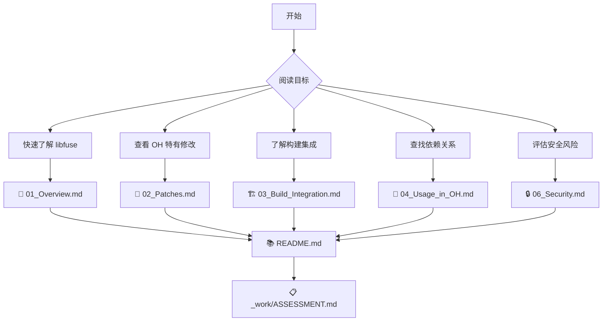
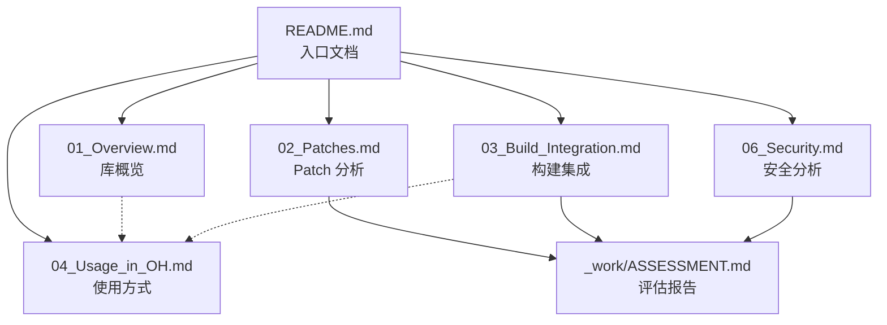

# libfuse 阅读路线建议

本文档提供 libfuse OpenHarmony 文档的阅读路线，帮助您快速定位所需信息。

---

## 阅读路线图

---

## 按角色分类的阅读路线

### 1. 新手入门

**目标**: 快速了解 libfuse 在 OH 中的作用

**阅读顺序**:
1. **[README.md](README.md)** - 了解文档结构和关键信息
2. **[01_Overview.md](01_Overview.md)** - 了解库的基本功能和 OH 定位
3. **[04_Usage_in_OH.md](04_Usage_in_OH.md)** - 了解哪些模块在使用 libfuse

**预计时间**: 15-20 分钟

---

### 2. 开发者

**目标**: 了解如何使用和集成 libfuse

**阅读顺序**:
1. **[01_Overview.md](01_Overview.md)** - 了解库的基本功能
2. **[04_Usage_in_OH.md](04_Usage_in_OH.md)** - 学习其他模块的使用方式
3. **[03_Build_Integration.md](03_Build_Integration.md)** - 了解如何在自己的模块中依赖 libfuse

**预计时间**: 30-40 分钟

---

### 3. 维护者

**目标**: 了解 OH 特有修改，准备升级上游版本

**阅读顺序**:
1. **[02_Patches.md](02_Patches.md)** - 详细了解所有 OH 特有修改
2. **[06_Security.md](06_Security.md)** - 了解安全风险和升级策略
3. **[03_Build_Integration.md](03_Build_Integration.md)** - 了解构建配置细节
4. **[_work/ASSESSMENT.md](_work/ASSESSMENT.md)** - 查看完整评估报告

**预计时间**: 60-90 分钟

---

### 4. 安全审计员

**目标**: 评估安全风险和合规性

**阅读顺序**:
1. **[06_Security.md](06_Security.md)** - 主要安全风险分析
2. **[02_Patches.md](02_Patches.md)** - 查看 OH 引入的修改是否有安全影响
3. **[_work/ASSESSMENT.md](_work/ASSESSMENT.md)** - 查看合规性检查

**预计时间**: 40-50 分钟

---

## 按场景分类的阅读路线

### 场景 1: 首次接触 libfuse

**问题**: 什么是 libfuse？在 OH 中有什么用？

**推荐阅读**:
1. **[README.md](README.md)** - 关键信息快速浏览
2. **[01_Overview.md](01_Overview.md)** - 了解库的基本概念
3. **[04_Usage_in_OH.md](04_Usage_in_OH.md)** - 实际使用案例

---

### 场景 2: 开发 FUSE 文件系统

**问题**: 如何在 OH 上开发基于 FUSE 的文件系统？

**推荐阅读**:
1. **[01_Overview.md](01_Overview.md)** - 了解 libfuse 提供的功能
2. **[04_Usage_in_OH.md](04_Usage_in_OH.md)** - 学习 cloudfiledaemon 的实现参考
3. **[03_Build_Integration.md](03_Build_Integration.md)** - 了解如何集成到构建系统

**参考示例**:
- `example/` 目录下的示例代码（原上游代码）
- `cloudfiledaemon/src/cloud_disk/fuse_operations.cpp`（OH 实际使用）

---

### 场景 3: 升级上游版本

**问题**: 如何从上游升级 libfuse？需要注意什么？

**推荐阅读**:
1. **[02_Patches.md](02_Patches.md)** - 了解所有 OH 特有修改
2. **[06_Security.md](06_Security.md)** - 了解安全风险
3. **[_work/ASSESSMENT.md](_work/ASSESSMENT.md)** - 查看升级策略建议

**关键步骤**:
1. 重新应用 HMFS 白名单修改（必须）
2. 检查符号链接检查逻辑是否被覆盖
3. 确认 pthread 兼容修改是否仍需要
4. 验证所有依赖模块的测试通过

---

### 场景 4: 调试 FUSE 问题

**问题**: FUSE 文件系统出现问题，如何排查？

**推荐阅读**:
1. **[03_Build_Integration.md](03_Build_Integration.md)** - 了解编译选项和日志配置
2. **[04_Usage_in_OH.md](04_Usage_in_OH.md)** - 了解使用方式
3. **[02_Patches.md](02_Patches.md)** - 查看是否有 OH 特有的修改导致问题

**调试工具**:
- 查看日志输出（`fuse_log.c`）
- 使用上游示例验证基本功能
- 参考 `cloudfiledaemon` 的调试方式

---

### 场景 5: 安全合规检查

**问题**: libfuse 是否符合安全要求？有哪些风险？

**推荐阅读**:
1. **[06_Security.md](06_Security.md)** - 主要安全风险分析
2. **[02_Patches.md](02_Patches.md)** - OH 修改的安全影响
3. **[_work/ASSESSMENT.md](_work/ASSESSMENT.md)** - 合规性检查

**关注点**:
- 已知 CVE 状态
- FUSE 已知权限缓存 bug（issue #15）
- OH 引入的新攻击面

---

## 文档关系图

---

## 常见问题快速索引

| 问题 | 推荐文档 |
|------|---------|
| libfuse 是什么？ | [01_Overview.md](01_Overview.md) |
| OH 对 libfuse 做了哪些修改？ | [02_Patches.md](02_Patches.md) |
| 如何在自己的模块中使用 libfuse？ | [03_Build_Integration.md](03_Build_Integration.md) |
| 哪些模块在使用 libfuse？ | [04_Usage_in_OH.md](04_Usage_in_OH.md) |
| 升级上游版本需要注意什么？ | [02_Patches.md](02_Patches.md) + [06_Security.md](06_Security.md) |
| 有哪些安全风险？ | [06_Security.md](06_Security.md) |
| HMFS 是什么？ | [02_Patches.md](02_Patches.md) |
| 编译选项有哪些？ | [03_Build_Integration.md](03_Build_Integration.md) |

---

## 反馈与贡献

如果您发现文档有误或有改进建议，请提交 Issue 或 Pull Request。

---

**最后更新**: 2026-02-08
