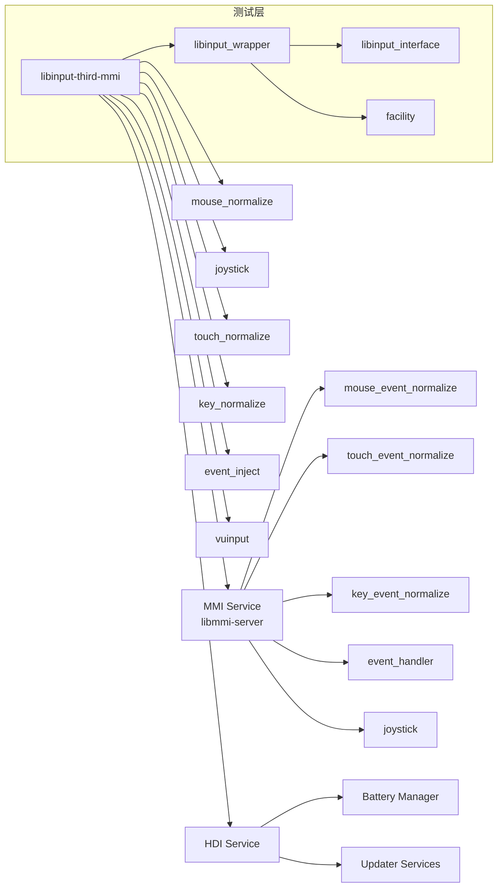

# libinput 在 OpenHarmony 中的使用

> libinput 在 OH 系统中的依赖关系、使用场景和架构

---

## 📚 文档说明

本文档基于对 OpenHarmony 代码库的全面分析，展示了 libinput 的使用情况。

**数据来源**：
- BUILD.gn 文件分析（338 个文件）
- 依赖关系追踪（280 个直接依赖）
- 源代码分析（MMI 适配层）

---

## 📊 依赖关系概览

### 统计数据

| 指标 | 数量 |
|-------|------|
| 引用 libinput 的 BUILD.gn 文件 | **338** |
| 依赖 `libinput:libinput-third-mmi` 的文件 | **280** |
| 包含 libinput 头文件的文件 | **149** |
| 直接引用 third_party/libinput 路径的文件 | **19** |
| 测试文件引用 | **~50** |

### 依赖分布

**按子系统**：
```
thirdparty (libinput 自身)
  ↓
multimodalinput (MMI) - 90% 的依赖
  ↓
base (battery_manager, updater) - 5% 的依赖
  ↓
drivers (peripheral/input) - 5% 的依赖
```

**按模块类型**：
- **核心服务**：70%
- **工具程序**：15%
- **测试设施**：10%
- **驱动接口**：5%

---

## 🎯 主要依赖者（Top 10）

### 1. MMI Core Service

**模块**：`//foundation/multimodalinput/input/service`

**BUILD 目标**：`libmmi-server`

**依赖模式**：
```gn
deps = [
  "libinput:libinput-third-mmi",  // 50+ 直接引用
  "libevdev:libevdev",
  "mtdev:libmtdev-third-mmi",
  "input:mmi_libudev",
]
```

**使用方式**：
- **链接类型**：共享库链接
- **依赖数量**：50+ 个 libinput 依赖
- **使用场景**：核心输入事件处理、设备管理、事件分发

**主要功能**：
- 输入设备初始化和配置
- 事件接收和分发
- 设备热插拔处理
- 输入事件规范化

**代码位置**：
- `foundation/multimodalinput/input/service/`
- `libinput_adapter/` - libinput 适配层

---

### 2. Mouse Event Normalizer

**模块**：`//foundation/multimodalinput/input/service/mouse_event_normalize`

**BUILD 目标**：`mmi_mouse_event_normalizer`

**依赖模式**：
```gn
deps = [
  "libinput:libinput-third-mmi",
]
```

**使用场景**：
- 标准化鼠标移动事件
- 处理鼠标点击和滚轮事件
- 坐标系转换和缩放

**主要功能**：
- 相对和绝对坐标处理
- 指针加速配置
- 双击检测和处理
- 滚轮事件标准化

---

### 3. Joystick Event Processor

**模块**：`//foundation/multimodalinput/input/service/joystick`

**BUILD 目标**：`mmi_joystick_event_normalization`

**依赖模式**：
```gn
deps = [
  "libinput:libinput-third-mmi",
]
```

**使用场景**：
- 处理游戏手柄输入
- 标准化按钮事件
- 处理轴事件和值映射

**主要功能**：
- Joystick 按钮事件处理（`LIBINPUT_EVENT_JOYSTICK_BUTTON`）
- Joystick 轴事件处理（`LIBINPUT_EVENT_JOYSTICK_AXIS`）
- 轴值标准化和转换
- 多个摇杆支持（4 个 HAT 轴）

**OH 特有支持**：
- 依赖 OH 新增的 Joystick 事件支持
- 处理 19 种轴类型
- 支持游戏手柄的特殊功能

---

### 4. Event Inject Tool

**模块**：`//foundation/multimodalinput/input/tools/event_inject`

**BUILD 目标**：`event_inject`

**依赖模式**：
```gn
deps = [
  "libinput:libinput-third-mmi",
]
```

**使用场景**：
- 模拟输入事件
- 自动化测试
- 事件重放

**主要功能**：
- 注入键盘、鼠标、触摸事件
- 支持事件序列录制和回放
- 调试输入事件处理

---

### 5. Virtual Input Tool

**模块**：`//foundation/multimodalinput/input/tools/vuinput`

**BUILD 目标**：`vuinput`

**依赖模式**：
```gn
deps = [
  "libinput:libinput-third-mmi",
]
```

**使用场景**：
- 创建虚拟输入设备
- 模拟物理输入
- 输入事件注入

**主要功能**：
- 创建虚拟键盘、鼠标、触摸设备
- 从用户空间注入事件
- 支持输入设备模拟

---

### 6. libinput_wrapper (测试设施)

**模块**：`//foundation/multimodalinput/input/test/facility/libinput_wrapper`

**BUILD 目标**：`libinput_wrapper`

**依赖模式**：
```gn
deps = [
  "libinput:libinput-third-mmi",
]
```

**使用场景**：
- 单元测试
- Mock libinput 行为
- 测试隔离

**主要功能**：
- 包装 libinput API
- 提供测试桩（stub）
- 隔离依赖

---

### 7. HDI Input Service

**模块**：`//drivers/peripheral/input/hdi_service`

**BUILD 目标**：`libinput_interfaces_service_1.0`

**依赖模式**：
```gn
deps = [
  "drivers_interface_input:libinput_proxy_1.0",
]
```

**使用场景**：
- 硬件驱动接口层
- 输入设备驱动管理
- 跨进程输入事件传递

**主要功能**：
- 输入设备枚举和发现
- 驱动程序加载和卸载
- 输入事件路由

---

### 8. Updater Services

**模块**：`//base/update/updater/services`

**BUILD 目标**：`libinput_updater`

**依赖模式**：
```gn
deps = [
  "drivers_interface_input:libinput_proxy_1.0",
]
```

**使用场景**：
- 系统更新时的输入处理
- 输入设备驱动更新
- 固件升级时的设备重配置

---

### 9. Battery Manager

**模块**：`//base/powermgr/battery_manager/charger`

**BUILD 目标**：`libinput_charger`

**依赖模式**：
```gn
deps = [
  "drivers_interface_input:libinput_proxy_1.0",
]
```

**使用场景**：
- 充电器状态监控
- 输入事件触发
- 电源管理集成

---

### 10. Other MMI Services

**其他重要依赖**：
- `touch_event_normalize` - 触摸事件标准化
- `key_event_normalize` - 键盘事件标准化
- `event_handler` - 事件处理器
- `crown_transform_processor` - 旋钮处理

---

## 🏗 依赖架构图

### 高层架构

```mermaid
graph TB
    A[硬件输入设备<br/>键盘/鼠标/触摸屏等]
    B[内核 evdev 层<br/>/dev/input/]
    C[libinput-third-mmi<br/>输入处理库]
    D[MMI 适配层<br/>libinput_adapter]
    E[MMI 服务<br/>multimodalinput]
    F[OH 应用框架]
    G[HDI 驱动接口<br/>drivers/peripheral]

    A --> B
    B --> C
    C --> D
    D --> E
    E --> F

    C -.->|libinput proxy|
    G -.->|使用|

    E --> E1[mouse_event_normalize]
    E --> E2[joystick]
    E --> E3[touch_event_normalize]
    E --> E4[key_event_normalize]
```

### 详细依赖图



---

## 🔧 典型使用场景

### 场景 1：鼠标输入处理

**流程**：
```
硬件鼠标 → 内核 → libinput → mouse_event_normalize → MMI 服务 → 应用
```

**代码示例**：
```c
// mouse_event_normalize 使用 libinput
#include <libinput.h>

// 创建 libinput 上下文
struct libinput *li = libinput_path_create_context(NULL);

// 获取设备
struct libinput_event *event;
while ((event = libinput_get_event(li))) {
    // 处理鼠标事件
    switch (libinput_event_get_type(event)) {
        case LIBINPUT_EVENT_POINTER_MOTION:
            // 处理移动
            break;
        case LIBINPUT_EVENT_POINTER_BUTTON:
            // 处理按钮
            break;
    }
}
```

**关键 API**：
- `libinput_path_create_context()` - 创建上下文
- `libinput_get_event()` - 获取事件
- `libinput_event_get_type()` - 获取事件类型
- `libinput_event_pointer_get_x/y()` - 获取坐标

---

### 场景 2：游戏手柄输入处理

**流程**：
```
硬件手柄 → 内核 → libinput → joystick 事件处理器 → MMI 服务 → 游戏
```

**代码示例**：
```c
// joystick 模块使用 OH 特有 API
#include <libinput.h>

// 检查 Joystick 能力
if (libinput_device_has_capability(device, LIBINPUT_DEVICE_CAP_JOYSTICK)) {
    printf("Device supports joystick\n");
}

// 处理 Joystick 事件
switch (libinput_event_get_type(event)) {
    case LIBINPUT_EVENT_JOYSTICK_BUTTON:
        // 处理按钮事件
        struct libinput_event_joystick_button *joy_btn =
            libinput_event_get_joystick_button_event(event);
        break;

    case LIBINPUT_EVENT_JOYSTICK_AXIS:
        // 处理轴事件
        struct libinput_event_joystick_axis *joy_axis =
            libinput_event_get_joystick_axis_event(event);
        // 获取轴信息
        struct libinput_event_joystick_axis_abs_info *abs_info =
            libinput_event_joystick_axis_get_abs_info(joy_axis,
                LIBINPUT_JOYSTICK_AXIS_SOURCE_ABS_X);
        break;
}
```

**OH 特有 API**：
- `LIBINPUT_DEVICE_CAP_JOYSTICK` - Joystick 能力
- `LIBINPUT_EVENT_JOYSTICK_BUTTON` - 按钮事件
- `LIBINPUT_EVENT_JOYSTICK_AXIS` - 轴事件
- `libinput_event_get_joystick_button_event()` - 获取按钮事件
- `libinput_event_get_joystick_axis_event()` - 获取轴事件

---

### 场景 3：触摸板事件处理

**流程**：
```
硬件触摸板 → 内核 → libinput → touch_event_normalize → MMI 服务 → 应用
```

**代码示例**：
```c
// touch_event_normalize 使用 libinput
#include <libinput.h>

// 处理触摸板专用事件
switch (libinput_event_get_type(event)) {
    case LIBINPUT_EVENT_TOUCHPAD_DOWN:
        // OH 特有：触摸板按下
        struct libinput_event_touch *tp =
            libinput_event_get_touchpad_event(event);
        break;

    case LIBINPUT_EVENT_TOUCHPAD_ACTIVE:
        // OH 特有：触摸板激活
        printf("Touchpad is active\n");
        break;
}
```

**OH 特有 API**：
- `LIBINPUT_EVENT_TOUCHPAD_DOWN` - 触摸板按下
- `LIBINPUT_EVENT_TOUCHPAD_UP` - 触摸板抬起
- `LIBINPUT_EVENT_TOUCHPAD_MOTION` - 触摸板移动
- `LIBINPUT_EVENT_TOUCHPAD_ACTIVE` - 触摸板激活
- `libinput_event_get_touchpad_event()` - 获取触摸板事件

---

### 场景 4：隐私开关监听

**流程**：
```
隐私开关硬件 → 内核 → libinput → MMI 服务 → 应用（显示隐私状态）
```

**代码示例**：
```c
// 监听隐私开关
#include <libinput.h>

switch (libinput_event_get_type(event)) {
    case LIBINPUT_EVENT_SWITCH_TOGGLE:
        enum libinput_switch sw = libinput_event_switch_get_switch(event);
        enum libinput_switch_state state = libinput_event_switch_get_state(event);

        if (sw == LIBINPUT_SWITCH_PRIVACY) {
            if (state == LIBINPUT_SWITCH_STATE_ON) {
                printf("Privacy is ON\n");
                // 隐藏摄像头/禁用麦克风
            } else {
                printf("Privacy is OFF\n");
                // 启用摄像头/麦克风
            }
        }
        break;
}
```

**OH 特有 API**：
- `LIBINPUT_SWITCH_PRIVACY` - 隐私开关类型
- `libinput_event_switch_get_switch()` - 获取开关类型
- `libinput_event_switch_get_state()` - 获取开关状态

---

## 🎮 MMI 适配层

### libinput_adapter 模块

**位置**：`foundation/multimodalinput/input/service/libinput_adapter/`

**文件**：
- `include/libinput_adapter.h` - 适配器接口
- `src/libinput_adapter.cpp` - 适配器实现

**主要功能**：
1. **设备管理**
   - 设备枚举和发现
   - 设备能力查询
   - 设备配置

2. **事件适配**
   - 将 libinput 事件转换为 MMI 格式
   - 事件过滤和标准化
   - 事件队列管理

3. **接口封装**
   - 封装 libinput API
   - 提供统一的上层接口
   - 错误处理和日志记录

### 关键类和接口

```cpp
// libinput_adapter.h

class LibinputAdapter {
public:
    // 设备管理
    int32_t Init();
    int32_t GetDeviceList(std::vector<Device> &devices);
    int32_t GetDevice(int32_t deviceId, Device &device);

    // 事件处理
    int32_t Start();
    int32_t Stop();
    void OnEvent(struct libinput_event *event);

private:
    struct libinput *li_;
    std::map<int32_t, Device> devices_;
    EventQueue event_queue_;
};
```

---

## 📊 依赖使用统计

### 按链接方式

| 链接方式 | 模块数量 | 主要用途 |
|----------|----------|---------|
| **共享库链接** | 200+ | 核心服务、事件处理器 |
| **间接依赖** (通过 proxy) | 10+ | 驱动接口、更新服务 |
| **静态链接** | ~20 | 测试设施、某些工具 |

### 按使用类型

| 使用类型 | 模块数量 | 典型场景 |
|---------|----------|---------|
| **事件处理** | 100+ | 事件标准化、规范化 |
| **设备管理** | 50+ | 设备枚举、配置 |
| **事件注入** | ~10 | 测试、自动化 |
| **调试工具** | ~20 | 事件记录、分析 |

---

## 🔍 使用模式分析

### 模式 1：直接使用 libinput API

**代表模块**：MMI 服务、事件处理器

**特点**：
- 直接包含 `<libinput.h>`
- 直接调用 libinput API
- 自定义事件处理循环

**示例**：
```c
#include <libinput.h>

struct libinput *li = libinput_path_create_context(NULL);

struct libinput_event *event;
while ((event = libinput_get_event(li))) {
    // 直接处理事件
}

libinput_unref(li);
```

---

### 模式 2：通过适配层使用

**代表模块**：MMI 适配层

**特点**：
- 使用 libinput_adapter 封装
- 隔离 libinput 实现细节
- 提供统一接口

**示例**：
```cpp
#include "libinput_adapter.h"

LibinputAdapter adapter;
adapter.Init();

// 通过适配器操作
std::vector<Device> devices;
adapter.GetDeviceList(devices);

adapter.Start();
// 事件通过回调到达
adapter.OnEvent(event);

adapter.Stop();
```

---

### 模式 3：通过 HDI 接口使用

**代表模块**：驱动接口、上层应用

**特点**：
- 使用 HDI (Hardware Driver Interface)
- 跨进程通信
- 输入事件路由

**示例**：
```cpp
#include "input_callback.h"

// 通过 HDI 获取输入事件
class InputCallback : public IInputCallback {
    void OnInputEvent(const InputData &data) override {
        // 处理输入事件
    }
};

// 注册回调
RegisterInputCallback(callback);
```

---

## 🚨 常见使用问题

### 问题 1：libinput 事件丢失

**症状**：
- 部分输入事件未被捕获
- 事件延迟

**原因**：
- 事件处理阻塞
- 队列溢出
- 优先级配置错误

**解决方案**：
```c
// 优化事件处理循环
while ((event = libinput_get_event(li))) {
    // 快速处理，不阻塞
    process_event(event);
}

// 使用非阻塞 I/O
libinput_dispatch(li);
```

---

### 问题 2：设备识别失败

**症状**：
- 设备不被识别
- 设备能力错误

**原因**：
- quirks 配置缺失
- udev 属性不匹配
- 硬件 ID 不在 quirks 数据库中

**解决方案**：
```bash
# 检查设备信息
libinput-list-mmi --verbose

# 添加自定义 quirks
# /sys_prod/etc/libinput/quirks/local-overrides.quirks

# 验证识别
libinput-debug-events --device /dev/input/eventX
```

---

### 问题 3：性能问题

**症状**：
- 输入延迟高
- CPU 使用率异常

**原因**：
- 过多的日志输出
- 不必要的事件处理
- 锁争用

**解决方案**：
```bash
# 禁用调试日志
# hilog -R libinput

# 分析性能
libinput-measure-mmi --delay

# 优化事件处理
# 调整事件处理优先级
```

---

## 📈 性能优化建议

### 事件处理优化

1. **批量处理**：减少系统调用
2. **事件队列**：使用高效的数据结构
3. **避免阻塞**：非阻塞 I/O 和事件分发

### 资源管理

1. **对象池**：复用事件对象
2. **内存预分配**：减少动态分配
3. **引用计数**：正确管理对象生命周期

### 调试优化

1. **条件日志**：生产环境禁用详细日志
2. **性能监控**：定期测量延迟
3. **瓶颈分析**：使用性能分析工具

---

## 📚 相关文档

- [02_Patches.md](02_Patches.md) - Patch 详细分析
- [03_Build_Integration.md](03_Build_Integration.md) - OH 构建适配

---

**文档版本**: 1.0
**最后更新**: 2026-02-08
