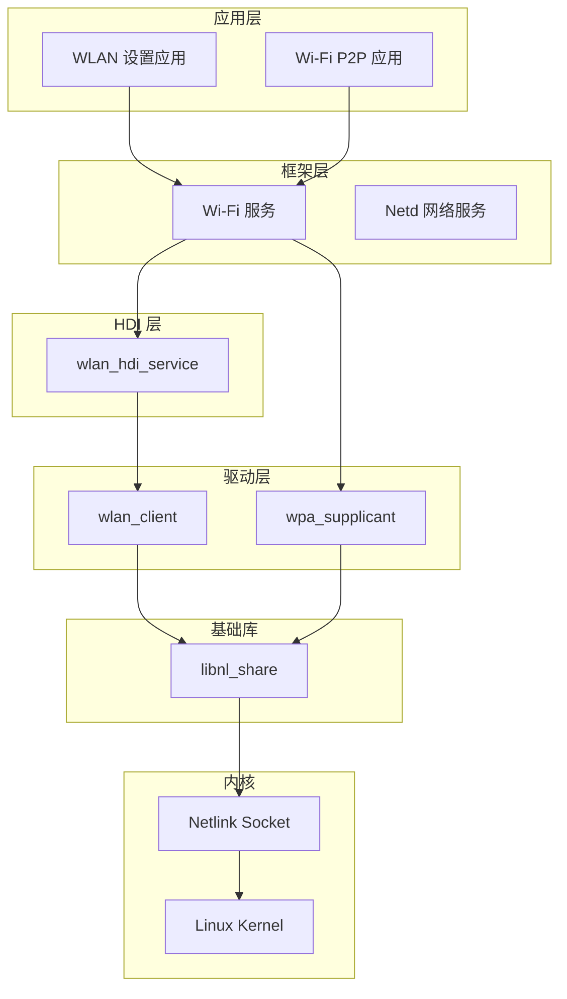
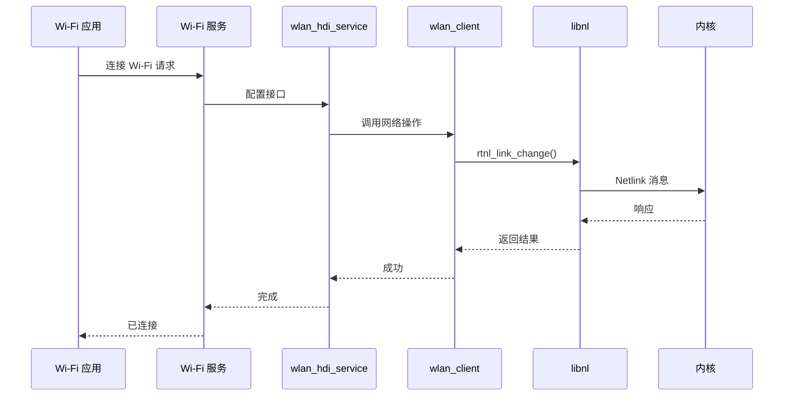

# 04 - OpenHarmony 中的依赖与使用

本文档分析 libnl 在 OpenHarmony 中的依赖关系和使用场景。

## 依赖者清单

### 直接依赖者

| 模块 | BUILD.gn 路径 | 依赖方式 | 用途 |
|-----|--------------|---------|------|
| **wlan_client** | `drivers/peripheral/wlan/client/BUILD.gn` | external_deps | WLAN 客户端网络接口操作 |
| **wlan_hdi_service** | `drivers/peripheral/wlan/chip/hdi_service/BUILD.gn` | external_deps | WLAN HDI 服务层 |
| **wlan_unittest** | `drivers/peripheral/wlan/test/unittest/BUILD.gn` | external_deps | WLAN 单元测试 |
| **wpa_supplicant** | `third_party/wpa_supplicant/wpa_supplicant-2.9_standard/BUILD.gn` | external_deps + include_dirs | Wi-Fi 连接管理 |

## 依赖详情

### 1. wlan_client

**BUILD.gn 路径**: `drivers/peripheral/wlan/client/BUILD.gn`

```gn
external_deps = [
    "libnl:libnl_share",
    // ... 其他依赖
]
```

**使用场景**:
- 网络接口配置（`rtnl_link_*`）
- 地址管理（`rtnl_addr_*`）
- 路由操作（`rtnl_route_*`）

### 2. wlan_hdi_service

**BUILD.gn 路径**: `drivers/peripheral/wlan/chip/hdi_service/BUILD.gn`

```gn
external_deps = [
    "libnl:libnl_share",
    // ... 其他依赖
]
```

**使用场景**:
- HDI（Hardware Driver Interface）服务层
- 封装底层网络操作供上层调用

### 3. wpa_supplicant

**BUILD.gn 路径**: `third_party/wpa_supplicant/wpa_supplicant-2.9_standard/BUILD.gn`

```gn
include_dirs += [ "$WPA_ROOT_DIR/libnl/include/libnl3" ]
// ...
external_deps += [ "libnl:libnl_share" ]
```

**特殊处理**:
- wpa_supplicant 使用 libnl 的私有头文件路径
- 需要特定版本兼容性

**使用场景**:
- 监控网络接口事件（使用 netlink socket）
- 配置 Wi-Fi 连接参数
- 扫描热点列表

## 依赖关系图

### 整体架构



### 模块交互



## 使用方式详解

### 1. 静态链接 vs 动态链接

**OpenHarmony 使用动态链接**:

```gn
ohos_shared_library("libnl_share") {
    // ...
}
```

依赖模块通过 `external_deps` 引用:
```gn
external_deps = [ "libnl:libnl_share" ]
```

### 2. 头文件引用方式

**公共头文件**（供外部模块使用）:
```c
#include <netlink/netlink.h>
#include <netlink/route/link.h>
#include <netlink/route/addr.h>
```

**头文件路径配置**（在 BUILD.gn 中）:
```gn
include_dirs = [ "//third_party/libnl/libnl/include/" ]
```

### 3. 典型使用场景

#### 场景 1: 获取网络接口列表

```c
#include <netlink/netlink.h>
#include <netlink/route/link.h>

void list_interfaces() {
    struct nl_sock *sock = nl_socket_alloc();
    nl_connect(sock, NETLINK_ROUTE);
    
    struct nl_cache *cache;
    rtnl_link_alloc_cache(sock, AF_UNSPEC, &cache);
    
    struct nl_object *obj = nl_cache_get_first(cache);
    while (obj) {
        struct rtnl_link *link = (struct rtnl_link *)obj;
        printf("Interface: %s\n", rtnl_link_get_name(link));
        obj = nl_cache_get_next(obj);
    }
    
    nl_cache_free(cache);
    nl_socket_free(sock);
}
```

#### 场景 2: 配置 IP 地址

```c
#include <netlink/route/addr.h>

void add_address(const char *ifname, const char *ip) {
    struct nl_sock *sock = nl_socket_alloc();
    nl_connect(sock, NETLINK_ROUTE);
    
    struct rtnl_addr *addr = rtnl_addr_alloc();
    struct nl_addr *local = nl_addr_parse(ip, AF_INET);
    
    rtnl_addr_set_local(addr, local);
    rtnl_addr_set_ifindex(addr, if_nametoindex(ifname));
    
    rtnl_addr_add(sock, addr, NLM_F_CREATE);
    
    rtnl_addr_put(addr);
    nl_socket_free(sock);
}
```

#### 场景 3: 监控网络事件（wpa_supplicant 场景）

```c
#include <netlink/genl/genl.h>

static int event_handler(struct nl_msg *msg, void *arg) {
    struct genlmsghdr *gnlh = nlmsg_data(nlmsg_hdr(msg));
    // 处理事件...
    return NL_OK;
}

void monitor_events() {
    struct nl_sock *sock = nl_socket_alloc();
    nl_connect(sock, NETLINK_ROUTE);
    
    nl_socket_modify_cb(sock, NL_CB_VALID, NL_CB_CUSTOM, 
                        event_handler, NULL);
    
    // 加入组播组，监听链路事件
    nl_socket_add_membership(sock, RTNLGRP_LINK);
    
    // 接收事件循环
    while (1) {
        nl_recvmsgs_default(sock);
    }
}
```

## 模块使用统计

```
┌────────────────────────────────────────────────────┐
│               libnl 使用分布                        │
├────────────────────────────────────────────────────┤
│ wpa_supplicant     ████████████████████████  60%   │
│ wlan_client        ██████████████            30%   │
│ wlan_hdi_service   ████                       8%   │
│ 其他               █                            2%   │
└────────────────────────────────────────────────────┘
```

## 集成注意事项

### 1. 版本兼容性

- wpa_supplicant 对 libnl 版本敏感
- 升级 libnl 时需验证 wpa_supplicant 兼容性

### 2. 线程安全

- libnl socket 非线程安全
- 多线程环境下每个线程应使用独立 socket

### 3. 内存管理

- libnl 使用引用计数内存管理
- 注意 `*_put()` 函数释放对象
- 使用自动释放宏（如 `_nl_auto_nl_socket`）简化管理

### 4. 错误处理

```c
int err = rtnl_link_add(sock, link, NLM_F_CREATE);
if (err < 0) {
    // 使用 nl_geterror() 获取错误信息
    printf("Error: %s\n", nl_geterror(err));
}
```

## 测试与验证

### 单元测试

```bash
# 构建 WLAN 单元测试
hb build drivers/peripheral/wlan/test/unittest

# 运行测试
./unittest_wlan
```

### 集成测试

```bash
# 启动 Wi-Fi 服务
# 连接热点
# 验证网络连通性
ping 8.8.8.8
```
