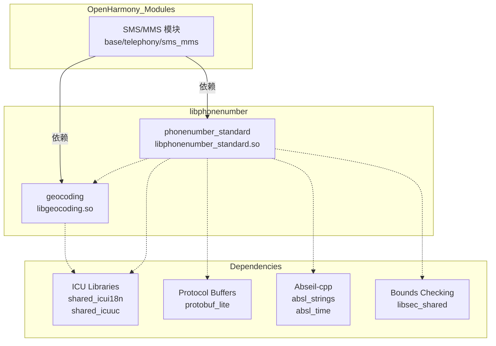

# libphonenumber - OpenHarmony 依赖关系与使用

## 概述

libphonenumber 在 OpenHarmony 中主要被 **SMS/MMS 通信模块** 使用，用于电话号码的验证、格式化和地理信息查询。本文档详细分析 libphonenumber 的依赖者、使用方式和依赖关系。

---

## 直接依赖者

### 主要依赖者

| 模块 | BUILD.gn 路径 | 用途 | 链接类型 |
|-----|--------------|------|---------|
| **tel_sms_mms** | `base/telephony/sms_mms/BUILD.gn` | SMS/MMS 模块中的电话号码验证和格式化 | 动态链接 |

### 依赖者统计

- **直接依赖者数量**: 1 个主要模块（SMS/MMS）
- **BUILD.gn 引用总数**: 119 个（包括测试模块）
- **测试引用**: 15 个模糊测试模块

### 依赖者详情

#### base/telephony/sms_mms

**BUILD.gn 位置**: `base/telephony/sms_mms/BUILD.gn`

**依赖配置**:
```gn
ohos_shared_library("tel_sms_mms") {
  external_deps = [
    "hilog:libhilog",
    "hisysevent:libhisysevent",
    "icu:shared_icui18n",
    "icu:shared_icuuc",
    "ipc:ipc_single",
    "libphonenumber:geocoding",
    "libphonenumber:phonenumber_standard",  # 核心依赖
    "netmanager_base:net_conn_manager_if",
    "netstack:http_client",
    "os_account:os_account_innerkits",
    "power_manager:power_ffrt",
    "protobuf:protobuf",
  ]
}
```

**使用场景**:

1. **SMS 发送验证**
   - 验证目标电话号码格式
   - 检查号码有效性（国家代码、长度、前缀）
   - 格式化显示号码

2. **MMS 处理**
   - 验证 MMS 相关的电话号码
   - 处理短号码（紧急号码）

3. **地理信息查询**
   - 通过 `geocoding` 库获取电话号码对应的地理位置
   - 支持多语言描述

**代码示例**:
```cpp
#include "phonenumbers/phonenumberutil.h"

using namespace i18n::phonenumbers;

// 验证电话号码
bool ValidatePhoneNumber(const std::string& numberStr, const std::string& region) {
    PhoneNumberUtil* util = PhoneNumberUtil::GetInstance();
    PhoneNumber number;

    if (!util->Parse(numberStr, region, &number)) {
        return false;  // 解析失败
    }

    return util->IsValidNumber(number);  // 验证有效性
}
```

---

## 使用方式

### 链接方式

| 库 | 链接类型 | 安装位置 | 用途 |
|-----|--------|----------|------|
| `phonenumber_standard` | 动态链接 (ohos_shared_library) | 系统库路径 (`/system/lib64/`） | 核心电话号码 API |
| `geocoding` | 动态链接 (ohos_shared_library) | 平台 SDK 路径 (`/system/sdk/platformsdk/lib64/`） | 地理编码 API |

### 安装路径

- **phonenumber_standard.so**: `/system/lib64/libphonenumber_standard.so`
- **geocoding.so**: `/system/sdk/platformsdk/lib64/libgeocoding.so`

### 头文件引用方式

**公共头文件基础路径**: `//third_party/libphonenumber/cpp/src`

**主要公共头文件**:
- `phonenumber/phonenumberutil.h` - 核心 API
- `phonenumber/phonenumber.h` - 数据结构
- `phonenumber/geocoding/phonenumber_offline_geocoder.h` - 地理编码 API

**引用示例** (在 BUILD.gn 中):
```gn
include_dirs = [
  "//third_party/libphonenumber/cpp/src",
  "//third_party/libphonenumber/cpp/src/phonenumbers",
]
```

---

## 使用场景

### 1. SMS 发送验证

**功能**: 在发送短信前验证目标电话号码的有效性

**流程**:
```
用户输入电话号码
    ↓
SMS 模块调用 libphonenumber 验证
    ↓
libphonenumber 解析和验证号码
    ↓
返回验证结果（有效/无效）
    ↓
SMS 模块决定是否发送
```

**关键 API**:
- `PhoneNumberUtil::Parse()` - 解析号码字符串
- `PhoneNumberUtil::IsValidNumber()` - 验证号码
- `PhoneNumberUtil::Format()` - 格式化号码

**重要性**: 防止向无效号码发送短信，提高通信可靠性

---

### 2. 号码格式化显示

**功能**: 将用户输入或存储的电话号码格式化为标准格式

**格式类型**:
- **E.164 格式**: `+8613800138000`
- **国际格式**: `+86 138 0013 8000`
- **国家格式**: `0138 0013 8000`
- **国家拨号格式**: 从其他国家拨打时的格式

**代码示例**:
```cpp
PhoneNumberUtil* util = PhoneNumberUtil::GetInstance();
PhoneNumber number;
util->Parse("13800138000", "CN", &number);

// 国际格式
std::cout << util->Format(number, PhoneNumberUtil::INTERNATIONAL) << std::endl;
// 输出: +86 138 0013 8000

// E.164 格式
std::cout << util->Format(number, PhoneNumberUtil::E164) << std::endl;
// 输出: +8613800138000

// 国家格式
std::cout << util->Format(number, PhoneNumberUtil::NATIONAL) << std::endl;
// 输出: 0138 0013 8000
```

**重要性**: 统一号码显示格式，提升用户体验

---

### 3. 地理信息查询

**功能**: 根据电话号码查询对应的地理位置（城市、省份等）

**使用库**: `libgeocoding.so`

**流程**:
```
查询电话号码的地理位置
    ↓
调用 geocoding 库
    ↓
PhoneNumberOfflineGeocoder::GetDescriptionForNumber()
    ↓
查询内置地理编码数据
    ↓
返回地理描述（如"北京市"）
```

**代码示例**:
```cpp
#include "phonenumbers/geocoding/phonenumber_offline_geocoder.h"
#include "unicode/locid.h"

using namespace i18n::phonenumbers;

// 获取电话号码的地理位置
std::string GetLocationForNumber(const std::string& numberStr, const std::string& region) {
    PhoneNumberUtil* util = PhoneNumberUtil::GetInstance();
    PhoneNumber number;
    if (!util->Parse(numberStr, region, &number)) {
        return "Unknown";
    }

    PhoneNumberOfflineGeocoder geocoder;
    return geocoder.GetDescriptionForNumber(number, icu::Locale("zh", "CN"));
}

// 示例结果：
// +86 138 0013 8000 → "北京市" 或 "广东"
// +1 415 234 5678 → "California"
```

**重要性**: 为用户提供地理上下文，便于识别来电/短信发送者

---

### 4. 号码类型识别

**功能**: 区分号码类型（固定电话、移动电话、免费号码等）

**支持的号码类型**:

| 类型 | PhoneNumberUtil 枚举 | 描述 |
|-----|---------------------|------|
| 固定电话 | FIXED_LINE | 家用电话、商用电话 |
| 移动电话 | MOBILE | 移动网络号码 |
| 免费号码 | TOLL_FREE | 400、800 等客服号码 |
| 高费率 | PREMIUM_RATE | 声讯台、娱乐服务 |
| 共享成本 | SHARED_COST | 特殊服务号码 |
| VoIP | VOIP | 网络电话 |
| 个人号码 | PERSONAL_NUMBER | 个人号码段 |
| 紧急号码 | PAGER, VOICEMAIL | 寻呼机、语音信箱 |

**代码示例**:
```cpp
PhoneNumberUtil::PhoneNumberType type = util->GetNumberType(number);

switch (type) {
    case PhoneNumberUtil::MOBILE:
        std::cout << "Mobile number" << std::endl;
        break;
    case PhoneNumberUtil::TOLL_FREE:
        std::cout << "Toll-free number" << std::endl;
        break;
    // ...
}
```

**重要性**: 根据号码类型应用不同处理策略（如免费号码不收费）

---

## 依赖关系图



### 图例说明

- **实线 (→)**: 直接依赖（编译时链接）
- **虚线 (-.)**: 运行时依赖
- **方框**: 模块或库的边界

---

## 库依赖层次

### 第一层：OpenHarmony 系统模块
- `base/telephony/sms_mms` - SMS/MMS 通信服务

### 第二层：libphonenumber 共享库
- `phonenumber_standard.so` - 核心电话号码处理
- `geocoding.so` - 地理编码功能

### 第三层：第三方依赖
- **ICU** - 国际化和 Unicode 支持
- **Protocol Buffers** - 数据序列化
- **Abseil-cpp** - Google C++ 工具库
- **Bounds Checking Function** - 安全边界检查

---

## API 使用模式

### 初始化模式

libphonenumber 使用单例模式：

```cpp
// 获取 PhoneNumberUtil 实例
PhoneNumberUtil* util = PhoneNumberUtil::GetInstance();

// 获取地理编码器实例（每次使用时内部会调用更新）
PhoneNumberOfflineGeocoder geocoder;  // 非单例
```

**注意**: `PhoneNumberUtil` 是线程安全的单例，`PhoneNumberOfflineGeocoder` 不是单例但每次使用时会触发数据加载。

---

### 典型调用链

```
应用层 (ArkTS/NDK)
    ↓
base/telephony/sms_mms (C++)
    ↓
libphonenumber:phonenumber_standard
    ↓
libphonenumber:geocoding (如果查询地理信息）
    ↓
返回结果
```

---

## 性能考虑

### 1. 单例模式优化

`PhoneNumberUtil::GetInstance()` 避免重复初始化，提高性能。

### 2. 地理编码缓存

地理编码数据预编译到二进制文件，使用二分查找算法，查询效率高。

### 3. 正则表达式缓存

使用 ICU 正则表达式缓存机制，避免重复编译正则表达式。

---

## 集成示例

### 在新的 OpenHarmony 模块中使用 libphonenumber

**1. 添加依赖到 BUILD.gn**:

```gn
ohos_shared_library("my_new_module") {
  sources = [ "my_module.cpp" ]
  external_deps = [
    "libphonenumber:phonenumber_standard",
    "libphonenumber:geocoding",
  ]
  # ... 其他配置
}
```

**2. 包含头文件**:

```cpp
#include "phonenumbers/phonenumberutil.h"
#include "phonenumbers/geocoding/phonenumber_offline_geocoder.h"
```

**3. 编写代码**:

```cpp
#include "phonenumbers/phonenumberutil.h"
#include "phonenumbers/geocoding/phonenumber_offline_geocoder.h"
#include <iostream>

using namespace i18n::phonenumbers;

void ProcessPhoneNumber(const std::string& input) {
    // 1. 解析电话号码
    PhoneNumberUtil* util = PhoneNumberUtil::GetInstance();
    PhoneNumber number;
    if (!util->Parse(input, "CN", &number)) {
        std::cout << "Invalid phone number" << std::endl;
        return;
    }

    // 2. 验证号码
    if (!util->IsValidNumber(number)) {
        std::cout << "Phone number is not valid" << std::endl;
        return;
    }

    // 3. 获取号码类型
    PhoneNumberUtil::PhoneNumberType type = util->GetNumberType(number);
    std::cout << "Number type: " << type << std::endl;

    // 4. 格式化号码
    std::string formatted = util->Format(number, PhoneNumberUtil::INTERNATIONAL);
    std::cout << "Formatted: " << formatted << std::endl;

    // 5. 获取地理位置
    PhoneNumberOfflineGeocoder geocoder;
    std::string location = geocoder.GetDescriptionForNumber(number, icu::Locale("zh", "CN"));
    std::cout << "Location: " << location << std::endl;
}
```

**4. 编译和运行**:

```bash
# 编译新模块
ohos_build.py --build-target my_new_module

# 运行（确保 libphonenumber 已安装）
./my_module
```

---

## 测试验证

### 单元测试

libphonenumber 包含完整的单元测试套件：

- **phonenumberutil_test.cc** - 核心功能测试
- **geocoding_test.cc** - 地理编码测试
- **metadata_test.cc** - 元数据测试

### 运行测试

```bash
# 运行 libphonenumber 单元测试
ohos_test --module libphonenumber
```

---

## 故障排查

### 常见问题

**问题 1**: 找不到 libphonenumber 头文件

**原因**: 未正确设置 `include_dirs`

**解决**:
```gn
include_dirs = [
  "//third_party/libphonenumber/cpp/src",
  "//third_party/libphonenumber/cpp/src/phonenumbers",
]
```

---

**问题 2**: 链接错误：undefined reference to 'PhoneNumberUtil'

**原因**: 忘记添加 `libphonenumber:phonenumber_standard` 到依赖

**解决**:
```gn
external_deps = [
  "libphonenumber:phonenumber_standard",
]
```

---

**问题 3**: 地理编码功能不工作

**原因**: 未链接 `libphonenumber:geocoding`

**解决**:
```gn
external_deps = [
  "libphonenumber:phonenumber_standard",
  "libphonenumber:geocoding",  # 必须添加
]
```

---

## 总结

### 关键要点

1. **主要依赖者**: `base/telephony/sms_mms` 模块
2. **两个共享库**: `phonenumber_standard`（核心）和 `geocoding`（地理编码）
3. **动态链接**: 链接方式为动态共享库
4. **安装位置**: 系统库路径和平台 SDK 目录
5. **关键用途**: 电话号码验证、格式化、地理信息查询

### 使用场景优先级

1. **SMS 发送验证** - 必要功能
2. **号码格式化** - 提升用户体验
3. **地理信息查询** - 上下文信息
4. **号码类型识别** - 业务逻辑决策

---

**最后更新**: 2026-02-08
