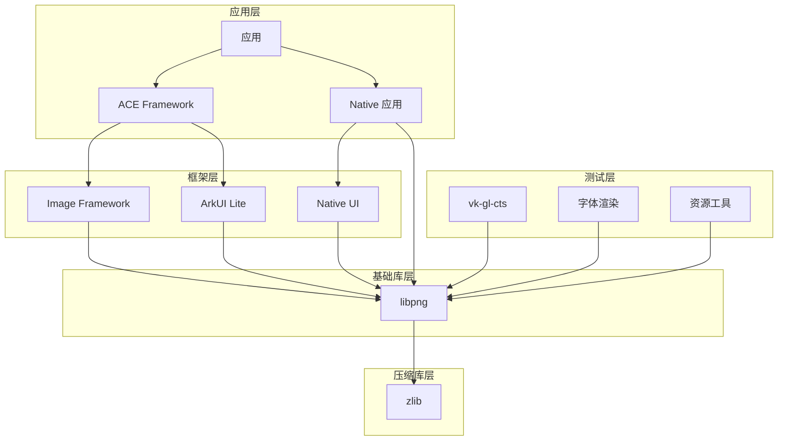
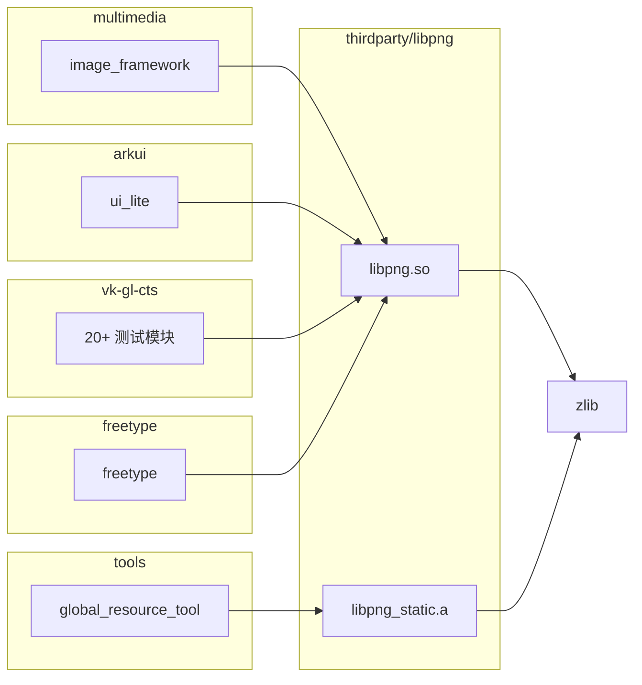

# OH 使用场景与依赖关系

本文档说明 libpng 在 OpenHarmony 系统中的使用场景、直接依赖者和依赖关系图。

---

## 4.1 使用场景

### 4.1.1 核心使用场景

#### 1. PNG 图像解码

libpng 是 OpenHarmony `image_framework` 子系统中 PNG 图像解码的核心后端。

**典型流程**:
```
应用请求加载 PNG 图片
    ↓
Image Framework
    ↓
libpng (PNG 解码)
    ↓
zlib (解压缩)
    ↓
像素数据 (RGBA/RGB)
    ↓
GPU 渲染 / 显示
```

**使用示例**:
```c
#include "png.h"

png_image image;
memset(&image, 0, sizeof(image));
image.version = PNG_IMAGE_VERSION;

if (png_image_begin_read_from_file(&image, "resource/image/logo.png")) {
    image.format = PNG_FORMAT_RGBA;
    
    png_bytep buffer = malloc(PNG_IMAGE_SIZE(image));
    if (png_image_free_to_buffer(&image, buffer, NULL, NULL, 0)) {
        // 使用解码后的像素数据
    }
    png_image_free(&image);
}
```

#### 2. UI 资源加载

ArkUI 框架使用 libpng 加载应用界面中的 PNG 资源。

**资源类型**:
- 图标资源（应用图标、功能图标）
- 背景图片（页面背景、按钮背景）
- 动画帧（帧动画资源）
- 纹理贴图（游戏图形）

#### 3. 图像格式转换

libpng 支持将 PNG 转换为其他格式供系统使用：

- PNG → Raw Pixel Data（GPU 纹理）
- PNG → BMP（兼容旧格式）
- PNG → 内存 Buffer（运行时处理）

---

### 4.1.2 测试场景

#### vk-gl-cts 图形测试

OpenHarmony 的 OpenGL/Vulkan 一致性测试套件大量使用 libpng：

**测试图像处理**:
- 基准图像加载（Reference Image）
- 测试结果图像保存
- 图像差异对比

**依赖模块**:

| 模块路径 | 用途 |
|----------|------|
| `third_party/vk-gl-cts/modules/glshared/` | GL 共享测试模块 |
| `third_party/vk-gl-cts/modules/egl/` | EGL 测试 |
| `third_party/vk-gl-cts/modules/gles2/` | OpenGL ES 2.0 测试 |
| `third_party/vk-gl-cts/modules/gles3/` | OpenGL ES 3.0 测试 |
| `third_party/vk-gl-cts/modules/gles31/` | OpenGL ES 3.1 测试 |
| `third_party/vk-gl-cts/framework/*` | 测试框架组件 |

**典型测试流程**:
```
渲染测试场景
    ↓
生成渲染结果图像
    ↓
使用 libpng 保存为 PNG
    ↓
与基准图像对比
    ↓
输出测试结果
```

---

### 4.1.3 辅助使用场景

#### FreeType 字体渲染

FreeType 库使用 libpng 处理嵌入在字体文件中的 PNG 图像：

```
字体文件 (包含 PNG 位图)
    ↓
FreeType 解析
    ↓
libpng 解码 PNG 数据
    ↓
字符位图渲染
    ↓
屏幕显示
```

#### 开发工具

| 工具 | 用途 |
|------|------|
| global_resource_tool | 资源文件处理 |
| bundlemanager 测试 | 应用包图像验证 |

---

## 4.2 直接依赖者

### 4.2.1 依赖统计

通过代码搜索，共发现 **37 个模块** 直接依赖 libpng：

| 类别 | 模块数量 | 主要用途 |
|------|----------|----------|
| 核心框架 | 2 | UI、图像处理 |
| 图形测试 | 20+ | vk-gl-cts 测试 |
| 字体渲染 | 1 | freetype |
| 开发工具 | 2 | 资源工具、测试 |
| 测试用例 | 10+ | bundlemanager 测试 |

### 4.2.2 主要依赖模块

#### 核心系统模块

| 模块 | BUILD.gn 路径 | 链接方式 | 用途 |
|------|--------------|----------|------|
| image_framework | `foundation/multimedia/image_framework/` | 静态/动态 | PNG 编解码 |
| ui_lite | `foundation/arkui/ui_lite/` | 动态 | UI 资源显示 |

#### 图形测试模块

| 模块 | 链接方式 | 用途 |
|------|----------|------|
| vk-gl-cts/glshared | 动态 | GL 共享测试 |
| vk-gl-cts/egl | 动态 | EGL 测试 |
| vk-gl-cts/gles2 | 动态 | OpenGL ES 2.0 |
| vk-gl-cts/gles3 | 动态 | OpenGL ES 3.0 |
| vk-gl-cts/gles31 | 动态 | OpenGL ES 3.1 |
| vk-gl-cts/openglcts/* | 动态 | OpenGL CTS |
| vk-gl-cts/framework/* | 动态 | 测试框架 |

#### 其他模块

| 模块 | 链接方式 | 用途 |
|------|----------|------|
| freetype | 动态 | 字体渲染 |
| global_resource_tool | 静态 | 资源工具 |

---

## 4.3 依赖关系图

### 4.3.1 系统依赖层次



### 4.3.2 详细依赖关系



---

## 4.4 链接方式详解

### 4.4.1 动态链接 (libpng.so)

**适用场景**: 需要减小二进制体积、多模块共享库的场景。

```gn
# BUILD.gn
deps += [ "//third_party/libpng:libpng" ]
```

**优点**:
- 减少重复代码（多模块共享同一份库）
- 便于库升级（无需重新编译依赖模块）
- 较小的最终二进制体积

**缺点**:
- 运行时需要动态链接器支持
- 可能存在 ABI 兼容性问题
- 加载时有一定开销

**使用模块**:
- image_framework（推荐动态链接）
- vk-gl-cts（推荐动态链接）
- ui_lite

### 4.4.2 静态链接 (libpng_static.a)

**适用场景**: 需要自包含二进制、无动态链接器环境的场景。

```gn
# BUILD.gn
deps += [ "//third_party/libpng:libpng_static" ]
```

**优点**:
- 完全自包含的二进制
- 无运行时依赖
- 更好的优化潜力（链接时优化 LTO）
- 无 ABI 兼容性问题

**缺点**:
- 最终二进制体积较大
- 库升级需要重新编译

**使用模块**:
- global_resource_tool（推荐静态链接）
- bundlemanager 测试
- liteos_m 内核模块

### 4.4.3 源码集 (png_static)

**适用场景**: 需要在编译时进行深度优化的场景。

```gn
# BUILD.gn
sources += get_target_outputs("//third_party/libpng:png_static")
```

**说明**: 直接包含 libpng 源码，编译器可以进行更激进的优化。

**使用场景**:
- 需要同时优化 libpng 和调用方代码
- 定制 libpng 内部行为
- 调试 libpng 本身

---

## 4.5 头文件引用

### 4.5.1 公开头文件

libpng 的公开头文件位于生成目录：

```
${target_gen_dir}/libpng-1.6.44/
├── png.h          # 主要头文件
├── pngconf.h      # 配置头文件
└── pnglibconf.h   # libpng 配置（生成）
```

### 4.5.2 包含方式

```c
// 标准方式
#include "png.h"
#include "pngconf.h"

// 带路径方式
#include "third_party/libpng/png.h"
```

### 4.5.3 配置宏

| 宏名称 | 说明 |
|--------|------|
| `PNG_LIBPNG_VER_STRING` | 版本字符串，如 "1.6.44" |
| `PNG_IMAGE_VERSION` | 图像 API 版本 |
| `PNG_ARM_NEON` | ARM NEON 优化启用 |
| `PNG_MULTY_LINE_ENABLE` | 多行解码优化 |

---

## 4.6 最佳实践

### 4.6.1 链接方式选择

| 场景 | 推荐链接方式 |
|------|--------------|
| 普通应用开发 | 动态链接 |
| 系统框架组件 | 动态链接 |
| 资源工具 | 静态链接 |
| 测试框架 | 动态链接 |
| LiteOS M 内核 | 静态链接 |

### 4.6.2 内存管理

```c
// 推荐：使用 png_image API（自动管理内存）
png_image image;
memset(&image, 0, sizeof(image));
image.version = PNG_IMAGE_VERSION;

if (png_image_begin_read_from_file(&image, "test.png")) {
    png_bytep buffer = malloc(PNG_IMAGE_SIZE(image));
    // 使用 buffer...
    png_image_free(&image);
    free(buffer);
}

// 不推荐：直接使用 png_struct（需要手动管理）
```

### 4.6.3 错误处理

```c
png_image image;
memset(&image, 0, sizeof(image));
image.version = PNG_IMAGE_VERSION;

if (!png_image_begin_read_from_file(&image, "test.png")) {
    // 处理错误
    fprintf(stderr, "Error: %s\n", image.message);
    return;
}

// 解码成功...
png_image_free(&image);
```

---

## 4.7 常见问题

### 问题 1: 多线程使用

**问**: libpng 是否支持多线程？

**答**: libpng 本身是线程安全的，但每个线程需要独立的 `png_struct`：

```c
// 线程安全：每个线程使用独立的 png_struct
void thread_func(void* arg) {
    png_struct* png_ptr = png_create_read_struct(...);
    // 使用 png_ptr...
    png_destroy_read_struct(&png_ptr, NULL, NULL);
}
```

### 问题 2: ARM NEON 兼容性

**问**: ARM NEON 优化是否兼容所有 ARM 芯片？

**答**: 需要满足以下条件：
- CPU 支持 ARM NEON 指令集
- 编译器支持 NEON intrinsic
- 运行时检测 CPU 能力

```c
// BUILD.gn 中的条件编译
if (is_ohos && is_clang && (target_cpu == "arm" || target_cpu == "arm64")) {
  defines = [ "PNG_ARM_NEON" ]
}
```

---

## 4.8 性能考量

### 4.8.1 解码性能优化

| 优化项 | 配置 | 效果 |
|--------|------|------|
| ARM NEON | `PNG_ARM_NEON` | 滤波器运算提升 4-8x |
| 多行解码 | `PNG_MULTY_LINE_ENABLE` | 大图解码提升 2x+ |
| 批量处理 | `png_image_begin_read_from_memory` | 减少 I/O 开销 |

### 4.8.2 内存使用

| 场景 | 内存占用 | 优化建议 |
|------|----------|----------|
| 单张图片 | ~图像尺寸 | 使用流式解码 |
| 多图缓存 | 累计尺寸 | 及时释放 |
| 大分辨率图 | 较大 | 考虑分块加载 |
