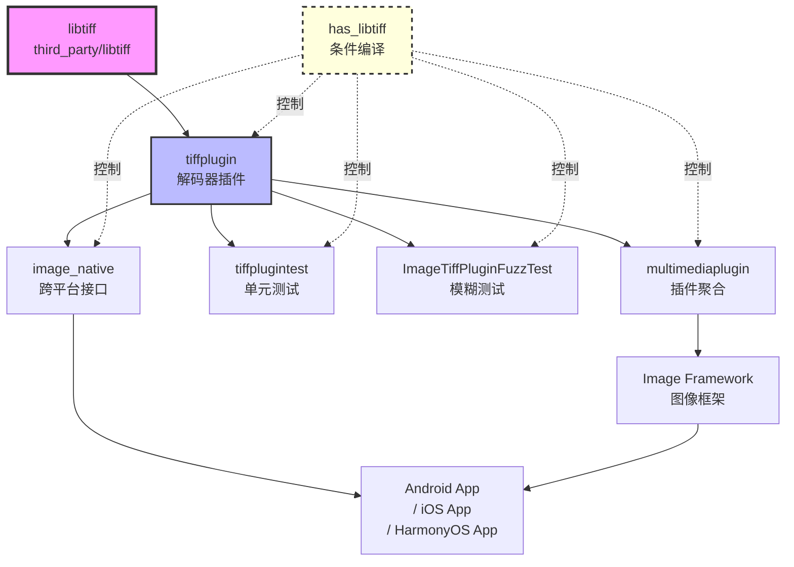
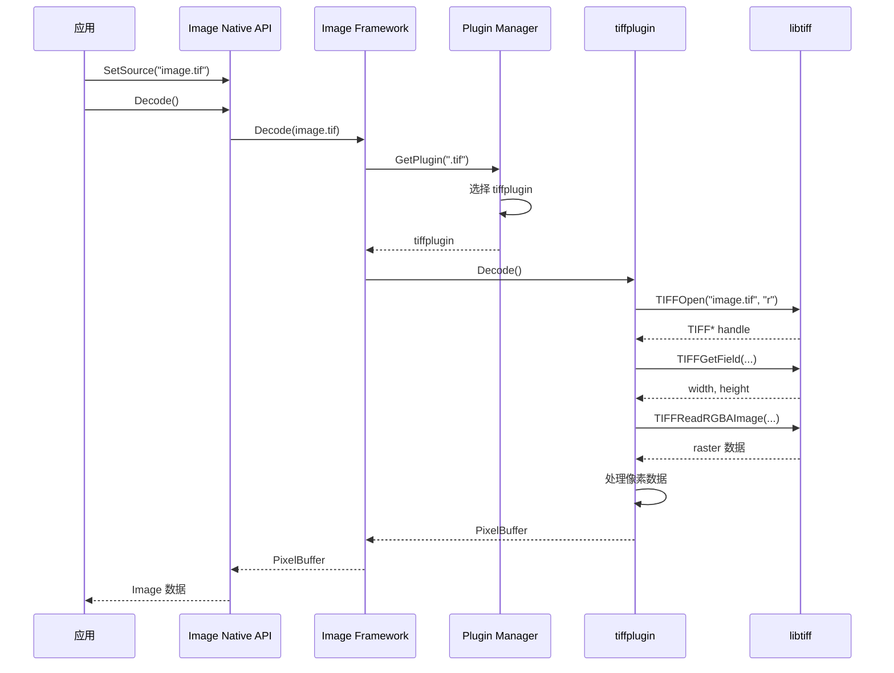

# 依赖关系与使用

## 概述

libtiff 在 OpenHarmony 中主要被 **Image Framework** 使用，提供 TIFF 图像格式解码功能。

---

## 直接依赖者

### 依赖者清单

| 序号 | 模块 | BUILD.gn 路径 | 引用方式 | 使用场景 |
|-----|------|--------------|---------|---------|
| 1 | **tiffplugin** | `oh/foundation/multimedia/image_framework/plugins/common/libs/image/libtiffplugin/BUILD.gn` | `external_deps += [ "libtiff:libtiff" ]` | TIFF 图像格式解码器插件 |
| 2 | **multimediaplugin** | `oh/foundation/multimedia/image_framework/plugins/common/libs/BUILD.gn` | `deps += [ "image/libtiffplugin:tiffplugin" ]` | 聚合所有图像格式插件 |
| 3 | **tiffplugintest** | `oh/foundation/multimedia/image_framework/frameworks/innerkitsimpl/test/BUILD.gn` | `deps + external_deps` | TIFF 解码器单元测试 |
| 4 | **ImageTiffPluginFuzzTest** | `oh/foundation/multimedia/image_framework/frameworks/innerkitsimpl/test/fuzztest/imagetiffplugin_fuzzer/BUILD.gn` | `deps + external_deps` | TIFF 解码器模糊测试 |

**依赖者总数**: 4 个核心依赖者（仅限图像框架）

### 依赖者详细说明

#### 1. tiffplugin（核心依赖者）

**路径**: `oh/foundation/multimedia/image_framework/plugins/common/libs/image/libtiffplugin/`

**类型**: `ohos_shared_library`

**引用方式**:

```gn
if (has_libtiff) {
    external_deps += [ "libtiff:libtiff", ]
}
```

**使用场景**: 提供 TIFF 图像格式解码功能，作为 Image Framework 的插件。

**关键文件**:
- `src/tiff_decoder.cpp` - TIFF 解码器实现
- `src/plugin_export.cpp` - 插件导出接口

---

#### 2. multimediaplugin

**路径**: `oh/foundation/multimedia/image_framework/plugins/common/libs/`

**类型**: `ohos_group`

**引用方式**:

```gn
if (has_libtiff) {
    deps += [
        "image/libtiffplugin:tiffplugin",
        "image/libtiffplugin:tiffpluginmetadata"
    ]
}
```

**使用场景**: 聚合所有图像格式插件，包括 TIFF 插件。

---

#### 3. tiffplugintest

**路径**: `oh/foundation/multimedia/image_framework/frameworks/innerkitsimpl/test/`

**类型**: `ohos_unittest`

**引用方式**:

```gn
deps = [ "//foundation/multimedia/image_framework/plugins/common/libs/image/libtiffplugin:tiffplugin" ]

if (has_libtiff) {
    external_deps += [ "libtiff:libtiff" ]
}
```

**使用场景**: 测试 TIFF 解码器插件功能。

---

#### 4. ImageTiffPluginFuzzTest

**路径**: `oh/foundation/multimedia/image_framework/frameworks/innerkitsimpl/test/fuzztest/imagetiffplugin_fuzzer/`

**类型**: `ohos_fuzztest`

**引用方式**:

```gn
deps = [ "$image_subsystem/plugins/common/libs/image/libtiffplugin:tiffplugin" ]

if (has_libtiff) {
    external_deps += [ "libtiff:libtiff", ]
}
```

**使用场景**: 对 TIFF 解码器进行安全模糊测试。

---

## 条件编译控制

### has_libtiff 开关

所有 libtiff 依赖都通过 `has_libtiff` 变量控制：

```gn
if (has_libtiff) {
    // 启用 libtiff 相关代码
}
```

**配置位置**: `oh/foundation/multimedia/image_framework/ide/image_decode_config.gni`

**默认值**: `has_libtiff = true`

**影响范围**:
- tiffplugin 构建
- multimediaplugin 聚合
- tiffplugintest 测试
- ImageTiffPluginFuzzTest 模糊测试
- image_native 跨平台接口（通过 defines）

### 跨平台配置

**Android 平台**:

```gni
# image_native_android.gni
if (has_libtiff) {
    sources += [ "tiff_decoder.cpp" ]
    include_dirs += [ "libtiffplugin/include" ]
}
```

**iOS 平台**:

```gni
# image_native_ios.gni
if (has_libtiff) {
    sources += [ "tiff_decoder.cpp" ]
    include_dirs += [ "libtiffplugin/include" ]
}
```

**说明**: 通过条件添加源文件和头文件路径，实现跨平台支持。

---

## 使用方式

### 1. 静态链接 / 动态链接

**libtiff 使用动态链接**:

```gn
ohos_shared_library("libtiff") {
    # ...
    output_extension = "so"
}
```

**说明**:
- libtiff 编译为共享库 `libtiff.so`
- 运行时动态加载

### 2. 头文件引用方式

**系统部件引用**:

```gn
// BUILD.gn
external_deps += [ "libtiff:libtiff" ]
```

**C/C++ 代码引用**:

```c
#include <tiff.h>
#include <tiffio.h>
```

**头文件路径**: `//third_party/libtiff/libtiff`

**导出头文件**:
- `tiff.h` - TIFF 基础定义和常量
- `tiffio.h` - TIFF I/O 接口

### 3. 典型使用场景

#### 场景 1: 图像查看应用

**需求**: 显示 TIFF 格式的图片

**实现**:
1. 应用使用 Image Framework 的图像解码接口
2. Image Framework 调用 tiffplugin 插件
3. tiffplugin 使用 libtiff 解码 TIFF 图片
4. 返回解码后的图像数据给应用

**代码示例**:

```c
// 应用代码（伪代码）
ImageDecoder* decoder = CreateDecoder();
decoder->SetSource("image.tif");
decoder->Decode();
PixelBuffer* buffer = decoder->GetBuffer();
// 显示 buffer 中的图像
```

---

#### 场景 2: 图像处理应用

**需求**: 读取 TIFF 格式的原始图像数据进行处理

**实现**:
1. 应用直接使用 libtiff API
2. 打开 TIFF 文件
3. 读取图像元数据
4. 解码图像数据
5. 处理图像数据

**代码示例**:

```c
#include <tiff.h>
#include <tiffio.h>

void process_tiff(const char* filename) {
    // 1. 打开 TIFF 文件
    TIFF* tif = TIFFOpen(filename, "r");
    if (!tif) {
        fprintf(stderr, "Failed to open TIFF file\n");
        return;
    }

    // 2. 读取图像元数据
    uint32_t width, height;
    TIFFGetField(tif, TIFFTAG_IMAGEWIDTH, &width);
    TIFFGetField(tif, TIFFTAG_IMAGELENGTH, &height);

    printf("Image size: %u x %u\n", width, height);

    // 3. 解码图像数据
    uint32_t* raster = (uint32_t*)_TIFFmalloc(width * height * sizeof(uint32_t));
    if (raster && TIFFReadRGBAImage(tif, width, height, raster, 0)) {
        // 处理解码后的像素数据
        for (uint32_t y = 0; y < height; y++) {
            for (uint32_t x = 0; x < width; x++) {
                uint32_t pixel = raster[y * width + x];
                // 处理像素...
            }
        }
    }

    // 4. 释放资源
    _TIFFfree(raster);
    TIFFClose(tif);
}
```

---

#### 场景 3: 多媒体框架

**需求**: 支持多种图像格式的统一解码接口

**实现**:
1. 应用调用 Image Native API
2. Image Native 调用 Image Framework 插件系统
3. 插件系统根据文件类型选择对应的插件
4. TIFF 文件选择 tiffplugin
5. tiffplugin 使用 libtiff 解码

**代码示例**:

```c
// 应用代码
ImageSource* source = ImageSource::Create();
source->SetSource("image.tif");
ImagePacker* packer = ImagePacker::Create();
packer->SetSource(source);
packer->SetOutputFormat(PixelFormat::RGBA);
packer->StartDecode();

// 图像框架内部调用链
ImageNative::Decode()
  → ImagePluginManager::Decode()
    → TiffPlugin::Decode()  // 选择 tiffplugin
      → libtiff::TIFFReadRGBAImage()  // 使用 libtiff API
```

---

## 依赖关系图

### 依赖架构图



---

### 调用链图



---

## 在 OH 中的典型使用场景

### 1. 图像查看应用

**场景**: 用户使用图库或相册查看 TIFF 图片

**技术实现**:
- 应用通过 Image Native API 加载图片
- Image Framework 检测到 TIFF 格式
- 调用 tiffplugin 解码
- libtiff 读取 TIFF 文件并解码为像素数据
- 应用显示解码后的图片

**支持的特性**:
- 多种压缩算法（LZW, JPEG, Deflate 等）
- 多种色彩空间和位深度
- BigTIFF 大文件支持

---

### 2. 图像处理应用

**场景**: 用户使用图像编辑器处理 TIFF 图片

**技术实现**:
- 应用直接使用 libtiff API
- 读取 TIFF 文件的原始数据
- 进行图像处理（滤镜、调整等）
- 保存为其他格式（注意：OH 不支持 TIFF 编码）

**限制**:
- 无法保存为 TIFF 格式（OH 不支持编码）
- 需要转换为其他格式保存

---

### 3. 文档查看器

**场景**: 用户使用文档查看器查看扫描的 TIFF 文档

**技术实现**:
- 通过 Image Framework 加载 TIFF 图片
- 支持多页 TIFF（TIFF 支持单文件存储多幅图像）
- 逐页显示文档

**优势**:
- TIFF 格式支持高分辨率图像
- 适合存储扫描的文档

---

### 4. 测试和验证

**单元测试**:
- `tiffplugintest` 测试 TIFF 解码器功能
- 验证各种压缩算法的解码正确性
- 验证不同色彩空间和位深度的支持

**模糊测试**:
- `ImageTiffPluginFuzzTest` 对 TIFF 解码器进行安全测试
- 随机生成异常 TIFF 文件
- 验证解码器的健壮性和安全性

---

## 性能考虑

### 1. 压缩算法性能

| 压缩算法 | 解码速度 | 内存占用 | 适用场景 |
|---------|---------|---------|---------|
| **LZW** | 中 | 中 | 通用场景 |
| **JPEG** | 快 | 中 | 照片图像 |
| **Deflate** | 中 | 中 | 通用场景 |
| **PackBits** | 快 | 低 | 简单图像 |
| **CCITT G3/G4** | 快 | 低 | 传真文档 |

### 2. 内存使用

**TIFFReadRGBAImage** API:

```c
uint32_t *raster = (uint32_t *)_TIFFmalloc(width * height * sizeof(uint32_t));
```

**内存计算**: `width × height × 4 bytes`

**示例**:
- 1000×1000 图像: 4 MB
- 4000×4000 图像: 64 MB

**建议**: 对大图像使用逐行解码（TIFFReadScanline）以减少内存占用。

---

## 安全考虑

### 1. 输入验证

libtiff 在 OH 中的使用场景：

- **解码器**: 读取用户提供的 TIFF 文件
- **安全风险**: 恶意构造的 TIFF 文件可能导致崩溃或安全漏洞

**防护措施**:
- 使用 `stopOnError` 参数控制错误处理
- 模糊测试（ImageTiffPluginFuzzTest）
- 升级至最新版本获取安全修复

---

### 2. 缓冲区溢出

**风险**: 某些旧版本 libtiff 存在缓冲区溢出漏洞

**建议**:
- 使用最新版本（建议升级至 4.7.1）
- 启用编译器的安全选项（如 `-fstack-protector`）

详见 [06_Security.md](06_Security.md)。

---

## 总结

### 依赖关系总结

| 维度 | 结果 |
|-----|------|
| **直接依赖者数量** | 4 个 |
| **主要使用子系统** | multimedia（图像框架） |
| **使用方式** | 通过 tiffplugin 插件 |
| **典型场景** | 图像查看、图像处理、文档查看 |
| **条件编译** | has_libtiff 开关 |

### libtiff 在 OH 中的定位

1. **基础设施组件**: 为 Image Framework 提供 TIFF 解码能力
2. **插件化集成**: 通过 tiffplugin 插件集成到图像框架
3. **跨平台支持**: 支持 Android/iOS/HarmonyOS 平台
4. **安全测试**: 通过模糊测试确保安全性

### 使用建议

1. **应用开发者**: 使用 Image Native API，无需直接调用 libtiff
2. **框架开发者**: 使用 tiffplugin 插件接口
3. **底层开发者**: 需要直接使用 libtiff 时，参考 API 示例

---

**文档版本**: 1.0
**最后更新**: 2026年2月8日
