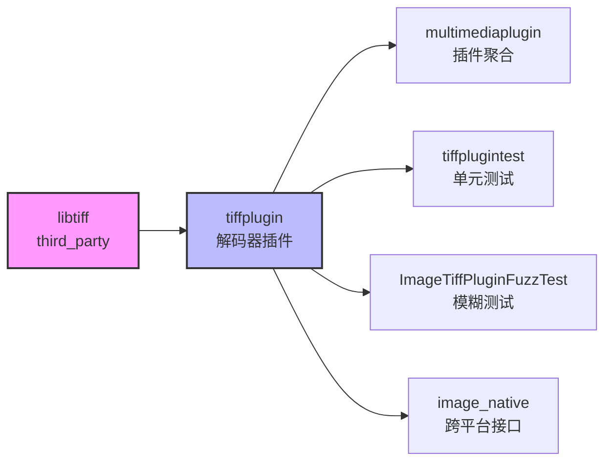

# libtiff - OpenHarmony 第三方库文档

本文档说明 libtiff 在 OpenHarmony 中的集成与适配。

---

## 库概览

**原始库名称**: LibTIFF - TIFF Library and Utilities
**版本**: 4.7.0
**许可证**: LibTIFF License (类 BSD 协议)
**上游地址**: https://gitlab.com/libtiff/libtiff

**OH 组件名称**: libtiff
**所属子系统**: thirdparty
**包名**: @ohos/libtiff

---

## 快速了解

### libtiff 是什么？

LibTIFF 是一个用于读写 TIFF (Tagged Image File Format) 图像文件的开源库。TIFF 是一种灵活的图像格式，支持多种压缩算法和色彩空间，广泛应用于印刷出版、医学影像、地理信息系统等领域。

### 在 OpenHarmony 中的作用

libtiff 在 OpenHarmony 中作为媒体子系统的基础组件，提供 **TIFF 图像格式解码能力**。集成在 Image Framework 中，用于读取和显示 TIFF 图片。

**功能限制**:
- ✅ 支持: TIFF 图像解码（读取和显示）
- ❌ 不支持: 图像编码、元数据编辑

---

## 集成特点

### 零 Patch 集成

libtiff 在 OpenHarmony 中是 **零 Patch 集成**，所有适配通过以下方式完成：

1. **BUILD.gn 构建系统适配**
2. **port/ 跨平台兼容层**
3. **条件编译开关**

这意味着源代码完全来自上游，升级上游版本相对容易。

### 压缩算法支持

BUILD.gn 提供了丰富的压缩算法配置选项：

| 压缩算法 | OH 状态 | 说明 |
|---------|---------|------|
| LZW | ✅ 启用 | Lempel-Ziv & Welch 压缩 |
| PackBits | ✅ 启用 | 行程编码 |
| JPEG | ✅ 启用 | JPEG 压缩（依赖 libjpeg-turbo） |
| Old JPEG | ✅ 启用 | 旧版 JPEG 压缩 |
| CCITT G3/G4 | ✅ 启用 | 传真压缩 |
| Deflate | ✅ 启用 | ZIP 风格压缩（依赖 zlib） |
| PixarLog | ✅ 启用 | Pixar 压缩格式（依赖 zlib） |
| LogLuv | ✅ 启用 | 对数压缩格式 |
| JBIG | ❌ 禁用 | JBIG 压缩 |
| LERC | ❌ 禁用 | Limited Error Raster Compression |
| LZMA | ❌ 禁用 | LZMA 压缩 |
| Zstd | ❌ 禁用 | Zstandard 压缩 |
| WebP | ❌ 禁用 | WebP 压缩 |

---

## 文档导航

### 阅读路线建议

1. **快速了解**: [SUMMARY.md](SUMMARY.md) - 阅读路线建议
2. **库概览**: [01_Overview.md](01_Overview.md) - 原始库简介和在 OH 中的作用
3. **Patch 分析**: [02_Patches.md](02_Patches.md) - 说明为何无需 Patch
4. **构建适配** (重点): [03_Build_Integration.md](03_Build_Integration.md) - BUILD.gn 和构建流程详解
5. **使用情况** (重点): [04_Usage_in_OH.md](04_Usage_in_OH.md) - 依赖关系和使用场景
6. **API 差异**: [05_API_Differences.md](05_API_Differences.md) - 功能限制说明
7. **安全分析**: [06_Security.md](06_Security.md) - 版本差异和安全建议

### 核心文档

| 文档 | 内容 | 阅读对象 |
|-----|------|---------|
| [03_Build_Integration.md](03_Build_Integration.md) | BUILD.gn 构建系统详解 | 构建工程师、移植开发者 |
| [04_Usage_in_OH.md](04_Usage_in_OH.md) | 依赖关系和使用场景 | 应用开发者、系统集成者 |
| [01_Overview.md](01_Overview.md) | 库概览和基本介绍 | 所有读者 |
| [02_Patches.md](02_Patches.md) | Patch 分析（零 Patch 说明） | 版本维护者、升级开发者 |
| [05_API_Differences.md](05_API_Differences.md) | API 和功能限制 | 应用开发者 |
| [06_Security.md](06_Security.md) | 安全风险和升级建议 | 安全工程师、版本维护者 |

---

## 快速开始

### 系统部件如何使用 libtiff

在 BUILD.gn 中添加依赖：

```gn
// BUILD.gn
external_deps += [ "libtiff:libtiff" ]
```

### API 使用示例

```c
// 1. 打开 TIFF 文件
TIFF *tif = TIFFOpen("image.tif", "r");

// 2. 读取图像元数据
uint32_t width, height;
TIFFGetField(tif, TIFFTAG_IMAGEWIDTH, &width);
TIFFGetField(tif, TIFFTAG_IMAGELENGTH, &height);

// 3. 解码图像数据
uint32_t *raster = (uint32_t *)_TIFFmalloc(width * height * sizeof(uint32_t));
if (TIFFReadRGBAImage(tif, width, height, raster, 0)) {
    // 处理解码后的像素数据
}

// 4. 释放资源
_TIFFfree(raster);
TIFFClose(tif);
```

详见 [04_Usage_in_OH.md](04_Usage_in_OH.md) 和 README_zh.md。

---

## 依赖关系

### 核心依赖者

libtiff 主要被 **Image Framework** 使用，依赖链如下：



详见 [04_Usage_in_OH.md](04_Usage_in_OH.md)。

---

## 版本信息

### 当前集成版本

- **OH 版本**: 4.7.0
- **上游最新版本**: 4.7.1（截至文档更新时）

### 版本差异

4.7.1 相比 4.7.0 主要改进：
- 新增 API: `TIFFOpenOptionsSetWarnAboutUnknownTags()`
- 内存泄漏修复
- 缓冲区溢出修复
- LZW 解压性能优化
- 大量安全性修复（CVE 相关）

详见 [06_Security.md](06_Security.md)。

---

## 贡献与反馈

### 维护者

- **Owner**: pengyonglong2@h-partners.com
- **上游**: https://gitlab.com/libtiff/libtiff

### 问题报告

如发现 libtiff 在 OpenHarmony 中的问题，请通过官方渠道反馈。

---

## 参考资料

- [官方文档首页](https://libtiff.gitlab.io/libtiff/)
- [函数文档](https://libtiff.gitlab.io/libtiff/functions.html)
- [构建说明](https://libtiff.gitlab.io/libtiff/build.html)
- [GitLab 仓库](https://gitlab.com/libtiff/libtiff)
- [OpenHarmony 中文说明](README_zh.md)
- [OpenHarmony 英文说明](README_en.md)

---

**文档版本**: 1.0
**最后更新**: 2026年2月8日
