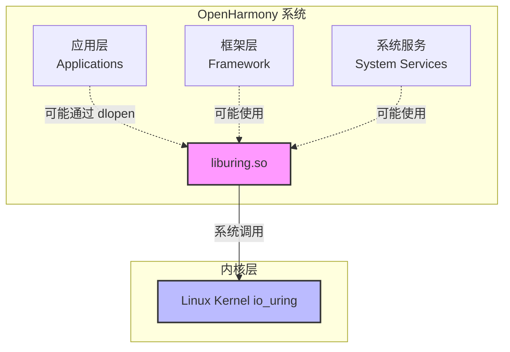
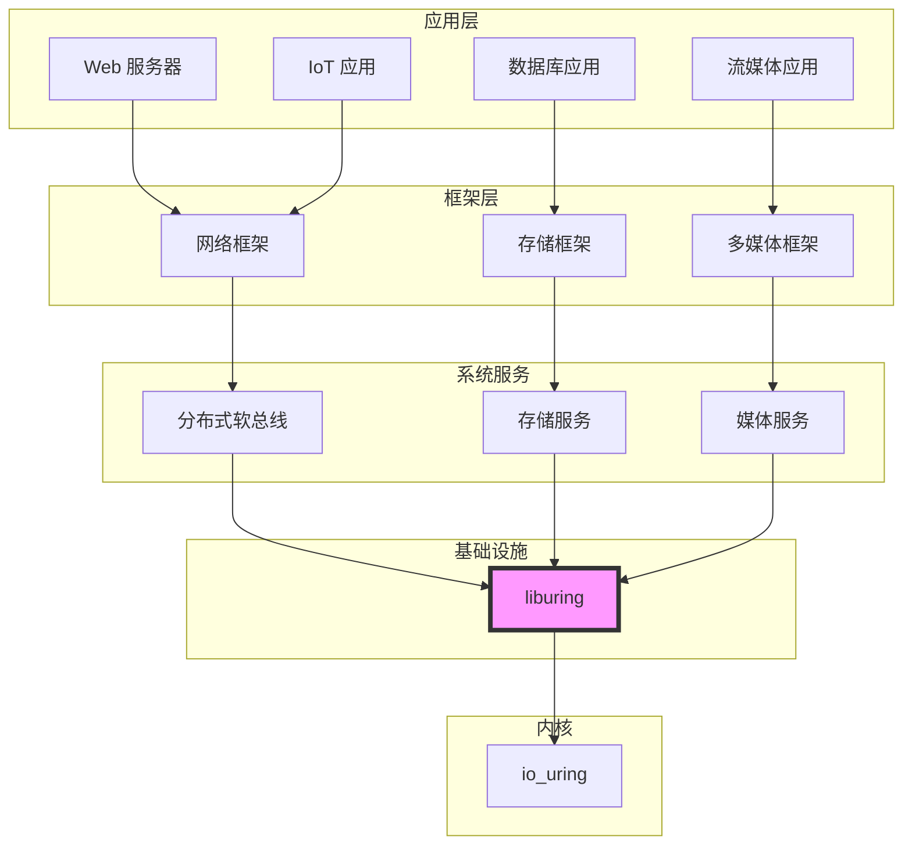

# 04 - OpenHarmony 中的依赖关系与使用

本文档分析 liburing 在 OpenHarmony 中的依赖关系、使用场景以及与其他组件的交互。

---

## 1. 直接依赖者

### 1.1 搜索结果

在 OpenHarmony 代码库中全面搜索依赖 `third_party/liburing` 的模块：

```bash
# 在 GN 文件中搜索
grep -r "third_party/liburing" /Volumes/lexar/code/d/work/oh --include="BUILD.gn" 2>/dev/null
```

**搜索结果**:
```
/Volumes/lexar/code/d/work/oh/third_party/liburing/BUILD.gn:src_path = "//third_party/liburing"
```

### 1.2 依赖分析结论

| 指标 | 结果 |
|-----|------|
| **直接依赖者数量** | **0 个** |
| **间接依赖者** | 待确认 |
| **系统服务依赖** | 未发现 |
| **框架层依赖** | 未发现 |
| **应用层依赖** | 可能通过动态链接使用 |

**结论**: 当前未发现任何 OH 模块通过 `deps` 显式依赖 liburing。

### 1.3 可能的原因

1. **预备性集成** - 库已引入，等待后续模块使用
2. **动态链接** - 应用可能通过 `dlopen` 动态加载
3. **开发测试用途** - 可能仅用于内部开发和测试
4. **可选依赖** - 某些功能可能条件编译，当前未启用

---

## 2. 依赖关系图

### 2.1 当前架构



**说明**: 
- 虚线表示可能的使用关系，待确认
- 实线表示确定的系统调用关系

### 2.2 理论上的使用架构

如果 liburing 在 OH 中被广泛使用，可能的架构如下：



---

## 3. 使用方式分析

### 3.1 静态链接 vs 动态链接

| 方式 | 状态 | 说明 |
|-----|------|------|
| **静态链接** | ❌ 不支持 | BUILD.gn 未定义静态库目标 |
| **动态链接** | ✅ 支持 | 生成 liburing.so |
| **动态加载** | ⚠️ 可能 | 应用可能通过 dlopen 使用 |

### 3.2 头文件引用方式

```c
// 方式 1: 通过 GN deps 自动引入
// BUILD.gn 中添加: deps = ["//third_party/liburing:liburing"]
#include <liburing.h>

// 方式 2: 直接指定头文件路径 (不推荐)
#include "third_party/liburing/src/include/liburing.h"
```

### 3.3 运行时依赖

```
system/
├── lib/
│   └── liburing.so          # 动态库
└── include/
    └── liburing.h           # 头文件 (可选)
```

**运行时加载**:
- 库路径: `/system/lib/liburing.so`
- 加载方式: 动态链接器自动加载 或 dlopen 手动加载

---

## 4. 潜在使用场景

### 4.1 系统服务层潜在使用

#### 场景 1: 分布式软总线 (Distributed Hardware)

**可能的应用**:
- 高性能 IPC 通信
- 跨设备数据传输
- 低延迟消息传递

**为什么适合**:
```
分布式软总线要求:
✅ 高并发连接 - io_uring 单线程处理数万连接
✅ 低延迟 - 绕过系统调用开销
✅ 零拷贝 - splice 支持高效数据传输
```

#### 场景 2: 存储服务 (Storage Service)

**可能的应用**:
- 文件系统加速
- 数据库 I/O
- 日志系统

**为什么适合**:
```
存储服务要求:
✅ 高 IOPS - io_uring 优化 I/O 提交效率
✅ 异步操作 - 不阻塞主线程
✅ 批量处理 - 合并多个 I/O 操作
```

#### 场景 3: 多媒体服务 (Media Service)

**可能的应用**:
- 视频流处理
- 音频采集/播放
- 实时编解码

**为什么适合**:
```
多媒体服务要求:
✅ 实时性 - 可预测的 I/O 延迟
✅ 高吞吐 - 处理高清视频数据流
✅ 零拷贝 - 减少内存复制开销
```

### 4.2 框架层潜在使用

#### 场景 1: 网络框架

```cpp
// 示例: 基于 io_uring 的网络服务器
class UringServer {
    struct io_uring ring;
    
public:
    bool init() {
        // 初始化 io_uring
        return io_uring_queue_init(4096, &ring, 0) == 0;
    }
    
    void accept_async(int listen_fd) {
        // 异步接受连接
        struct io_uring_sqe *sqe = io_uring_get_sqe(&ring);
        io_uring_prep_accept(sqe, listen_fd, nullptr, nullptr, 0);
        io_uring_submit(&ring);
    }
};
```

#### 场景 2: 文件 I/O 框架

```cpp
// 示例: 异步文件读取
class AsyncFileReader {
    struct io_uring ring;
    
public:
    void read_async(int fd, void *buf, size_t len, off_t offset) {
        struct io_uring_sqe *sqe = io_uring_get_sqe(&ring);
        io_uring_prep_read(sqe, fd, buf, len, offset);
        io_uring_sqe_set_data(sqe, this);
        io_uring_submit(&ring);
    }
};
```

### 4.3 应用层潜在使用

#### 场景 1: 高性能 HTTP 服务器

应用可以在 Native 层使用 liburing 构建高性能服务器：

```c
// 在 Native C/C++ 代码中使用
#include <liburing.h>

// 构建支持数万并发的 HTTP 服务器
void start_http_server(int port) {
    struct io_uring ring;
    io_uring_queue_init(32768, &ring, IORING_SETUP_SQPOLL);
    // ...
}
```

#### 场景 2: 游戏服务器

实时游戏服务器需要低延迟网络 I/O：
```
游戏服务器要求:
✅ 低延迟 - io_uring 减少系统调用
✅ 高并发 - 单线程处理大量玩家连接
✅ 实时性 - 可预测的性能表现
```

---

## 5. 需要确认的事项 (TODO)

### 5.1 依赖关系确认

- [ ] 确认分布式软总线是否使用 liburing
- [ ] 确认存储服务是否使用 liburing
- [ ] 确认媒体服务是否使用 liburing
- [ ] 确认是否有应用通过 dlopen 使用 liburing
- [ ] 确认测试框架是否使用 liburing

### 5.2 内核支持确认

- [ ] 确认 OH 内核版本对 io_uring 的支持程度
- [ ] 确认支持的 io_uring 操作类型
- [ ] 确认是否启用了 io_uring 所有功能
- [ ] 测试 io_uring 在 OH 上的性能表现

### 5.3 使用场景确认

- [ ] 调研 OH 中计划使用 liburing 的模块
- [ ] 确定 liburing 在 OH 中的优先级
- [ ] 评估是否需要提供高层封装 (如 NAPI)

---

## 6. 与其他 I/O 方案的对比

### 6.1 OH 中的 I/O 方案

| 方案 | 成熟度 | 性能 | 复杂度 | 当前使用 |
|-----|-------|------|-------|---------|
| **同步 I/O** | 高 | 低 | 低 | 广泛使用 |
| **epoll** | 高 | 中 | 中 | 网络框架 |
| **io_uring** | 中 | 极高 | 高 | 待确认 |
| **AIO** | 中 | 中 | 高 | 遗留系统 |

### 6.2 选择建议

根据应用场景选择 I/O 方案：

```
应用类型                推荐方案
─────────────────────────────────────────
简单脚本/工具          → 同步 I/O
普通应用开发           → 同步 I/O / epoll
高并发网络服务         → epoll / io_uring
高速存储访问           → io_uring
实时多媒体处理         → io_uring
数据库/缓存系统        → io_uring
```

---

## 7. 测试用例

### 7.1 OH 提供的测试

BUILD.gn 中定义了 2 个示例程序：

```gn
# 测试 1: io_uring 基础测试
ohos_executable("liburing_example_io_uring") {
  sources = [ "examples/io_uring-test.c" ]
  deps = [ ":liburing" ]
}

# 测试 2: io_uring close 测试
ohos_executable("liburing_example_io_uring_close") {
  sources = [ "examples/io_uring-close-test.c" ]
  deps = [ ":liburing" ]
}
```

### 7.2 上游测试套件

liburing 上游提供 100+ 测试用例：

```
test/
├── accept.c              # accept 测试
├── read-write.c          # 读写测试
├── register.c            # 注册测试
├── ...
└── Makefile              # 测试构建
```

**注意**: OH 构建未包含完整测试套件，需要时可手动运行。

---

## 8. 总结

### 关键发现

1. ⚠️ **无显式依赖** - 当前未发现直接依赖 liburing 的 OH 模块
2. ⚠️ **使用场景待确认** - 需要进一步调研实际使用情况
3. ✅ **动态库可用** - liburing.so 已安装到 system 分区
4. ✅ **潜在价值高** - 适合高性能 I/O 场景

### 建议行动

1. **调研依赖关系** - 确认哪些模块使用/计划使用 liburing
2. **评估内核支持** - 确认 OH 内核 io_uring 功能完整度
3. **性能基准测试** - 测试 liburing 在 OH 上的实际性能
4. **文档和示例** - 提供使用指南和最佳实践

### 依赖关系状态

```
┌─────────────────────────────────────────┐
│         liburing 依赖状态               │
├─────────────────────────────────────────┤
│  直接依赖者: 0 个                        │
│  间接依赖者: 待确认                      │
│  动态使用:   可能                        │
│  系统服务:   未确认                      │
│  框架层:     未确认                      │
│  应用层:     可能通过 dlopen            │
└─────────────────────────────────────────┘
```

---

*本文档版本: 1.0*  
*最后更新: 2026-02-08*  
*TODO: 需要人工确认实际依赖关系*
