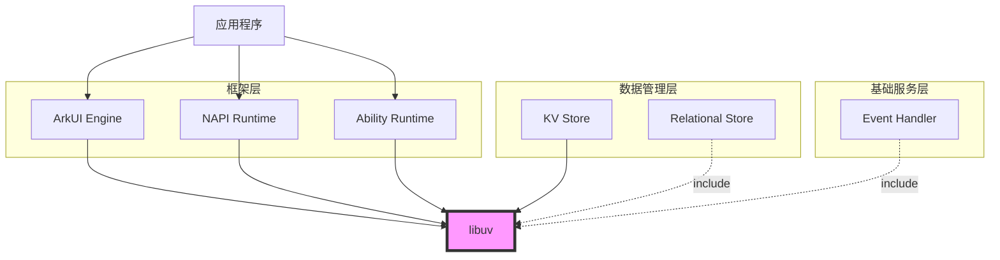
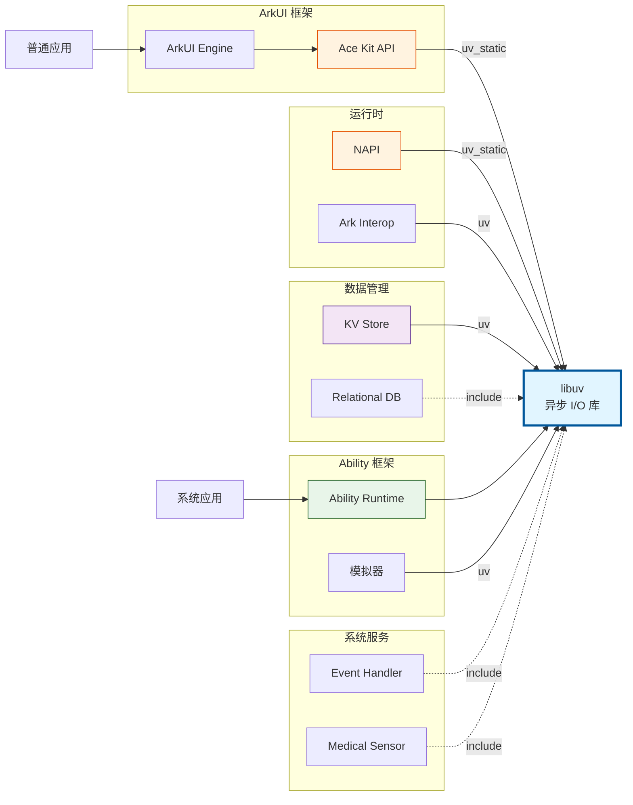

# 04 - 依赖关系与使用

## 4.1 直接依赖者列表

### 4.1.1 核心框架层

| 模块 | BUILD.gn 路径 | 依赖方式 | 主要用途 |
|-----|--------------|---------|---------|
| **napi** | `foundation/arkui/napi/BUILD.gn` | `uv_static` | Node-API 运行时事件循环 |
| **ace_engine/ace_kit** | `foundation/arkui/ace_engine/interfaces/inner_api/ace_kit/BUILD.gn` | `uv_static` | ArkUI 框架异步 I/O |
| **ark_interop** | `foundation/arkui/napi/interfaces/inner_api/cjffi/ark_interop/BUILD.gn` | `uv` | 跨语言互操作 |
| **ability_runtime/simulator** | `foundation/ability/ability_runtime/frameworks/simulator/BUILD.gn` | `uv` | 模拟器事件循环 |

### 4.1.2 数据管理层

| 模块 | BUILD.gn 路径 | 依赖方式 | 主要用途 |
|-----|--------------|---------|---------|
| **kv_store (mock)** | `foundation/distributeddatamgr/kv_store/kvstoremock/interfaces/jskits/distributeddata/BUILD.gn` | `uv` | KV 存储异步操作 |
| **kv_store (mock)** | `foundation/distributeddatamgr/kv_store/kvstoremock/interfaces/jskits/distributedkvstore/BUILD.gn` | `uv` | KV 存储异步操作 |
| **kv_store (inner)** | `foundation/distributeddatamgr/kv_store/kvstoremock/interfaces/innerkits/distributeddata/BUILD.gn` | `uv` | 内部接口异步 I/O |
| **relational_store** | `foundation/distributeddatamgr/relational_store/interfaces/inner_api/rdb/BUILD.gn` | include only | 关系型数据库 |

### 4.1.3 系统服务层

| 模块 | BUILD.gn 路径 | 依赖方式 | 主要用途 |
|-----|--------------|---------|---------|
| **eventhandler** | `base/notification/eventhandler/frameworks/napi/BUILD.gn` | include only | 事件处理框架 |
| **medical_sensor** | `base/sensors/medical_sensor/interfaces/plugin/BUILD.gn` | include only | 医疗传感器数据 |

### 4.1.4 测试层

| 模块 | BUILD.gn 路径 | 说明 |
|-----|--------------|------|
| **acts/libuv** | `test/xts/acts/arkui/libuv/BUILD.gn` | XTS 兼容性测试套件 |

---

## 4.2 依赖关系图

### 4.2.1 简化依赖图



### 4.2.2 详细依赖图



---

## 4.3 典型使用场景

### 4.3.1 NAPI 运行时 (核心使用)

**场景**: Node-API 提供 JavaScript 与 C/C++ 互操作能力

```
JS 代码
   │
   ▼
NAPI 接口
   │
   ├──► 同步调用
   │
   └──► 异步调用 ──► libuv 线程池 ──► 回调 JS
            │
            └──► uv_queue_work
```

**关键 API**:
- `uv_queue_work` - 提交异步工作
- `uv_async_send` - 异步通知
- Event Loop 集成

### 4.3.2 ArkUI 引擎

**场景**: UI 框架的事件循环和异步资源加载

```
用户交互
   │
   ▼
ArkUI 引擎
   │
   ├──► 事件分发 (通过 libuv 事件循环)
   │
   ├──► 网络请求 (通过 libuv 异步 I/O)
   │
   └──► 文件操作 (通过 libuv 线程池)
```

**关键功能**:
- 主线程事件循环
- HTTP 资源加载
- 异步动画帧

### 4.3.3 数据存储 (KV Store)

**场景**: 分布式 KV 存储的异步读写

```
应用调用
   │
   ▼
KV Store API
   │
   ├──► 同步读 (内存缓存)
   │
   └──► 异步写 ──► libuv 线程池
            │
            └──► 文件系统操作
```

**优势**:
- 避免阻塞主线程
- 批量操作优化

### 4.3.4 Ability Runtime

**场景**: 应用生命周期管理和 IPC

```
系统服务
   │
   ▼
Ability Runtime
   │
   ├──► 进程间通信 (libuv pipe/stream)
   │
   └──► 定时任务 (libuv timer)
```

---

## 4.4 使用方式分析

### 4.4.1 链接方式

| 模块 | 链接方式 | 说明 |
|-----|---------|------|
| napi | 静态链接 (`uv_static`) | 运行时集成 |
| ace_kit | 静态链接 (`uv_static`) | 框架内嵌 |
| ark_interop | 动态链接 (`uv`) | 插件机制 |
| kv_store | 动态链接 (`uv`) | 独立模块 |
| simulator | 动态链接 (`uv`) | 模拟器环境 |

### 4.4.2 头文件引用

**方式一: 通过 BUILD.gn 依赖**
```gn
deps = [ "//third_party/libuv:uv" ]
# 自动包含 //third_party/libuv/include
```

**方式二: 直接 include**
```gn
include_dirs = [
  "//third_party/libuv/include",
  "//third_party/libuv/src",
  "//third_party/libuv/src/unix",
]
```

**方式三: 使用 inner_kits**
```gn
external_deps = [ "libuv:uv" ]
# 通过 bundle.json 定义的 inner_kits
```

### 4.4.3 API 使用模式

**模式一: 直接使用 libuv API**
```c
#include <uv.h>

// 创建事件循环
uv_loop_t* loop = uv_default_loop();

// 创建定时器
uv_timer_t timer;
uv_timer_init(loop, &timer);
uv_timer_start(&timer, callback, timeout, repeat);

// 运行循环
uv_run(loop, UV_RUN_DEFAULT);
```

**模式二: 通过框架封装**
```c
// 使用 NAPI 提供的异步 API
// 底层使用 libuv 但不直接暴露
napi_create_async_work(env, resource, name, execute, complete, data, &work);
```

---

## 4.5 依赖影响分析

### 4.5.1 影响范围

```
libuv 变更影响分析:

High Impact (高风险):
├── napi - 运行时核心
└── ace_engine - UI 框架核心

Medium Impact (中风险):
├── ability_runtime - 应用框架
├── kv_store - 数据存储
└── ark_interop - 互操作

Low Impact (低风险):
├── eventhandler - 事件处理
├── medical_sensor - 传感器
└── test modules - 测试模块
```

### 4.5.2 升级影响

| 变更类型 | 影响模块 | 风险等级 |
|---------|---------|---------|
| ABI 变更 | napi, ace_engine | 🔴 高 |
| API 废弃 | 所有依赖模块 | 🟡 中 |
| 行为变更 | kv_store, ability | 🟡 中 |
| 性能优化 | 所有模块 | 🟢 低 |
| Bug 修复 | 所有模块 | 🟢 低 |

---

## 4.6 使用统计

### 4.6.1 按子系统统计

| 子系统 | 模块数 | 主要使用方式 |
|-------|-------|-------------|
| arkui | 3 | 事件循环、异步 I/O |
| ability | 2 | IPC、定时器 |
| distributeddatamgr | 3 | 文件 I/O、线程池 |
| notification | 1 | 事件处理 |
| sensors | 1 | 数据采样 |

### 4.6.2 使用频率估计

| 模块 | 使用频率 | 说明 |
|-----|---------|------|
| napi | ⭐⭐⭐⭐⭐ | 每个 JS 应用都使用 |
| ace_engine | ⭐⭐⭐⭐⭐ | 每个 UI 应用都使用 |
| kv_store | ⭐⭐⭐ | 使用 KV 存储的应用 |
| ability_runtime | ⭐⭐⭐⭐ | 系统服务 |
| eventhandler | ⭐⭐ | 特定场景 |

---

## 4.7 集成建议

### 4.7.1 新模块集成

**推荐方式**:
```gn
# 在 BUILD.gn 中添加依赖
ohos_shared_library("my_module") {
  external_deps = [
    "libuv:uv",  # 或 uv_static
  ]
}
```

**头文件包含**:
```c
#include <uv.h>  // 无需额外路径
```

### 4.7.2 功能选择

| 需求 | 建议 |
|-----|------|
| 仅需要事件循环 | 使用 uv 默认 loop |
| 需要线程池 | 使用 uv_queue_work |
| 需要定时器 | 使用 uv_timer_* API |
| 需要网络 | 使用 uv_tcp_* / uv_udp_* |
| 需要文件 I/O | 使用 uv_fs_* API |

### 4.7.3 注意事项

1. **线程安全**: libuv 的 handle 不是线程安全的，需要在创建 loop 的线程操作
2. **内存管理**: 注意 uv_close 后需要 uv_run 才能释放资源
3. **错误处理**: 检查所有 API 返回值
4. **QoS 使用**: 启用 FFRT 时可指定任务优先级

---

## 4.8 总结

libuv 在 OpenHarmony 中作为**基础设施**被广泛使用：

| 维度 | 说明 |
|-----|------|
| **核心地位** | 运行时、框架、数据层的基础依赖 |
| **使用广度** | 覆盖 8+ 个子系统 |
| **依赖深度** | 从框架到应用的完整链路 |
| **稳定性要求** | 极高，影响整个系统 |

**维护建议**:
- 升级前必须进行全系统回归测试
- 保持 ABI 兼容性
- 完善变更影响分析

---

*注: 依赖关系基于 BUILD.gn 实际引用，统计时间 2025-02-08*
