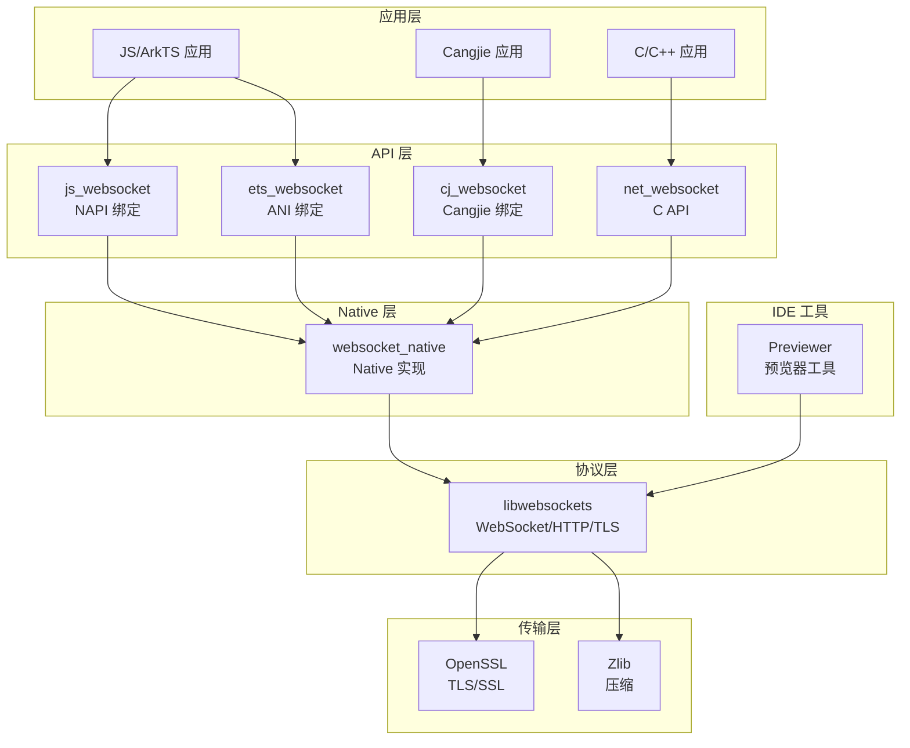
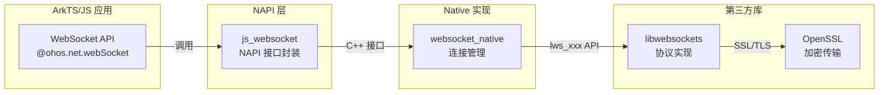
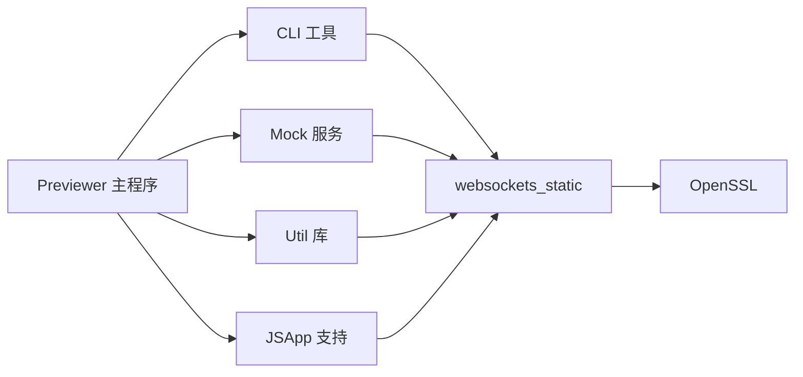

# 04 - 依赖关系与使用

## 直接依赖者清单

通过搜索 GN 文件，发现以下模块直接依赖 libwebsockets：

### 1. netstack 子系统 - WebSocket 核心实现

| 模块 | BUILD.gn 路径 | 用途 | 依赖方式 |
|-----|--------------|-----|---------|
| **websocket_native** | `foundation/communication/netstack/interfaces/innerkits/websocket_native/BUILD.gn` | WebSocket Native API 内部实现 | `deps = ["libwebsockets:websockets"]` |
| **net_websocket** | `foundation/communication/netstack/interfaces/kits/c/net_websocket/BUILD.gn` | C 语言 WebSocket API | `deps = ["libwebsockets:websockets"]` |
| **cj_websocket** | `foundation/communication/netstack/frameworks/cj/websocket/BUILD.gn` | Cangjie 语言 WebSocket 绑定 | `deps = ["libwebsockets:websockets"]` |
| **ets_websocket** | `foundation/communication/netstack/frameworks/ets/ani/web_socket/BUILD.gn` | ArkTS/ETS WebSocket 绑定 | `deps = ["libwebsockets:websockets"]` |
| **js_websocket** | `foundation/communication/netstack/frameworks/js/napi/websocket/BUILD.gn` | JavaScript NAPI WebSocket 绑定 | `deps = ["libwebsockets:websockets"]` |

### 2. netstack 子系统 - 测试

| 模块 | BUILD.gn 路径 | 用途 |
|-----|--------------|-----|
| **websocketexec_fuzzer** | `foundation/communication/netstack/test/fuzztest/websocket/fuzztest/websocketexec_fuzzer/BUILD.gn` | WebSocket Fuzz 测试 |
| **websocket_capi_unittest** | `foundation/communication/netstack/test/unittest/websocket_capi_unittest/BUILD.gn` | C API 单元测试 |
| **websocket_inner_unittest** | `foundation/communication/netstack/test/unittest/websocket_inner_unittest/BUILD.gn` | 内部单元测试 |
| **websocket_unittest** | `foundation/communication/netstack/test/unittest/websocket/BUILD.gn` | WebSocket 单元测试 |

### 3. IDE 工具 - Previewer

| 模块 | BUILD.gn 路径 | 用途 | 依赖方式 |
|-----|--------------|-----|---------|
| **previewer_cli** | `ide/tools/previewer/cli/BUILD.gn` | 预览器命令行工具 | `deps = ["//third_party/libwebsockets:websockets_static"]` |
| **previewer_mock** | `ide/tools/previewer/mock/BUILD.gn` | 预览器 Mock 服务 | `deps = ["//third_party/libwebsockets:websockets_static"]` |
| **previewer_util** | `ide/tools/previewer/util/BUILD.gn` | 预览器工具库 | `deps = ["//third_party/libwebsockets:websockets_static"]` |
| **previewer_main** | `ide/tools/previewer/BUILD.gn` | 预览器主程序 | `deps = ["//third_party/libwebsockets:websockets_static"]` |
| **previewer_jsapp** | `ide/tools/previewer/jsapp/BUILD.gn` | 预览器 JS 应用支持 | `deps = ["//third_party/libwebsockets:websockets_static"]` |

### 4. IDE 工具 - 测试

| 模块 | BUILD.gn 路径 | 用途 | 依赖方式 |
|-----|--------------|-----|---------|
| **commandparse_fuzzer** | `ide/tools/previewer/test/fuzztest/commandparse_fuzzer/BUILD.gn` | 命令解析 Fuzz 测试 | `include_dirs = ["//third_party/libwebsockets/include"]` |
| **jsonparse_fuzzer** | `ide/tools/previewer/test/fuzztest/jsonparse_fuzzer/BUILD.gn` | JSON 解析 Fuzz 测试 | `include_dirs = ["//third_party/libwebsockets/include"]` |
| **previewer_mock_lite_unittest** | `ide/tools/previewer/test/unittest/mock_lite/BUILD.gn` | Mock Lite 单元测试 | `include_dirs = ["//third_party/libwebsockets/include"]` |
| **previewer_jsapp_lite_unittest** | `ide/tools/previewer/test/unittest/jsapp_lite/BUILD.gn` | JSApp Lite 单元测试 | `include_dirs = ["//third_party/libwebsockets/include"]` |
| **previewer_cli_unittest** | `ide/tools/previewer/test/unittest/cli/BUILD.gn` | CLI 单元测试 | `include_dirs = ["//third_party/libwebsockets/include"]` |
| **previewer_mock_unittest** | `ide/tools/previewer/test/unittest/mock/BUILD.gn` | Mock 单元测试 | `include_dirs = ["//third_party/libwebsockets/include"]` |
| **previewer_jsapp_unittest** | `ide/tools/previewer/test/unittest/jsapp/BUILD.gn` | JSApp 单元测试 | `include_dirs = ["//third_party/libwebsockets/include"]` |

---

## 依赖关系图

### 总体架构



### netstack WebSocket 调用链



### Previewer 依赖链



---

## 使用方式详解

### 1. WebSocket 客户端连接

**典型使用场景**：应用通过 WebSocket 与服务器进行双向实时通信。

**代码层级**:
```
ArkTS 代码:
  import webSocket from '@ohos.net.webSocket';
  let ws = webSocket.createWebSocket();
  ws.connect('wss://example.com/socket');
    ↓
NAPI 层 (js_websocket):
  将 JS 调用转换为 Native 调用
    ↓
Native 层 (websocket_native):
  管理连接生命周期，处理回调
    ↓
libwebsockets:
  lws_client_connect_via_info() - 创建连接
  lws_service() - 事件循环
  lws_write() / lws_read() - 数据收发
```

### 2. HTTP 请求

libwebsockets 同时提供 HTTP 客户端功能：

```c
// 示例：使用 libwebsockets 发送 HTTP 请求
struct lws_client_connect_info i;
memset(&i, 0, sizeof(i));
i.context = context;
i.address = "api.example.com";
i.port = 443;
i.path = "/data";
i.ssl_connection = LCCSCF_USE_SSL;
```

### 3. IDE Previewer 通信

Previewer 使用 WebSocket 与开发工具通信：

```
DevEco Studio (IDE)
    ↓ WebSocket
Previewer (设备模拟器)
    ↓ 内部通信
libwebsockets (websockets_static)
```

**为什么使用 websockets_static？**
- 工具链需要静态链接，便于分发
- 不需要完整的系统级功能
- 减小工具包体积

---

## 链接方式

### 静态链接

所有依赖者都使用静态链接：

```gn
# netstack
deps = [ "libwebsockets:websockets" ]

# IDE Previewer
deps = [ "//third_party/libwebsockets:websockets_static" ]
```

**原因**:
1. **系统一致性**: 避免运行时版本冲突
2. **性能优化**: 静态链接可启用更多优化
3. **部署简化**: 不依赖系统共享库

### 头文件引用

**标准引用**（使用 inner_kits）:
```gn
deps = [ "libwebsockets:websockets" ]
# 自动获得 include_dirs
```

**直接引用**（测试代码）:
```gn
include_dirs = [ "//third_party/libwebsockets/include" ]
```

---

## 关键使用场景

### 场景 1：即时通讯应用

```
用户发送消息
    ↓
应用调用 WebSocket API
    ↓
libwebsockets 封装消息帧
    ↓
OpenSSL 加密
    ↓
网络发送
```

### 场景 2：实时数据推送

```
服务器推送数据
    ↓
libwebsockets 接收 WebSocket 帧
    ↓
解析并回调到 Native 层
    ↓
传递到 JS/ArkTS 应用
    ↓
UI 更新
```

### 场景 3：开发调试

```
DevEco Studio 修改代码
    ↓
通过 WebSocket 通知 Previewer
    ↓
Previewer 热重载应用
    ↓
开发者实时看到效果
```

---

## 依赖影响分析

### 升级影响

如果升级 libwebsockets 版本，需要验证：

1. **netstack 子系统**:
   - WebSocket API 行为一致性
   - 连接管理兼容性
   - 错误码映射

2. **IDE Previewer**:
   - 调试通信功能
   - 热重载机制
   - 工具链兼容性

### 安全问题影响

由于涉及网络通信，安全漏洞影响范围广：

- **高危**: 所有使用 WebSocket 的应用受影响
- **中危**: IDE 开发工具受影响
- **建议**: 安全更新需快速推送到所有分支

---

## 总结

libwebsockets 在 OpenHarmony 中的使用情况：

1. **核心依赖者**: netstack 子系统（WebSocket 功能基石）
2. **工具依赖者**: IDE Previewer（开发工具链）
3. **使用方式**: 全部静态链接，通过 NAPI/ANI 暴露给上层
4. **关键场景**: 实时通信、数据推送、开发调试

---

*依赖关系分析完成。下一节将分析 API 差异。*
