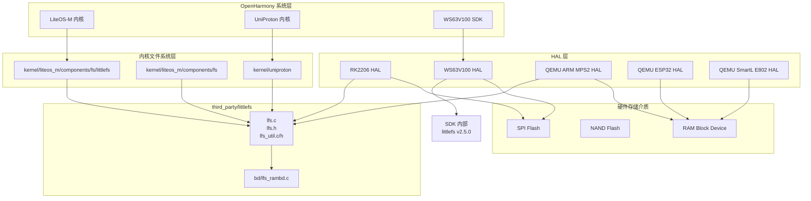
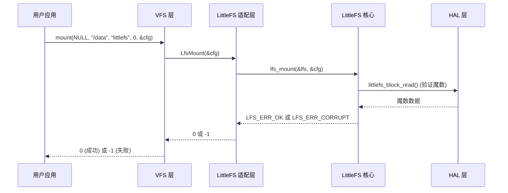

# 依赖关系与使用

> littlefs 在 OpenHarmony 中被多个内核模块和芯片平台深度集成，主要用于嵌入式 MCU 文件系统和 IoT 设备数据持久化。

---

## 直接依赖者列表

### 完整依赖者列表（共 8 个主要模块）

| 序号 | 模块名称 | BUILD.gn 路径 | 依赖方式 | 使用场景 |
|------|---------|--------------|----------|----------|
| 1 | **kernel/liteos_m/components/fs/littlefs** | /oh/kernel/liteos_m/components/fs/littlefs/BUILD.gn | 源码导入 (littlefs.gni) | LiteOS-M 内核 littlefs 文件系统实现 |
| 2 | **kernel/liteos_m/components/fs** | /oh/kernel/liteos_m/components/fs/BUILD.gn | 模块组依赖 | 文件系统模块管理 (vfs/littlefs/fatfs) |
| 3 | **kernel/uniproton** | /oh/kernel/uniproton/BUILD.gn | 源码导入 (littlefs.gni) | UniProton RTOS 文件系统支持 |
| 4 | **device/soc/rockchip/rk2206/adapter/hals/utils/file** | /oh/device/soc/rockchip/rk2206/adapter/hals/utils/file/BUILD.gn | 静态库 + 头文件引用 | RK2206 芯片文件 HAL 层适配 |
| 5 | **device/soc/rockchip/rk2206/hdf_driver/fs** | /oh/device/soc/rockchip/rk2206/hdf_driver/fs/BUILD.gn | 头文件引用 (littlefs.gni) | RK2206 HDF 文件系统驱动 |
| 6 | **device/qemu/arm_mps2_an386/liteos_m/board/fs** | /oh/device/qemu/arm_mps2_an386/liteos_m/board/fs/BUILD.gn | 头文件引用 | QEMU ARM MPS2 模拟器文件系统 |
| 7 | **device/soc/hisilicon/ws63v100/adapter/hals/utils/file** | /oh/device/soc/hisilicon/ws63v100/adapter/hals/utils/file/BUILD.gn | 静态库 (自定义适配层) | 海思 WS63V100 星闪芯片文件适配 |
| 8 | **device/soc/hisilicon/ws63v100/sdk/middleware/chips/ws63/littlefs** | SDK 内部 BUILD | 源码级深度集成 | WS63V100 SDK 内部 littlefs 实现 |

---

## 依赖方式分类统计

| 依赖类型 | 数量 | 说明 |
|---------|------|------|
| **源码导入 (littlefs.gni)** | 3 | 内核级深度集成，直接编译 littlefs 源码 |
| **头文件引用** | 3 | 引用 littlefs 头文件进行适配开发 |
| **静态库依赖** | 2 | 链接 littlefs 功能到 HAL 层 |
| **模块组依赖** | 1 | 作为文件系统子模块管理 |

---

## 典型使用场景

### 场景 1: 嵌入式 MCU 文件系统 (LiteOS-M)

#### 模块信息

**模块名称**: kernel/liteos_m/components/fs/littlefs

**BUILD.gn 路径**: `/oh/kernel/liteos_m/components/fs/littlefs/BUILD.gn`

**依赖方式**: 源码导入 (littlefs.gni)

**使用场景**: 为 LiteOS-M 内核提供标准的文件系统支持，用于 IoT 设备的数据持久化。

#### 实现细节

**适配层文件**:
- `lfs_adapter.c` - VFS 适配层实现
- `lfs_adapter.h` - VFS 适配层头文件
- `lfs_conf.h` - OH 配置参数定义

**VFS 操作映射**:
```c
static const struct MountOps g_lfsMnt = {
    .mount = LfsMount,
    .umount = LfsUmount,
    .statfs = LfsStatfs,
};

static const struct FileOps g_lfsFops = {
    .open = LfsOpen,
    .close = LfsClose,
    .read = LfsRead,
    .write = LfsWrite,
    .lseek = LfsSeek,
    .stat = LfsStat,
    .unlink = LfsUnlink,
    .rename = LfsRename,
    .fsync = LfsFsync,
};

static const struct FsManagementOps g_lfsMgt = {
    .mkdir = LfsMkdir,
    .rmdir = LfsRmdir,
    .opendir = LfsOpendir,
    .closedir = LfsClosedir,
    .readdir = LfsReaddir,
    .rewinddir = LfsRewinddir,
};
```

**使用示例**:
```c
#include "lfs.h"
#include "lfs_adapter.h"

// 挂载 littlefs 文件系统
ret = mount(NULL, "/data", "littlefs", 0, &littlefsConfig);
if (ret != 0) {
    printf("mount littlefs failed: %d\n", ret);
    return -1;
}

// 创建文件
int fd = open("/data/config.txt", O_CREAT | O_WRONLY, 0644);
if (fd >= 0) {
    write(fd, "hello littlefs", 15);
    close(fd);
}

// 读取文件
fd = open("/data/config.txt", O_RDONLY);
if (fd >= 0) {
    char buf[64];
    int len = read(fd, buf, sizeof(buf));
    printf("read: %.*s\n", len, buf);
    close(fd);
}

// 卸载文件系统
ret = umount("/data");
```

---

### 场景 2: 实时操作系统 (UniProton)

#### 模块信息

**模块名称**: kernel/uniproton

**BUILD.gn 路径**: `/oh/kernel/uniproton/BUILD.gn`

**依赖方式**: 源码导入 (littlefs.gni)

**使用场景**: 为 UniProton RTOS 提供文件系统支持，适用于实时性和确定性要求高的场景。

#### 实现细节

**条件编译**:
```gn
if (defined(OS_SUPPORT_FS)) {
  sources += KERNEL_FS_SOURCES + LITTLEFS_SRC_FILES_FOR_KERNEL_MODULE
}
```

**配置开关**: `OS_SUPPORT_FS`

**使用方式**: 与 LiteOS-M 类似，通过 VFS 层接口访问文件系统。

---

### 场景 3: 芯片 SDK 集成 (海思 WS63V100)

#### 模块信息

**模块名称**: device/soc/hisilicon/ws63v100

**BUILD.gn 路径**:
- `/oh/device/soc/hisilicon/ws63v100/adapter/hals/utils/file/BUILD.gn`
- `/oh/device/soc/hisilicon/ws63v100/sdk/middleware/chips/ws63/littlefs/`

**依赖方式**: 静态库 (自定义适配层) + 源码级深度集成

**使用场景**: 海思 WS63V100 星闪芯片 SDK 内置 littlefs，提供基于 SPI Flash 的持久化存储支持。

#### 实现细节

**SDK 内部 littlefs 版本**:
- 路径: `sdk/open_source/littlefs/v2.5.0/`
- 版本: v2.5.0（独立于 third_party/littlefs）

**适配层实现**:
- `littlefs_adapt.c` - SFC (SPI Flash Controller) 适配层
- `littlefs_config.h` - WS63 配置参数

**配置特性**:
- 支持线程安全 (LFS_THREADSAFE)
- 4KB block size
- 基于 SPI Flash 的持久化存储

**使用示例**:
```c
#include "littlefs.h"
#include "littlefs_adapt.h"

// 初始化 littlefs
lfs_t lfs;
const struct lfs_config cfg = {
    .read = ws63_lfs_read,
    .prog = ws63_lfs_prog,
    .erase = ws63_lfs_erase,
    .sync = ws63_lfs_sync,
    .read_size = 256,
    .prog_size = 256,
    .block_size = 4096,
    .block_count = 512,
    .cache_size = 256,
    .lookahead_size = 256,
    .block_cycles = 500,
};

// 挂载文件系统
int err = lfs_mount(&lfs, &cfg);
if (err) {
    lfs_format(&lfs, &cfg);
    lfs_mount(&lfs, &cfg);
}

// 文件操作
lfs_file_t file;
lfs_file_open(&lfs, &file, "config.txt", LFS_O_RDWR | LFS_O_CREAT);
lfs_file_write(&lfs, &file, "hello ws63", 11);
lfs_file_close(&lfs, &file);

// 卸载文件系统
lfs_unmount(&lfs);
```

---

### 场景 4: QEMU 模拟器支持

#### 模块信息

**模块名称**: device/qemu/arm_mps2_an386/liteos_m/board/fs

**BUILD.gn 路径**: `/oh/device/qemu/arm_mps2_an386/liteos_m/board/fs/BUILD.gn`

**依赖方式**: 头文件引用

**使用场景**: QEMU ARM MPS2 AN386 模拟器环境下的文件系统测试与开发。

#### 实现细节

**HAL 层文件**:
- `littlefs_hal.c` - RAM 块设备适配层
- 板级文件: `fs_init.c`

**块设备实现**:
```c
int littlefs_hal_read(const struct lfs_config *c, lfs_block_t block,
                    lfs_off_t off, void *buffer, lfs_size_t size)
{
    uint32_t addr = c->block_size * block + off;
    // 调用 QEMU 模拟器的 RAM 接口
    return FlashRead(addr, buffer, size);
}

int littlefs_hal_prog(const struct lfs_config *c, lfs_block_t block,
                    lfs_off_t off, const void *buffer, lfs_size_t size)
{
    uint32_t addr = c->block_size * block + off;
    // 调用 QEMU 模拟器的 RAM 接口
    return FlashWrite(addr, buffer, size);
}
```

**初始化代码**:
```c
void FsInit(void)
{
    uint32_t addrArray[1];
    uint32_t lengthArray[1];

    // 分区格式化
    LOS_DiskPartition("flash0", "littlefs", lengthArray, addrArray, 1);

    // 挂载文件系统
    mount(NULL, "/data", "littlefs", 0, &fs[0].partCfg);
}
```

---

### 场景 5: HDF 驱动框架适配 (Rockchip RK2206)

#### 模块信息

**模块名称**: device/soc/rockchip/rk2206/hdf_driver/fs

**BUILD.gn 路径**: `/oh/device/soc/rockchip/rk2206/hdf_driver/fs/BUILD.gn`

**依赖方式**: 头文件引用 (littlefs.gni)

**使用场景**: RK2206 芯片的 HDF (Hardware Driver Foundation) 文件系统驱动。

#### 实现细节

**驱动文件**:
- `fs_driver.c` - HDF 文件系统驱动

**挂载代码**:
```c
result = mount(NULL, m_fs_cfg[i].mount_point, "littlefs", 0, &m_fs_cfg[i].lfs_cfg);
```

---

## 依赖关系图

### 整体架构图



### VFS 适配层流程图


### 文件系统挂载流程



---

## 使用方式对比

### 静态链接 vs 动态链接

| 模块 | 链接方式 | 说明 |
|------|----------|------|
| **kernel/liteos_m/components/fs/littlefs** | 静态链接 | 直接编译到内核镜像 |
| **kernel/uniproton** | 静态链接 | 直接编译到内核镜像 |
| **device/soc/rockchip/rk2206/adapter/hals/utils/file** | 静态链接 | 编译到 HAL 层库 |
| **device/soc/hisilicon/ws63v100/sdk/...** | 静态链接 | 编译到 SDK 库 |

### 头文件引用

| 模块 | 头文件 | 说明 |
|------|--------|------|
| **kernel/liteos_m/components/fs/littlefs** | `lfs.h`, `lfs_adapter.h` | 内核内部使用 |
| **kernel/uniproton** | `lfs.h` | 内核内部使用 |
| **device/soc/rockchip/rk2206/hdf_driver/fs** | `lfs.h` | HAL 层适配 |
| **device/qemu/arm_mps2_an386/liteos_m/board/fs** | `lfs.h` | 板级适配 |

---

## 典型使用场景总结

### 1. IoT 设备数据持久化

**场景**: IoT 设备需要保存配置文件、日志和用户数据。

**使用方式**:
- 挂载 littlefs 到 `/data` 或 `/config` 目录
- 使用标准 POSIX API 进行文件操作
- 利用断电恢复特性保证数据完整性

**示例**:
```c
// 保存配置
int fd = open("/data/config.json", O_CREAT | O_WRONLY, 0644);
write(fd, config_json, config_len);
close(fd);

// 保存日志
fd = open("/data/log.txt", O_CREAT | O_WRONLY | O_APPEND, 0644);
write(fd, log_msg, log_len);
close(fd);
```

### 2. 固件更新

**场景**: 设备固件更新时需要保存版本信息和更新状态。

**使用方式**:
- 在 `/firmware` 目录下保存版本号和更新状态
- 使用原子操作保证更新过程的可靠性

**示例**:
```c
// 保存版本信息
lfs_file_t file;
lfs_file_open(&lfs, &file, "/firmware/version", LFS_O_WRONLY | LFS_O_CREAT);
lfs_file_write(&lfs, &file, &version, sizeof(version));
lfs_file_close(&lfs, &file);

// 更新状态
lfs_file_open(&lfs, &file, "/firmware/status", LFS_O_WRONLY | LFS_O_CREAT);
lfs_file_write(&lfs, &file, &status, sizeof(status));
lfs_file_close(&lfs, &file);
```

### 3. 数据采集

**场景**: 传感器数据需要缓存和批量上传。

**使用方式**:
- 定期保存传感器数据到文件
- 批量读取并上传到服务器
- 利用磨损均衡特性延长 Flash 寿命

**示例**:
```c
// 保存传感器数据
char filename[64];
snprintf(filename, sizeof(filename), "/data/sensor_%ld.txt", timestamp);
int fd = open(filename, O_CREAT | O_WRONLY, 0644);
write(fd, sensor_data, data_len);
close(fd);

// 批量上传
DIR *dir = opendir("/data");
struct dirent *entry;
while ((entry = readdir(dir)) != NULL) {
    if (strstr(entry->d_name, "sensor_")) {
        // 上传文件
        upload_to_server(entry->d_name);
    }
}
closedir(dir);
```

### 4. 开发调试

**场景**: QEMU 模拟器环境下进行文件系统测试和开发。

**使用方式**:
- 使用 RAM 块设备进行快速测试
- 无需实际 Flash 硬件
- 方便调试和性能分析

**示例**:
```bash
# 启动 QEMU 模拟器
./start_qemu.sh

# 在模拟器中测试 littlefs
mount(NULL, "/data", "littlefs", 0, &cfg)
# 进行文件操作...
umount("/data")
```

---

## 性能优化建议

### 1. 缓冲区大小优化

根据 Flash 特性和性能需求调整缓存大小：

| 场景 | cache_size | lookahead_size |
|------|-----------|----------------|
| **小容量 Flash** | 16-256 bytes | 16-256 bytes |
| **大容量 Flash** | 256-1024 bytes | 256-1024 bytes |
| **高性能需求** | 1024-4096 bytes | 1024-4096 bytes |

### 2. 磨损均衡优化

调整 `block_cycles` 参数以平衡性能和寿命：

| 场景 | block_cycles |
|------|-------------|
| **高性能优先** | 100-500 |
| **寿命优先** | 500-1000 |
| **平衡模式** | 500 |

### 3. 线程安全优化

根据并发需求启用线程安全：

```gn
# 单线程环境（默认）
config("littlefs_config") {
  defines = [
    "LFS_THREADSAFE=0",
  ]
}

# 多线程环境
config("littlefs_config") {
  defines = [
    "LFS_THREADSAFE=1",
  ]

  # 需要用户提供 lock/unlock 回调
}
```

---

## 调试与测试

### 启用调试日志

```gn
config("littlefs_config") {
  defines = [
    "LFS_YES_TRACE=1",  # 启用详细跟踪日志
    "LFS_DEBUG=1",      # 启用调试日志
  ]
}
```

### QEMU 测试

```bash
# 启动 QEMU 模拟器
./start_qemu.sh

# 在模拟器中运行测试
mount(NULL, "/data", "littlefs", 0, &cfg)
# 进行文件操作...
umount("/data")
```

### 断电恢复测试

```bash
# 在写入过程中强制断电
dd if=/dev/urandom of=/dev/mmcblk0 bs=1M count=10

# 重新挂载验证
mount(NULL, "/data", "littlefs", 0, &cfg)
# 检查数据完整性...
```

---

## 常见问题

### Q1: 如何选择 cache_size？

**A**: 根据性能和内存限制选择：
- **小缓存** (16-256 bytes): 适合内存受限的设备，性能略低
- **大缓存** (256-1024 bytes): 性能更好，但占用更多 RAM

### Q2: 如何启用线程安全？

**A**:
1. 定义 `LFS_THREADSAFE=1`
2. 在 `lfs_config` 中提供 lock/unlock 回调
3. 确保回调函数是线程安全的

### Q3: littlefs 与 FATfs 如何选择？

**A**:
- **littlefs**: 断电恢复、磨损均衡、适合嵌入式设备
- **FATfs**: PC 互操作、适合 SD 卡和外设存储

### Q4: 如何处理 Flash 坏块？

**A**:
littlefs 会自动检测和绕过坏块，无需手动处理。但可通过 `lfs_fs_grow()` 扩展文件系统。

---

## 参考资料

### OH 文档

- [OH 文件系统文档](https://gitee.com/openharmony/docs/blob/master/zh-cn/application-dev/file/README.md)
- [LiteOS-M VFS 文档](https://gitee.com/openharmony/kernel_liteos_m/blob/master/README.md)
- [HDF 驱动框架文档](https://gitee.com/openharmony/docs/blob/master/zh-cn/drivers/README.md)

### 上游文档

- [littlefs 官方文档](https://github.com/littlefs-project/littlefs/blob/master/README.md)
- [DESIGN.md - 设计原理](https://github.com/littlefs-project/littlefs/blob/master/DESIGN.md)

---

**最后更新时间**: 2026-02-08
**上游版本**: v2.11.2
**OH 版本**: 3.1
