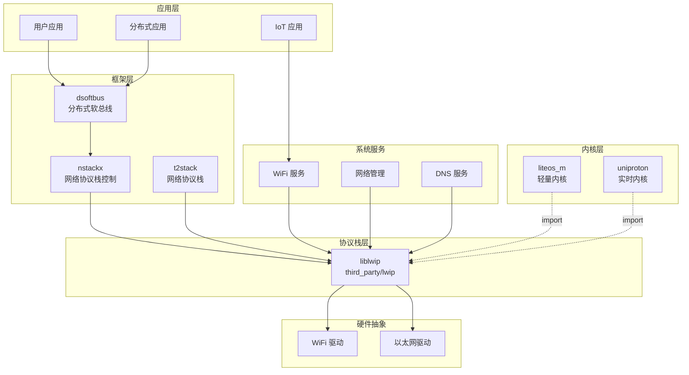

# 依赖关系与使用

## 概述

lwIP 在 OpenHarmony 中作为基础网络协议栈，被多个核心模块依赖。本章分析依赖关系和典型使用场景。

## 依赖者统计

### 核心模块依赖

| 模块 | 路径 | 依赖方式 | 主要用途 |
|------|------|----------|----------|
| **dsoftbus** | foundation/communication/dsoftbus | 头文件 + 链接 | 分布式软总线网络通信 |
| **nstackx** | foundation/communication/dsoftbus/components/nstackx | 头文件 | 网络协议栈控制 |
| **t2stack** | foundation/communication/t2stack | 头文件 | 网络协议栈 |
| **uniproton** | kernel/uniproton | import lwip.gni | 内核网络支持 |
| **liteos_m** | kernel/liteos_m | THIRDPARTY_LWIP_DIR | 轻量级内核网络 |

### 芯片厂商使用

Hisilicon Hi3861 SDK 封装了 lwIP (称为 `lwip_sack`)，广泛用于 Demo 项目：

| Demo 项目 | 用途 |
|-----------|------|
| easy_wifi_demo | WiFi 连接管理 |
| mqtt_demo | MQTT 物联网通信 |
| tcpclient_demo | TCP 客户端 |
| tcpserver_demo | TCP 服务器 |
| udpclient_demo | UDP 客户端 |
| udpserver_demo | UDP 服务器 |
| coap_demo | CoAP 物联网协议 |
| sntp_demo | 网络时间同步 |
| oc_demo | 华为云 IoT 连接 |

## 依赖关系图



## 详细依赖分析

### 1. DSoftBus (分布式软总线)

**路径**: `foundation/communication/dsoftbus`

**使用方式**:
```gn
# adapter/BUILD.gn
include_dirs = [
  "//third_party/lwip/src/include",
]

# 针对 hispark_pegasus 的特殊处理
if (defined(hispark_pegasus_sdk_path)) {
  include_dirs += [
    "$hispark_pegasus_sdk_path/third_party/lwip_sack/include",
  ]
}
```

**使用场景**:
- 分布式设备发现
- 跨设备网络通信
- 软总线数据通道

**依赖关系**:
```
DSoftBus → lwIP (Socket API)
         → lwIP (分布式网络功能)
```

### 2. NStackX

**路径**: `foundation/communication/dsoftbus/components/nstackx/nstackx_ctrl`

**使用方式**:
```gn
# BUILD.gn
include_dirs = [
  "//third_party/lwip/src/include",
]
```

**使用场景**:
- 网络协议栈控制
- 网络状态管理
- 接口配置

### 3. LiteOS Kernel

**路径**: `kernel/liteos_m`

**使用方式**:
```gn
# liteos.gni
THIRDPARTY_LWIP_DIR = "//third_party/lwip"
```

**集成方式**:
- 通过 `lwip.gni` 引用源文件
- 提供 `lwipopts.h` 配置
- 实现 OS 移植层 (`sys_arch.c`)

**使用场景**:
- 内核网络栈
- 设备网络连接
- Socket 系统调用支持

### 4. UniProton

**路径**: `kernel/uniproton`

**使用方式**:
```gn
# BUILD.gn
import("//third_party/lwip/lwip.gni")
```

**使用场景**:
- 实时内核网络支持
- 高可靠性网络通信

## 使用方式分类

### 方式一：链接 liblwip

适用于用户态应用，使用标准 Socket API：

```gn
# BUILD.gn
ohos_executable("my_app") {
  deps = [
    "//third_party/lwip:liblwip",
  ]
}
```

```c
// main.c
#include "lwip/sockets.h"

int main() {
    int sock = lwip_socket(AF_INET, SOCK_STREAM, 0);
    // ... 使用标准 Socket API
}
```

### 方式二：嵌入源文件

适用于内核或需要定制的场景：

```gn
# BUILD.gn
import("//third_party/lwip/lwip.gni")

ohos_static_library("kernel_net") {
  sources = LWIPNOAPPSFILES  # 核心协议栈
  sources += SNMPFILES       # 添加 SNMP
  
  include_dirs = LWIP_INCLUDE_DIRS
}
```

### 方式三：头文件引用

适用于已有网络栈，只需 lwIP 数据结构和常量：

```gn
# BUILD.gn
include_dirs = [
  "//third_party/lwip/src/include",
]
```

## 典型使用场景

### 场景一：IoT 设备网络连接

**设备类型**: Hi3861 WiFi 模组

**软件栈**:
```
应用 (MQTT/CoAP/HTTP)
    ↓
lwip_sack (SDK 封装的 lwIP)
    ↓
WiFi 驱动
    ↓
硬件
```

**特点**:
- 使用轻量级 lwIP 配置
- 启用低功耗模式
- 通常使用裸机或 LiteOS-M

### 场景二：分布式软总线

**设备类型**: 手机、平板、智能屏

**软件栈**:
```
分布式应用
    ↓
DSoftBus
    ↓
lwIP + 分布式网络扩展
    ↓
WiFi/以太网驱动
    ↓
硬件
```

**特点**:
- 启用分布式网络功能
- 可能需要网络容器隔离
- 标准 Linux/Socket API 兼容

### 场景三：网络服务

**设备类型**: 路由器、网关

**软件栈**:
```
网络服务 (DHCP/DNS/NAT)
    ↓
lwIP (启用全部功能)
    ↓
多网卡驱动
    ↓
硬件
```

**特点**:
- 启用 IPv4/IPv6 双栈
- 启用 DHCP 服务器/客户端
- 启用 DNS 代理
- 可能启用 SNMP

## 链接方式

### 静态链接 vs 动态链接

| 方式 | 适用场景 | 优点 | 缺点 |
|------|----------|------|------|
| **动态链接** (liblwip.so) | 用户态应用 | 节省空间、易于升级 | 运行时依赖 |
| **静态链接** | 内核、单应用 | 无依赖、可裁剪 | 二进制增大 |
| **源码嵌入** | 深度定制 | 最大灵活性 | 维护成本高 |

### OH 中的默认方式

- **标准系统**: 动态链接 `liblwip`
- **轻量系统**: 静态链接或源码嵌入
- **内核**: 源码嵌入

## 版本兼容性

### 当前版本

- **上游版本**: STABLE-2_2_1_RELEASE
- **OH 版本**: 3.1

### 兼容性说明

| 使用方式 | 升级影响 |
|----------|----------|
| Socket API | 向后兼容 |
| Netconn API | 向后兼容 |
| Raw API | 向后兼容 |
| OH 特有 API | 需关注变更 |

### 升级建议

1. 应用层代码通常无需修改
2. 检查 OH 特有功能的兼容性
3. 重新编译和测试
