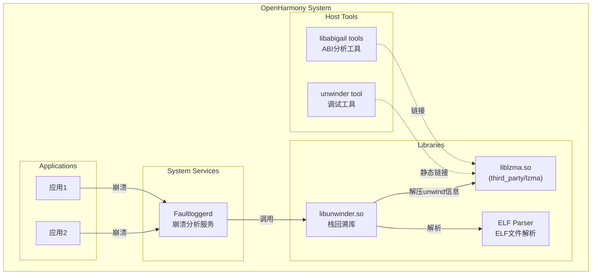
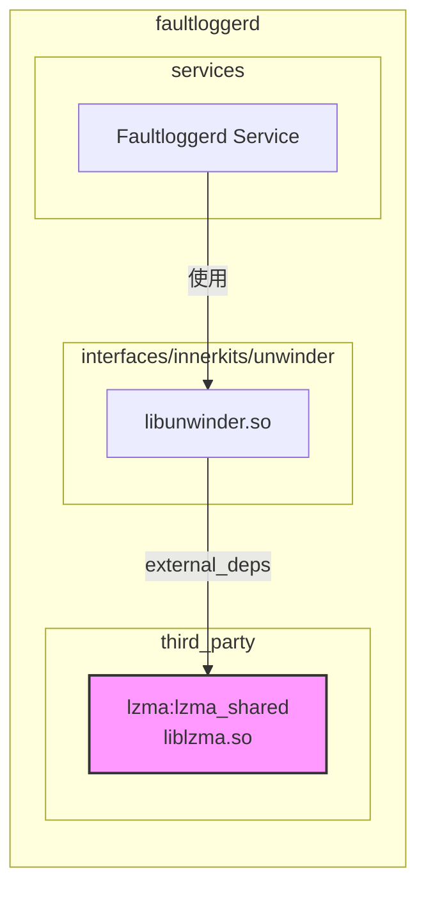
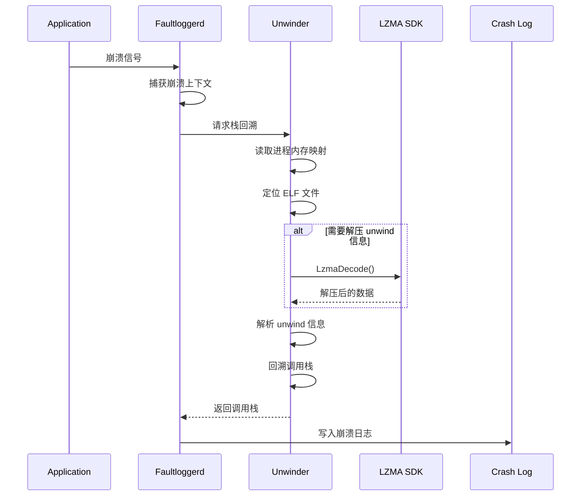

# 04 - 依赖关系与使用场景

## 概览

| 指标 | 数值 |
|------|------|
| 直接依赖者数量 | 5 个模块 |
| 主要使用场景 | ELF unwind 信息解压 |
| 链接方式 | 设备端: 动态链接 / 主机端: 静态链接 |

---

## 依赖者列表

### 直接依赖者

| 序号 | 模块 | BUILD.gn 路径 | 依赖类型 | 用途 |
|-----|------|--------------|----------|------|
| 1 | **faultloggerd/unwinder** | `base/hiviewdfx/faultloggerd/interfaces/innerkits/unwinder/BUILD.gn` | lzma_shared / lzma_static | ELF unwind 信息解压 |
| 2 | unwindstack (benchmark) | `base/hiviewdfx/faultloggerd/test/benchmarktest/unwindstack/BUILD.gn` | liblzma (本地) | 性能测试 |
| 3 | sigdump_handler (test) | `base/hiviewdfx/faultloggerd/test/unittest/sigdump_handler/BUILD.gn` | lzma_shared | 单元测试 |
| 4 | libabigail/tools | `third_party/libabigail/tools/BUILD.gn` | -llzma (系统) | ABI 分析工具 |
| 5 | libtiff | `third_party/libtiff/BUILD.gn` | 条件编译 (当前禁用) | TIFF 压缩 |

### 依赖详情

#### 1. faultloggerd/unwinder (核心依赖者)

**位置**: `base/hiviewdfx/faultloggerd/interfaces/innerkits/unwinder/`

**配置**:
```gn
config("lzma_config") {
  include_dirs = [ "//third_party/lzma/C" ]
}

# 设备端动态链接
ohos_shared_library("libunwinder") {
  configs = [ ":lzma_config" ]
  external_deps += [ "lzma:lzma_shared" ]
}

# 主机端静态链接
ohos_executable("unwinder_tool") {
  configs = [ ":lzma_config" ]
  external_deps += [ "lzma:lzma_static" ]
}
```

**使用代码示例** (典型模式):
```c
#include "LzmaDec.h"

// 解压 ELF 中压缩的 unwind 信息
SRes LzmaUncompress(unwind_info, &destLen, compressed_data, &srcLen) {
  ELzmaStatus status;
  return LzmaDecode(unwind_info, &destLen, 
                    compressed_data, &srcLen,
                    props, LZMA_PROPS_SIZE,
                    LZMA_FINISH_ANY, &status, &g_Alloc);
}
```

#### 2. libabigail/tools

**位置**: `third_party/libabigail/tools/BUILD.gn`

**配置**:
```gn
ldflags = [
  "-llzma",  // 使用系统 lzma 库
]
```

**说明**: 使用系统库而非 OH 的 lzma，用于 ABI 兼容性分析工具。

#### 3. libtiff

**位置**: `third_party/libtiff/BUILD.gn`

**配置**:
```gn
enable_lzma = false  # 当前禁用

if (enable_lzma) {
  all_libtiff_sources += [ "libtiff/tif_lzma.c" ]
  external_deps += [ "lzma:lzma_shared" ]
}
```

**说明**: 支持 TIFF 文件的 LZMA 压缩，当前未启用。

---

## 依赖关系图

### 整体依赖图



### faultloggerd 内部依赖图



### 模块使用场景流程



---

## 典型使用场景

### 场景 1：应用崩溃栈回溯

**触发条件**: 应用发生崩溃 (SIGSEGV, SIGABRT 等)

**执行流程**:

1. **崩溃捕获** (Faultloggerd)
   ```
   应用崩溃
      ↓
   Kernel 发送信号
      ↓
   Faultloggerd 信号处理器
   ```

2. **栈回溯** (Unwinder + LZMA)
   ```
   读取 /proc/pid/maps
      ↓
   定位每个 PC 对应的 ELF 文件
      ↓
   读取 ELF .eh_frame 段
      ↓
   [LZMA 解压] ◄─── 使用 lzma_shared
      ↓
   解析 CFI (Call Frame Information)
      ↓
   计算每个栈帧的寄存器值
      ↓
   生成调用栈
   ```

3. **日志生成**
   ```
   调用栈信息
      ↓
   符号解析 (需要 debug symbols)
      ↓
   写入 /data/log/faultlog/tombstone_xx
   ```

**关键代码路径**:
```
unwinder/src/elf/dfx_elf.cpp
    ↓
读取 ELF 的 .eh_frame_hdr 和 .eh_frame
    ↓
如果压缩，调用 LzmaDecode (来自 lzma:lzma_shared)
    ↓
dwarf_entry_parser.cpp 解析解压后的数据
    ↓
生成回溯结果
```

### 场景 2：离线分析工具 (主机端)

**使用场景**: 开发者在 PC 上分析设备抓取的崩溃日志

**工具链**:
```
unwinder tool (主机端)
    ↓
静态链接 lzma_static
    ↓
解析 tombstone 文件
    ↓
输出人类可读的调用栈
```

**优势**:
- 不依赖设备环境
- 可访问完整符号表
- 支持复杂分析功能

---

## 使用方式详解

### 头文件引用

**推荐方式**:
```gn
# BUILD.gn
config("my_module_lzma_config") {
  include_dirs = [ "//third_party/lzma/C" ]
}

ohos_shared_library("my_module") {
  configs = [ ":my_module_lzma_config" ]
  external_deps += [ "lzma:lzma_shared" ]
}
```

```c
// 源文件
#include "LzmaDec.h"
#include "7zTypes.h"
```

**关键头文件**:
- `LzmaDec.h` - LZMA 解压 API
- `LzmaEnc.h` - LZMA 压缩 API
- `7zTypes.h` - 基础类型定义
- `7z.h` - 7z 格式 API
- `Xz.h` - XZ 格式 API

### 链接方式

#### 设备端 (动态链接)

```gn
external_deps += [ "lzma:lzma_shared" ]
```

- 运行时依赖 `liblzma.so`
- 减小二进制体积
- 共享内存中的库实例
- 便于安全更新

#### 主机端 (静态链接)

```gn
external_deps += [ "lzma:lzma_static" ]
```

- 不依赖外部库
- 独立可执行文件
- 适合分发工具

---

## 性能特征

### 解压性能

| 指标 | 数值 | 说明 |
|------|------|------|
| 解压速度 | 数十 MB/s | 单线程 |
| 内存占用 | ~16KB (state) + dictionary | 解压时 |
| 延迟 | <1ms (典型 unwind 数据) | 满足实时性要求 |

### 崩溃处理时序

```
应用崩溃
    │
    ├── T+0ms: 信号捕获
    │
    ├── T+1ms: 读取内存映射
    │
    ├── T+2ms: 读取 ELF 文件头
    │
    ├── T+3ms: [LZMA 解压 unwind 信息] (约 0.5ms)
    │
    ├── T+5ms: 解析 CFI
    │
    ├── T+10ms: 完成栈回溯
    │
    └── T+20ms: 写入日志
```

**结论**: LZMA 解压时间在崩溃处理中占比很小，不影响实时性。

---

## 与其他压缩库对比

在 faultloggerd 中的选择：

| 特性 | LZMA | zlib | zstd |
|------|------|------|------|
| 压缩比 | ⭐⭐⭐ 最高 | ⭐⭐ 中等 | ⭐⭐⭐ 高 |
| 解压速度 | ⭐⭐⭐ 快 | ⭐⭐⭐ 快 | ⭐⭐⭐ 很快 |
| 内存占用 | ⭐⭐⭐ 低 | ⭐⭐⭐ 低 | ⭐⭐⭐ 低 |
| 压缩速度 | ⭐⭐ 慢 | ⭐⭐⭐ 快 | ⭐⭐⭐ 很快 |
| ELF 工具链支持 | ⭐⭐⭐ 原生 | ⭐⭐ 需配置 | ⭐ 不常用 |
| 许可证 | ⭐⭐⭐ Public Domain | ⭐⭐⭐ zlib | ⭐⭐⭐ BSD/GPL |

**选择 LZMA 的原因**:
1. 压缩比最高 → ELF 文件最小
2. ELF 工具链原生支持 `.eh_frame` 压缩
3. Public Domain → 无合规顾虑

---

## 依赖影响分析

### 如果 lzma 需要升级

**影响范围**:
- ✅ faultloggerd/unwinder - 需要测试
- ⚠️ libabigail/tools - 使用系统库，不受影响
- ⚠️ libtiff - 未启用，无影响

**测试建议**:
1. 生成崩溃，验证栈回溯正确性
2. 测试不同架构 (ARM/ARM64/RISC-V)
3. 验证性能无退化

### 如果 lzma 需要移除

**替代方案**:
- 使用 zlib 替代 → 需要修改 ELF 生成工具链
- 禁用 unwind 压缩 → ELF 文件增大
- 使用 zstd → 需要 GCC/LLVM 支持

**影响评估**: 高 - 影响系统核心崩溃分析功能

---

*最后更新: 2025-02-08*
