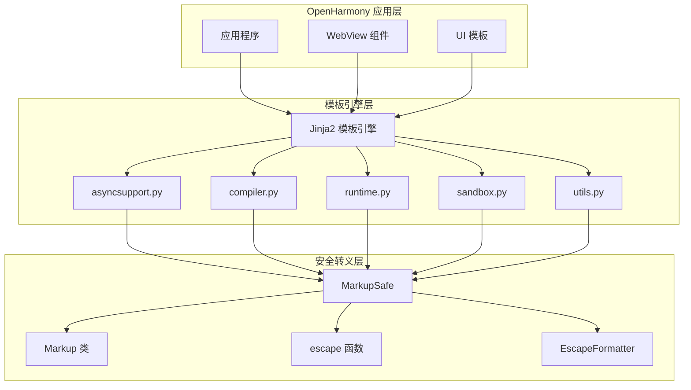

# 依赖关系与使用

## 4.1 依赖概览

### 4.1.1 上游依赖

MarkupSafe 自身不依赖任何第三方库，仅使用 Python 标准库：

| 依赖类型 | 依赖项 | 用途 |
|----------|--------|------|
| 标准库 | functools | 函数装饰器 |
| 标准库 | string | 字符串格式化 |
| 标准库 | sys | 系统交互 |
| 标准库 | typing | 类型注解 |
| 可选扩展 | _speedups.c | 性能优化 |

### 4.1.2 下游依赖（OH 侧）

```
markupsafe
    │
    └──→ jinja2（模板引擎）
            │
            └──→ OpenHarmony 模板渲染系统
                    │
                    └──→ 应用程序和 UI 组件
```

## 4.2 直接依赖者

### Jinja2 模板引擎

Jinja2 是 MarkupSafe 在 OpenHarmony 中的**唯一直接依赖者**。

| 属性 | 值 |
|------|-----|
| **组件名** | jinja2 |
| **路径** | third_party/jinja2 |
| **用途** | Python 模板引擎 |
| **依赖类型** | 静态导入 |

### Jinja2 中的引用统计

通过代码搜索发现，Jinja2 在以下模块中引用了 MarkupSafe：

| 文件 | 行数 | 导入内容 | 使用场景 |
|------|------|----------|----------|
| asyncsupport.py | 1 | `Markup` | 异步模板支持 |
| compiler.py | 2 | `escape`, `Markup` | 模板编译 |
| runtime.py | 3 | `escape`, `Markup`, `soft_str` | 运行时渲染 |
| sandbox.py | 1 | `EscapeFormatter` | 沙箱安全 |
| utils.py | 6 | `markupsafe` 模块 | 工具函数 |
| environment.py | 1 | `Markup` | 环境配置 |
| nodes.py | 1 | `Markup` | AST 节点 |
| filters.py | 1 | `escape` | 内置过滤器 |

**总计**：16 处直接引用，涵盖 Jinja2 的核心功能模块。

## 4.3 使用方式详解

### 4.3.1 静态链接方式

MarkupSafe 通过 Python 的**静态导入**被 Jinja2 使用：

```python
# 直接导入模块
import markupsafe

# 导入具体符号
from markupsafe import Markup, escape, soft_str

# 导入特定类
from markupsafe import EscapeFormatter
```

这种静态导入方式意味着 MarkupSafe 在 Python 运行时已经被加载到内存中。

### 4.3.2 核心使用场景

**场景一：模板变量转义**

```python
# Jinja2 runtime.py
def eval_context_attribute():
    # 自动转义用户输入
    escaped = escape(user_input)
    return Markup(escaped)
```

**场景二：HTML 标签安全标记**

```python
# Jinja2 compiler.py
def visit_Text(node):
    # 标记安全的静态文本
    return Markup(node.data)
```

**场景三：格式化字符串**

```python
# Jinja2 sandbox.py
def format_string(template, args):
    formatter = EscapeFormatter(escape)
    return formatter.format(template, args)
```

**场景四：字符串连接**

```python
# Jinja2 utils.py
def generate_html(parts):
    # 使用 Markup.join 确保连接安全
    return Markup('').join(parts)
```

## 4.4 依赖关系图

### Mermaid 依赖图



### 依赖统计

| 依赖层级 | 组件数量 | 说明 |
|----------|----------|------|
| 上游依赖 | 0 | 无第三方依赖 |
| 同级依赖 | 0 | 无同级依赖 |
| 下游依赖 | 1 | 仅 Jinja2 |

## 4.5 集成路径

### 4.5.1 模板渲染路径

```
用户输入
    │
    ▼
┌─────────────┐
│ Jinja2 模板  │
└─────────────┘
    │
    ▼
┌─────────────┐
│ MarkupSafe   │  ←── 转义检查
│ escape()     │
└─────────────┘
    │
    ▼
安全输出 → 渲染到 UI
```

### 4.5.2 安全检查点

MarkupSafe 在以下位置提供安全保障：

| 检查点 | 位置 | 操作 |
|--------|------|------|
| 变量渲染 | runtime.py | 自动转义 |
| 过滤器 | filters.py | 参数转义 |
| 字符串操作 | utils.py | 连接转义 |
| 格式化 | sandbox.py | 参数格式化转义 |

## 4.6 使用最佳实践

### 4.6.1 正确使用方式

**始终使用 escape 处理用户输入**

```python
from markupsafe import escape

# 正确：转义用户输入
user_name = escape(request.user_input)
```

**使用 Markup 标记可信内容**

```python
from markupsafe import Markup

# 正确：标记已知安全的 HTML
trusted_html = Markup("<b>Bold text</b>")
```

**避免混用未转义内容**

```python
# 错误：不安全的方式
html = "<b>" + user_input + "</b>"  # XSS 风险！

# 正确：使用 Markup
html = Markup("<b>{}</b>").format(user_input)
```

### 4.6.2 性能优化建议

| 场景 | 建议 |
|------|------|
| 高频转义 | 确保 C 扩展可用 |
| 大文本 | 考虑分块处理 |
| 批量渲染 | 复用 Template 对象 |

## 4.7 故障排查

### 常见问题

**问题一：C 扩展不可用**

症状：转义性能低于预期  
排查：`python3 -c "from markupsafe._speedups import escape"`  
解决：安装带编译环境的 Python

**问题二：Jinja2 导入错误**

症状：`ImportError: cannot import name 'Markup'`  
排查：检查 markupsafe 是否正确安装  
解决：确保 Jinja2 和 MarkupSafe 版本兼容

**问题三：转义不生效**

症状：HTML 被原样输出  
排查：检查是否误用了 Markup 而不是 escape  
解决：对用户输入使用 escape()

## 4.8 未来演进

### 潜在的依赖变更

- MarkupSafe 版本升级
- Jinja2 对 MarkupSafe API 的使用变化
- OpenHarmony Python 运行时的演进
