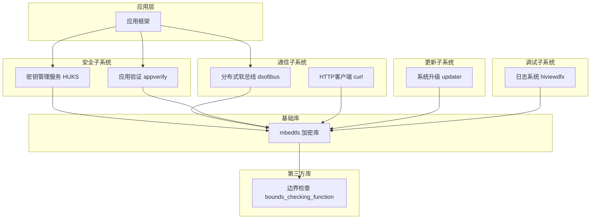
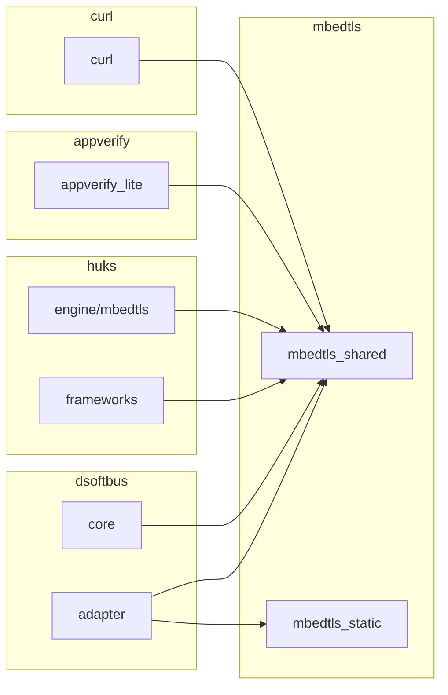

# OpenHarmony 使用场景与依赖关系

## 依赖关系概览

### 直接依赖模块

mbedtls 作为 OpenHarmony 的核心加密基础设施，被以下模块直接依赖：

| 模块 | 路径 | 依赖方式 | 主要用途 |
|------|------|----------|----------|
| **dsoftbus** | `foundation/communication/dsoftbus/` | 共享库 | 分布式软总线 TLS 加密 |
| **huks** | `base/security/huks/` | 静态/共享库 | 密钥管理加密操作 |
| **appverify_lite** | `base/security/appverify/` | 共享库 | 应用证书验证 |
| **curl** | `third_party/curl/` | 共享库 | HTTPS 客户端 |
| **hiviewdfx** | `build/lite/config/subsystem/hiviewdfx/` | 静态库 | 安全日志记录 |
| **sys_installer_lite** | `base/update/` | 静态库 | 系统升级加密 |
| **device_attest_lite** | `test/xts/device_attest_lite/` | 静态/共享库 | 设备认证 |

## 核心使用场景

### 场景 1：分布式软总线通信 (dsoftbus)

#### 用途

dsoftbus (Distributed Softbus) 是 OpenHarmony 的分布式通信框架，mbedtls 为其提供 **TLS/DTLS 加密通信** 能力。

#### 依赖配置

```gn
# foundation/communication/dsoftbus/adapter/BUILD.gn
deps += [ "//third_party/mbedtls" ]
# 或
external_deps += [ "//third_party/mbedtls" ]
```

#### 典型使用

```c
#include "mbedtls/ssl.h"
#include "mbedtls/entropy.h"
#include "mbedtls/ctr_drbg.h"

// TLS 连接建立
mbedtls_ssl_context ssl;
mbedtls_ssl_config conf;
mbedtls_entropy_context entropy;
mbedtls_ctr_drbg_context ctr_drbg;

// 加密数据传输
mbedtls_ssl_write(&ssl, data, len);
mbedtls_ssl_read(&ssl, buffer, size);
```

#### 安全要求

- 支持 TLS 1.2/TLS 1.3
- 证书验证
- 加密套件协商

### 场景 2：密钥管理服务 (HUKS)

#### 用途

HUKS (Huawei Universal KeyStore) 是 OpenHarmony 的密钥管理服务，mbedtls 为其提供 **底层加密算法实现**。

#### 依赖配置

```gn
# base/security/huks/frameworks/huks_standard/main/crypto_engine/mbedtls/BUILD.gn
deps += [ "//third_party/mbedtls" ]
# 或
deps += [ "//third_party/mbedtls:mbedtls_shared" ]
```

#### 加密操作

```c
#include "mbedtls/aes.h"
#include "mbedtls/rsa.h"
#include "mbedtls/cipher.h"
#include "mbedtls/ecp.h"

// AES 加密
mbedtls_cipher_context_t ctx;
mbedtls_cipher_setup(&ctx, ...);
mbedtls_cipher_encrypt(...);

// RSA 签名
mbedtls_rsa_context rsa;
mbedtls_rsa_init(&rsa);
mbedtls_rsa_sign(...);

// ECC 密钥生成
mbedtls_ecp_group_id grp_id = MBEDTLS_ECP_DP_SECP256R1;
mbedtls_ecp_keypair keypair;
mbedtls_ecp_gen_key(grp_id, &keypair, ...);
```

#### PSA API 使用

```c
#include "psa/crypto.h"

// PSA 初始化
psa_crypto_init();

// 密钥生成
psa_key_attributes_t attributes = PSA_KEY_ATTRIBUTES_INIT;
psa_set_key_usage_flags(&attributes, PSA_KEY_USAGE_SIGN_HASH);
psa_set_key_algorithm(&attributes, PSA_ALG_ECDSA_ANY);
psa_set_key_type(&attributes, PSA_KEY_TYPE_ECC_KEY_PAIR(PSA_ECC_FAMILY_SECP_R1));
psa_set_key_bits(&attributes, 256);

psa_key_id_t key_id;
psa_generate_key(&attributes, &key_id);
```

### 场景 3：应用验证 (appverify_lite)

#### 用途

appverify_lite 负责验证应用签名和证书，mbedtls 提供 **X.509 证书解析与验证** 能力。

#### 依赖配置

```gn
# base/security/appverify/interfaces/innerkits/appverify_lite/BUILD.gn
external_deps += [ "//third_party/mbedtls:mbedtls_shared" ]
```

#### 证书操作

```c
#include "mbedtls/x509_crt.h"
#include "mbedtls/error.h"

mbedtls_x509_crt cacert;
mbedtls_x509_crt_init(&cacert);

// 解析证书
int ret = mbedtls_x509_crt_parse(&cacert, cert_data, cert_len);
if (ret != 0) {
    // 错误处理
    char error_buf[256];
    mbedtls_strerror(ret, error_buf, sizeof(error_buf));
}

// 验证证书链
ret = mbedtls_x509_crt_verify(&cacert, &cacert, NULL, NULL, &flags, NULL, NULL);
```

### 场景 4：HTTPS 客户端 (curl)

#### 用途

curl 模块提供 HTTP/HTTPS 客户端功能，mbedtls 作为 **TLS 后端** 提供加密能力。

#### 依赖配置

```gn
# third_party/curl/BUILD.gn
deps = [ "//third_party/mbedtls" ]
```

#### HTTPS 请求

```c
#include <curl/curl.h>

CURL *curl = curl_easy_init();
if (curl) {
    curl_easy_setopt(curl, CURLOPT_URL, "https://example.com");
    curl_easy_setopt(curl, CURLOPT_SSL_VERIFYPEER, 1L);
    curl_easy_setopt(curl, CURLOPT_SSL_VERIFYHOST, 2L);
    
    CURLcode res = curl_easy_perform(curl);
    curl_easy_cleanup(curl);
}
```

### 场景 5：系统升级 (sys_installer_lite)

#### 用途

sys_installer_lite 负责系统 OTA 升级，mbedtls 提供 **升级包完整性验证** 和 **安全传输**。

#### 依赖配置

```gn
# base/update/sys_installer_lite/frameworks/source/BUILD.gn
external_deps += [ "//third_party/mbedtls:libsec_static" ]
```

#### 安全验证

```c
#include "mbedtls/sha256.h"
#include "mbedtls/pk.h"

// SHA256 哈希计算
mbedtls_sha256_context sha_ctx;
mbedtls_sha256_init(&sha_ctx);
mbedtls_sha256_starts(&sha_ctx, 0);
mbedtls_sha256_update(&sha_ctx, data, data_len);
mbedtls_sha256_finish(&sha_ctx, hash);

// RSA 签名验证
mbedtls_pk_context pk;
mbedtls_pk_init(&pk);
mbedtls_pk_parse_public_key(&pk, pubkey, pubkey_len);
int ret = mbedtls_pk_verify(&pk, MBEDTLS_MD_SHA256, hash, hash_len, signature, sig_len);
```

## 依赖关系图

### 系统依赖架构



### 详细依赖关系



## 使用最佳实践

### 1. 头文件包含

```c
// 推荐：使用完整路径
#include "mbedtls/ssl.h"
#include "mbedtls/x509_crt.h"
#include "mbedtls/cipher.h"

// 不推荐：使用相对路径
#include "../third_party/mbedtls/include/mbedtls/ssl.h"
```

### 2. 库链接选择

| 场景 | 推荐库 | 原因 |
|------|--------|------|
| 常规应用 | `mbedtls_shared` | 减少代码体积 |
| 静态链接 | `mbedtls_static` | 独立部署 |
| 资源受限设备 | `mbedtls_static` | 避免共享库开销 |
| NDK 开发 | `mbedtls_ndk` | 标准 NDK 接口 |

### 3. 错误处理

```c
#include "mbedtls/error.h"

char error_buf[256];
mbedtls_strerror(ret, error_buf, sizeof(error_buf));
// 使用 error_buf 进行日志记录
```

### 4. 内存管理

```c
// 初始化
mbedtls_xxx_context ctx;
mbedtls_xxx_init(&ctx);

// 使用
mbedtls_xxx_setup(&ctx, ...);

// 清理
mbedtls_xxx_free(&ctx);
```

## 常见问题

### Q1: 应该使用静态库还是共享库？

**答**: 
- **共享库**: 节省内存，便于安全更新
- **静态库**: 减少依赖，启动更快
- **建议**: 优先使用共享库，除非有特殊需求

### Q2: 如何验证证书链？

**答**: 使用 `mbedtls_x509_crt_verify()` 函数：

```c
mbedtls_x509_crt_verify(&crt, &ca_crt, &crl, &trusted_certs, &flags, NULL, NULL);
```

### Q3: 如何启用 TLS 1.3？

**答**: mbedtls v3.6.5 原生支持 TLS 1.3，在配置文件中启用：

```c
#define MBEDTLS_SSL_TLS1_3_COMPATIBILITY_MODE
#define MBEDTLS_SSL_TLS1_3_KEY_EXCHANGE_MODE_PSK_ENABLED
```

### Q4: 如何减少代码体积？

**答**: 使用轻量级配置文件 (`config_liteos_m.h`) 或在配置文件中禁用不需要的功能。

## 相关文档

- [mbedtls 官方文档](https://mbed-tls.readthedocs.io/)
- [PSA 加密 API 文档](https://arm-software.github.io/psa-api/crypto/)
- [OpenHarmony 安全框架](../security/README.md)
