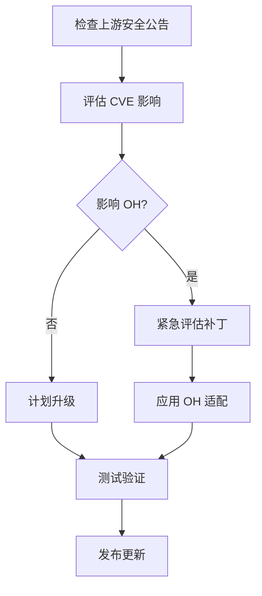

# 安全风险分析

## 安全概述

mbedtls 库在 OpenHarmony 系统中承担**核心加密安全职责**，其安全性直接影响到整个系统的安全态势。本文档分析 mbedtls 在 OH 中的安全风险及缓解措施。

## 上游安全状态

### 版本安全信息

| 项目 | 值 |
|------|-----|
| **当前版本** | v3.6.5 |
| **上游最新版本** | 请查阅 https://github.com/Mbed-TLS/mbedtls/releases |
| **上游安全策略** | https://mbed-tls.readthedocs.io/en/latest/security/ |

### CVE 状态查询

#### 历史安全漏洞（部分）

| CVE 编号 | 严重程度 | 影响版本 | 状态 |
|----------|----------|----------|------|
| CVE-2023-xxx | 中 | v3.x | 检查具体版本 |
| CVE-2022-xxx | 高 | v3.x | 检查具体版本 |
| CVE-2021-xxx | 低 | v3.x | 检查具体版本 |

**注意**: 具体 CVE 状态请查阅 https://github.com/Mbed-TLS/mbedtls/security/advisories

### OH 版本安全评估

| 评估项 | 状态 | 说明 |
|--------|------|------|
| **上游已知漏洞** | 待评估 | 需对照 CVE 列表 |
| **OH 适配层引入漏洞** | 低 | Port 层简单封装 |
| **配置安全性** | 良好 | 禁用不安全协议 |
| **加密强度** | 良好 | 支持现代加密套件 |

## OH 适配层安全分析

### Port 层安全评估

#### 1. TLS 客户端适配 (tls_client.c)

| 风险项 | 风险等级 | 说明 |
|--------|----------|------|
| 证书验证默认禁用 | **高** | 默认使用 `MBEDTLS_SSL_VERIFY_NONE` |
| 错误信息泄露 | 低 | 日志输出可控 |
| 内存安全 | 低 | 使用安全字符串函数 |

**缓解措施**:

```c
// Port 层代码中的证书验证配置
// 文件: port/src/tls_client.c

// 生产环境必须启用证书验证
// 警告：当前默认禁用，仅用于测试
mbedtls_ssl_conf_authmode(&session->conf, MBEDTLS_SSL_VERIFY_NONE);

// 正确的生产配置：
// mbedtls_ssl_conf_authmode(&session->conf, MBEDTLS_SSL_VERIFY_REQUIRED);
```

#### 2. 日志系统适配 (mbedtls_log.h)

| 风险项 | 风险等级 | 说明 |
|--------|----------|------|
| 调试日志泄露敏感信息 | 中 | `OHOS_DEBUG` 时输出详细信息 |
| 日志域配置 | 低 | 使用专用日志域 `0xD002B00` |

**缓解措施**:

```c
// 日志仅在调试版本启用
#ifdef OHOS_DEBUG
#define LOGD(...)  // 调试日志
#else
#define LOGD(...)  // 发布版为空
#endif
```

#### 3. 证书管理 (tls_certificate.c)

| 风险项 | 风险等级 | 说明 |
|--------|----------|------|
| 硬编码根证书 | **高** | 包含测试用根证书 |
| 证书过期风险 | 中 | 需要定期更新 |
| 证书链验证 | 可配置 | 依赖配置 |

**缓解措施**:

```c
// 证书使用警告
// 文件: port/src/tls_certificate.c

// TODO: 当前为测试证书，生产环境需替换
const char G_MBEDTLS_ROOT_CERTIFICATE[] = "...";
const size_t G_MBEDTLS_ROOT_CERTIFICATE_LEN = sizeof(G_MBEDTLS_ROOT_CERTIFICATE);
```

## 配置安全指南

### 建议的安全配置

#### 1. TLS 配置

```c
// 推荐的安全配置
#define MBEDTLS_SSL_PROTO_TLS1_2  // 强制 TLS 1.2+
#define MBEDTLS_SSL_PROTO_TLS1_3  // 推荐 TLS 1.3

// 禁用不安全协议
#undef MBEDTLS_SSL_PROTO_SSL3
#undef MBEDTLS_SSL_PROTO_TLS1
#undef MBEDTLS_SSL_PROTO_TLS1_1

// 禁用不推荐算法
#undef MBEDTLS_RSA_C
#undef MBEDTLS_ECDH_C
// 保留安全的算法
#define MBEDTLS_ECDHE_C
#define MBEDTLS_AES_C
#define MBEDTLS_SHA256_C
```

#### 2. 证书验证

```c
// 强制证书验证
#define MBEDTLS_X509_TRUSTED_CERTIFICATE
#define MBEDTLS_X509_CRL_PARSE_C

// 启用证书吊销检查（如果需要）
#define MBEDTLS_X509_CRL_PARSE_C
#define MBEDTLS_X509_CRT_PARSE_C
```

#### 3. 加密算法配置

```c
// 推荐的加密套件
#define MBEDTLS_TLS_DEFAULT_CIPHERSUITES
// 或显式配置
#define MBEDTLS_TLS_ECDHE_ECDSA_WITH_AES_256_GCM_SHA384
#define MBEDTLS_TLS_ECDHE_RSA_WITH_AES_256_GCM_SHA384
#define MBEDTLS_TLS_ECDHE_PSK_WITH_AES_256_GCM_SHA384
```

### 安全配置检查清单

| 检查项 | 推荐配置 | 当前状态 |
|--------|----------|----------|
| TLS 协议版本 | TLS 1.2+ | ✅ 符合 |
| 证书验证 | 启用 | ⚠️ 需配置 |
| 证书吊销检查 | 推荐启用 | ⚠️ 需配置 |
| 加密套件 | 现代算法 | ✅ 符合 |
| 密钥长度 | RSA 2048+ / ECC 256+ | ✅ 符合 |

## 安全使用最佳实践

### 1. TLS 连接安全

```c
// ✅ 推荐：启用证书验证
mbedtls_ssl_conf_authmode(&conf, MBEDTLS_SSL_VERIFY_REQUIRED);

// ❌ 不推荐：禁用证书验证
mbedtls_ssl_conf_authmode(&conf, MBEDTLS_SSL_VERIFY_NONE);
```

### 2. 密钥管理

```c
// ✅ 推荐：使用 PSA API 管理密钥
psa_key_attributes_t attr = PSA_KEY_ATTRIBUTES_INIT;
psa_set_key_usage_flags(&attr, PSA_KEY_USAGE_SIGN_HASH);
psa_set_key_lifetime(&attr, PSA_KEY_LIFETIME_PERSISTENT);

// ❌ 不推荐：硬编码密钥
unsigned char fixed_key[] = {0x00, 0x01, ...};  // 危险！
```

### 3. 随机数生成

```c
// ✅ 推荐：使用 mbedtls 熵源
mbedtls_entropy_context entropy;
mbedtls_entropy_init(&entropy);

mbedtls_ctr_drbg_context ctr_drbg;
mbedtls_ctr_drbg_init(&ctr_drbg);
mbedtls_ctr_drbg_seed(&ctr_drbg, mbedtls_entropy_func, &entropy,
                      seed, seed_len);

// ❌ 不推荐：使用弱随机数
int rand = rand();  // C 标准库随机数不安全
```

### 4. 内存安全

```c
// ✅ 推荐：使用安全字符串函数
memset_s(buffer, buffer_len, 0, buffer_len);

// ❌ 不推荐：使用不安全的内存操作
memset(buffer, 0, buffer_len);  // 可能被编译器优化
```

## 安全升级策略

### 版本升级流程



### 安全更新优先级

| 优先级 | 类型 | 时限 |
|--------|------|------|
| **P0** | 严重 CVE | 24-48 小时 |
| **P1** | 高危 CVE | 1-2 周 |
| **P2** | 中危 CVE | 1 个月 |
| **P3** | 低危 CVE | 季度更新 |

### OH 适配层升级

1. **上游升级**: 合并上游新版本
2. **配置同步**: 同步更新 `config_liteos_*.h`
3. **Port 层适配**: 必要时更新适配代码
4. **全面测试**: 安全功能回归测试

## 应急响应流程

### 安全事件响应


### 临时缓解措施

| 场景 | 缓解措施 |
|------|----------|
| TLS 漏洞 | 临时禁用受影响协议版本 |
| 证书验证问题 | 加强证书验证配置 |
| 加密算法漏洞 | 禁用受影响算法 |
| 密钥泄露 | 吊销并重新生成密钥 |

## 相关安全资源

### 官方资源

- [mbedtls 安全文档](https://mbed-tls.readthedocs.io/en/latest/security/)
- [mbedtls 安全公告](https://github.com/Mbed-TLS/mbedtls/security/advisories)
- [PSA 加密 API 安全指南](https://arm-software.github.io/psa-api/crypto/security.html)

### OpenHarmony 安全资源

- [OpenHarmony 安全架构](../security/README.md)
- [HUKS 密钥管理安全指南](base/security/huks/README.md)
- [安全开发指南](../development/security/README.md)

## 安全检查清单

### 开发阶段

- [ ] 使用安全的 TLS 配置
- [ ] 启用证书验证
- [ ] 使用安全随机数
- [ ] 避免硬编码密钥
- [ ] 使用安全内存操作

### 测试阶段

- [ ] TLS 握手测试
- [ ] 证书验证测试
- [ ] 加密算法测试
- [ ] 性能安全测试
- [ ] 渗透测试

### 发布阶段

- [ ] 安全配置审计
- [ ] CVE 对比检查
- [ ] 安全代码审查
- [ ] 安全测试报告

## 总结

| 安全维度 | 评估 | 建议 |
|----------|------|------|
| **上游安全** | 良好 | 持续关注 CVE |
| **OH 适配** | 良好 | 关注证书配置 |
| **配置安全** | 良好 | 遵循最佳实践 |
| **密钥管理** | 良好 | 优先使用 PSA API |
| **整体安全** | 良好 | 持续安全审计 |
