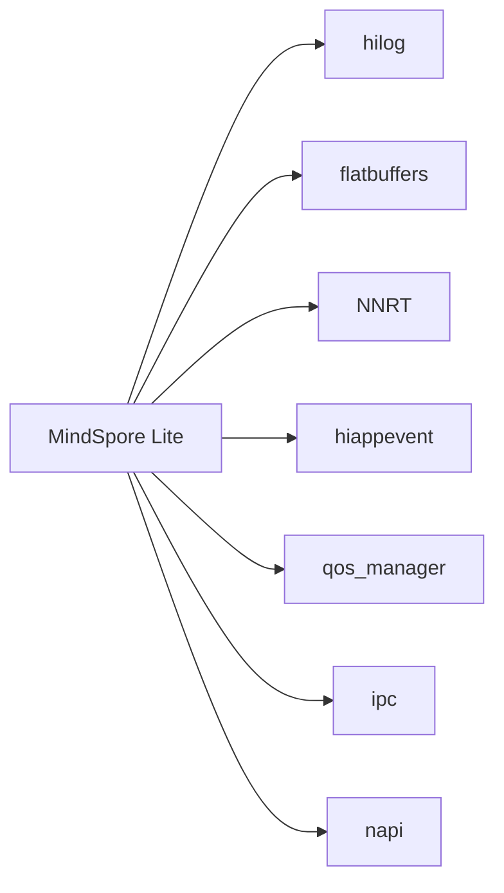

# MindSpore 库概览

## 原始库信息

| 字段 | 值 |
|------|-----|
| **库名称** | MindSpore Lite |
| **上游版本** | v2.7.0 |
| **OH 版本** | 3.1 |
| **许可证** | Apache License 2.0 |
| **上游地址** | https://gitee.com/mindspore/mindspore-lite |
| **维护者** | chengfeng27@huawei.com |

## 原始功能描述

MindSpore Lite 是华为开源的轻量级深度学习推理框架，主要特性包括：

### 核心能力

- **自动微分**: 基于源码转换的自动微分技术，支持动态图和静态图
- **自动并行**: 数据并行、模型并行、混合并行的自动策略选择
- **端到端优化**: 从模型训练到部署的全流程优化
- **多硬件支持**: Ascend、GPU、CPU 等多种硬件后端

### 架构设计

```
┌─────────────────────────────────────────────────────────┐
│                    MindSpore Lite                        │
├─────────────────────────────────────────────────────────┤
│  ┌─────────────┐  ┌─────────────┐  ┌─────────────────┐   │
│  │  C++ API    │  │  C API      │  │  Python API     │   │
│  └──────┬──────┘  └──────┬──────┘  └────────┬────────┘   │
│         │                 │                   │            │
│  ┌──────┴─────────────────┴───────────────────┴────────┐   │
│  │                    Runtime Core                     │   │
│  ├─────────────────────────────────────────────────────┤   │
│  │  ┌──────────┐  ┌──────────┐  ┌──────────────────┐   │   │
│  │  │ NNACL    │  │ MindIR   │  │  Delegate        │   │   │
│  │  │ Kernel   │  │ Parser   │  │  (NNRT, etc.)   │   │   │
│  │  └──────────┘  └──────────┘  └──────────────────┘   │   │
│  └─────────────────────────────────────────────────────┘   │
└─────────────────────────────────────────────────────────┘
```

## 在 OpenHarmony 中的定位

### 系统角色

MindSpore Lite 是 OpenHarmony **AI 子系统**的核心推理框架：

```
OpenHarmony AI 子系统
┌─────────────────────────────────────────────────┐
│                                                 │
│  ┌──────────────────┐      ┌──────────────────┐ │
│  │  AI Framework    │ ←──→ │  MindSpore Lite  │ │
│  │  (应用层 API)    │      │  (推理引擎)      │ │
│  └──────────────────┘      └────────┬─────────┘ │
│                                   │            │
│  ┌──────────────────┐      ┌──────┴──────────┐ │
│  │ Neural Network   │ ←──→ │  Hardware       │ │
│  │ Runtime (NNRT)   │      │  (CPU/NPU/HID)  │ │
│  └──────────────────┘      └─────────────────┘ │
│                                                 │
└─────────────────────────────────────────────────┘
```

### 功能定位

| 功能 | 在 OH 中的作用 |
|------|----------------|
| **模型推理** | 为 OH 设备提供 AI 推理能力 |
| **模型格式支持** | MindIR 作为 OH AI 模型的标准格式 |
| **NNRT 集成** | 支持 Neural Network Runtime 硬件加速 |
| **NDK API** | 供第三方应用调用的原生接口 |

### 系统能力声明

```json
"syscap": [
  "SystemCapability.Ai.MindSpore",
  "SystemCapability.AI.MindSporeLite"
]
```

## OH 特定适配

### 构建系统适配

从上游 CMake 迁移到 OH GN 构建系统：

| 上游配置 | OH 适配 |
|----------|---------|
| CMake | GN (BUILD.gn) |
| GLOG | hilog |
| Android NDK | OH NDK |
| 无 | Android 标志禁用 |

### 核心适配模块

| 模块 | 适配内容 |
|------|----------|
| **日志系统** | GLOG → hilog |
| **事件系统** | 新增 HI App Event 集成 |
| **NNRT 委托** | 新增 NNRT Delegate 支持 |
| **接口绑定** | 新增 Taihe/ANI (Ark Native Interface) |
| **N-API** | ArkTS/JS 接口支持 |

### 新增 OH 特定文件

```
mindspore-src/source/mindspore-lite/
├── src/common/
│   └── hi_app_event/          # OH 应用事件集成
│       ├── hi_app_event.cc
│       └── hi_app_event_thread.cc
├── src/litert/
│   ├── js_api/                # N-API 模块
│   │   └── mindsporelite_napi
│   └── taihe/
│       └── ability_delegator/ # Taihe/ANI 绑定
└── src/litert/delegate/nnrt/  # NNRT 委托
    ├── nnrt_delegate.cc
    └── nnrt_model_kernel.cc
```

## 版本对应关系

| OH 版本 | MindSpore 版本 | 发布时间 |
|---------|----------------|----------|
| 3.1 | v2.7.0 | 2024-XX |

## 与其他 OH 组件的关系

### 依赖关系



### 被依赖关系

| 依赖模块 | 用途 |
|----------|------|
| Neural Network Runtime | MindIR 模型解析 |
| NNRT 测试套件 | HDI 接口测试 |
| ACTS MindSpore 测试 | C API/JS API 测试 |
| SDK NDK 接口 | 第三方应用调用 |

## 关键源文件

```
mindspore-src/source/mindspore-lite/
├── include/
│   ├── c_api/                 # C API 头文件
│   └── api/                   # C++ API 头文件
├── mindir/
│   ├── include/               # MindIR 格式定义
│   └── src/                   # MindIR 解析实现
├── src/
│   ├── litert/                # Lite Runtime
│   │   ├── c_api/             # C API 实现
│   │   ├── cxx_api/           # C++ API 实现
│   │   ├── delegate/          # 委托实现
│   │   └── kernel/            # CPU 内核
│   └── common/                # 公共模块
└── test/                      # 测试代码
```

## 许可证信息

- **主许可证**: Apache License 2.0
- **依赖库许可证**: 多种 (见 06_Security.md)
- **分发限制**: 无 (符合 OH 第三方库政策)
