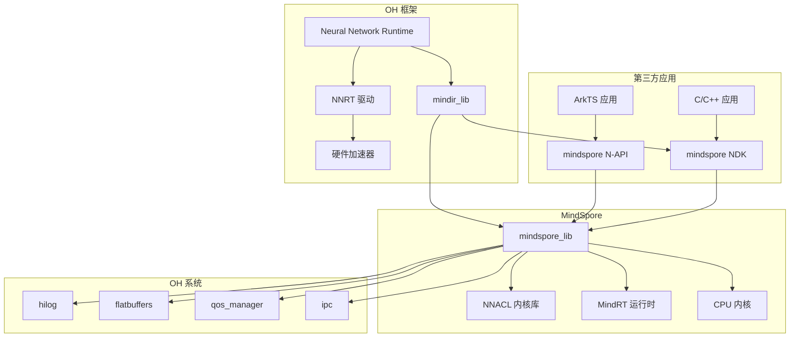
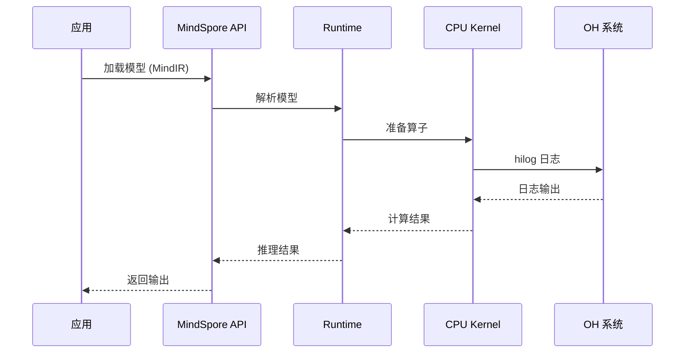

# 依赖关系与使用

## 直接依赖者概览

| 类别 | 数量 | 描述 |
|------|------|------|
| **核心框架** | 1 | Neural Network Runtime |
| **测试套件** | 25+ | HATS/ACTS 测试 |
| **SDK 接口** | 1 | NDK 接口导出 |
| **内部组件** | 5+ | JS/Taihe 绑定 |

---

## 核心框架依赖

### Neural Network Runtime (NNRT)

**路径**: `foundation/ai/neural_network_runtime/`

Neural Network Runtime 是 MindSpore 在 OpenHarmony 中的主要消费者。

```gn
# neural_network_runtime/BUILD.gn
external_deps = [
  # ... 其他依赖 ...
  "mindspore:mindir_lib",  # MindIR 模型解析
  # ... 其他依赖 ...
]
```

**使用方式**: NNRT 使用 MindSpore 的 MindIR 格式进行模型解析，将 AI 模型转换为统一的内部表示。

**场景**: 当应用使用 NNRT 进行 AI 推理时，如果模型是 MindIR 格式，NNRT 会调用 MindSpore 的解析器。

---

## 测试套件依赖

### HATS NNRT 测试

| 测试模块 | 依赖目标 | HDI 版本 | 用途 |
|----------|----------|----------|------|
| `test/xts/hats/ai/nnrt/hdi/v1_0/nnrtFunctionTest/` | mindspore:mindir | v1.0 | 功能测试 |
| `test/xts/hats/ai/nnrt/hdi/v1_0/nnrtStabilityTest/` | mindspore:mindir | v1.0 | 稳定性测试 |
| `test/xts/hats/ai/nnrt/hdi/v2_0/nnrtFunctionTest/` | mindspore:mindir | v2.0 | 功能测试 |
| `test/xts/hats/ai/nnrt/hdi/v2_0/nnrtFunctionTest_additional/` | mindspore:mindir | v2.0 | 附加测试 |
| `test/xts/hats/ai/nnrt/hdi/v2_0/nnrtStabilityTest/` | mindspore:mindir | v2.0 | 稳定性测试 |

### ACTS NNRT 测试

| 测试模块 | 依赖目标 | 用途 |
|----------|----------|------|
| `test/xts/acts/ai/neural_network_runtime/v1_0/interface/` | mindspore:mindir_lib | 接口测试 |
| `test/xts/acts/ai/neural_network_runtime/v1_0/stability/` | mindspore:mindir_lib | 稳定性测试 |
| `test/xts/acts/ai/neural_network_runtime/v2_0/interface/` | mindspore:mindir_lib | 接口测试 |
| `test/xts/acts/ai/neural_network_runtime/v2_0/stability/` | mindspore:mindir_lib | 稳定性测试 |

### ACTS MindSpore 测试

| 测试模块 | 组件名 | 用途 |
|----------|--------|------|
| `test/xts/acts/ai/mindspore/mindsporectest/` | mindspore | C API 测试 |
| `test/xts/acts/ai/mindspore/mindsporendktest/` | mindspore | NDK 测试 |
| `test/xts/acts/ai/mindspore/mindsporejstest/` | mindspore | JS API 测试 |
| `test/xts/acts/ai/mindspore/ai_mindsporectest_20/` | mindspore | C API 2.0 测试 |
| `test/xts/acts/ai/mindspore/ActsMindSporeCTest/` | mindspore | C 接口测试 |

---

## SDK/NDK 接口

### NDK 头文件导出

**路径**: `interface/sdk_c/third_party/mindspore/kits/BUILD.gn`

```gn
ohos_ndk_headers("mindspore_header") {
  dest_dir = "$ndk_headers_out_dir/mindspore"
  sources = [
    "context.h",
    "data_type.h",
    "format.h",
    "model.h",
    "status.h",
    "tensor.h",
    "types.h",
  ]
}

ohos_ndk_library("mindspore_lib") {
  output_name = "mindspore_lite_ndk"
  ndk_description_file = "./mindspore_lib.ndk.json"
}
```

---

## 使用场景

### 场景 1: 直接使用 MindSpore C API

**适用**: 需要精细控制推理过程的场景

```c
// hello_mindspore.c
#include <stdio.h>
#include "context.h"
#include "model.h"
#include "tensor.h"

int main() {
    // 1. 创建上下文
    MSContextHandle context = MSContextCreate();
    if (context == NULL) {
        printf("Failed to create context\n");
        return -1;
    }

    // 2. 设置设备 (CPU)
    MSContextSetDeviceTarget(context, kMSDeviceTypeCPU);

    // 3. 加载模型
    MSModelHandle model = MSModelCreate();
    MSStatus status = MSModelLoadFromFile(model, "/path/to/model.ms");
    if (status != kMSStatusSuccess) {
        printf("Failed to load model: %d\n", status);
        return -1;
    }

    // 4. 获取输入张量
    MSTensorHandle input_tensor = MSModelGetInputByIndex(model, 0);
    
    // 5. 设置输入数据
    void* input_data = malloc(input_size);
    // ... 填充输入数据 ...
    MSTensorSetData(input_tensor, input_data, input_size);

    // 6. 执行推理
    status = MSModelPredict(model);
    if (status != kMSStatusSuccess) {
        printf("Failed to predict: %d\n", status);
        return -1;
    }

    // 7. 获取输出
    MSTensorHandle output = MSModelGetOutputByIndex(model, 0);
    void* output_data = MSTensorGetData(output);
    size_t output_size = MSTensorGetSize(output);

    // 8. 处理输出
    // ... 处理推理结果 ...

    // 9. 清理资源
    free(input_data);
    MSTensorDestroy(&input_tensor);
    MSTensorDestroy(&output);
    MSModelDestroy(&model);
    MSContextDestroy(&context);

    return 0;
}
```

**BUILD.gn 依赖**:
```gn
external_deps = [
  "mindspore:mindspore_ndk",
]
```

---

### 场景 2: 通过 NNRT 使用 MindIR 模型

**适用**: 需要硬件加速的场景

```c
// hello_nnrt.c
#include <stdio.h>
#include "neural_network_runtime.h"

// NNRT 加载 MindIR 模型
int main() {
    // 1. 创建 NNRT 回调
    OH_NnRt_Executor *executor = NULL;
    OH_NnRt_ReturnCode ret;

    // 2. 加载 MindIR 模型
    ret = OH_NnRt_Executor_Create(&executor,
        "/path/to/model.mindir",  // MindIR 格式
        NULL, 0);
    if (ret != NNRT_SUCCESS) {
        printf("Failed to create executor\n");
        return -1;
    }

    // 3. 设置输入
    // ... 设置输入张量 ...

    // 4. 执行推理
    ret = OH_NnRt_Executor_Compute(executor);
    if (ret != NNRT_SUCCESS) {
        printf("Failed to compute\n");
        return -1;
    }

    // 5. 获取输出
    // ... 获取输出张量 ...

    // 6. 清理
    OH_NnRt_Executor_Destroy(executor);

    return 0;
}
```

**BUILD.gn 依赖**:
```gn
external_deps = [
  "neural_network_runtime:nnrt_sdk",
  "mindspore:mindir_lib",  # 间接依赖
]
```

---

### 场景 3: 使用 ArkTS/JS API

**适用**: Web 前端开发者

```typescript
import mindspore from '@ohos.mindspore';

// 加载模型
const model = await mindspore.loadModel('/path/to/model.ms');

// 创建会话
const session = await model.createSession();

// 设置输入
session.setInput('input_name', inputData);

// 执行推理
const outputs = session.predict();

// 获取输出
const output = outputs[0];
console.log('Result:', output);
```

---

## 依赖关系图

### 模块依赖图



### 调用链图



---

## 添加新依赖

### 方式 1: 静态链接 (推荐)

```gn
# BUILD.gn
ohos_shared_library("my_ai_module") {
  deps = [
    "//third_party/mindspore/mindspore-src/source/mindspore-lite:mindspore_lib",
  ]
  
  # 或链接 NDK 库
  # deps = [
  #   "//third_party/mindspore:mindspore-ndk",
  # ]
}
```

### 方式 2: 外部依赖

```gn
# BUILD.gn
ohos_shared_library("my_ai_module") {
  external_deps = [
    "mindspore:mindspore_lib",  # 静态链接
    # 或
    # "mindspore:mindspore_ndk",  # 动态链接 (NDK)
  ]
}
```

### 头文件路径

```gn
include_dirs = [
  "//third_party/mindspore/mindspore-src/source/include/c_api",
  "//third_party/mindspore/mindspore-src/source/mindspore-lite/mindir/include",
]
```

---

## 链接方式对比

| 方式 | 优点 | 缺点 | 适用场景 |
|------|------|------|----------|
| **静态链接 (lib)** | 无运行时依赖、性能最佳 | 二进制体积大 | 系统级组件 |
| **NDK 动态链接** | 体积小、版本独立 | 需要 NDK 支持 | 第三方应用 |
| **间接依赖** | 灵活 | 版本依赖 | 框架层 |

---

## 版本兼容性

### 兼容性矩阵

| OH 版本 | MindSpore 版本 | API 兼容性 |
|---------|----------------|------------|
| 4.0+ | v2.7.0 | ✅ 兼容 |
| 3.2+ | v2.7.0 | ✅ 兼容 |
| 3.1 | v2.7.0 | ✅ 基准版本 |

### API 版本

| API 版本 | NDK 版本 | 状态 |
|----------|----------|------|
| 2.0 | 3.1 | ✅ 当前 |
| 1.0 | 3.0 | ✅ 兼容 |

---

## 常见问题

### Q1: 找不到 mindspore 依赖

**问题**: `error: cannot find //third_party/mindspore:mindspore-ndk`

**解决**: 确保在产品的 `build.gn.args` 中启用 mindspore 组件

### Q2: NDK 应用无法加载模型

**问题**: `MSModelLoadFromFile 返回 kMSStatusError`

**解决**: 
1. 检查模型文件路径是否正确
2. 确保模型是有效的 MindIR 格式
3. 检查设备存储权限

### Q3: 推理性能差

**问题**: 推理时间过长

**解决**:
1. 启用 INT8 量化
2. 使用 NNRT 硬件加速
3. 优化模型结构

---

## 性能基准

### 推理性能 (参考值)

| 模型 | 输入尺寸 | CPU 推理时间 | 设备 |
|------|----------|-------------|------|
| ResNet-50 | 224x224 | ~50ms | ARM64 |
| MobileNet-V2 | 224x224 | ~15ms | ARM64 |
| YOLOv5s | 640x640 | ~120ms | ARM64 |

*注: 实际性能取决于设备配置和模型复杂度*

---

## 相关文档

- [MindSpore Lite C API 文档](https://www.mindspore.cn/lite/api/en/master/api_cpp/)
- [HarmonyOS AI 开发指南](https://developer.huawei.com/consumer/en/doc/harmonyos-guides/mindspore-guidelines-based-native)
- [NNRT 开发指南](https://gitee.com/openharmony/neural_network_runtime)
