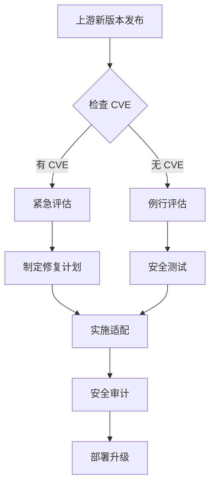

# 安全风险分析

## 6.1 概述

本章节分析 mksh 库在 OpenHarmony 中的安全风险，包括：

- 上游版本的已知漏洞
- OH 适配引入的安全影响
- 安全配置建议

---

## 6.2 上游版本安全状态

### CVE 查询状态

**当前状态**：需要进一步确认上游 CVE 数据库

**建议操作**：
```bash
# 查询上游 CVE（需要访问外部数据库）
# 参考：https://www.cve.org/

# 或使用本地安全扫描工具
```

### 历史安全修复

| CVE 编号 | 严重程度 | 影响版本 | 修复状态 |
|----------|----------|----------|----------|
| 待查询 | - | - | - |

**注意**：需定期检查上游安全公告，确保 OH 版本及时获得安全修复。

---

## 6.3 OH 适配安全评估

### 适配代码安全分析

#### 适配 1：exec 空指针检查

**文件**：`exec.c:1170-1175`

**安全评估**：

| 评估项 | 结果 |
|--------|------|
| 风险类型 | 防御性编程 |
| 风险等级 | ✅ **降低风险** |
| 引入新攻击面 | ❌ 否 |
| 绕过可能 | ❌ 否 |

**分析**：此适配修复了潜在的空指针解引用漏洞，提高了安全性。

---

#### 适配 2：管道写入重试

**文件**：`funcs.c:568-589`

**安全评估**：

| 评估项 | 结果 |
|--------|------|
| 风险类型 | 可靠性改进 |
| 风险等级 | ✅ **降低风险** |
| 引入新攻击面 | ⚠️ 需评估 |
| 绕过可能 | ❌ 否 |

**潜在风险**：
- 重试机制可能导致资源耗尽（需检查 `MAX_WRITE_RETRY_TIME` 值）
- 建议在生产环境中限制最大重试次数

**缓解措施**：
```c
// 建议限制重试次数
#define MAX_WRITE_RETRY_TIME 3  // 最大 3 次
```

---

#### 适配 3：窗口大小同步

**文件**：`edit.c:1894-1900`

**安全评估**：

| 评估项 | 结果 |
|--------|------|
| 风险类型 | 防御性编程 |
| 风险等级 | ✅ **降低风险** |
| 引入新攻击面 | ❌ 否 |
| 绕过可能 | ❌ 否 |

**分析**：纯防御性代码，不引入安全风险。

---

### OH 特定编译选项安全分析

#### 栈保护

```gn
"-fstack-protector-all"   # 启用栈保护
```

| 评估项 | 结果 |
|--------|------|
| 状态 | ✅ 已启用 |
| 保护效果 | 防止栈溢出攻击 |
| 性能影响 | 极小 |

---

#### 位置无关可执行文件

```gn
"-fPIE"                   # 位置无关
"-Wl,-z,relro"           # 只读重定位
"-Wl,-z,now"             # 立即绑定
"-Wl,-z,noexecstack"     # 不可执行栈
```

| 评估项 | 结果 |
|--------|------|
| PIE | ✅ 已启用 |
| RELRO | ✅ 已启用 |
| NOW | ✅ 已启用 |
| NX | ✅ 已启用 |

**综合安全等级**：✅ **高**

---

## 6.4 安全配置建议

### 编译时安全强化

#### 当前配置（良好）

```gn
# 已启用的安全选项
cflags = [
  "-fstack-protector-all",  # 栈保护
  "-fPIE",                # 位置无关
]

ldflags = [
  "-pie",                 # 链接时 PIE
  "-Wl,-z,relro",        # 只读重定位
  "-Wl,-z,now",          # 立即绑定
  "-Wl,-z,noexecstack",  # 不可执行栈
]
```

#### 建议添加的配置

```gn
# 可选增强配置
cflags_ex = [
  "-D_FORTIFY_SOURCE=2",     # 运行时缓冲区检查
  "-fstack-protector-strong", # 更强的栈保护
]

ldflags_ex = [
  "-Wl,--pie",               # 显式 PIE
]
```

---

### 运行时安全配置

#### 安全启动选项

```bash
# 建议的安全启动参数
mksh --secure  # 如果支持
```

#### 环境变量安全

```bash
# 建议设置的安全环境变量
export ENV=/etc/mkshrc.secure
export HISTFILE=/dev/null  # 禁用历史（敏感环境）
export HISTSIZE=0
```

---

## 6.5 攻击面分析

### 潜在攻击面

| 攻击面 | 风险等级 | 缓解措施 |
|--------|----------|----------|
| Shell 注入 | **中** | 验证输入 |
| 命令注入 | **中** | 使用 escapeshellcmd() |
| 路径遍历 | **低** | 验证文件路径 |
| 符号链接攻击 | **低** | 禁用不安全的路径 |
| 资源耗尽 | **低** | 设置资源限制 |

### 缓解建议

#### Shell 注入防护

```bash
# 禁止使用 eval 处理不可信输入
# 推荐使用更安全的方式

# 差：使用 eval
eval "command=$user_input"  # 危险！

# 好：参数化
command -p "$user_input"    # 安全
```

#### 资源限制

```bash
# 在 /etc/profile 或 /etc/mkshrc 中设置
ulimit -t 30    # CPU 时间 30 秒
ulimit -v 51200 # 虚拟内存 50MB
ulimit -n 100   # 文件描述符 100
```

---

## 6.6 安全审计清单

### 代码审计项

| 序号 | 审计项 | 状态 | 备注 |
|------|--------|------|------|
| 1 | 检查 exec 命令空指针处理 | ✅ 已适配 | 见 exec.c |
| 2 | 检查管道写入重试逻辑 | ⚠️ 需验证 | MAX_WRITE_RETRY_TIME 值 |
| 3 | 检查窗口大小同步逻辑 | ✅ 安全 | 纯防御性代码 |
| 4 | 检查终端扩展安全性 | ⚠️ 需评估 | 可选功能 |
| 5 | 验证编译选项安全 | ✅ 良好 | 已启用多项保护 |

### 配置审计项

| 序号 | 审计项 | 状态 | 备注 |
|------|--------|------|------|
| 1 | 栈保护启用 | ✅ 已启用 | -fstack-protector-all |
| 2 | PIE 启用 | ✅ 已启用 | -fPIE |
| 3 | RELRO 启用 | ✅ 已启用 | -Wl,-z,relro |
| 4 | NX 启用 | ✅ 已启用 | -Wl,-z,noexecstack |
| 5 | _FORTIFY_SOURCE | ❌ 未启用 | 建议启用 |

---

## 6.7 安全升级策略

### 版本升级流程



### 升级检查清单

| 步骤 | 操作 | 验证方法 |
|------|------|----------|
| 1 | 下载上游新版本 | 校验 SHA256 |
| 2 | 检查 CVE 公告 | CVE 数据库查询 |
| 3 | 移植 OH 适配 | 对比 MKSH_OH_ADAPT 相关代码 |
| 4 | 运行安全测试 | 静态分析 + 动态测试 |
| 5 | 性能测试 | 基准测试 |
| 6 | 集成测试 | 与 samgr_lite 等模块测试 |

### 适配代码升级建议

| 适配项 | 升级优先级 | 建议 |
|--------|------------|------|
| exec 空指针检查 | **P0** | 优先验证是否已在上游修复 |
| 管道重试机制 | **P1** | 评估上游是否有类似实现 |
| 窗口同步代码 | **P2** | 保留作为防御性代码 |

---

## 6.8 应急响应

### CVE 响应流程

```
1. 接收 CVE 通知
   ↓
2. 评估影响范围
   ↓
3. 检查 OH 版本是否受影响
   ↓
4. 如受影响，制定修复计划
   ↓
5. 实施修复（适配或升级）
   ↓
6. 测试验证
   ↓
7. 发布安全更新
```

### 快速止血措施

如发现严重安全漏洞，可临时措施：

```bash
# 禁用 mksh（需谨慎）
mv /bin/sh /bin/sh.backup
mv /bin/mksh /bin/mksh.backup

# 或限制使用
chmod 000 /bin/mksh
```

**注意**：以上措施可能影响系统稳定性，仅作为最后手段。

---

## 6.9 安全相关配置示例

### 系统级安全配置

```bash
# /etc/mkshrc.system

# 资源限制
ulimit -c 0           # 禁止核心转储
ulimit -t 60          # CPU 时间限制
ulimit -v 100000      # 虚拟内存限制

# 历史记录安全
export HISTSIZE=1000
export HISTFILE=/var/log/mksh_history
chmod 600 /var/log/mksh_history

# 路径安全
export PATH=/bin:/usr/bin:/system/bin
```

### 敏感环境配置

```bash
# /etc/mkshrc.secure

# 禁用敏感功能
set -o nolog

# 限制环境变量
readonly ENV PATH HOME USER

# 禁止特定命令
alias rm='rm -i'
alias cp='cp -i'
alias mv='mv -i'
```

---

## 6.10 总结

### 安全评估总结

| 方面 | 评估结果 |
|------|----------|
| 上游安全状态 | ⚠️ 需定期检查 |
| OH 适配安全性 | ✅ **良好** |
| 编译安全强化 | ✅ **良好** |
| 运行时安全 | ✅ **良好** |

### 建议行动

| 优先级 | 行动 | 时间线 |
|--------|------|--------|
| **P0** | 启用 _FORTIFY_SOURCE | 1-2 周 |
| **P1** | 验证管道重试限制 | 2-4 周 |
| **P2** | 建立 CVE 监控 | 持续 |
| **P3** | 安全配置最佳实践文档 | 1 个月 |

### 最终建议

1. ✅ mksh 的 OH 适配整体安全状态良好
2. ✅ 已启用多项编译时安全保护
3. ⚠️ 建议启用额外的 _FORTIFY_SOURCE 保护
4. ⚠️ 建立定期 CVE 检查机制
5. 📋 遵循最小权限原则配置 mksh
