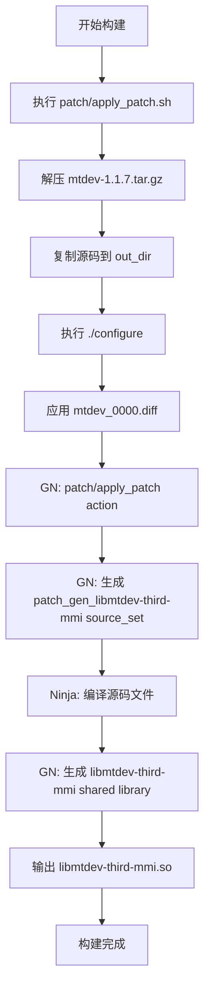

# mtdev OpenHarmony 构建集成

## 概述

mtdev 在 OpenHarmony 中使用 GN（Generate Ninja）构建系统进行编译，通过 Patch 机制对上游源码进行定制化修改。构建流程分为两个阶段：
1. **Patch 应用阶段**: 解压源码、应用 Patch、配置构建环境
2. **编译阶段**: 使用 GN 生成构建规则，通过 Ninja 编译生成共享库

---

## 构建文件结构

```
third_party/mtdev/
├── BUILD.gn                          # 主 GN 构建文件
├── patch/
│   ├── BUILD.gn                      # Patch 应用 GN 规则
│   ├── apply_patch.sh                 # Patch 应用脚本
│   └── diff_libmtdev_mmi/mtdev/
│       └── mtdev_0000.diff           # OH 特定 Patch
├── mtdev-1.1.7/                     # 上游源码（原样）
├── mtdev-1.1.7.tar.gz               # 上游源码压缩包
├── bundle.json                       # OH 组件定义
└── OAT.xml                          # OSS 审计配置
```

---

## 主构建文件 (BUILD.gn)

### 路径
`third_party/mtdev/BUILD.gn`

### 构建目标

#### 1. 编译配置: `libmtdev-third_config`

```gn
config("libmtdev-third_config") {
  visibility = [ ":*" ]

  include_dirs = [
    "$gen_dst_dir/src",
    "$gen_dst_dir/include",
  ]

  cflags = [
    "-Wno-unused-parameter",
    "-Wno-sign-compare",
    "-DDISABLE_FILTER",  # ⭐ OH 特定：禁用数据过滤
  ]
}
```

**关键配置说明**:
- `$gen_dst_dir`: `$root_out_dir/diff_libmtdev_mmi`，Patch 后的源码输出目录
- `-DDISABLE_FILTER`: 禁用 mtdev 的数据过滤功能（见 [02_Patches.md](02_Patches.md)）
- 警告抑制: `-Wno-unused-parameter` 和 `-Wno-sign-compare` 用于避免上游代码的编译警告

#### 2. 公共头文件配置: `libmtdev-third_public_config`

```gn
config("libmtdev-third_public_config") {
  include_dirs = [ "$gen_dst_dir/include" ]

  cflags = []
}
```

**说明**: 仅暴露公共头文件目录 (`include/`) 给依赖者。

#### 3. 源码集合: `patch_gen_libmtdev-third-mmi`

```gn
ohos_source_set("patch_gen_libmtdev-third-mmi") {
  part_name = "input"
  subsystem_name = "multimodalinput"

  sources = [
    root_out_dir + "/diff_libmtdev_mmi/src/caps.c",
    root_out_dir + "/diff_libmtdev_mmi/src/core.c",
    root_out_dir + "/diff_libmtdev_mmi/src/iobuf.c",
    root_out_dir + "/diff_libmtdev_mmi/src/match.c",
    root_out_dir + "/diff_libmtdev_mmi/src/match_four.c",
  ]

  branch_protector_ret = "pac_ret"
  sanitize = {
    cfi = true
    cfi_cross_dso = true
    debug = false
  }

  configs = [ ":libmtdev-third_config" ]
  public_configs = [ ":libmtdev-third_public_config" ]
  deps = [ "//third_party/mtdev/patch:apply_patch" ]
}
```

**安全加固配置**:
- `branch_protector_ret = "pac_ret"`: 启用 PAC-RET（指针认证返回地址保护）
- `sanitize.cfi = true`: 启用 CFI（控制流完整性）
- `sanitize.cfi_cross_dso = true`: 跨 DSO 的 CFI 保护
- `sanitize.debug = false`: 禁用 CFI 调试信息（生产环境优化）

#### 4. 共享库: `libmtdev-third-mmi`

```gn
ohos_shared_library("libmtdev-third-mmi") {
  sources = []

  branch_protector_ret = "pac_ret"
  sanitize = {
    cfi = true
    cfi_cross_dso = true
    debug = false
  }

  configs = [ ":libmtdev-third_config" ]
  public_configs = [ ":libmtdev-third_public_config" ]
  deps = [ ":patch_gen_libmtdev-third-mmi" ]

  license_file = "//third_party/mtdev/COPYING"
  part_name = "input"
  subsystem_name = "multimodalinput"
}
```

**说明**:
- 这是一个**包装目标**，本身不包含源文件（`sources = []`）
- 实际源文件来自 `patch_gen_libmtdev-third-mmi` source_set
- 最终输出: `libmtdev-third-mmi.so` 共享库

---

## Patch 应用构建 (patch/BUILD.gn)

### 路径
`third_party/mtdev/patch/BUILD.gn`

### Patch 应用 Action: `apply_patch`

```gn
action("apply_patch") {
  visibility = [ "*" ]
  script = "${gen_src_dir}/patch/apply_patch.sh"

  inputs = [ "$gen_src_dir" ]

  outputs = [
    "$gen_dst_dir/src/caps.c",
    "$gen_dst_dir/src/core.c",
    "$gen_dst_dir/src/iobuf.c",
    "$gen_dst_dir/src/match.c",
    "$gen_dst_dir/src/match_four.c",
  ]

  args = [
    rebase_path(gen_src_dir, root_build_dir),
    rebase_path(gen_dst_dir, root_build_dir),
    rebase_path(build_gn_dir, root_build_dir),
  ]
}
```

**关键点**:
- `action` 目标在编译前执行自定义脚本
- `outputs` 声明 Patch 后生成的文件路径
- `args` 传递源码目录、输出目录和 Patch 目录路径

---

## Patch 应用脚本 (apply_patch.sh)

### 路径
`third_party/mtdev/patch/apply_patch.sh`

### 脚本流程

```bash
#!/bin/bash
set -e

# 参数: $1=源码目录, $2=输出目录, $3=patch目录
curdir=$(pwd)
source_dir=$1
out_dir=$2
path_file_dir=$3

# 1. 清理旧输出
if [ -d "$out_dir" ]; then
    rm -rf "$out_dir"
fi
mkdir -p $out_dir

# 2. 复制源码到输出目录
cp -fra $source_dir/* $out_dir

# 3. 解压并配置上游源码
cd $out_dir
tar xvf mtdev-1.1.7.tar.gz
cp -rf mtdev-1.1.7/* ./
./configure

# 4. 应用 Patch
ls -l $path_file_dir/*.diff
if [ $? -ne 0 ]; then
    echo "WARNING: no patch."
    exit 0
fi

PATCH_FILE=$(realpath $(ls $path_file_dir/*.diff | tail -n 1))
echo "PATCH_FILE: $PATCH_FILE"

patch -p1 -i $PATCH_FILE
if [ $? -ne 0 ]; then
    echo "patch fail. path_file_dir=$path_file_dir"
    exit 1
fi

cd $curdir
exit 0
```

### 步骤详解

| 步骤 | 操作 | 目的 |
|-----|------|-----|
| 1 | 清理输出目录 | 确保每次构建都是干净的环境 |
| 2 | 复制源码 | 将 `mtdev-1.1.7.tar.gz` 等文件复制到输出目录 |
| 3 | 解压并配置 | 解压上游源码，执行 `./configure` 生成 Makefile |
| 4 | 应用 Patch | 使用 `patch -p1` 应用 `mtdev_0000.diff` |

---

## 构建流程图



---

## 与上游构建系统的差异

| 维度 | 上游构建 | OpenHarmony 构建 |
|-----|---------|---------------|
| **构建系统** | Autotools (autoconf + automake) | GN + Ninja |
| **配置方式** | `./configure` | `BUILD.gn` 配置文件 |
| **编译选项** | configure 脚本参数 | GN configs 和 cflags |
| **输出格式** | 静态库 (`libmtdev.a`) | 共享库 (`libmtdev-third-mmi.so`) |
| **源码修改** | 直接修改源码 | Patch 机制 |
| **安全加固** | 无 | CFI, PAC-RET |
| **依赖管理** | pkg-config | GN deps |

---

## 编译选项对比

### 上游典型编译
```bash
./configure --prefix=/usr/local
make
make install
```

生成的库:
- 静态库: `/usr/local/lib/libmtdev.a`
- 动态库: `/usr/local/lib/libmtdev.so`
- 头文件: `/usr/local/include/mtdev.h`

### OpenHarmony 编译
```bash
hb build mtdev
```

生成的库:
- 共享库: `out/ohos-arm-release/lib/libmtdev-third-mmi.so`
- 头文件: `out/ohos-arm-release/gen/diff_libmtdev_mmi/include/mtdev.h`

---

## 特殊处理

### 1. 禁用数据过滤

**配置位置**: `BUILD.gn` → `libmtdev-third_config`

```gn
cflags = [
    "-DDISABLE_FILTER",  # 禁用 filter_data() 调用
]
```

**影响**:
- 原始触摸数据直接传递，不经过 EWMA 滤波
- 适用于需要高精度或低延迟的场景

**注意事项**:
- 如果上游引入新的过滤逻辑，可能需要重新评估此选项

### 2. 头文件路径处理

**问题**: Patch 后的源码位于 `out_dir`，而非原始 `third_party/mtdev/`

**解决方案**:
```gn
include_dirs = [
    "$gen_dst_dir/src",      # 内部头文件
    "$gen_dst_dir/include",  # 公共头文件
]
```

**依赖者使用方式**:
```gn
deps = [
    "//third_party/mtdev:libmtdev-third-mmi",
]

# 头文件引用
#include <mtdev.h>  # 自动解析到 $gen_dst_dir/include
```

### 3. 安全加固

| 加固项 | 配置值 | 说明 |
|-------|-------|------|
| CFI | `true` | 控制流完整性，防止 ROP 攻击 |
| CFI Cross-DSO | `true` | 跨共享库的 CFI 保护 |
| PAC-RET | `"pac_ret"` | 返回地址指针认证 |
| Debug | `false` | 生产环境禁用 CFI 调试信息 |

**编译要求**:
- 需要 Clang 编译器支持 CFI 和 PAC
- 目标架构需支持硬件特性（如 ARMv8.3+）

---

## 构建输出

### 输出目录结构

```
out/ohos-arm-release/
├── gen/
│   └── diff_libmtdev_mmi/         # Patch 后的源码
│       ├── include/
│       │   ├── mtdev.h
│       │   ├── mtdev-mapping.h
│       │   └── mtdev-plumbing.h
│       └── src/
│           ├── caps.c
│           ├── core.c             # ⭐ 已应用 Patch
│           ├── iobuf.c
│           ├── match.c
│           └── match_four.c
└── lib/
    └── libmtdev-third-mmi.so     # 最终共享库
```

### 关键文件说明

| 文件 | 说明 | 是否 Patch 修改 |
|-----|------|--------------|
| `core.c` | 核心事件处理逻辑 | ✅ 是 |
| `caps.c` | 设备能力检测 | ❌ 否 |
| `iobuf.c` | 输入/输出缓冲区 | ❌ 否 |
| `match.c` | 事件匹配算法 | ❌ 否 |
| `match_four.c` | 四点触摸匹配 | ❌ 否 |
| `mtdev.h` | 公共 API 头文件 | ❌ 否 |

---

## 调试构建

### 启用详细日志

```bash
# 1. 清理旧构建
hb clean

# 2. 启用详细编译日志
hb build mtdev --verbose --gn-args="is_component_build=true"

# 3. 查看 Patch 应用日志
cat out/ohos-arm-release/.ninja_log | grep apply_patch
```

### 检查 Patch 是否生效

```bash
# 查看生成的 core.c 是否包含 OH 修改
grep "DISABLE_FILTER" out/ohos-arm-release/gen/diff_libmtdev_mmi/src/core.c

# 查看编译选项
grep -r "DISABLE_FILTER" out/ohos-arm-release/.ninja_deps
```

---

## 常见问题

### Q1: Patch 失败怎么办？

**症状**: 构建时报错 `patch fail`

**原因**: 上游版本更新导致 Patch 不兼容

**解决方法**:
1. 检查 `mtdev-1.1.7/` 中的源码版本
2. 手动对比 `core.c` 中相关函数的实现
3. 更新 `mtdev_0000.diff` 中的行号或逻辑

### Q2: 如何修改编译选项？

**修改 `BUILD.gn`**:
```gn
config("libmtdev-third_config") {
  cflags = [
    "-DDISABLE_FILTER",      # OH 特有
    "-DDEBUG_MTDEV",         # 自定义调试选项
    "-O2",                  # 优化级别
  ]
}
```

**验证**:
```bash
hb clean && hb build mtdev
grep -E "(DISABLE_FILTER|DEBUG_MTDEV)" out/ohos-arm-release/.ninja_log
```

### Q3: 如何添加新的 Patch？

1. 在 `patch/diff_libmtdev_mmi/mtdev/` 目录下创建新的 diff 文件
2. 修改 `patch/apply_patch.sh` 以应用多个 Patch（如需要）
3. 更新 `patch/BUILD.gn` 的 `outputs` 列表

---

## 相关文档

- [01_Overview.md](01_Overview.md) - mtdev 库概览
- [02_Patches.md](02_Patches.md) - Patch 详细分析
- [04_Usage_in_OH.md](04_Usage_in_OH.md) - 在 OpenHarmony 中的使用
