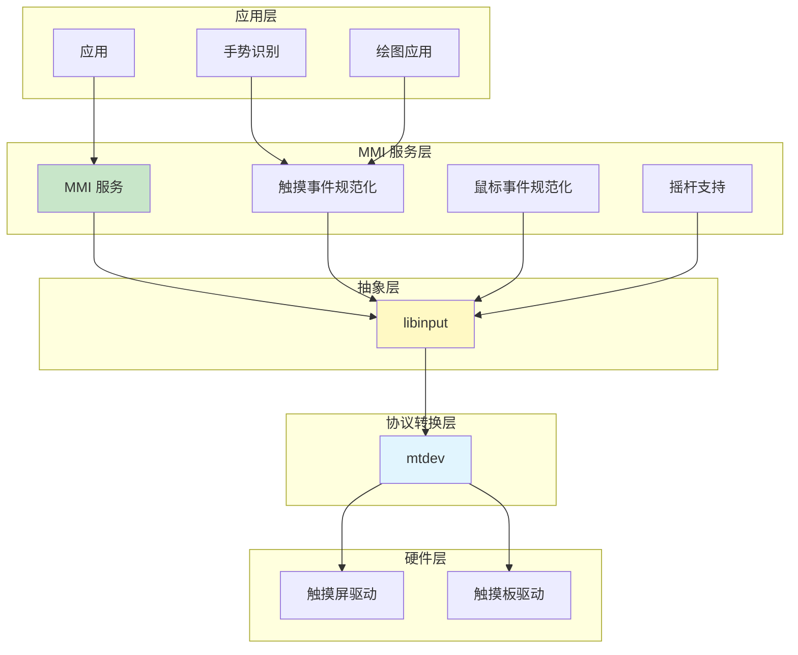
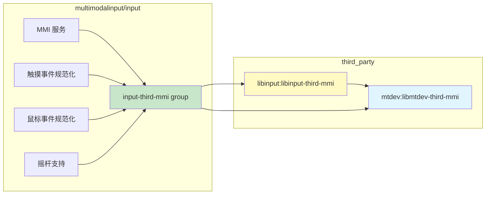
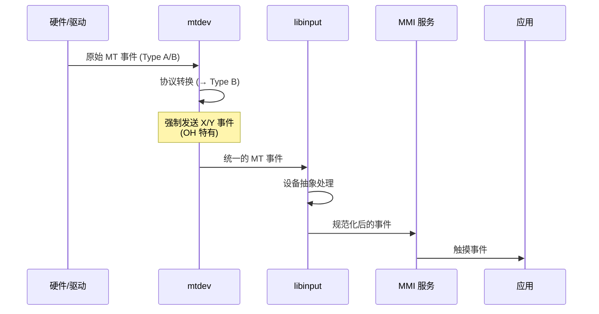

# mtdev 在 OpenHarmony 中的使用

## 概述

mtdev 是 OpenHarmony 多模态输入系统（MMI）的基础组件，负责将内核的原始多点触控事件转换为统一的 Type B 协议。它被 `libinput` 和 `MMI 服务` 等模块依赖，构成了 OpenHarmony 输入子系统的底层支撑。

---

## 直接依赖者

### 1. libinput (third_party/libinput)

**组件名称**: @ohos/libinput
**子系统**: thirdparty / multimodalinput
**依赖类型**: `public_external_deps`

#### 依赖的 libinput 目标

| libinput 目标 | 目标类型 | 子系统 | 说明 |
|-------------|---------|--------|-----|
| `patch_gen_libinput-third-mmi` | source_set | thirdparty | libinput 源码集合 |
| `libinput-third-mmi` | shared_library | thirdparty | libinput 共享库 |
| `libinput-debug-mmi` | tool | multimodalinput | 调试工具 |
| `libinput-list-mmi` | tool | multimodalinput | 设备列表工具 |
| `libinput-tablet-mmi` | tool | multimodalinput | 绘图板工具 |
| `libinput-record-mmi` | tool | multimodalinput | 事件录制工具 |
| `libinput-analyze-mmi` | tool | multimodalinput | 事件分析工具 |
| `libinput-measure-mmi` | tool | multimodalinput | 性能测量工具 |
| `libinput-quirks-mmi` | tool | multimodalinput | 硬件怪癖处理工具 |

#### BUILD.gn 依赖声明

```gn
# third_party/libinput/BUILD.gn
ohos_shared_library("libinput-third-mmi") {
  public_external_deps = [
    "mtdev:libmtdev-third-mmi",  # ⭐ 依赖 mtdev
    # ... 其他依赖
  ]
}
```

**说明**: libinput 使用 `public_external_deps` 声明依赖，意味着依赖会传递给 libinput 的使用者。

---

### 2. multimodalinput/input (MMI 服务)

**组件名称**: @ohos/multimodalinput_input
**子系统**: multimodalinput
**依赖类型**: `external_deps`

#### 依赖的 MMI 目标

| MMI 目标 | 目标类型 | 说明 |
|---------|---------|-----|
| `input-third-mmi` | group | 包含 libinput 和 mtdev 的依赖组 |

#### BUILD.gn 依赖声明

```gn
# foundation/multimodalinput/input/BUILD.gn
group("input-third-mmi") {
  external_deps = [
    "mtdev:libmtdev-third-mmi",  # ⭐ 直接依赖 mtdev
    "libinput:libinput-third-mmi",
    # ... 其他依赖
  ]
}
```

---

## 间接依赖者（通过 libinput）

### MMI 服务核心模块

| 模块 | 路径 | 用途 |
|-----|------|-----|
| MMI 服务 | `foundation/multimodalinput/input/service/BUILD.gn` | 输入事件分发服务 |
| 触摸事件规范化 | `foundation/multimodalinput/input/service/touch_event_normalize/BUILD.gn` | 触摸事件预处理 |
| 鼠标事件规范化 | `foundation/multimodalinput/input/service/mouse_event_normalize/BUILD.gn` | 鼠标事件预处理 |
| 摇杆支持 | `foundation/multimodalinput/input/service/joystick/BUILD.gn` | 游戏手柄输入处理 |
| Fuzz 测试 | `foundation/multimodalinput/input/test/fuzztest/*/BUILD.gn` | 安全性测试 |

**依赖链**:
```
MMI 核心模块 → libinput:libinput-third-mmi → mtdev:libmtdev-third-mmi
```

**数量**: 约 270+ 个 BUILD.gn 文件间接受益于 mtdev

---

## 依赖关系图

### 系统级依赖图



### 构建依赖图



---

## 使用方式

### 1. 静态链接 vs 动态链接

| 模块 | 链接方式 | 说明 |
|-----|---------|-----|
| libinput | 动态链接 | 运行时加载 `libmtdev-third-mmi.so` |
| MMI 服务 | 间接动态链接 | 通过 libinput 间接链接 |
| MMI 工具 | 动态链接 | 工具依赖 libinput，进而依赖 mtdev |

**说明**: mtdev 作为共享库（`ohos_shared_library`）发布，所有依赖者都通过动态链接方式使用。

---

### 2. 头文件引用方式

#### mtdev 公共头文件

| 头文件 | 路径 | 用途 |
|-------|------|-----|
| `mtdev.h` | `include/mtdev.h` | 公共 API 接口 |
| `mtdev-mapping.h` | `include/mtdev-mapping.h` | MT 事件到 EV_ABS 的映射 |
| `mtdev-plumbing.h` | `include/mtdev-plumbing.h` | 内部 plumbing API |

#### 引用示例

```c
// 标准用法（推荐）
#include <mtdev.h>

// 低级用法（仅内部使用）
#include <mtdev-plumbing.h>
#include <mtdev-mapping.h>
```

---

### 3. 典型使用场景

#### 场景 1: 触摸屏设备

**流程**:
1. 内核触摸驱动产生原始 MT 事件
2. mtdev 将 Type A/Type B 事件统一转换为 Type B 协议
3. libinput 将事件抽象为设备通用接口
4. MMI 服务规范化触摸事件
5. 应用层接收触摸事件

**关键 mtdev 调用**:
```c
// libinput 内部使用
struct mtdev dev;
mtdev_open(&dev, fd);  // 打开设备
mtdev_get(&dev, fd, &ev, 1);  // 获取转换后的事件
mtdev_idle(&dev, fd, 5000);  // 检查设备空闲
mtdev_close(&dev);  // 关闭设备
```

---

#### 场景 2: 触摸板设备

**特点**:
- 支持多点触控（2-5 点）
- 支持手势识别（捏合、旋转、滚动）
- 可能需要更频繁的事件更新

**mtdev 作用**:
- 协议转换（统一 Type B）
- 触点跟踪（手指 ID 管理）

---

#### 场景 3: 绘图板/数字化仪

**特点**:
- 高精度坐标
- 支持压力感应
- 支持触摸笔倾斜角度

**mtdev 作用**:
- 传递原始触摸数据（OH 禁用过滤，保持精度）
- 支持 `ABS_MT_PRESSURE`、`ABS_MT_ORIENTATION` 等属性

---

#### 场景 4: 手势识别

**手势类型**:
- 单指滑动手势
- 多指捏合（Pinch）手势
- 旋转手势
- 双指点击

**mtdev 作用**:
- 提供可靠的触点跟踪（ID 稳定性）
- 强制发送 X/Y 事件（确保手势识别算法有足够的位置更新）

---

## 产品配置

### 默认启用的产品类型

| 产品类型 | 配置文件 | 说明 |
|---------|---------|-----|
| 富设备（Rich） | `productdefine/common/inherit/rich.json` | 手机、平板 |
| 可穿戴设备（Wearable） | `productdefine/common/inherit/wearable.json` | 智能手表 |
| 电视（TV） | `productdefine/common/inherit/tv.json` | 智能电视 |

**bundle.json 配置**:
```json
{
  "name": "@ohos/mtdev",
  "subsystem": "multimodalinput",
  "component": {
    "name": "mtdev",
    "part_name": "input",
    "adapted_system_type": ["standard"]
  }
}
```

---

## 运行时行为

### 库加载时机

```
系统启动 → MMI 服务启动 → 加载 libinput → 加载 mtdev → 触摸事件就绪
```

**动态库路径**: `/system/lib/libmtdev-third-mmi.so`

### 事件处理流程



### OH 特定行为

| 行为 | OH 实现 | 原始实现 |
|-----|---------|---------|
| X/Y 事件发送 | 强制发送（即使值不变） | 仅当值变化时发送 |
| 数据过滤 | 禁用 | 启用 EWMA 滤波 |
| 事件缓冲 | 保持原逻辑 | 保持原逻辑 |

---

## 性能影响

### 事件量影响

**OH 修改**: 强制发送 X/Y 事件

**影响估算**:
- 假设触摸采样率 60Hz，每帧 5 个触点
- 原始实现: 仅当坐标变化时发送（假设 50% 变化率）→ ~150 X/Y 事件/秒
- OH 实现: 强制发送 → ~300 X/Y 事件/秒

**性能影响**:
- CPU 占用增加: 约 10-20%（取决于硬件）
- 事件缓冲区使用: 增加 2 倍
- 触摸延迟: 可能略微降低（由于事件量增加）

### 优化建议

1. **按需启用强制发送**
   ```c
   // 建议添加配置选项
   if (config.force_xy_updates) {
       // OH 行为
   } else {
       // 原始行为
   }
   ```

2. **调整事件缓冲区大小**
   - 考虑增加 `evbuf` 容量
   - 避免高事件量时的缓冲区溢出

3. **性能监控**
   - 使用 `perf` 工具监控 mtdev 的 CPU 占用
   - 对比启用/禁用强制发送的性能差异

---

## 调试和诊断

### 查看事件流

**方法 1: 使用 libinput 工具**
```bash
# 构建并运行 libinput 工具
hb build libinput-list-mmi
./out/ohos-arm-release/bin/libinput-list-mmi --devices

# 监控事件
./out/ohos-arm-release/bin/libinput-record-mmi /dev/input/eventX
```

**方法 2: 日志分析**
```bash
# 启用 MMI 服务日志
hilog -b D -T MMI

# 过滤 mtdev 相关日志
hilog | grep mtdev
```

### 验证 Patch 是否生效

```bash
# 1. 检查编译宏
readelf -d /system/lib/libmtdev-third-mmi.so | grep DISABLE_FILTER

# 2. 查看源码中的修改
grep -n "ABS_MT_POSITION_X" out/ohos-arm-release/gen/diff_libmtdev_mmi/src/core.c

# 3. 运行时日志检查
# 添加调试日志到 mtdev
```

---

## 故障排查

### 常见问题

| 问题 | 可能原因 | 解决方法 |
|-----|---------|---------|
| 触摸事件丢失 | 缓冲区溢出 | 增加缓冲区大小或降低采样率 |
| 手势识别失败 | ID 跟踪不稳定 | 检查 `tracking_id` 逻辑 |
| 触摸延迟高 | 事件处理瓶颈 | 优化 OH 强制发送逻辑 |
| CPU 占用过高 | 事件量过大 | 考虑恢复部分过滤 |

### 日志关键点

查看以下日志以诊断问题：
- MMI 服务启动日志
- libinput 设备枚举日志
- mtdev 设备打开和事件处理日志

---

## 相关文档

- [01_Overview.md](01_Overview.md) - mtdev 库概览
- [02_Patches.md](02_Patches.md) - OH 特定 Patch 分析
- [03_Build_Integration.md](03_Build_Integration.md) - 构建系统适配
