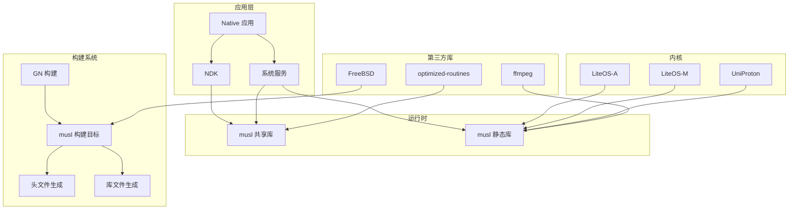
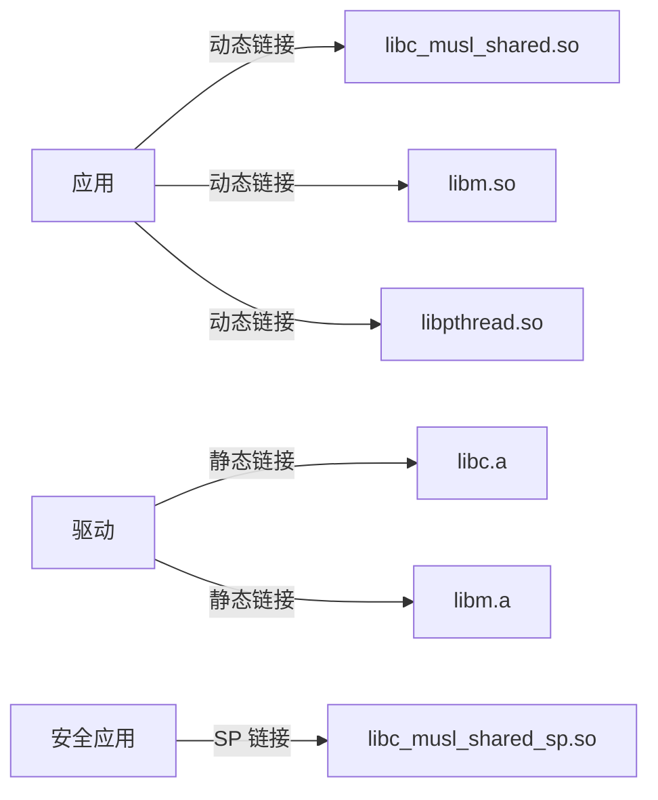

# 依赖关系与使用

> OpenHarmony musl 依赖关系和使用场景分析文档

---

## 1. 直接依赖者

### 1.1 核心构建系统依赖

| 模块 | BUILD.gn 路径 | 用途 | 依赖类型 |
|------|--------------|------|---------|
| **build/common/musl** | `build/common/musl/BUILD.gn` | 构建系统 musl 集成 | 静态链接/共享链接 |
| **build/lite** | `build/lite/BUILD.gn` | 轻量系统构建 | sysroot |
| **build/config** | `build/config/BUILD.gn` | 构建配置 | 头文件/库 |

#### build/common/musl 依赖详情

```python
# build/common/musl/BUILD.gn

# 动态链接器依赖
deps = [ "//third_party/musl:soft_create_linker" ]
deps += [ "//third_party/musl:soft_create_linker_sp" ]

# 共享库依赖
deps = [ "//third_party/musl:soft_libc_musl_shared" ]
```

### 1.2 内核集成

| 模块 | BUILD.gn 路径 | 用途 | 系统类型 |
|------|--------------|------|---------|
| **kernel/uniproton** | `kernel/uniproton/BUILD.gn` | UniProton RTOS | small |
| **kernel/liteos_a** | `kernel/liteos_a/liteos.gni` | LiteOS-A 内核 | standard |
| **kernel/liteos_m** | `kernel/liteos_m/liteos.gni` | LiteOS-M 内核 | mini |

#### UniProton 依赖

```python
# kernel/uniproton/BUILD.gn
deps += [ "//third_party/musl/porting/uniproton/kernel:kernel" ]
```

#### LiteOS-A 配置

```python
# kernel/liteos_a/liteos.gni
THIRDPARTY_MUSL_DIR = "//third_party/musl"
```

### 1.3 SDK/NDK 构建

| 模块 | BUILD.gn 路径 | 用途 | 架构支持 |
|------|--------------|------|---------|
| **interface/sdk_c** | `interface/sdk_c/third_party/musl/ndk_script/BUILD.gn` | NDK 构建 | arm/arm64/x86_64 |

#### NDK 依赖详情

```python
# interface/sdk_c/third_party/musl/ndk_script/BUILD.gn

# 静态库依赖
"//third_party/musl:soft_libc_musl_static",
"//third_party/musl:soft_libm",
"//third_party/musl:soft_libdl",
"//third_party/musl:soft_libpthread",
"//third_party/musl:soft_libcrypt",
"//third_party/musl:soft_libutil",
"//third_party/musl:soft_libxnet",
"//third_party/musl:soft_libresolv",
"//third_party/musl:soft_librt",

# 构建动作依赖
"//third_party/musl:create_alltypes_h",
"//third_party/musl:create_syscall_h",
"//third_party/musl:musl_copy_inc_bits",
```

### 1.4 测试依赖

| 模块 | BUILD.gn 路径 | 用途 |
|------|--------------|------|
| **test/xts** | `test/xts/acts/commonlibrary/toolchain/libc-test/BUILD.gn` | libc 功能测试 |
| **fuzztest** | `third_party/musl/fuzztest/atoi_fuzzer/BUILD.gn` | 模糊测试 |

#### libc-test 依赖

```python
# test/xts/acts/commonlibrary/toolchain/libc-test/BUILD.gn

# 头文件依赖
"//third_party/musl/porting/linux/user/include",

# 测试用例
deps = [ "//third_party/musl:libctest" ]
```

---

## 2. 系统服务依赖

### 2.1 基础服务

| 模块 | BUILD.gn 路径 | 用途 | 依赖方式 |
|------|--------------|------|---------|
| **startup/init** | `base/startup/init/services/param/base/BUILD.gn` | 初始化服务 | 头文件/库 |
| **hiviewdfx** | `build/lite/config/subsystem/hiviewdfx/BUILD.gn` | DFX 子系统 | 头文件 |

### 2.2 设备适配层

| 模块 | BUILD.gn 路径 | 用途 | 依赖类型 |
|------|--------------|------|---------|
| **rk2206 HAL** | `device/soc/rockchip/rk2206/adapter/hals/utils/file/BUILD.gn` | 文件操作 | porting 头文件 |
| **device_manager** | `foundation/distributedhardware/device_manager/interfaces/inner_kits/native_cpp/BUILD.gn` | 设备管理 | porting 头文件 |

#### 设备适配层依赖

```python
# device/soc/rockchip/rk2206/adapter/hals/utils/file/BUILD.gn
include_dirs += [ "//third_party/musl/porting/liteos_m/kernel/include" ]
```

---

## 3. 第三方库依赖

### 3.1 内部第三方库

| 库名称 | BUILD.gn 路径 | 用途 | 依赖类型 |
|--------|--------------|------|---------|
| **FreeBSD** | `third_party/FreeBSD/BUILD.gn` | BSD 兼容层 | 头文件/构建模板 |
| **optimized-routines** | `third_party/optimized-routines/BUILD.gn` | 优化数学函数 | 链接 |
| **ffmpeg** | `third_party/ffmpeg/BUILD.gn` | 多媒体框架 | 静态链接 |

#### FreeBSD 依赖

```python
# third_party/FreeBSD/BUILD.gn
"//third_party/musl/*",  # 复用 musl 构建模板
```

#### ffmpeg 依赖

```python
# third_party/ffmpeg/BUILD.gn
"third_party:ffmpeg # external_deps //third_party/musl:soft_libc_musl_static"
```

### 3.2 运行时依赖

| 库名称 | 构建配置路径 | 用途 | 依赖类型 |
|--------|-------------|------|---------|
| **cangjie_runtime** | `third_party/cangjie_runtime/runtime/config.cmake` | Cangjie 运行时 | sysroot |

#### Cangjie 运行时依赖

```cmake
# third_party/cangjie_runtime/runtime/config.cmake
set(CMAKE_C_FLAGS "${CMAKE_C_FLAGS} ${OHOS_INCLUDE} --sysroot=${OHOS_ROOT}/out/sdk/obj/third_party/musl/sysroot")
```

---

## 4. 工具链依赖

### 4.1 编译器工具链

| 工具链 | 配置路径 | 用途 |
|--------|---------|------|
| **ohos_clang_arm** | `build/toolchain/ohos:ohos_clang_arm` | ARM 32位工具链 |
| **ohos_clang_arm64** | `build/toolchain/ohos:ohos_clang_arm64` | ARM 64位工具链 |
| **ohos_clang_x86_64** | `build/toolchain/ohos:ohos_clang_x86_64` | x86_64 工具链 |

### 4.2 sysroot 配置

```python
# build/config/ohos/musl.gni
musl_target = "//third_party/musl:musl_libs"

import("//third_party/musl/musl_config.gni")
```

---

## 5. 使用场景

### 5.1 标准系统 (Standard System)

**使用 musl 的模块**：

| 场景 | 说明 | 链接方式 |
|------|------|---------|
| **Native 应用** | C/C++ 原生应用 | 动态链接 |
| **系统服务** | Foundation 服务 | 动态链接 |
| **Native 测试** | XTS 测试用例 | 静态链接 |

**链接示例**：
```python
deps = [ "//third_party/musl:soft_libc_musl_shared" ]
```

### 5.2 轻量系统 (Small System)

**使用 musl 的模块**：

| 场景 | 说明 | 链接方式 |
|------|------|---------|
| **LiteOS-A 内核** | 用户态 C 库 | 静态链接 |
| **系统服务** | 轻量服务 | 静态链接 |
| **NDK 开发** | 应用开发 | 动态链接 |

**链接示例**：
```python
# kernel/liteos_a/liteos.gni
THIRDPARTY_MUSL_DIR = "//third_party/musl"
```

### 5.3 微型系统 (Mini System)

**使用 musl 的模块**：

| 场景 | 说明 | 链接方式 |
|------|------|---------|
| **LiteOS-M 内核** | 用户态 C 库 | 静态链接 |
| **IoT 设备** | 轻量应用 | 静态链接 |
| **设备驱动** | HAL 层 | 静态链接 |

---

## 6. 链接方式详解

### 6.1 静态链接

**适用场景**：
- 嵌入式系统
- 最小化依赖
- 启动速度要求高

**静态库目标**：

| 目标名称 | 路径 | 说明 |
|---------|------|------|
| `soft_libc_musl_static` | `//third_party/musl:soft_libc_musl_static` | musl 静态库 |
| `soft_libm` | `//third_party/musl:soft_libm` | 数学库 |
| `soft_libpthread` | `//third_party/musl:soft_libpthread` | 线程库 |
| `soft_libc` | `//third_party/musl:soft_libc` | C 库主库 |

### 6.2 动态链接

**适用场景**：
- 多应用共享
- 系统更新灵活
- 内存占用优化

**共享库目标**：

| 目标名称 | 路径 | 说明 |
|---------|------|------|
| `soft_libc_musl_shared` | `//third_party/musl:soft_libc_musl_shared` | musl 共享库 |
| `soft_libc_musl_shared_sp` | `//third_party/musl:soft_libc_musl_shared_sp` | 安全增强共享库 |

### 6.3 安全特性链接

**SP (Secure Profile) 共享库**：

```python
# 使用安全增强版本的 musl
deps += [ "//third_party/musl:soft_create_linker_sp" ]
deps = [ "//third_party/musl:soft_libc_musl_shared_sp" ]
```

**安全特性**：
- ASLR 地址随机化
- RELRO 只读重定位
- CFI 控制流完整性

---

## 7. 头文件使用

### 7.1 标准头文件

```c
#include <stdio.h>
#include <stdlib.h>
#include <string.h>
#include <pthread.h>
#include <unistd.h>
```

### 7.2 OH 特有头文件

```c
#include "hilog/log.h"      // OHOS 日志
#include "securec.h"        // 安全内存函数
```

### 7.3 头文件路径配置

```python
# BUILD.gn 配置
include_dirs = [
    "//third_party/musl/include",
    "//third_party/musl/porting/linux/user/include",
]
```

---

## 8. 依赖关系图

### 8.1 系统依赖图



### 8.2 链接关系图



---

## 9. 编译产物

### 9.1 静态库产物

| 产物名称 | 路径 | 用途 |
|---------|------|------|
| `libc.a` | `out/{target}/obj/third_party/musl/libc.a` | C 库静态库 |
| `libm.a` | `out/{target}/obj/third_party/musl/libm.a` | 数学库 |
| `libpthread.a` | `out/{target}/obj/third_party/musl/libpthread.a` | 线程库 |

### 9.2 共享库产物

| 产物名称 | 路径 | 用途 |
|---------|------|------|
| `libc.so` | `out/{target}/lib/unknown/libc.so` | C 库共享库 |
| `libm.so` | `out/{target}/lib/unknown/libm.so` | 数学库 |
| `ld-musl-{arch}.so` | `out/{target}/lib/ld-musl-{arch}.so.1` | 动态链接器 |

### 9.3 头文件产物

| 产物路径 | 用途 |
|---------|------|
| `out/{target}/obj/third_party/musl/usr/include/` | 标准 C 头文件 |
| `out/{target}/obj/third_party/musl/usr/include/bits/` | 架构相关头文件 |

---

## 10. 版本兼容性

### 10.1 支持的架构

| 架构 | 状态 | 说明 |
|------|------|------|
| **arm** | ✅ 支持 | 32位 ARM (arm-linux-ohos) |
| **aarch64** | ✅ 支持 | 64位 ARM (arm-linux-ohos) |
| **x86_64** | ✅ 支持 | 64位 x86 (x86_64-linux-ohos) |
| **mips** | ✅ 支持 | MIPS 架构 |
| **riscv64** | ✅ 支持 | RISC-V 64位 |
| **loongarch64** | ✅ 支持 | 龙芯架构 |

### 10.2 系统类型支持

| 系统类型 | 支持状态 | 说明 |
|---------|---------|------|
| **mini** | ✅ 支持 | 微型系统 (LiteOS-M) |
| **small** | ✅ 支持 | 轻量系统 (LiteOS-A, UniProton) |
| **standard** | ✅ 支持 | 标准系统 (Linux) |

---

## 附录 A: 主要依赖模块清单

### A.1 核心模块 (必须依赖)

| 模块 | 最小依赖 | 用途 |
|------|---------|------|
| build/common/musl | musl 全部 | 系统构建 |
| kernel/liteos_a | porting/liteos_a | LiteOS-A 支持 |
| kernel/liteos_m | porting/liteos_m | LiteOS-M 支持 |

### A.2 可选模块

| 模块 | 可选依赖 | 用途 |
|------|---------|------|
| interface/sdk_c | musl_headers | NDK 构建 |
| test/xts | libctest | 测试 |
| third_party/ffmpeg | soft_libc_musl_static | 多媒体 |

### A.3 设备特定模块

| 设备 | 依赖路径 | 用途 |
|------|---------|------|
| rk2206 | porting/liteos_m/kernel/include | Rockchip HAL |
| hi3516dv300 | (Makefile) | 传感器 SDK |

---

## 附录 B: BUILD.gn 依赖示例

### B.1 静态链接示例

```python
# 静态链接 musl
deps = [
    "//third_party/musl:soft_libc_musl_static",
    "//third_party/musl:soft_libm",
    "//third_party/musl:soft_libpthread",
    "//third_party/musl:soft_libcrypt",
]

# 添加头文件路径
include_dirs = [
    "//third_party/musl/include",
    "//third_party/musl/porting/linux/user/include",
]
```

### B.2 动态链接示例

```python
# 动态链接 musl
deps = [
    "//third_party/musl:soft_libc_musl_shared",
]

# 配置链接器
ldflags = [
    "-l:libc.so",
    "-l:libm.so",
    "-l:libpthread.so",
]
```

### B.3 安全版本链接

```python
# 安全增强版本 (SP)
deps = [
    "//third_party/musl:soft_libc_musl_shared_sp",
    "//third_party/musl:soft_create_linker_sp",
]

# 启用安全特性
defines = [
    "MUSL_SECURE_ALL",
]
```

---

*文档版本: 1.0*
*最后更新: 2025-02-08*
