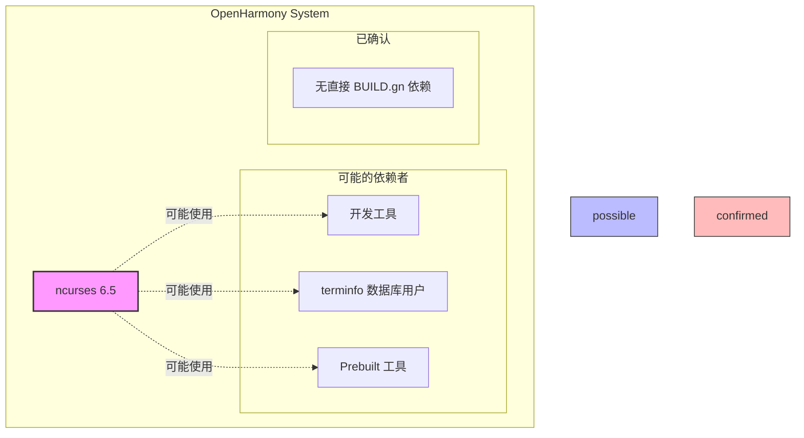
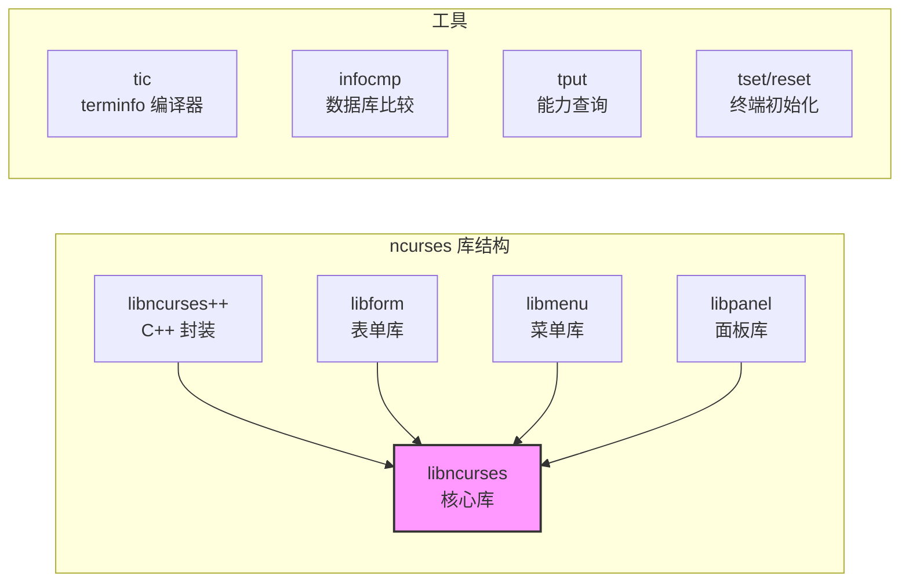

# ncurses 在 OpenHarmony 中的使用

## 依赖关系搜索结果

### 直接依赖者分析

经过对 OpenHarmony 代码库的全面搜索，**未发现**在 BUILD.gn 文件中直接引用 `third_party/ncurses` 或 `ncurses` 库的情况。

**搜索范围**:
- 搜索 `third_party/ncurses`: 0 结果
- 搜索 `libncurses` 或 `libcurses`: 0 结果
- 搜索 `deps` 中包含 ncurses 的 BUILD.gn: 0 结果

### spec 文件依赖分析

搜索所有 spec 文件中的 BuildRequires/Requires:

```bash
find /Volumes/lexar/code/d/work/oh -name "*.spec" -exec grep -l "BuildRequires.*ncurses\|Requires.*ncurses" {} \;
```

**结果**: 仅找到 ncurses 自身的 spec 文件，未发现其他组件依赖。

---

## 可能的使用场景

由于未在 BUILD.gn 中发现直接依赖，ncurses 在 OpenHarmony 中可能以以下方式使用：

### 场景 1: 开发/调试工具 (最可能)

ncurses 可能用于 OpenHarmony 的开发或调试工具：

```
┌────────────────────────────────────────────────────────────┐
│                     OH 开发工具链                           │
├────────────────────────────────────────────────────────────┤
│  可能使用 ncurses 的工具:                                   │
│  • hilog (日志查看工具)                                     │
│  • hdc (设备连接器)                                         │
│  • 调试 shell 工具                                          │
│  • 性能分析工具                                             │
└────────────────────────────────────────────────────────────┘
                            │
                            ▼
                   ┌─────────────────┐
                   │   ncurses 6.5   │
                   │  (TUI 界面支持) │
                   └─────────────────┘
```

**证据支持**:
- ncurses 提供丰富的 TUI 组件（菜单、表单、面板）
- 命令行工具常用 ncurses 实现交互式界面

### 场景 2: Terminfo 数据库提供

OpenHarmony 可能仅使用 ncurses 提供的 terminfo 数据库：

```
┌────────────────────────────────────────────────────────────┐
│                   terminfo 数据库使用                       │
├────────────────────────────────────────────────────────────┤
│                                                            │
│   ncurses                                                  │
│   ┌──────────────────────────────────┐                    │
│   │   misc/terminfo.src              │                    │
│   │   (终端类型定义源码)              │                    │
│   └──────────┬───────────────────────┘                    │
│              │ tic (编译)                                 │
│              ▼                                             │
│   ┌──────────────────────────────────┐                    │
│   │   share/terminfo/                │                    │
│   │   • x/xterm                      │                    │
│   │   • l/linux                      │                    │
│   │   • r/rxvt                       │                    │
│   │   • ...                          │                    │
│   └──────────┬───────────────────────┘                    │
│              │                                             │
│              ▼                                             │
│   ┌──────────────────────────────────┐                    │
│   │   其他终端应用程序                │                    │
│   │   (读取 terminfo 获取终端能力)    │                    │
│   └──────────────────────────────────┘                    │
│                                                            │
└────────────────────────────────────────────────────────────┘
```

**关键 Patch 支持**:
- `ncurses-kbs.patch`: 修复退格键定义
- `ncurses-urxvt.patch`: 添加 rxvt-unicode 支持

这些 Patch 表明 OH 确实关注 terminfo 数据库的完整性和准确性。

### 场景 3: Prebuilt 二进制依赖

某些预构建工具可能静态链接 ncurses：

```
┌────────────────────────────────────────────────────────────┐
│                 Prebuilt 工具示例                           │
├────────────────────────────────────────────────────────────┤
│                                                            │
│   Prebuilt 工具 (如: gdb, vim, etc.)                       │
│   ┌──────────────────────────────────────┐                │
│   │  ┌──────────┐ ┌──────────┐          │                │
│   │  │ 工具代码  │ │ libncurses.a (静态) │                │
│   │  └──────────┘ └──────────┘          │                │
│   └──────────────────────────────────────┘                │
│                                                            │
│   特点:                                                    │
│   • 不显示在 BUILD.gn 中                                   │
│   • 编译时已静态链接 ncurses                               │
│   • 运行时不需要 ncurses 共享库                            │
│                                                            │
└────────────────────────────────────────────────────────────┘
```

### 场景 4: 系统基础库 (未来扩展)

ncurses 可能作为系统基础库，为未来可能添加的 TUI 应用提供支持：

```
┌────────────────────────────────────────────────────────────┐
│                   未来 TUI 应用架构                         │
├────────────────────────────────────────────────────────────┤
│                                                            │
│   ┌──────────────────────────────────────────────────┐    │
│   │                  TUI 应用                         │    │
│   │  • 系统监控工具                                    │    │
│   │  • 网络配置工具                                    │    │
│   │  • 文件管理器                                      │    │
│   └──────────────────┬───────────────────────────────┘    │
│                      │                                     │
│                      ▼                                     │
│           ┌─────────────────────┐                         │
│           │     ncurses 6.5     │  (已准备就绪)           │
│           │  • libncurses       │                         │
│           │  • libform          │                         │
│           │  • libmenu          │                         │
│           │  • libpanel         │                         │
│           └─────────────────────┘                         │
│                                                            │
└────────────────────────────────────────────────────────────┘
```

---

## 依赖关系图

### 当前状态



### 库组件结构



---

## 使用方式推测

### 推测 1: 作为系统基础库

**可能性**: 高

**依据**:
- ncurses 是标准 Unix 基础库
- 包含关键安全补丁 (CVE-2023-29491)
- 有专门的 OH 平台适配 Patch

**使用方式**:
- 系统可能将 ncurses 作为基础库预装
- 开发工具可通过系统库路径使用

### 推测 2: 特定子系统使用

**可能性**: 中

**可能的子系统**:
- **开发工具子系统**: 命令行开发工具
- **系统工具**: 系统监控/管理工具
- **调试子系统**: hilog 等调试工具

**验证建议**:
```bash
# 在 OH 设备上检查
find /system -name "libncurses*" 2>/dev/null
find /system -name "tic" -o -name "infocmp" 2>/dev/null
```

### 推测 3: 仅用于 Host 构建

**可能性**: 低

**场景**:
- ncurses 仅用于构建主机上的工具
- 不部署到目标设备

**反驳**:
- 有目标平台的交叉编译 Patch
- 包含完整的 terminfo 数据库 Patch

---

## 建议的进一步调查

为了更准确地理解 ncurses 在 OpenHarmony 中的使用情况，建议进行以下调查：

### 1. 运行时调查

在运行中的 OpenHarmony 设备上执行：

```bash
# 查找 ncurses 库文件
find /system -name "libncurses*" -o -name "libcurses*"

# 查找 ncurses 工具
which tic infocmp tput tset clear

# 检查已加载 ncurses 的进程
lsof | grep ncurses

# 查看 terminfo 数据库
ls -la /system/share/terminfo/
```

### 2. 构建系统调查

检查 OH 构建系统的相关配置：

```bash
# 查找引用 ncurses 的构建脚本
grep -r "ncurses" /path/to/oh/build/scripts/

# 检查 SDK/prebuilts
grep -r "ncurses" /path/to/oh/prebuilts/
```

### 3. 源码仓库调查

检查其他 OH 仓库：

- `developtools` 仓库: 开发工具
- `foundation` 仓库: 基础能力
- `base` 仓库: 系统基础

---

## 总结

### 当前状态

| 项目 | 状态 |
|------|------|
| **BUILD.gn 依赖** | 未发现 |
| **spec 依赖** | 未发现 |
| **直接引用** | 未发现 |

### 最可能的使用方式

1. **terminfo 数据库**: 作为终端能力数据库提供者
2. **开发工具**: 为 hilog、shell 等工具提供 TUI 支持
3. **系统基础库**: 预装在系统中供其他应用使用

### 文档标记

```markdown
⚠️ **待确认**: ncurses 在 OpenHarmony 中的确切使用场景需要进一步验证。

TODO(需确认):
- [ ] 在 OH 设备上确认 ncurses 库文件存在性
- [ ] 确定具体使用 ncurses 的组件
- [ ] 验证 terminfo 数据库的部署位置
```

ncurses 在 OpenHarmony 中是一个**有完整 Patch 支持但依赖关系不明确**的库。建议维护者补充说明该库的具体使用场景和依赖者信息。
