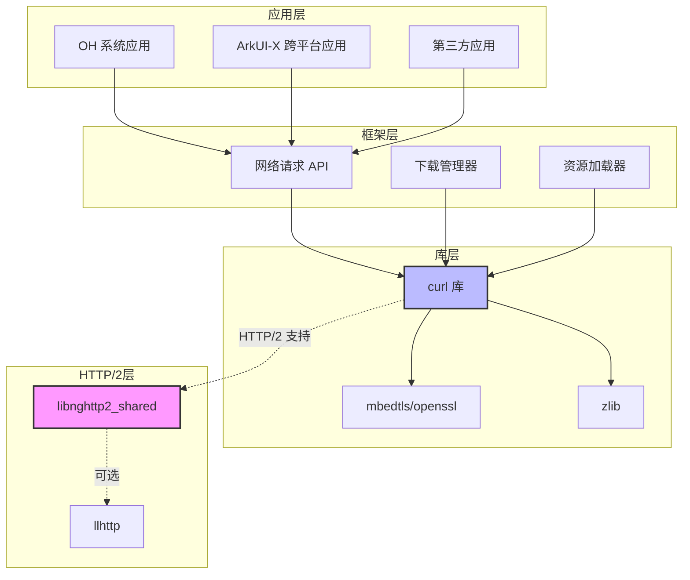
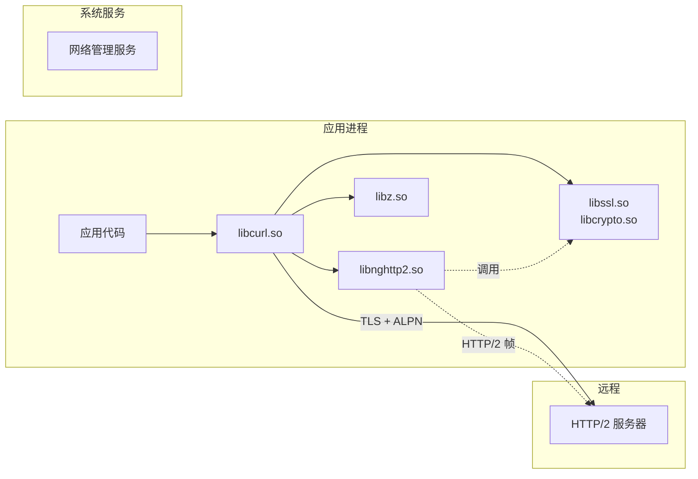

# OpenHarmony 中的依赖关系与使用

## 依赖关系总览

### 直接依赖者

| 模块 | BUILD.gn 路径 | 目标 | 用途 |
|-----|--------------|------|------|
| curl | `third_party/curl/BUILD.gn` | `nghttp2_lib_static` / `nghttp2_lib_shared` | HTTP/2 协议支持 |

**说明**: 经全面搜索，目前 OpenHarmony 代码库中只有 **curl** 直接依赖 nghttp2。

---

## curl 对 nghttp2 的使用

### 依赖配置

#### LiteOS 系统

```gn
# third_party/curl/BUILD.gn
if (ohos_kernel_type == "liteos_m") {
  static_library("libcurl_static") {
    deps = [ "//third_party/mbedtls" ]
    deps += [ "//third_party/nghttp2/lib:nghttp2_lib_static" ]
    ...
  }
} else {
  shared_library("libcurl_shared") {
    deps = [ "//third_party/mbedtls" ]
    deps += [ "//third_party/nghttp2/lib:nghttp2_lib_shared" ]
    ...
  }
}
```

#### 标准系统 (Standard)

```gn
# third_party/curl/BUILD.gn
if (is_arkui_x) {
  deps = [
    "//third_party/nghttp2/lib:libnghttp2_shared",
    "//third_party/openssl:libcrypto_shared",
    "//third_party/openssl:libssl_shared",
    "//third_party/zlib:shared_libz",
  ]
} else {
  external_deps += [
    "nghttp2:libnghttp2_shared",
    "openssl:libcrypto_shared",
    "openssl:libssl_shared",
    "zlib:shared_libz",
  ]
}
```

### 使用场景

curl 使用 nghttp2 实现以下 HTTP/2 功能：

| 功能 | 说明 | nghttp2 API |
|------|------|------------|
| **HTTP/2 over TLS** | 通过 ALPN 协商 HTTP/2 | `nghttp2_session_client_new2()` |
| **HTTP/2 cleartext** | h2c 直接连接 | `nghttp2_session_upgrade2()` |
| **多路复用** | 单连接多请求 | `nghttp2_submit_request()` |
| **服务器推送** | 接收服务端推送 | `nghttp2_submit_push_promise()` |
| **头部压缩** | HPACK 压缩 | `nghttp2_hd_deflate_*()` |
| **流优先级** | 请求优先级控制 | `nghttp2_priority_spec_init()` |

### 初始化流程

```
curl 初始化 HTTP/2 连接时:
1. SSL 握手 + ALPN (协商 h2)
2. nghttp2_session_client_new2() - 创建会话
3. nghttp2_session_callbacks_set_*() - 设置回调
4. 发送 HTTP/2 连接序言 (preface)
5. 开始多路复用传输
```

---

## 依赖关系图

### 完整依赖链



### 运行时依赖



---

## 使用场景分析

### 场景一：应用发起 HTTPS 请求

**流程**:
1. 应用调用网络请求 API
2. 框架层调用 curl
3. curl 解析 URL (https://)
4. curl 建立 TLS 连接
5. TLS ALPN 协商 HTTP/2
6. curl 调用 nghttp2 进行 HTTP/2 帧处理
7. 完成请求/响应传输

**涉及组件**:
- 应用框架 → curl → nghttp2 → openssl

### 场景二：ArkUI-X 跨平台应用

**流程**:
1. ArkUI-X 应用使用标准网络 API
2. 框架内部使用 curl 作为后端
3. 自动支持 HTTP/2（如果服务器支持）

**特点**:
- 应用无感知
- 自动协商 HTTP/2
- 享受多路复用性能优势

### 场景三：系统服务（OTA 更新）

**流程**:
1. 系统更新服务请求 OTA 包
2. 通过 curl 下载
3. 如果服务器支持，使用 HTTP/2
4. 多路复用加速下载

---

## 静态链接 vs 动态链接

### LiteOS (轻量级设备)

```
┌────────────────────────────────────────────┐
│              应用程序                        │
│  ┌──────────────────────────────────────┐  │
│  │  应用代码                              │  │
│  │  + libcurl.a (静态)                   │  │
│  │  + libnghttp2.a (静态)                │  │
│  │  + libmbedtls.a (静态)                │  │
│  └──────────────────────────────────────┘  │
└────────────────────────────────────────────┘
```

**特点**:
- 无动态库开销
- 单文件部署
- 适合资源受限设备

### 标准系统 (富设备)

```
┌────────────────────────────────────────────┐
│              应用程序                        │
│  ┌──────────────────────────────────────┐  │
│  │  应用代码                              │  │
│  │  + libcurl.so (动态链接)              │  │
│  └──────────────────────────────────────┘  │
└────────────────────────────────────────────┘
                    │
                    ▼
        ┌───────────────────────┐
        │    libcurl.so         │
        │  (依赖 libnghttp2.so)  │
        └───────────┬───────────┘
                    │
        ┌───────────▼───────────┐
        │   libnghttp2.so       │
        └───────────────────────┘
```

**特点**:
- 共享库节省内存
- 独立更新组件
- 适合多应用系统

---

## 头文件引用方式

### 方式一：标准路径（推荐）

```c
#include <nghttp2/nghttp2.h>

// 使用 API
nghttp2_session *session;
nghttp2_session_client_new2(&session, callbacks, NULL, option);
```

**BUILD.gn 配置**:
```gn
external_deps += [ "nghttp2:libnghttp2_shared" ]
```

### 方式二：直接路径

```c
#include <nghttp2.h>
```

**适用场景**:
- 内部开发
- 与上游代码保持一致

---

## 性能影响

### HTTP/2 带来的性能提升

| 指标 | HTTP/1.1 | HTTP/2 | 提升 |
|------|----------|--------|------|
| **并发请求** | 6-8 (浏览器限制) | 无限制 | 大幅提升 |
| **头部大小** | 完整文本 | HPACK 压缩 | 减少 80%+ |
| **连接数** | 每域名多个 | 单一长连接 | 减少资源消耗 |
| **服务器推送** | 不支持 | 支持 | 减少往返延迟 |

### OH 中的实际收益

1. **应用启动加速**: 资源并行加载
2. **系统更新加速**: OTA 包下载更快
3. **云服务同步**: 减少流量消耗

---

## 维护建议

### 版本兼容性

| 组件 | 接口稳定性 | 升级风险 |
|------|-----------|---------|
| nghttp2 | 高 (C API 稳定) | 低 |
| curl | 中 | 中 |
| openssl | 中 | 中 |

### 升级检查清单

升级 nghttp2 时：

- [ ] 检查 curl 兼容性（主要使用者）
- [ ] 验证 libnghttp2_shared.map 是否需要更新
- [ ] 测试 HTTP/2 基本功能（nghttp2.org）
- [ ] 测试 HTTP/2 + TLS (ALPN)
- [ ] 在 LiteOS 和 Standard 系统分别验证
- [ ] 性能测试（多路复用、头部压缩）

### 故障排查

**问题**: curl 无法使用 HTTP/2

**检查步骤**:
1. 确认 curl 编译时启用了 HTTP/2 支持
2. 检查 nghttp2 是否正确链接: `ldd libcurl.so | grep nghttp2`
3. 测试连接: `curl --http2 -v https://nghttp2.org/`
4. 查看 ALPN 协商结果

---

## 总结

### 关键结论

1. **单一依赖者**: 目前只有 curl 直接使用 nghttp2
2. **间接使用广泛**: 通过 curl，所有使用网络功能的应用间接受益
3. **透明集成**: 应用无需修改即可享受 HTTP/2 性能提升
4. **低维护成本**: 依赖关系简单，升级风险低

### 依赖统计

| 层级 | 模块数 | 说明 |
|------|--------|------|
| 直接依赖 | 1 | curl |
| 间接依赖 | 大量 | 所有使用 curl 的模块 |
| 无依赖 | N/A | - |

### 推荐实践

- **应用开发者**: 使用 curl API，自动获得 HTTP/2 支持
- **系统开发者**: 如需直接使用 HTTP/2 帧层，可依赖 `libnghttp2_shared`
- **维护人员**: 关注 curl 和 nghttp2 的版本兼容性
