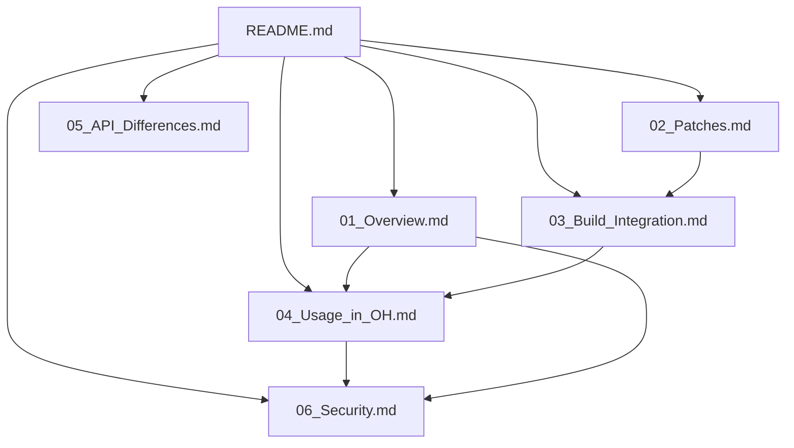

# 阅读路线建议

## 按角色阅读

### 如果你是系统开发者

**阅读顺序**:
1. [01_Overview.md](./01_Overview.md) - 了解 nghttp2 在 OH 中的定位
2. [03_Build_Integration.md](./03_Build_Integration.md) - 理解构建系统配置
3. [04_Usage_in_OH.md](./04_Usage_in_OH.md) - 查看依赖关系

**重点关注**:
- 如何在自己的模块中使用 nghttp2
- BUILD.gn 中的配置选项
- 头文件路径和链接方式

### 如果你负责库维护/升级

**阅读顺序**:
1. [01_Overview.md](./01_Overview.md) - 版本和许可证信息
2. [02_Patches.md](./02_Patches.md) - **必读** - Patch 分析和升级建议
3. [03_Build_Integration.md](./03_Build_Integration.md) - 构建配置细节
4. [06_Security.md](./06_Security.md) - 安全注意事项

**重点关注**:
- Patch 的修改范围和影响
- 升级时的兼容性风险
- 版本脚本 (libnghttp2_shared.map) 的更新

### 如果你是安全审计人员

**阅读顺序**:
1. [06_Security.md](./06_Security.md) - 安全风险总览
2. [02_Patches.md](./02_Patches.md) - Patch 是否引入新攻击面
3. [01_Overview.md](./01_Overview.md) - 了解功能边界

**重点关注**:
- 已知 CVE 及修复状态
- HPACK 解码器的安全机制
- 流控制和速率限制

### 如果你是应用开发者

**阅读顺序**:
1. [01_Overview.md](./01_Overview.md) - 库功能简介
2. [04_Usage_in_OH.md](./04_Usage_in_OH.md) - 谁在使用、使用场景

**重点关注**:
- 通过 curl 间接使用 HTTP/2 功能
- 不直接操作 nghttp2 API

## 文档依赖图

## 快速参考

| 我想了解... | 推荐阅读 |
|------------|---------|
| 这是什么库？ | [01_Overview.md](./01_Overview.md) |
| 有哪些 Patch？ | [02_Patches.md](./02_Patches.md) |
| 如何构建？ | [03_Build_Integration.md](./03_Build_Integration.md) |
| 谁在用它？ | [04_Usage_in_OH.md](./04_Usage_in_OH.md) |
| 安全吗？ | [06_Security.md](./06_Security.md) |
| 可以升级吗？ | [02_Patches.md](./02_Patches.md) 的升级建议部分 |

## 时间有限的读者

如果只有 5 分钟：
1. 阅读本页上方的「关键信息速览」
2. 查看 [02_Patches.md](./02_Patches.md) 的 Patch 清单表

如果只有 15 分钟：
1. 阅读 [01_Overview.md](./01_Overview.md)
2. 阅读 [04_Usage_in_OH.md](./04_Usage_in_OH.md) 的「依赖关系图」
3. 阅读 [02_Patches.md](./02_Patches.md) 的结论部分
