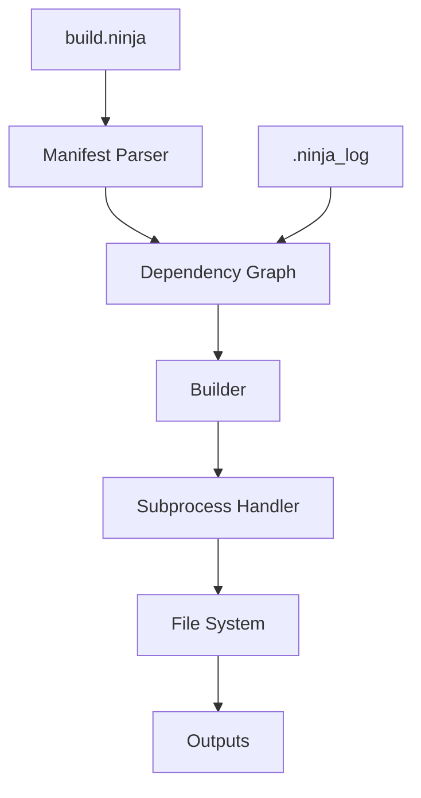
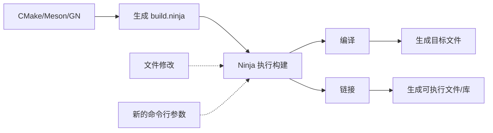

# Ninja 原始库简介

## 1.1 基本信息

| 属性 | 值 |
|------|-----|
| **库名称** | ninja |
| **当前版本** | v1.12.0 |
| **许可证** | Apache License V2.0 |
| **上游地址** | https://github.com/ninja-build/ninja |
| **官方文档** | https://ninja-build.org/manual.html |
| **首次发布** | 2012 年 |
| **主要维护者** | Ninja community |

## 1.2 项目简介

### 是什么

Ninja 是一个**专注于构建速度的小型构建系统**。它的设计理念是：

> "Ninja is a small build system that focuses on speed."

### 设计目标

1. **极速增量构建**：Ninja 将构建文件解析和依赖图构建的时间降到最低
2. **简单构建语言**：使用简洁的 `build.ninja` 语法，易于理解和生成
3. **最小化重复工作**：严格追踪输入文件的修改，只重新构建必要的部分
4. **跨平台支持**：原生支持 Linux、macOS、Windows

### 与其他构建系统的对比

| 特性 | Ninja | Make | CMake (full build) |
|------|-------|------|---------------------|
| **增量构建速度** | 极快 | 快 | 慢 |
| **配置复杂度** | 低 | 低 | 高 |
| **依赖图构建** | 即时 | 即时 | 慢 |
| **学习曲线** | 陡峭 | 平缓 | 中等 |
| **适用场景** | 频繁增量编译 | 简单项目 | 复杂项目配置 |

Ninja 通常不直接编写构建文件，而是由 CMake、Meson、GN 等元构建系统生成 Ninja 文件，然后由 Ninja 执行实际构建。

## 1.3 核心特性

### 极速增量构建

Ninja 的核心优化在于减少增量构建时的开销：

```
Make:     解析 Makefile → 计算依赖 → 执行构建
Ninja:    读取 manifest → 执行构建
```

对于大型项目，Ninja 的增量构建时间通常是 Make 的 10-100 倍。

### 简单语法

```ninja
# build.ninja 示例
rule cc
  command = gcc -c $in -o $out
  depfile = $out.d

build foo.o: cc foo.c
  depfile = foo.o.d

build bar.o: cc bar.c
  depfile = bar.o.d

build program: link foo.o bar.o
```

### 严格依赖追踪

- 每个构建规则可以指定 `depfile`（gcc 的 `.d` 文件）
- 自动追踪隐式依赖（头文件等）
- 支持动态依赖（`dyndep`）

### 增量状态存储

Ninja 将构建状态存储在 `.ninja_log` 文件中，记录：
- 每个输出文件的修改时间
- 输入文件的哈希值
- 构建规则使用的命令

## 1.4 架构设计

### 核心组件



| 组件 | 功能 |
|------|------|
| **Manifest Parser** | 解析 `build.ninja` 文件 |
| **Dependency Graph** | 构建依赖关系图 |
| **Builder** | 执行构建计划 |
| **Subprocess Handler** | 调用外部命令（编译器等） |
| **File System** | 文件操作接口 |

### 命令行接口

```bash
# 基本用法
ninja [options] [targets...]

# 常用选项
ninja -C <dir>      # 切换工作目录
ninja -j <N>        # 并行作业数
ninja -k <N>        # 失败时继续 N 个作业
ninja -n            # Dry-run（仅显示不执行）
ninja -t <tool>     # 运行工具（browse, deps, query 等）

# 示例
ninja              # 构建默认目标
ninja -j8          # 使用 8 个并行作业
ninja clean        # 清理构建产物
```

## 1.5 使用场景

### 典型工作流



### 适用项目

Ninja 特别适合以下场景：

| 场景 | 推荐程度 | 说明 |
|------|---------|------|
| **大型 C/C++ 项目** | ⭐⭐⭐⭐⭐ | 增量编译收益最大 |
| **频繁编译循环** | ⭐⭐⭐⭐⭐ | 开发调试阶段 |
| **CI/CD 流水线** | ⭐⭐⭐⭐ | 增量构建加速 |
| **多平台项目** | ⭐⭐⭐⭐ | 统一构建体验 |
| **小型项目** | ⭐⭐⭐ | 收益有限，可不使用 |
| **一次性完整构建** | ⭐⭐ | 首次构建速度与 Make 相当 |

## 1.6 与 OpenHarmony 的关系

### 为什么 OH 包含 Ninja

OpenHarmony 包含 Ninja 的原因：

1. **构建系统架构**：OH 使用 GN 生成构建文件，需要 Ninja 执行实际构建
2. **性能优化**：大型项目的增量构建需要 Ninja 的速度优势
3. **工具链标准化**：统一的构建工具链确保跨平台构建一致性

### 在 OH 中的角色

```
用户 → hb build → GN 生成 build.ninja → Ninja 执行编译 → 目标文件
```

Ninja 位于构建流程的最底层，负责调用编译器、链接器等工具完成实际构建工作。

## 1.7 版本信息

### 当前版本：v1.12.0

**主要特性**（v1.12.0）：

- 性能优化和 bug 修复
- 更好的 Windows 支持
- 改进了对大型项目的处理能力

### 版本历史摘要

| 版本 | 发布日期 | 主要变更 |
|------|---------|---------|
| v1.12.0 | 2023 | 当前 OH 使用版本 |
| v1.11.0 | 2022 | 性能改进 |
| v1.10.0 | 2021 | 稳定版本 |

## 1.8 参考资源

### 官方资源

| 资源 | 链接 |
|------|------|
| **GitHub 仓库** | https://github.com/ninja-build/ninja |
| **官方手册** | https://ninja-build.org/manual.html |
| **发布页面** | https://github.com/ninja-build/ninja/releases |
| **Wiki** | https://github.com/ninja-build/ninja/wiki |

### 学习资源

- **五分钟入门**：https://github.com/ninja-build/ninja#running-ninja
- **进阶用法**：https://ninja-build.org/manual.html#_tips_for_more_speed
- **FAQ**：https://github.com/ninja-build/ninja/wiki/FAQ

---

**上一级**：../README.md
**下一级**：[02_Patches.md](./02_Patches.md)
