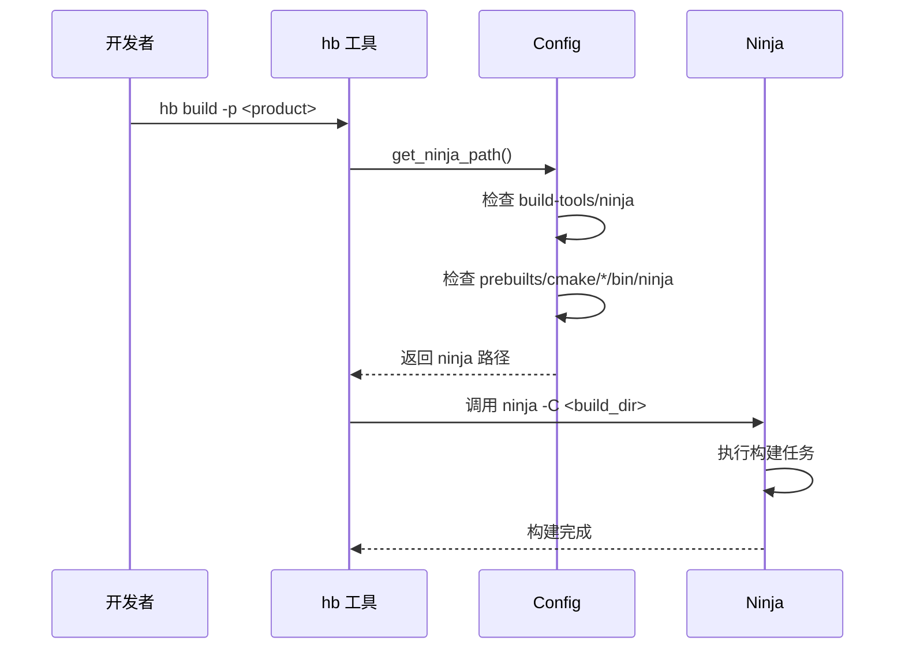

# OpenHarmony 构建适配

## 概述

Ninja 在 OpenHarmony 中的集成方式**与其他第三方库不同**。它不是通过 GN 构建系统编译的库，而是作为**预编译构建工具**被 OH 构建系统直接调用。

---

## 集成方式

### 架构定位

```
┌─────────────────────────────────────────────────────────┐
│                   OpenHarmony 构建栈                    │
├─────────────────────────────────────────────────────────┤
│  用户接口层                                               │
│  hb (HarmonyOS Build) CLI 工具                          │
├─────────────────────────────────────────────────────────┤
│  元构建层                                                │
│  GN (Generator Ninja) → 生成 build.ninja               │
├─────────────────────────────────────────────────────────┤
│  构建执行层                                              │
│  Ninja → 调用 gcc/clang/msvc → 生成目标文件              │
├─────────────────────────────────────────────────────────┤
│  工具层                                                  │
│  third_party/ninja (可执行文件)                         │
└─────────────────────────────────────────────────────────┘
```

### 目录结构

```
third_party/
└── ninja/
    ├── README.md              # Ninja 官方 README
    ├── README.OpenSource       # OH 开源声明
    ├── bundle.json             # OH 组件配置
    ├── COPYING                 # Apache 2.0 许可证
    ├── configure.py            # Ninja 构建脚本（上游）
    ├── CMakeLists.txt          # CMake 构建配置（上游）
    ├── src/                    # Ninja 源代码（上游）
    │   ├── ninja.cc           # 主程序入口
    │   ├── build.cc           # 构建执行逻辑
    │   └── ...
    └── ...（其他上游文件）
```

### 与标准 GN 项目的对比

| 特性 | 标准 GN 库 | Ninja (OH) |
|------|-----------|-----------|
| **构建系统** | GN | Python configure.py / CMake |
| **BUILD.gn** | ✅ 存在 | ❌ 不存在 |
| **编译输出** | .a / .so 库 | ninja 可执行文件 |
| **使用方式** | 静态/动态链接 | 命令行调用 |
| **OH 适配** | 需要 BUILD.gn | 无需适配 |

---

## 组件配置

### bundle.json 配置

```json
{
  "name": "@ohos/ninja",
  "description": "a small build system with a focus on speed",
  "version": "3.1",
  "license": "Apache V2",
  "publishAs": "code-segment",
  "segment": {
    "destPath": "third_party/ninja"
  },
  "component": {
    "name": "ninja",
    "subsystem": "thirdparty",
    "adapted_system_type": ["mini", "small", "standard"],
    "build": {
      "sub_component": [],
      "inner_kits": [],
      "test": []
    }
  }
}
```

### 配置说明

| 字段 | 值 | 说明 |
|------|-----|------|
| `publishAs` | `code-segment` | 发布为代码段，非编译库 |
| `destPath` | `third_party/ninja` | 安装路径 |
| `subsystem` | `thirdparty` | 属于第三方子系统 |
| `adapted_system_type` | mini/small/standard | 支持所有 OH 系统类型 |

### 与其他库的对比

```json
// 标准库示例（有 BUILD.gn）
{
  "publishAs": "code-segment",
  "segment": { "destPath": "third_party/curl" }
  // 无 deps.build.sub_component
}

// Ninja 示例（无 BUILD.gn）
{
  "publishAs": "code-segment", 
  "segment": { "destPath": "third_party/ninja" }
  // 配置相同，但 ninja 无 BUILD.gn
}
```

**关键差异**：两者都发布为 `code-segment`，但：
- 标准库：通过 BUILD.gn 被其他模块依赖
- Ninja：无 BUILD.gn，仅作为工具存在

---

## 预编译机制

### 构建产物

Ninja 的构建产物是**单个可执行文件**：

| 平台 | 产物路径 | 文件名 |
|------|---------|--------|
| Linux | prebuilts/cmake/linux-x86/bin/ | ninja |
| macOS | prebuilts/cmake/darwin-universal/bin/ | ninja |
| Windows | prebuilts/cmake/windows-x86/bin/ | ninja.exe |

### 预下载脚本

OH 的 `build/prebuilts_download.sh` 负责管理 Ninja：

```bash
# 检查并下载 Ninja（伪代码）
if [ ! -f "$prebuilts_path/bin/ninja" ]; then
    download_ninja
fi

# 清理旧版本（升级时）
if [ -f "$prebuilts_path/bin/ninja" ]; then
    echo "remove ninja in cmake"
    rm -rf "$prebuilts_path/bin/ninja"
fi
```

### 预编译 vs 源码编译

| 方式 | 优点 | 缺点 |
|------|------|------|
| **预编译** | 构建快、无需编译环境 | 平台受限 |
| **源码编译** | 平台无关、定制灵活 | 构建时间长 |

**当前 OH 选择**：预编译 + 源码并存
- `prebuilts/cmake/*/bin/ninja`：预编译产物
- `third_party/ninja/`：源码，供需要时编译

---

## 构建系统集成

### hb 工具配置

OH 构建工具（hb）在 `build/hb/resources/config.py` 中配置 Ninja：

```python
class Config:
    @property
    def ninja_path(self):
        # 优先级1：build-tools 中的 ninja
        repo_ninja_path = os.path.join(self.build_tools_path, 'ninja')
        
        # 检查文件是否存在
        if os.path.isfile(repo_ninja_path):
            return repo_ninja_path
        
        # 优先级2：prebuilts 中的 ninja
        # ... 其他路径
        
        # 不存在则报错
        raise Exception(f'ninja not found at {repo_ninja_path}')
```

### 调用流程



### 错误处理

hb 工具对 Ninja 错误有专门的处理：

```python
def get_ninja_failed_log(log_path):
    """提取 Ninja 构建失败日志"""
    failed_pattern = re.compile(r'(ninja: (?:error|fatal):.*?)\n', re.DOTALL)
    # ... 解析错误信息
```

---

## 构建选项

### Ninja 命令行参数

OH 构建系统常用的 Ninja 参数：

| 参数 | 用途 | 示例 |
|------|------|------|
| `-j <N>` | 并行作业数 | `-j8`（8核并行） |
| `-C <dir>` | 指定工作目录 | `-C out/ohos-arm-release` |
| `-t clean` | 清理构建产物 | `-t clean` |
| `-n` | Dry-run 模式 | `-n` |
| `-v` | 详细输出 | `-v` |

### 在 OH 中的使用示例

```bash
# 完整构建
python3 build/hb/build.py -p <product>

# GN 阶段（仅生成 build.ninja）
python3 build/hb/build.py -p <product> --gn-only

# 构建阶段（仅执行 Ninja）
python3 build/hb/build.py -p <product> --build-only

# 清理后构建
python3 build/hb/build.py -p <product> --clean
```

---

## 性能配置

### 并行度优化

Ninja 的 `-j` 参数直接影响构建速度：

| 配置 | 场景 | 建议 |
|------|------|------|
| `-j1` | 调试构建错误 | 禁用并行以定位问题 |
| `-j$(nproc)` | 常规构建 | 使用所有 CPU 核心 |
| `-j<CPU数-1>` | 低内存设备 | 避免内存不足 |

### OH 默认配置

```python
# build/hb/internal/config.py (伪代码)
DEFAULT_PARALLEL_JOBS = os.cpu_count()  # 默认使用所有核心
```

---

## 与其他构建工具的关系

### GN → Ninja

```
GN 元构建
    ↓
生成 build.ninja
    ↓
Ninja 执行构建
```

| 工具 | 角色 | 输入 | 输出 |
|------|------|------|------|
| **GN** | 元构建系统 | BUILD.gn | build.ninja |
| **Ninja** | 构建执行器 | build.ninja | .o/.a/.so |

### Ninja vs Make

| 特性 | Ninja | Make |
|------|-------|------|
| **增量速度** | ⚡ 极快 | 快 |
| **首次构建** | 快 | 快 |
| **并行支持** | 原生 | 支持 |
| **依赖追踪** | 严格 | 依赖声明 |

---

## 故障排除

### 常见问题

| 问题 | 可能原因 | 解决方案 |
|------|---------|---------|
| Ninja 找不到 | 未运行 prebuilts_download.sh | 执行 `./build/prebuilts_download.sh` |
| 构建卡住 | 并行度过高 | 降低 `-j` 参数 |
| 编译失败 | 编译器问题 | 检查 `ninja -v` 输出 |
| 增量失效 | `.ninja_log` 损坏 | 删除 `.ninja_log` 重新构建 |

### 诊断命令

```bash
# 查看 Ninja 版本
./third_party/ninja/ninja --version

# 查看帮助
./third_party/ninja/ninja --help

# Dry-run（显示将要执行的命令）
cd <build_dir>
./third_party/ninja/ninja -n

# 显示依赖关系
./third_party/ninja/ninja -t deps <target>

# 列出所有目标
./third_party/ninja/ninja -t targets
```

---

## 总结

### 集成特点

| 特点 | 说明 |
|------|------|
| **集成方式** | 预编译可执行文件 + 源码 |
| **构建系统** | Python configure.py / CMake |
| **GN 适配** | 无需 BUILD.gn |
| **Patch** | 无需任何 Patch |
| **维护成本** | 低 |

### 关键文件

| 文件 | 作用 |
|------|------|
| `build/prebuilts_download.sh` | Ninja 预下载脚本 |
| `build/hb/resources/config.py` | Ninja 路径配置 |
| `build/hb/util/log_util.py` | Ninja 错误日志处理 |
| `bundle.json` | OH 组件声明 |

---

**上一级**：[02_Patches.md](./02_Patches.md)
**下一级**：[04_Usage_in_OH.md](./04_Usage_in_OH.md)
