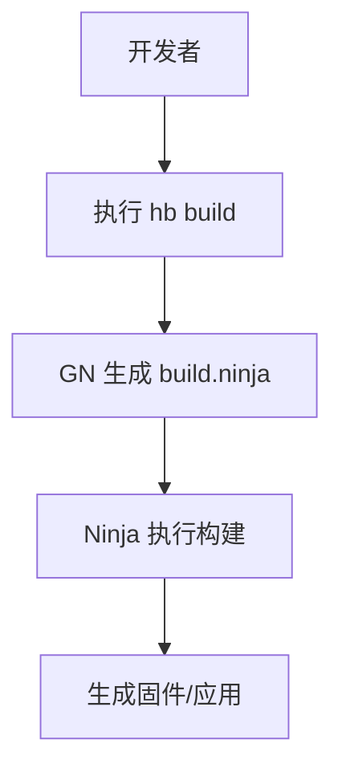
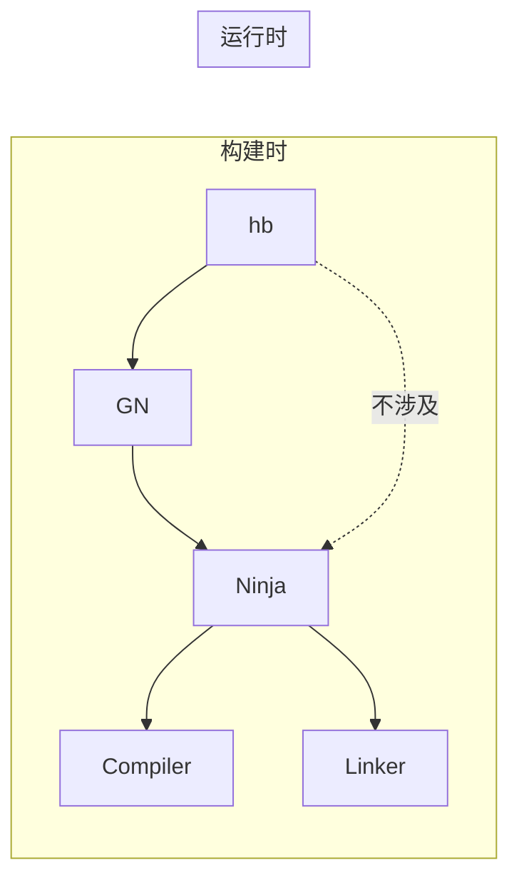

# Ninja 在 OpenHarmony 中的使用

## 概述

Ninja 在 OpenHarmony 中作为**构建执行引擎**被使用。它是 OH 构建系统的底层工具，负责将 GN 生成的 `build.ninja` 文件转换为实际的编译和链接操作。

---

## 使用者分析

### 直接依赖者

**搜索结果**：

```bash
grep -r "third_party/ninja" /Volumes/lexar/code/d/work/oh/ --include="BUILD.gn"
# 结果：无直接 BUILD.gn 依赖
```

**结论**：Ninja **不通过 GN 被任何模块静态链接**。

### 使用方式

| 维度 | 说明 |
|------|------|
| **链接方式** | 不链接（命令行调用） |
| **头文件引用** | 不涉及 |
| **二进制调用** | 通过命令行执行 |
| **运行时使用** | ❌ 仅构建时使用 |

---

## 使用场景

### 场景 1：完整产品构建



**命令**：

```bash
# 完整构建流程
python3 build/hb/build.py -p <product_name>
```

**内部流程**：

```python
# build/hb/internal/builder.py (伪代码)
def build(self):
    # 1. 配置阶段
    self.run_gn()
    
    # 2. 构建阶段 - 调用 Ninja
    self.run_ninja(
        ninja_path=self.config.ninja_path,
        build_dir=self.build_dir,
        parallel_jobs=self.config.jobs
    )
    
    # 3. 后处理
    self.post_process()
```

### 场景 2：仅生成阶段

```bash
# 仅执行 GN，生成 build.ninja，不调用 Ninja
python3 build/hb/build.py -p <product> --gn-only
```

### 场景 3：仅构建阶段

```bash
# 跳过 GN，直接执行 Ninja（假设 build.ninja 已存在）
python3 build/hb/build.py -p <product> --build-only
```

### 场景 4：增量构建

```bash
# 修改代码后，增量构建
python3 build/hb/build.py -p <product>

# Ninja 自动检测修改，仅重新构建必要的目标
```

### 场景 5：清理构建

```bash
# 清理并重新构建
python3 build/hb/build.py -p <product> --clean
python3 build/hb/build.py -p <product>
```

---

## 集成架构

### 构建栈

```
┌─────────────────────────────────────────────────────────┐
│                    开发者                               │
│  $ hb build -p ohos-arm64                               │
└─────────────────────────────────────────────────────────┘
                          ↓
┌─────────────────────────────────────────────────────────┐
│                 hb 构建工具                             │
│  - 配置管理                                              │
│  - GN 调用                                               │
│  - Ninja 调用                                           │
│  - 错误处理                                              │
└─────────────────────────────────────────────────────────┘
                          ↓
┌─────────────────────────────────────────────────────────┐
│                 GN 元构建系统                            │
│  - 解析 BUILD.gn                                        │
│  - 生成 build.ninja                                     │
│  - 依赖分析                                              │
└─────────────────────────────────────────────────────────┘
                          ↓
┌─────────────────────────────────────────────────────────┐
│              Ninja 构建引擎 ⬅️ 我们在这里               │
│  - 读取 build.ninja                                     │
│  - 调度编译任务                                          │
│  - 调用编译器/链接器                                     │
│  - 追踪依赖变化                                          │
└─────────────────────────────────────────────────────────┘
                          ↓
┌─────────────────────────────────────────────────────────┐
│              编译工具链                                  │
│  - gcc/clang (C/C++ 编译)                               │
│  - ar/ld (归档/链接)                                    │
│  - other (资源编译、代码生成等)                         │
└─────────────────────────────────────────────────────────┘
```

### 调用关系图



**关键点**：Ninja 仅在**构建时**被调用，不参与任何**运行时**操作。

---

## 关键代码位置

### hb 工具中的 Ninja 调用

| 文件 | 作用 |
|------|------|
| `build/hb/build.py` | 构建入口，调用 Ninja |
| `build/hb/internal/builder.py` | 构建执行逻辑 |
| `build/hb/resources/config.py` | Ninja 路径配置 |
| `build/hb/util/log_util.py` | Ninja 日志处理 |
| `build/prebuilts_download.sh` | Ninja 预下载 |

### 示例代码

**路径查找**：

```python
# build/hb/resources/config.py
@property
def ninja_path(self):
    """获取 Ninja 可执行文件路径"""
    paths = [
        os.path.join(self.build_tools_path, 'ninja'),
        os.path.join(self.prebuilts_path, 'cmake/linux-x86/bin/ninja'),
        os.path.join(self.prebuilts_path, 'cmake/darwin-universal/bin/ninja'),
    ]
    
    for path in paths:
        if os.path.isfile(path):
            return path
    
    raise Exception(f'Ninja not found. Please run build/prebuilts_download.sh')
```

**执行调用**：

```python
# build/hb/internal/builder.py
def run_ninja(self, ninja_path, build_dir, targets=None, jobs=None):
    """执行 Ninja 构建"""
    cmd = [
        ninja_path,
        '-C', build_dir,
        '-j', str(jobs or os.cpu_count())
    ]
    
    if targets:
        cmd.extend(targets)
    
    return self.run_command(cmd)
```

**错误处理**：

```python
# build/hb/util/log_util.py
def get_ninja_failed_log(log_path):
    """提取 Ninja 失败日志"""
    is_ninja_failed = False
    failed_pattern = re.compile(r'(ninja: (?:error|fatal):.*?)\n', re.DOTALL)
    
    with open(log_path, 'r') as f:
        content = f.read()
        if failed_pattern.search(content):
            is_ninja_failed = True
    
    return is_ninja_failed
```

---

## 配置参数

### hb 工具配置

| 参数 | 环境变量 | 默认值 | 说明 |
|------|---------|--------|------|
| 并行作业数 | `PARALLEL_JOBS` | CPU 核心数 | `-j` 参数 |
| 构建目录 | `BUILD_DIR` | `out/` | `-C` 参数 |
| Ninja 路径 | `NINJA_PATH` | 自动检测 | 指定 Ninja 位置 |

### 使用示例

```bash
# 设置并行度
export PARALLEL_JOBS=8
python3 build/hb/build.py -p <product>

# 指定 Ninja 路径
export NINJA_PATH=/custom/path/ninja
python3 build/hb/build.py -p <product>
```

---

## 常见使用问题

### Q1: Ninja 和 GN 有什么关系？

**答**：GN 是生成 Ninja 构建文件的元构建系统，Ninja 是执行构建的引擎。

```
BUILD.gn (GN) → build.ninja (Ninja) → 编译产物
```

### Q2: 为什么不直接使用 Make？

**答**：Ninja 在增量构建方面比 Make 快得多：

| 对比项 | Ninja | Make |
|-------|-------|------|
| 增量构建 | ~0.1s | ~1-10s |
| 依赖解析 | 即时 | 需解析 Makefile |
| 并行效率 | 更高 | 较低 |

### Q3: 如何调试构建问题？

**答**：使用 Ninja 的诊断功能：

```bash
# 进入构建目录
cd out/ohos-arm64

# 查看将要执行的命令（不执行）
../third_party/ninja/ninja -n

# 查看详细输出
../third_party/ninja/ninja -v

# 查看特定目标的依赖
../third_party/ninja/ninja -t deps <target>

# 列出所有目标
../third_party/ninja/ninja -t targets
```

### Q4: 构建失败时如何定位问题？

**答**：

```bash
# 1. 查看详细错误
python3 build/hb/build.py -p <product> 2>&1 | grep -A5 "ninja: error"

# 2. 使用 verbose 模式
cd <build_dir>
<path-to-ninja> -v <target>

# 3. 检查依赖
<path-to-ninja> -t deps <target>
```

---

## 性能影响

### 构建速度对比

| 构建类型 | 使用 Ninja | 不使用 Ninja |
|---------|-----------|--------------|
| **首次构建** | 快 | 快 |
| **增量构建** | ⚡ **极快** | 慢 |
| **清理后构建** | 快 | 快 |

### 优化建议

| 场景 | 优化方法 |
|------|---------|
| 多核 CPU | 增加 `-j` 参数 |
| 大型项目 | 使用增量构建 |
| CI/CD | 缓存 `.ninja_log` |
| 调试问题 | 使用 `-j1` 串行构建 |

---

## 总结

### Ninja 的角色

| 维度 | 说明 |
|------|------|
| **工具类型** | 构建执行引擎 |
| **使用阶段** | 构建时（build-time） |
| **调用方式** | 命令行执行 |
| **依赖关系** | 被 hb 工具调用 |
| **运行时影响** | 无 |

### 关键结论

1. **Ninja 是 OH 构建的核心工具**：所有 C/C++ 编译最终都由 Ninja 执行
2. **不参与运行时**：Ninja 仅在构建时存在，不影响最终固件
3. **无需任何 Patch**：工具性质使其可以直接使用上游版本
4. **通过 hb 工具管理**：开发者通常不需要直接调用 Ninja

---

**上一级**：[03_Build_Integration.md](./03_Build_Integration.md)
**相关文档**：[README.md](./README.md) | [SUMMARY.md](./SUMMARY.md)
