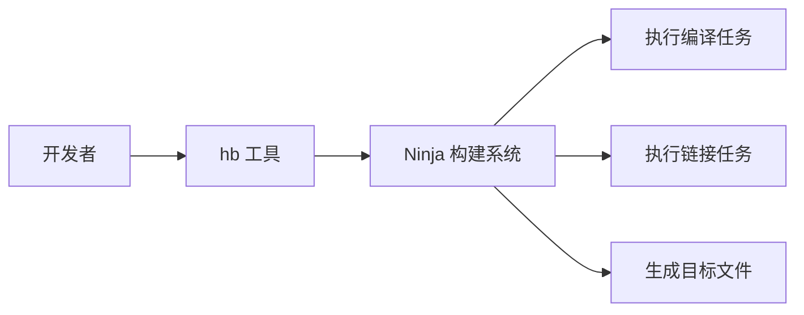

# Ninja - OpenHarmony 第三方库 Wiki

## 库概览

| 属性 | 值 |
|------|-----|
| **库名称** | ninja |
| **版本** | v1.12.0 |
| **许可证** | Apache License V2.0 |
| **上游地址** | https://github.com/ninja-build/ninja |
| **OH 组件名称** | @ohos/ninja |
| **OH 版本** | 3.1 |
| **所属子系统** | thirdparty |

## 什么是 Ninja？

Ninja 是一个**专注于速度的小型构建系统**。它被设计为与 CMake、Meson 等更高级的构建系统配合使用，通过极简的设计和增量编译优化来加速大型项目的构建过程。

## OpenHarmony 适配概述

### ⚠️ 重要说明

**Ninja 在 OpenHarmony 中的定位特殊**：它不是作为运行时库被其他模块链接使用，而是作为**构建工具**被包含在 `third_party` 目录中。

### 适配状态

| 评估项 | 状态 | 说明 |
|-------|------|------|
| **Patch 数量** | ✅ 无 | 未发现任何 OH 特有修改 |
| **BUILD.gn** | ❌ 不适用 | 不通过 GN 构建系统编译 |
| **平台适配** | ✅ 原生支持 | 支持 OH 所有目标平台 |
| **集成复杂度** | 🟢 低 | 直接使用上游版本 |

### 适配策略

```
上游 Ninja → 预编译二进制 → OH 构建系统调用
     ↓
  无需任何 Patch
```

OpenHarmony 直接使用上游的 Ninja 版本，不做任何修改。这是因为：

1. **工具性质**：Ninja 是独立的构建工具，不依赖特定平台 API
2. **标准化接口**：Ninja 的命令行接口稳定，跨版本兼容
3. **构建时使用**：Ninja 仅在构建时执行，不参与运行时

## 在 OpenHarmony 中的作用



OpenHarmony 的构建系统（hb）使用 Ninja 作为底层构建引擎来执行实际的编译和链接操作。

## 文档导航

| 文档 | 说明 | 推荐人群 |
|------|------|---------|
| **[01_Overview.md](./01_Overview.md)** | Ninja 原始功能介绍 | 所有读者 |
| **[02_Patches.md](./02_Patches.md)** | OH Patch 分析 | 版本维护者 |
| **[03_Build_Integration.md](./03_Build_Integration.md)** | OH 构建集成说明 | 构建系统开发者 |
| **[04_Usage_in_OH.md](./04_Usage_in_OH.md)** | OH 使用场景 | 全体开发者 |
| **[SUMMARY.md](./SUMMARY.md)** | 完整文档索引 | 需要导航时 |

## 快速开始

### 验证 Ninja 是否可用

```bash
# 检查 OH 构建工具中的 Ninja 配置
python3 build/hb/resources/config.py

# 或直接查看预编译的 Ninja
ls -la prebuilts/cmake/*/bin/ninja
```

### Ninja 基本用法

```bash
# 查看 Ninja 版本
./third_party/ninja/ninja --version

# 查看帮助
./third_party/ninja/ninja --help
```

## 维护信息

### 版本历史

| OH 版本 | Ninja 版本 | 更新日期 | 备注 |
|--------|-----------|---------|------|
| 3.1 | v1.12.0 | - | 当前版本 |

### 升级指南

升级 Ninja 版本时：

1. **无需 Patch 重构**：Ninja 无需任何 OH 特有修改
2. **兼容性验证**：确保新版本命令行接口兼容
3. **测试构建**：在 OH 构建系统中测试新版本

详见 [02_Patches.md](./02_Patches.md) 和 [03_Build_Integration.md](./03_Build_Integration.md)

## 常见问题

### Q: 为什么 third_party/ninja 没有 BUILD.gn？

**A**: Ninja 不是通过 GN 构建系统编译的库。它作为预编译工具被 OH 使用，上游使用 Python (`configure.py`) 或 CMake 作为构建系统。

### Q: Ninja 和 OH 的 gn有什么关系？

**A**: Ninja 与 GN（Generator Ninja）是不同的概念：
- **Ninja**：实际的构建执行引擎
- **GN**：生成 Ninja 构建文件的元构建系统

OpenHarmony 使用 GN 生成 `BUILD.gn` 文件，然后用 Ninja 执行构建。

### Q: 如何为 OH 贡献 Ninja 的改进？

**A**: 由于 Ninja 无需 OH 特有修改，所有改进应直接贡献给上游项目：https://github.com/ninja-build/ninja

## 相关资源

- **上游项目**：https://github.com/ninja-build/ninja
- **Ninja 官方手册**：https://ninja-build.org/manual.html
- **OpenHarmony 构建系统**：build/hb/
- **上游 README**：../README.md
