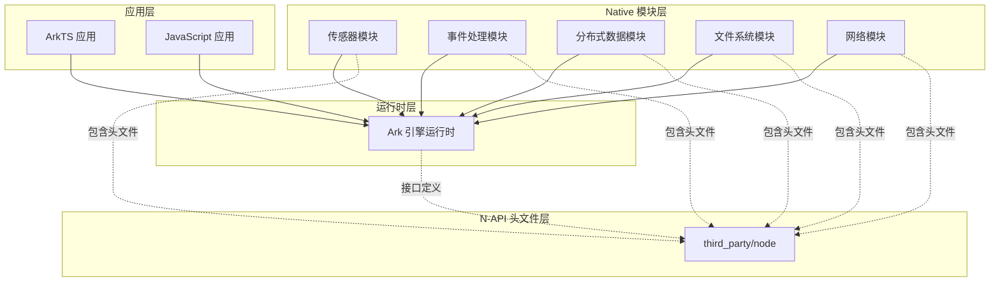
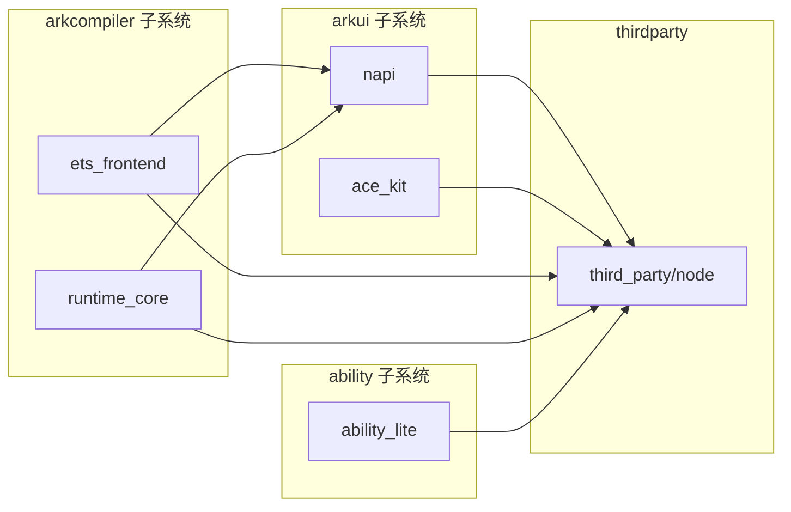

# 依赖关系与使用

## 一、直接依赖者清单

### 1.1 依赖模块汇总

经过全仓库 BUILD.gn 文件搜索，以下模块直接依赖 `third_party/node` 库：

| 序号 | 模块名称 | 子系统 | BUILD.gn 路径 | 主要用途 |
|------|----------|--------|---------------|----------|
| 1 | hiviewdfx（故障日志系统） | hiviewdfx | test/xts/acts/hiviewdfx/hiview/faultlogger/faultloggerjs/src/main/cpp/BUILD.gn | JS 异常栈解析 |
| 2 | syscap_codec | developtools | developtools/syscap_codec/test/unittest/common/BUILD.gn | 单元测试 N-API 调用 |
| 3 | ability_lite | ability | foundation/ability/ability_lite/interfaces/kits/js/napi/BUILD.gn | JS Kit 接口定义 |
| 4 | kvstoremock | distributeddatamgr | foundation/distributeddatamgr/kv_store/kvstoremock/interfaces/jskits/distributeddata/BUILD.gn | 分布式数据接口 |
| 5 | distributedkvstore | distributeddatamgr | foundation/distributeddatamgr/kv_store/kvstoremock/interfaces/jskits/distributedkvstore/BUILD.gn | 键值存储接口 |
| 6 | ace_kit | arkui | foundation/arkui/ace_engine/interfaces/inner_api/ace_kit/BUILD.gn | ACE 工具接口 |
| 7 | napi | arkui | foundation/arkui/napi/BUILD.gn | N-API 框架核心 |
| 8 | ets_frontend | arkcompiler | arkcompiler/ets_frontend/ets2panda/bindings/BUILD.gn | ArkTS 绑定层 |
| 9 | runtime_core | arkcompiler | arkcompiler/runtime_core/static_core/plugins/ets/runtime/interop_js/BUILD.gn | JS/TS 互操作 |
| 10 | medical_sensor | sensors | base/sensors/medical_sensor/interfaces/plugin/BUILD.gn | 传感器 Native 接口 |
| 11 | eventhandler | notification | base/notification/eventhandler/frameworks/napi/BUILD.gn | 事件异步处理 |

### 1.2 按子系统分类

| 子系统 | 模块数量 | 代表性模块 |
|--------|----------|------------|
| arkui | 3 | napi、ace_kit |
| arkcompiler | 2 | ets_frontend、runtime_core |
| distributeddatamgr | 2 | kvstoremock、distributedkvstore |
| ability | 1 | ability_lite |
| hiviewdfx | 1 | faultloggerjs |
| sensors | 1 | medical_sensor |
| notification | 1 | eventhandler |
| developtools | 1 | syscap_codec |

### 1.3 核心依赖者分析

以下模块是该库的核心使用者，其重要性高于其他依赖者：

#### foundation/arkui/napi

**重要级别**：★★★★★（最高）

这是 N-API 框架的核心实现模块，负责：

- N-API 接口的运行时实现
- Ark 引擎与 Native 模块的桥接
- JavaScript 值的创建、转换和操作
- 异步操作和 Promise 的支持

该模块直接使用 N-API 头文件定义所有接口函数，是连接 Ark 运行时和 Native 代码的关键桥梁。

#### arkcompiler/ets_frontend/bindings

**重要级别**：★★★★☆

该模块实现 ArkTS 语言与 Native 代码的互操作绑定：

- TypeScript/ArkTS 类型的 Native 表示
- 函数调用和参数转换
- 对象属性的跨语言访问
- 异常处理和错误传播

#### foundation/arkui/ace_engine/ace_kit

**重要级别**：★★★★☆

ACE（Ace Container Engine）工具套件的接口定义模块：

- UI 组件的 Native 实现
- 事件处理和渲染接口
- 资源管理

## 二、使用场景详解

### 2.1 Native 模块开发场景

#### 场景一：创建 JavaScript 函数

Native 模块通过 N-API 向 JavaScript/ArkTS 暴露函数：

```c
// example_module.c
#include <node_api.h>
#include <js_native_api.h>

// 定义 Native 函数
static napi_value Add(napi_env env, napi_callback_info info) {
  size_t argc = 2;
  napi_value argv[2];
  napi_value this_arg;
  void* data;

  // 获取参数
  napi_get_cb_info(env, info, &argc, argv, &this_arg, &data);

  // 获取参数值
  int32_t a, b;
  napi_get_value_int32(env, argv[0], &a);
  napi_get_value_int32(env, argv[1], &b);

  // 创建返回值
  napi_value result;
  napi_create_int32(env, a + b, &result);

  return result;
}

// 定义模块导出
napi_register_module() {
  napi_property_descriptor desc[] = {
    {"add", NULL, Add, NULL, NULL, NULL, napi_default, NULL}
  };
  napi_define_properties(env, exports, 1, desc);
}
```

#### 场景二：异步操作

Native 模块通过 N-API 实现异步操作：

```c
// async_worker.c
#include <node_api.h>

// 异步执行回调
static void Execute(napi_env env, void* data) {
  MyWorkData* work_data = (MyWorkData*)data;

  // 执行耗时操作
  Result result = PerformHeavyComputation(work_data->input);

  work_data->result = result;
}

// 异步完成回调
static void Complete(napi_env env, napi_status status, void* data) {
  MyWorkData* work_data = (MyWorkData*)data;

  // 通过 Promise 或回调返回结果
  napi_resolve_deferred(env, work_data->deferred, work_data->result);

  free(work_data);
}

// 创建异步工作
napi_value ComputeAsync(napi_env env, napi_callback_info info) {
  napi_value promise;
  napi_deferred deferred;

  // 创建 Promise
  napi_create_promise(env, &deferred, &promise);

  // 获取输入参数
  InputData* input = GetInputData(env, info);

  // 创建异步工作
  MyWorkData* work_data = malloc(sizeof(MyWorkData));
  work_data->input = input;
  work_data->deferred = deferred;

  napi_async_work work;
  napi_create_async_work(env, NULL, NULL, Execute, Complete, work_data, &work);
  napi_queue_async_work(env, work);

  return promise;
}
```

#### 场景三：对象和属性操作

```c
// object_creation.c
#include <node_api.h>

napi_value CreatePersonObject(napi_env env, napi_callback_info info) {
  napi_value object;
  napi_value name, age;

  // 创建 JS 对象
  napi_create_object(env, &object);

  // 设置属性
  napi_create_string_utf8(env, "Alice", 5, &name);
  napi_set_named_property(env, object, "name", name);

  napi_create_int32(env, 30, &age);
  napi_set_named_property(env, object, "age", age);

  return object;
}
```

### 2.2 框架层使用场景

#### Ark 引擎的 N-API 实现

OpenHarmony 的 Ark 引擎通过以下方式使用 N-API 头文件：

```c
// ark_napi.cc（框架内部实现）
#include <node_api.h>
#include <js_native_api.h>

// Ark 引擎的 N-API 实现
napi_status napi_create_object(napi_env env, napi_value* result) {
  ArkEngine* engine = (ArkEngine*)env;

  // 创建 Ark 引擎的 JS 值
  ArkValue* ark_value = engine->CreateObject();

  // 封装为 N-API 值
  *result = (napi_value)ark_value;

  return napi_ok;
}

napi_status napi_set_property(napi_env env, napi_value object,
                               napi_value key, napi_value value) {
  ArkEngine* engine = (ArkEngine*)env;
  ArkValue* obj = (ArkValue*)object;
  ArkValue* key_val = (ArkValue*)key;
  ArkValue* value_val = (ArkValue*)value;

  // 调用 Ark 引擎的内部实现
  engine->SetProperty(obj, key_val, value_val);

  return napi_ok;
}
```

#### 分布式数据管理

```c
// distributed_kvstore.cc
#include <node_api.h>

// 分布式键值存储的 Native 实现
napi_value GetKVStore(napi_env env, napi_callback_info info) {
  // 获取选项参数
  napi_value options = GetArgument(env, info, 0);

  // 创建 Native KVStore 实例
  KVStore* store = KVStoreFactory::Create(options);

  // 包装为 JS 对象
  napi_value result;
  WrapNativeObject(env, store, result);

  return result;
}

// 异步保存
napi_value PutAsync(napi_env env, napi_callback_info info) {
  // 实现异步保存逻辑
  // ...
}
```

### 2.3 系统服务使用场景

#### 事件处理框架

```c
// event_handler.cc
#include <node_api.h>

napi_value PostEvent(napi_env env, napi_callback_info info) {
  // 获取事件参数
  EventData* event = ParseEvent(env, info);

  // 发送到事件队列
  EventHandler::Post(event);

  return NULL;
}

napi_value OnEvent(napi_env env, napi_callback_info info) {
  // 注册事件回调
  napi_value callback = GetArgument(env, info, 0);

  // 存储回调引用
  napi_ref ref;
  napi_create_reference(env, callback, 1, &ref);

  // 注册到事件系统
  EventHandler::Register(ref);

  return NULL;
}
```

## 三、依赖关系图

### 3.1 系统架构视角

```
┌─────────────────────────────────────────────────────────────────────────────┐
│                            应用层                                          │
│    ┌─────────────┐  ┌─────────────┐  ┌─────────────┐  ┌─────────────┐      │
│    │  应用 A    │  │  应用 B    │  │  应用 C    │  │  ...      │      │
│    └──────┬──────┘  └──────┬──────┘  └──────┬──────┘  └──────┬──────┘      │
└───────────┼────────────────┼────────────────┼────────────────┼────────────┘
            │                │                │                │
            ▼                ▼                ▼                ▼
┌─────────────────────────────────────────────────────────────────────────────┐
│                         ArkTS / JavaScript 运行时                            │
│         ┌──────────────────────────────────────────────────────┐            │
│         │              Ark 引擎运行时核心                        │            │
│         │         （实现 N-API 接口的运行时环境）                  │            │
│         └──────────────────────────────────────────────────────┘            │
└─────────────────────────────────────────────────────────────────────────────┘
                                      ▲
                                      │ N-API 调用
                                      ▼
┌─────────────────────────────────────────────────────────────────────────────┐
│                        Native 模块层（第三方）                               │
│    ┌─────────────┐  ┌─────────────┐  ┌─────────────┐  ┌─────────────┐      │
│    │  传感器    │  │  文件系统   │  │  网络模块   │  │  ...      │      │
│    │  模块      │  │  模块      │  │  模块      │  │  模块      │      │
│    └─────────────┘  └─────────────┘  └─────────────┘  └─────────────┘      │
│                                      │                                      │
│         ┌───────────────────────────┼───────────────────────────┐        │
│         │                           │                           │        │
└─────────┼───────────────────────────┼───────────────────────────┼────────┘
          │                           │                           │
          ▼                           ▼                           ▼
┌─────────────────────────────────────────────────────────────────────────────┐
│                      N-API 头文件层（third_party/node）                     │
│         ┌──────────────────────────────────────────────────────┐           │
│         │     js_native_api.h / node_api.h                     │           │
│         │     js_native_api_types.h / node_api_types.h         │           │
│         └──────────────────────────────────────────────────────┘           │
└─────────────────────────────────────────────────────────────────────────────┘
```

### 3.2 OH 核心模块依赖关系



### 3.3 核心模块依赖链



## 四、使用方式详解

### 4.1 静态链接方式

大多数 Native 模块采用静态链接方式使用 N-API 头文件：

```gn
# BUILD.gn 配置示例
ohos_shared_library("my_native_module") {
  sources = [
    "src/my_module.cc",
    "src/native_addon.cc",
  ]

  # 依赖 N-API 头文件库
  deps = [
    "//third_party/node:node_header_notice",
  ]

  # 依赖 Ark 引擎的 N-API 实现
  external_deps = [
    "arkui_napi:default",
  ]
}
```

```c
// 源文件
#include <node_api.h>
#include <js_native_api.h>

// 使用 N-API 接口
napi_value MyFunction(napi_env env, napi_callback_info info) {
  // 实现逻辑
}
```

### 4.2 头文件引用方式

#### 直接引用

```c
// 方式一：包含完整 N-API
#include <node_api.h>

// 方式二：按需包含
#include <js_native_api.h>      // 核心接口
#include <js_native_api_types.h> // 类型定义
#include <node_api_types.h>     // Node 特有类型
```

#### 包含层次

```
node_api.h
    │
    ├── js_native_api.h
    │       │
    │       └── js_native_api_types.h
    │
    └── node_api_types.h
            │
            └── js_native_api_types.h
```

### 4.3 构建配置模式

#### 模式一：独立模块

```gn
# 独立 Native 模块
ohos_shared_library("standalone_addon") {
  sources = [
    "addon.cc",
  ]

  deps = [
    "//third_party/node:node_header_notice",
    "//third_party/other_lib:target",
  ]
}
```

#### 模式二：子系统模块

```gn
# 属于某个子系统的 Native 模块
ohos_shared_library("subsystem_native") {
  subsystem_name = "mysubsystem"

  sources = [
    "impl.cc",
  ]

  deps = [
    "//third_party/node:node_header_notice",
    "//foundation/arkui/napi:napi_impl",
  ]
}
```

#### 模式三：测试模块

```gn
# 测试用例
ohos_test("napi_test") {
  sources = [
    "test.cc",
  ]

  deps = [
    "//third_party/node:node_header_notice",
    "//foundation/arkui/napi:napi_impl",
  ]
}
```

## 五、最佳实践

### 5.1 接口设计原则

**原则一：遵循 N-API 规范**

```c
// 推荐：使用 N-API 标准接口
napi_status status = napi_create_object(env, &obj);

// 不推荐：直接操作引擎内部对象
ArkValue* value = env->CreateObject();  // 违反抽象
```

**原则二：处理错误返回值**

```c
// 推荐：检查所有 N-API 返回值
napi_status status = napi_get_value_int32(env, argv[0], &value);
if (status != napi_ok) {
  napi_throw_error(env, "EINVAL", "Invalid argument type");
  return NULL;
}

// 不推荐：忽略返回值
napi_get_value_int32(env, argv[0], &value);  // 可能导致未定义行为
```

**原则三：正确管理内存**

```c
// 推荐：使用引用计数管理长生命周期对象
napi_ref callback_ref;
napi_create_reference(env, callback, 1, &callback_ref);

// 推荐：使用句柄作用域管理临时对象
napi_handle_scope scope;
napi_open_handle_scope(env, &scope);
// ... 创建临时对象 ...
napi_close_handle_scope(env, scope);
```

### 5.2 性能优化建议

**建议一：批量操作**

```c
// 推荐：使用批量接口
napi_property_descriptor descriptors[] = {
  {"prop1", NULL, GetProp1, NULL, NULL, NULL, napi_default, NULL},
  {"prop2", NULL, GetProp2, NULL, NULL, NULL, napi_default, NULL},
  {"prop3", NULL, GetProp3, NULL, NULL, NULL, napi_default, NULL},
};
napi_define_properties(env, object, 3, descriptors);

// 不推荐：逐个设置属性
napi_set_named_property(env, object, "prop1", value1);
napi_set_named_property(env, object, "prop2", value2);
napi_set_named_property(env, object, "prop3", value3);
```

**建议二：避免频繁跨语言调用**

```c
// 推荐：批量获取参数
size_t argc = 10;
napi_value argv[10];
napi_get_cb_info(env, info, &argc, argv, NULL, NULL);

// 不推荐：逐个获取参数
napi_value arg0, arg1, arg2;
napi_get_cb_info(env, info, NULL, &arg0, NULL, NULL);  // 多次调用
```

### 5.3 错误处理模式

**标准错误处理**：

```c
napi_value SafeOperation(napi_env env, napi_callback_info info) {
  napi_status status;

  // 阶段一：参数获取
  status = napi_get_cb_info(env, info, &argc, argv, NULL, NULL);
  if (status != napi_ok) {
    napi_throw_type_error(env, NULL, "Failed to get arguments");
    return NULL;
  }

  // 阶段二：参数验证
  napi_valuetype type;
  status = napi_typeof(env, argv[0], &type);
  if (status != napi_ok || type != napi_object) {
    napi_throw_type_error(env, NULL, "Expected object argument");
    return NULL;
  }

  // 阶段三：业务逻辑
  Result result = PerformOperation(argv[0]);
  if (result.error) {
    napi_throw_error(env, result.code, result.message);
    return NULL;
  }

  // 阶段四：返回结果
  napi_value output;
  napi_create_object(env, &output);
  // ... 设置返回值 ...
  return output;
}
```

## 六、常见问题

### Q1：如何在 Native 模块中调用 JavaScript 函数？

```c
// 获取并调用回调函数
napi_value callback;
napi_get_cb_info(env, info, NULL, &callback, NULL, NULL);

napi_value result;
napi_call_function(env, NULL, callback, 0, NULL, &result);
```

### Q2：如何处理 Promise？

```c
napi_value CreatePromise(napi_env env, napi_callback_info info) {
  napi_deferred deferred;
  napi_value promise;

  napi_create_promise(env, &deferred, &promise);

  // 在异步操作完成后
  // napi_resolve_deferred(env, deferred, result);
  // 或
  // napi_reject_deferred(env, deferred, error);

  return promise;
}
```

### Q3：如何传递大块数据？

```c
// 使用 ArrayBuffer
void* buffer_data;
size_t buffer_size = 1024 * 1024;  // 1MB

napi_value arraybuffer;
napi_create_arraybuffer(env, buffer_size, &buffer_data, &arraybuffer);

// 填充数据
memcpy(buffer_data, source_data, buffer_size);

// 作为 TypedArray 暴露
napi_value typedarray;
napi_create_typedarray(env, napi_uint8_array, buffer_size,
                      arraybuffer, 0, &typedarray);
```

### Q4：如何调试 Native 模块？

```c
// 使用 napi_get_last_error_info
const napi_extended_error_info* error_info;
napi_get_last_error_info(env, &error_info);

printf("Error: %s\n", error_info->error_message);
printf("Code: %d\n", error_info->engine_error_code);
```

## 七、参考资源

### 7.1 官方文档

- [Node.js N-API 官方文档](https://nodejs.org/api/n-api.html)
- [OpenHarmony N-API 开发指南](https://gitee.com/openharmony/docs)
- [Ark 引擎开发指南](https://gitee.com/openharmony/docs)

### 7.2 示例代码

参考以下仓库中的 N-API 使用示例：

- foundation/arkui/napi — N-API 框架核心实现
- foundation/ability/ability_lite/interfaces/kits/js/napi — JS Kit 示例
- base/notification/eventhandler/frameworks/napi — 异步操作示例

### 7.3 相关工具

| 工具 | 用途 |
|------|------|
| node-gyp | Node.js 原生模块构建工具 |
| cmake-js | CMake 方式的 Native 模块构建 |
| nbind | C++ 到 N-API 的封装库 |
