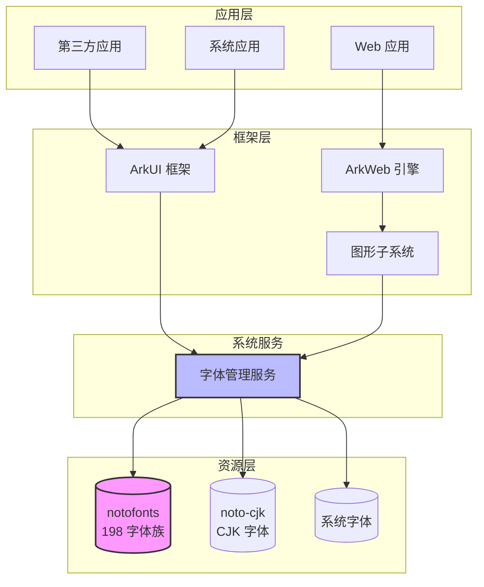

# 依赖关系与使用场景

本文档分析 notofonts 在 OpenHarmony 中的依赖关系和使用方式。

---

## 1. 依赖关系概览

### 1.1 字体库的特殊依赖模式

与其他第三方库不同，notofonts 的依赖关系具有以下特点：

```
┌────────────────────────────────────────────────────────────┐
│                  notofonts 依赖模式特点                      │
├────────────────────────────────────────────────────────────┤
│                                                            │
│   常规库依赖                    notofonts 依赖              │
│   ────────────                  ──────────────             │
│                                                            │
│   模块 A ──depends──▶ 库        模块 A ──uses──▶ 字体文件   │
│     │  (编译期链接)               │   (运行时加载)          │
│     ▼                            ▼                         │
│   链接库 .so                     文件系统 /system/fonts/    │
│                                                            │
│   依赖声明在 BUILD.gn           依赖通过字体管理器间接实现   │
│   deps += ["//third_party/..."]   无直接 GN 依赖           │
│                                                            │
└────────────────────────────────────────────────────────────┘
```

### 1.2 无直接 GN 依赖的原因

| 原因 | 说明 |
|------|------|
| **资源性质** | 字体是资源文件，不是代码库 |
| **运行时加载** | 通过文件路径加载，非编译期链接 |
| **动态发现** | 字体管理器动态扫描 /system/fonts/ |
| **解耦设计** | 应用不直接依赖字体库，通过系统 API 访问 |

---

## 2. 依赖者分析

### 2.1 直接引用点

基于代码搜索，发现以下位置引用 notofonts：

| 位置 | 引用内容 | 用途 |
|------|----------|------|
| `build/ohos/sdk/ohos_sdk_description_std.json` | `"//third_party/notofonts:copy_preview_fonts_notofonts"` | SDK 预览器字体资源 |
| `third_party/notofonts/bundle.json` | `"//third_party/notofonts:fonts_notofonts"` | 自引用，组件定义 |

### 2.2 间接依赖者（运行时）

虽然无直接的 GN `deps` 依赖，但以下模块**运行时依赖** notofonts：

#### 2.2.1 ArkUI 框架

```
ArkUI 文本组件
    │
    ├── Text 组件渲染
    │   └── 字体解析器
    │       └── /system/fonts/NotoSans*.ttf
    │
    └── Span 样式处理
        └── 字体回退 (Font Fallback)
            └── notofonts 多语言字体
```

**使用方式**: ArkUI 通过系统字体管理器动态加载字体。

#### 2.2.2 图形子系统

```
图形子系统
    │
    ├── 文本布局引擎 (TextLayout)
    │   └── 字体匹配 (Font Matching)
    │       └── notofonts 字体族
    │
    └── 渲染后端
        └── Skia/Harfbuzz
            └── 字体光栅化
```

#### 2.2.3 Web 引擎

```
Web 引擎 (ArkWeb)
    │
    ├── CSS 字体解析
    │   └── font-family: "Noto Sans"
    │
    └── 文本渲染
        └── 字体回退链
            ├── 指定字体 (Noto Sans)
            ├── 系统回退 (notofonts 对应语系)
            └── 最终回退 (notofonts 通用字体)
```

#### 2.2.4 SDK 预览器

```
DevEco Studio 预览器
    │
    └── 界面渲染模拟
        └── 复制自: //third_party/notofonts:copy_preview_fonts_notofonts
            └── previewer/common/bin/fonts/
```

### 2.3 依赖关系图



---

## 3. 使用场景详解

### 3.1 多语言应用显示

**场景**: 印度用户使用印地语浏览应用

```
用户输入 (印地语)
    ↓
ArkUI Text 组件
    ↓
文本测量 (Measurement)
    ↓
字体匹配: 需要 Devanagari 字形
    ↓
字体管理器查询
    ↓
加载 /system/fonts/NotoSansDevanagari[wdth,wght].ttf
    ↓
Harfbuzz 文本整形 (Shaping)
    ↓
Skia 渲染
    ↓
屏幕显示
```

### 3.2 Web 页面渲染

**场景**: 浏览包含阿拉伯文的网页

```
HTML 内容
    ↓
CSS font-family: "Noto Naskh Arabic", sans-serif
    ↓
Web 引擎字体解析
    ↓
字体回退链:
    1. Noto Naskh Arabic (已预置) ✅
    2. Generic Arabic (系统字体)
    3. notofonts 阿拉伯语系字体
    ↓
文本渲染
```

### 3.3 系统设置界面

**场景**: 系统设置中的语言选择列表

```
设置应用
    ↓
显示支持的语言列表
    ↓
每种语言使用原生名称显示
    例: "हिन्दी" (印地语)
    例: "العربية" (阿拉伯语)
    ↓
字体回退自动选择相应 notofonts 字体
```

### 3.4 SDK 预览器

**场景**: 开发者在 DevEco Studio 中预览界面

```
开发者设计界面
    ↓
点击 "Preview"
    ↓
预览器进程启动
    ↓
加载 previewer/common/bin/fonts/ 下的 notofonts
    ↓
模拟界面渲染（与真机一致）
    ↓
开发者看到包含多语言的预览效果
```

---

## 4. 字体回退机制

### 4.1 什么是字体回退

当请求的字形在当前字体中不存在时，系统自动寻找包含该字形的备用字体。

### 4.2 OH 字体回退链

```
应用请求字符 'अ' (印地语天城文)
    ↓
当前字体: HarmonyOS Sans
    ↓
检查: HarmonyOS Sans 是否包含 'अ'? ❌
    ↓
回退 1: Noto Sans Devanagari
    ↓
检查: 是否包含 'अ'? ✅
    ↓
使用 Noto Sans Devanagari 渲染
```

### 4.3 notofonts 在回退链中的位置

```
字体回退优先级（从高到低）

1. 应用指定字体
   ↓
2. 系统默认字体 (HarmonyOS Sans/Roboto)
   ↓
3. 语系专用字体 ← notofonts 在此层
   - NotoSansDevanagari (印度语)
   - NotoSansThai (泰语)
   - NotoSansArabic (阿拉伯语)
   - ...
   ↓
4. 通用回退字体 ← notofonts 也在此层
   - NotoSans
   - NotoSerif
   ↓
5. 最终回退
   - 豆腐块 (□) 或空白
```

---

## 5. 与其他组件的协作

### 5.1 与 noto-cjk 的关系

| 组件 | 覆盖范围 | 协作方式 |
|------|----------|----------|
| **notofonts** | 非 CJK 语言 | 处理除中日韩外的所有语言 |
| **noto-cjk** | 中日韩语言 | 处理中文、日文、韩文 |

```
文本渲染请求
    ↓
Unicode 范围检查
    ├── CJK 范围 → noto-cjk
    ├── 印地语 → notofonts
    ├── 泰语 → notofonts
    └── 其他 → notofonts
```

### 5.2 与系统字体的关系

```
字体栈示例 (CSS 概念)

font-family: 
    "HarmonyOS Sans",      /* OH 系统字体 - 主要界面 */
    "Noto Sans",           /* notofonts - 通用回退 */
    "Noto Sans Devanagari", /* notofonts - 印地语 */
    sans-serif;            /* 通用族名 */
```

### 5.3 与字体管理器的关系

```
字体管理器 (Font Manager)
    │
    ├── 字体发现
    │   └── 扫描 /system/fonts/ 目录
    │       └── 加载 notofonts 字体元数据
    │
    ├── 字体缓存
    │   └── 缓存常用 notofonts 字体
    │
    └── 字体匹配
        └── 根据 locale 和字符选择 notofonts
```

---

## 6. 依赖统计

### 6.1 按语系的使用统计

基于 fonts_config.gni 的配置，预计使用频率：

| 语系 | 字体数量 | 预计使用频率 | 典型市场 |
|------|----------|--------------|----------|
| **印度-雅利安** | 15+ | 高 | 印度、巴基斯坦、孟加拉 |
| **达罗毗荼** | 12+ | 高 | 印度南部、斯里兰卡 |
| **东南亚** | 8+ | 高 | 泰国、越南、缅甸、柬埔寨 |
| **中东** | 6+ | 中 | 中东、北非 |
| **非洲** | 4+ | 中 | 埃塞俄比亚、西非 |
| **欧洲古典** | 4+ | 中 | 东欧、中亚 |
| **符号** | 3+ | 中 | 全球（数学、技术符号）|
| **古代文字** | 20+ | 低 | 学术研究 |

### 6.2 按设备类型的使用

| 设备类型 | 字体数量 | 特殊优化 |
|----------|----------|----------|
| **手机/平板 (default)** | 140+ | 完整字体集 |
| **手表 (watch)** | 约 80 | 精简字体集，使用 Condensed 版本 |

---

## 7. 使用建议

### 7.1 应用开发者

**建议**:
1. 不直接指定 notofonts 字体名称（可能随版本变化）
2. 使用系统字体 API 或 CSS 通用族名
3. 依赖系统字体回退机制

**示例**:
```css
/* 推荐: 使用通用族名 */
font-family: sans-serif;

/* 不推荐: 硬编码字体名 */
font-family: "Noto Sans Devanagari";
```

### 7.2 系统开发者

**添加新字体**:
1. 确认目标语言是否已在 fonts_config.gni 中
2. 如需要新语系，添加对应的 notofonts 字体配置
3. 更新相关文档

**优化系统体积**:
1. 针对特定市场定制字体集
2. 使用 `support_devices` 控制设备特定字体
3. 优先使用 Variable TTF 减少文件数量

---

## 8. 常见问题

### Q1: 如何知道某个字符使用哪个字体渲染？

```
方法: 查看字体管理器日志
或: 使用开发者选项中的 "显示字体边界"
```

### Q2: 为什么某些罕见字符仍显示为豆腐块？

```
可能原因:
1. 该字符不在任何预置字体中
2. 字体回退链未覆盖该 Unicode 范围
3. 字体文件损坏或缺失

解决: 检查 fonts_config.gni 是否包含对应语系字体
```

### Q3: 能否在应用中打包自定义字体？

```
可以。应用可以:
1. 将字体文件作为资源打包
2. 通过 API 注册自定义字体
3. 优先使用应用字体，回退到系统字体

注意: 应用字体不会覆盖系统字体回退链
```

---

## 9. 参考文档

- [OpenHarmony 字体开发指南](https://gitee.com/openharmony/docs)
- [Noto Fonts 官方文档](https://fonts.google.com/noto)
- [字体回退机制详解](https://developer.mozilla.org/en-US/docs/Web/CSS/font-family)
