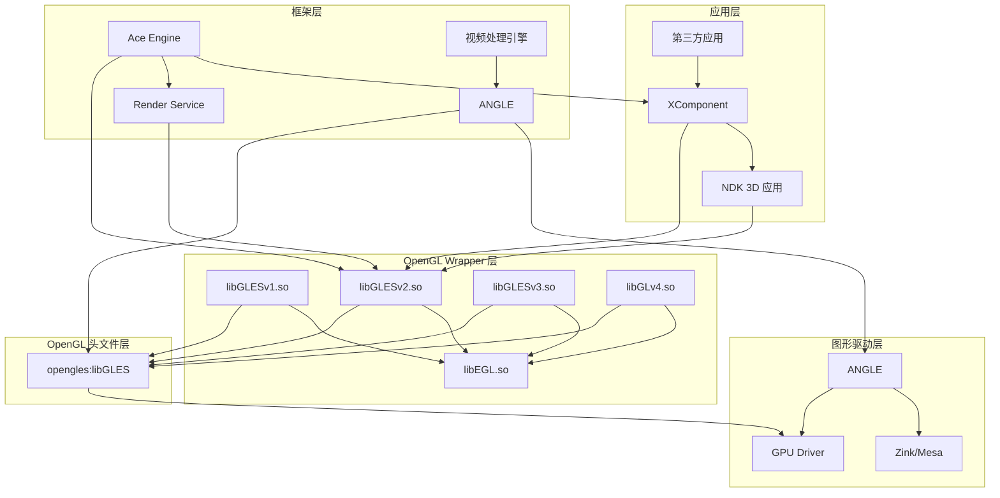

# 依赖关系与使用

## 4.1 直接依赖者

### 4.1.1 核心依赖模块

本库被以下 OpenHarmony 模块直接依赖：

| 模块名称 | BUILD.gn 路径 | 用途 | 依赖方式 |
|---------|--------------|------|---------|
| **opengl_wrapper** | `foundation/graphic/graphic_2d/frameworks/opengl_wrapper/BUILD.gn` | OpenGL Wrapper 实现（libEGL.so、libGLESv1.so、libGLESv2.so、libGLESv3.so、libGLv4.so） | `public_external_deps` |
| **skia/angle2** | `third_party/skia/m133/third_party/angle2/BUILD.gn` | ANGLE（Vulkan/Metal 到 GL 的转换层） | `public_deps` |
| **3d_widget_adapter** | `foundation/graphic/graphic_3d/3d_widget_adapter/BUILD.gn` | 3D 小部件适配 | 头文件引用 |
| **render_service_client** | `foundation/graphic/graphic_2d/rosen/modules/render_service_client/BUILD.gn` | 渲染服务客户端 | 头文件引用 |
| **GLES2 NDK** | `interface/sdk_c/graphic/graphic_2d/GLES2/BUILD.gn` | GLES2 NDK 头文件导出 | 头文件重导出 |
| **GLES3 NDK** | `interface/sdk_c/graphic/graphic_2d/GLES3/BUILD.gn` | GLES3 NDK 头文件导出 | 头文件重导出 |
| **GL4 NDK** | `interface/sdk_c/graphic/graphic_2d/GL4/BUILD.gn` | GL4 NDK 头文件导出 | 头文件重导出 |
| **openGLES NDK** | `interface/sdk_c/third_party/openGLES/BUILD.gn` | 基础 GLES NDK 头文件导出 | 头文件重导出 |

### 4.1.2 主要使用场景

#### 场景一：OpenGL Wrapper 层

OpenGL Wrapper 层（`opengl_wrapper`）是本库最主要的使用者：

```gn
ohos_shared_library("GLESv2") {
  # ...
  public_external_deps = [
    "egl:libEGL",
    "opengles:libGLES",        # 依赖 OpenGL ES 头文件
  ]
  # ...
}
```

此模块构建出 `libGLESv2.so`，是 OpenHarmony 图形应用使用 OpenGL ES 2.x 的主要接口。

#### 场景二：ANGLE 跨平台渲染

ANGLE 是 Google 维护的 OpenGL 到其他图形 API（Vulkan、Metal、DirectX）的转换层：

```gn
group("angle2") {
  public_deps = [
    "${skia_third_party_dir}/externals/angle2:includes",
    "${skia_third_party_dir}/externals/angle2:libEGL",
    "${skia_third_party_dir}/externals/angle2:libGLESv2",
  ]
}
```

ANGLE 使用本库头文件来实现 GL API 的标准化定义。

#### 场景三：NDK 开发者接口

OpenHarmony 通过 NDK 向第三方开发者暴露 OpenGL ES 接口：

```gn
ohos_ndk_headers("GLES2_header") {
  dest_dir = "$ndk_headers_out_dir/GLES2"
  sources = [
    "../../../third_party/openGLES/GLES2/gl2.h",
    "../../../third_party/openGLES/GLES2/gl2ext.h",
    "../../../third_party/openGLES/GLES2/gl2platform.h",
  ]
}
```

## 4.2 依赖关系图

### 4.2.1 整体架构



### 4.2.2 依赖传递链

```
opengles:libGLES
├── foundation/graphic/.../opengl_wrapper:GLESv1
├── foundation/graphic/.../opengl_wrapper:GLESv2
├── foundation/graphic/.../opengl_wrapper:GLESv3
├── foundation/graphic/.../opengl_wrapper:GLv4
└── third_party/skia/.../angle2:libGLESv2
        └── foundation/multimedia/video_processing_engine:...
```

## 4.3 使用方式详解

### 4.3.1 静态链接与动态链接

| 链接方式 | 说明 | 使用场景 |
|---------|------|---------|
| **静态链接** | 通过 public_external_deps 声明依赖，编译时链接 | 系统库构建（opengl_wrapper） |
| **动态链接** | NDK 库（.so）形式提供 | 第三方应用开发 |

### 4.3.2 头文件引用方式

#### 方式一：系统头文件引用

```c
// OpenGL ES 2.x 应用
#include <GLES2/gl2.h>
#include <GLES2/gl2ext.h>
#include <GLES2/gl2platform.h>

void render() {
    glClear(GL_COLOR_BUFFER_BIT);
    glDrawArrays(GL_TRIANGLES, 0, 3);
}
```

#### 方式二：NDK 头文件引用

```c
// NDK 开发
#include <GLES2/gl2.h>
#include <GLES3/gl3.h>

void render() {
    // 使用 GLES 2.x API
    glClear(GL_COLOR_BUFFER_BIT);
    
    // 使用 GLES 3.x API（如设备支持）
    glClearBufferfv(GL_COLOR, 0, color);
}
```

### 4.3.3 关键使用场景

#### 场景一：XComponent 3D 渲染

```cpp
// XComponent 中的 OpenGL ES 渲染
#include <GLES2/gl2.h>
#include <EGL/egl.h>

class GLRenderer {
public:
    void Initialize() {
        // 初始化 EGL
        eglDisplay = eglGetDisplay(EGL_DEFAULT_DISPLAY);
        eglInitialize(eglDisplay, &majorVersion, &minorVersion);
        
        // 配置 EGL
        EGLint configAttribs[] = {
            EGL_SURFACE_TYPE, EGL_PBUFFER_BIT,
            EGL_RENDERABLE_TYPE, EGL_OPENGL_ES2_BIT,
            EGL_NONE
        };
        
        // 初始化 OpenGL ES 上下文
        eglContext = eglCreateContext(eglDisplay, config, EGL_NO_CONTEXT, ctxAttribs);
    }
    
    void Render() {
        // OpenGL ES 渲染
        glClearColor(1.0f, 0.0f, 0.0f, 1.0f);
        glClear(GL_COLOR_BUFFER_BIT);
        // ... 渲染逻辑
    }
};
```

#### 场景二：视频处理引擎

```cpp
// 视频处理中的 GPU 加速
#include <GLES3/gl3.h>

class VideoProcessor {
public:
    void ProcessFrame(GLuint inputTexture, GLuint outputTexture) {
        glActiveTexture(GL_TEXTURE0);
        glBindTexture(GL_TEXTURE_2D, inputTexture);
        
        // 使用 Compute Shader 或 Fragment Shader 处理
        glDispatchCompute(workGroupsX, workGroupsY, 1);
        
        glMemoryBarrier(GL_SHADER_IMAGE_ACCESS_BARRIER_BIT);
        
        glBindTexture(GL_TEXTURE_2D, outputTexture);
        // ... 复制或进一步处理
    }
};
```

## 4.4 依赖配置示例

### 4.4.1 添加 OpenGL ES 依赖

在模块的 BUILD.gn 中添加依赖：

```gn
ohos_shared_library("my_graphics_module") {
  # ...
  public_configs = [ ":my_config" ]
  
  public_external_deps = [
    "opengles:libGLES",        # OpenGL ES 头文件
    "egl:libEGL",              # EGL 头文件
    # ...
  ]
  
  external_deps = [
    "hilog:libhilog",
    # ...
  ]
}
```

### 4.4.2 NDK 模块依赖

```gn
ohos_ndk_library("libnative_video") {
  output_name = "native_video"
  ndk_description_file = "./libnative_video.ndk.json"
  system_capability = "SystemCapability.Graphic.Graphic2D.Native"
  
  public_external_deps = [
    "opengles:libGLES",
    "egl:libEGL",
  ]
}
```

## 4.5 常见问题

### Q1：如何判断使用 GLES 2.x 还是 GLES 3.x？

OpenHarmony 推荐使用 GLES 2.x 作为基准兼容性目标：

```c
// 检查 GL 版本
const GLubyte* version = glGetString(GL_VERSION);
if (strstr((const char*)version, "OpenGL ES 3")) {
    // 支持 GLES 3.x
    glDrawArraysInstanced(...);
} else {
    // 仅支持 GLES 2.x
    glDrawArrays(...);
}
```

### Q2：如何启用 OpenGL ES 扩展？

```c
// 获取扩展函数指针
typedef void (GL_APIENTRYP PFNGLDRAWARRAYSINSTANCEDEXTPROC)(GLenum, GLint, GLsizei, GLsizei, GLsizei);
PFNGLDRAWARRAYSINSTANCEDEXTPROC glDrawArraysInstancedEXT =
    (PFNGLDRAWARRAYSINSTANCEDEXTPROC)eglGetProcAddress("glDrawArraysInstancedEXT");

// 使用扩展
if (glDrawArraysInstancedEXT) {
    glDrawArraysInstancedEXT(GL_TRIANGLES, 0, vertexCount, instanceCount);
}
```

### Q3：调试 OpenGL ES 错误的方法？

```c
// 启用调试输出
glEnable(GL_DEBUG_OUTPUT);
glDebugMessageCallback(DebugCallback, nullptr);

// 调试回调函数
void GL_APIENTRY DebugCallback(GLenum source, GLenum type, GLuint id,
                                GLenum severity, GLsizei length,
                                const GLchar* message, const void* userParam) {
    // 打印错误信息
    LOG_ERROR("GL Error: %{public}s", message);
}
```

## 4.6 安全注意事项

### 4.6.1 常见安全风险

| 风险 | 描述 | 缓解措施 |
|------|------|---------|
| **Shader 注入** | 恶意构造的 Shader 可能导致 GPU 挂起或信息泄露 | 验证 Shader 来源，使用安全编译选项 |
| **资源耗尽** | 大量纹理或 Buffer 请求可能导致内存耗尽 | 设置资源限制，监控 GPU 内存使用 |
| **上下文混淆** | 多个上下文共享资源时可能产生安全问题 | 使用严格的上下文隔离 |
| **图像处理漏洞** | 图像解码中的缓冲区溢出 | 使用安全的图像加载库 |

### 4.6.2 安全开发建议

1. **验证输入**：所有来自外部的 Shader 代码和纹理数据都需要验证
2. **限制资源**：设置 GPU 资源使用上限
3. **错误处理**：检查所有 GL 调用返回值
4. **更新驱动**：确保 GPU 驱动为最新版本
