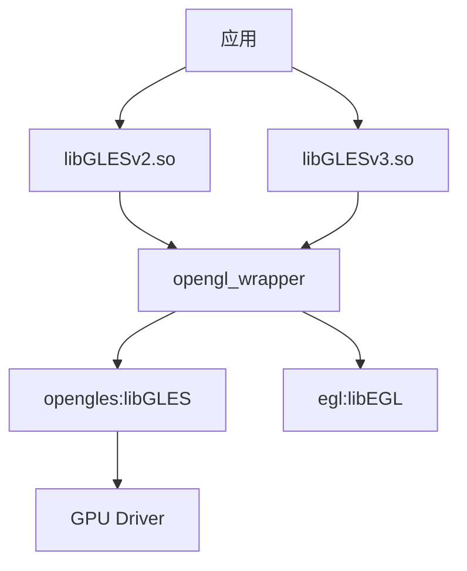

# OpenGL ES Registry

## 库概览

**OpenGL ES Registry** 是 Khronos Group 官方维护的 OpenGL、OpenGL ES 和 OpenGL SC 的 API 与扩展注册表。在 OpenHarmony 系统中，该库作为图形子系统的**头文件注册表**，为整个系统的 OpenGL ES 图形渲染提供标准化的 API 定义和扩展支持。

| 项目 | 内容 |
|------|------|
| **库名称** | Khronos Group - OpenGL ES Registry |
| **上游地址** | https://github.com/KhronosGroup/OpenGL-Registry |
| **许可证** | Apache-2.0 |
| **版本** | 31db35a53f7e64d3e03e35ec47ccfd6079b792d7 |
| **OH 组件名** | @ohos/opengles |
| **OH 版本** | 3.1 |

## OpenHarmony 适配概述

### 适配特点

本库在 OpenHarmony 中的适配具有以下特点：

1. **无 Patch 设计**：由于该库为纯头文件注册表，不包含可编译的实现代码，因此 OpenHarmony 未使用任何 Patch。所有平台差异通过独立的 `opengl_wrapper` 层处理。

2. **极简 BUILD.gn 配置**：仅需暴露 `api/` 目录，无需编译任何源文件。

3. **NDK 头文件分层**：OpenHarmony 实现了专门的头文件重导出层，用于 NDK 开发者接口。

4. **标准扩展支持**：包含 50+ 供应商扩展（ARB、EXT、OES、HUAWEI 等）。

### 核心组件

| 组件 | 路径 | 说明 |
|------|------|------|
| **头文件目录** | `third_party/openGLES/api/` | OpenGL ES 头文件（GLES、GLES2、GLES3） |
| **扩展规范** | `third_party/openGLES/extensions/` | 扩展定义文件 |
| **XML 注册表** | `third_party/openGLES/xml/gl.xml` | API 注册表定义 |
| **OpenGL Wrapper** | `foundation/graphic/.../opengl_wrapper/` | OH 特有的 OpenGL 实现层 |

## 文档导航

| 文档 | 说明 |
|------|------|
| [README.md](./README.md) | 本文档，库概览和导航 |
| [SUMMARY.md](./SUMMARY.md) | 阅读路线建议 |
| [01_Overview.md](./01_Overview.md) | 原始库简介 |
| [02_Patches.md](./02_Patches.md) | Patch 详细分析（无 Patch 原因说明） |
| [03_Build_Integration.md](./03_Build_Integration.md) | OH 构建适配说明 |
| [04_Usage_in_OH.md](./04_Usage_in_OH.md) | 依赖关系与使用场景 |

## 快速开始

### 获取头文件

```gn
# 在 BUILD.gn 中添加依赖
public_external_deps = [ "opengles:libGLES" ]
```

### NDK 开发

```c
// NDK 头文件引用
#include <GLES2/gl2.h>
#include <GLES2/gl2ext.h>
#include <GLES3/gl3.h>
```

### 系统集成

OpenGL Wrapper 层负责将 OpenGL ES API 桥接到具体 GPU 驱动：

```
应用 → libGLESv2.so → opengl_wrapper → GPU Driver
```

## 依赖关系



## 常见问题

### Q1：为什么没有 Patch？

该库是纯头文件注册表，仅包含 API 定义和扩展规范，不包含可执行的 C/C++ 代码。OpenHarmony 通过独立的 `opengl_wrapper` 层处理平台差异，无需修改上游头文件。

### Q2：如何添加新的扩展支持？

扩展规范文件位于 `extensions/` 目录。如需添加新扩展，请参考 Khronos Group 的官方流程，上游更新后同步到 OH。

### Q3：NDK 头文件与系统头文件的区别？

- **系统头文件**：`third_party/openGLES/api/` 原始上游头文件
- **NDK 头文件**：`interface/sdk_c/graphic/graphic_2d/GLES2/` 版本化、隔离的头文件层

## 版本历史

| OH 版本 | 库版本 | 变更说明 |
|---------|--------|---------|
| 3.1 | 31db35a | 当前版本，跟随 Khronos 上游 |

## 相关资源

- [Khronos OpenGL Registry](https://www.khronos.org/registry/OpenGL/)
- [OpenGL ES 规范文档](https://www.khronos.org/registry/OpenGL/)
- [OpenHarmony 图形系统](../README.md)
