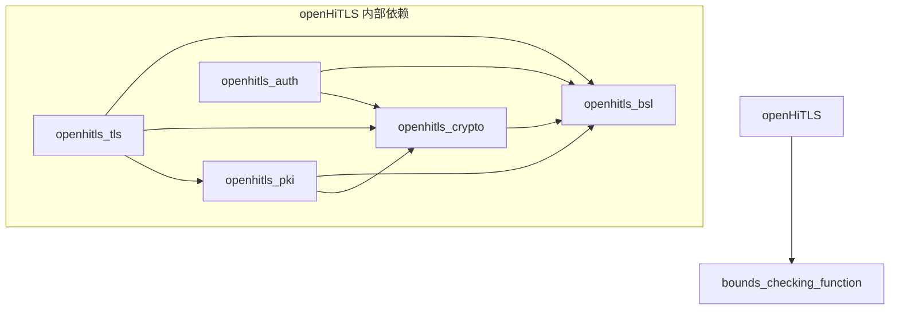
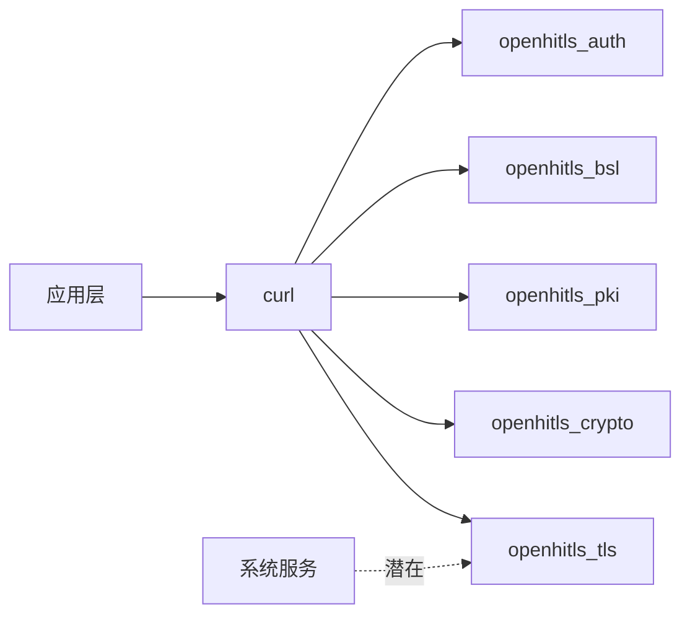
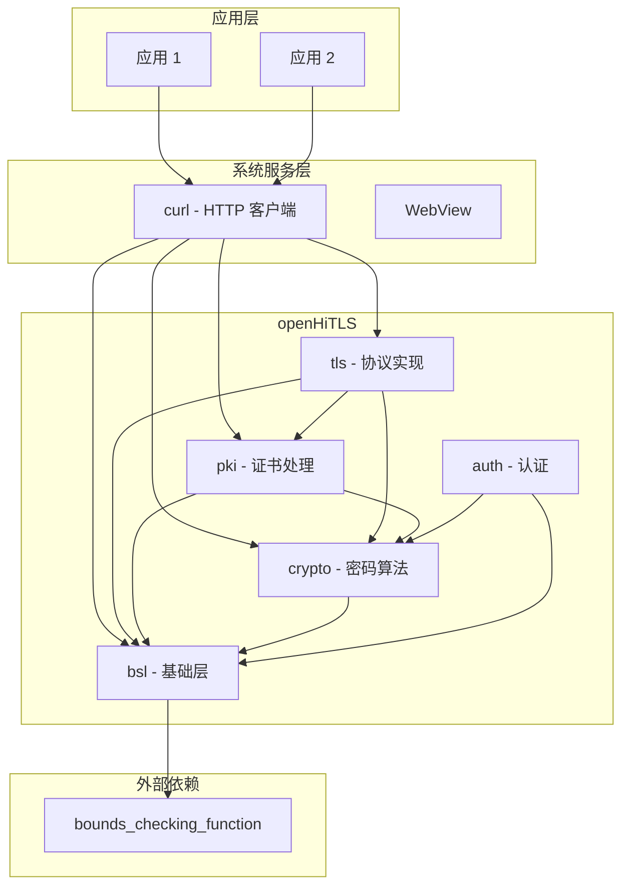

# OpenHarmony 中的依赖关系与使用

## 1. 依赖关系总览

### 1.1 该库的依赖



### 1.2 该库的被依赖关系



---

## 2. 直接依赖者详情

### 2.1 curl - 主要依赖者

**BUILD.gn 路径**: `third_party/curl/BUILD.gn`

#### 依赖检测逻辑 (lines 196-202)

```gn
support_gmssl = false
if (defined(global_parts_info) &&
    defined(global_parts_info.thirdparty_openhitls) &&
    global_parts_info.thirdparty_openhitls &&
    (is_linux || (is_ohos && is_standard_system)))  {
  support_gmssl = true
}
```

**说明**：
- 检测 openhitls 组件是否启用
- 仅在 Linux 或 OHOS Standard 系统启用
- 启用后 `support_gmssl = true`

#### 依赖声明 (lines 450-454, 628-632)

```gn
deps += [
    "openhitls:openhitls_bsl",
    "openhitls:openhitls_crypto",
    "openhitls:openhitls_pki",
    "openhitls:openhitls_tls",
    "openhitls:openhitls_auth",
]
```

#### 适配代码

**文件**: `third_party/curl/lib/vtls/openhitls.c` (约 1000+ 行)

**功能**：
- 初始化 openHiTLS 环境
- 实现 TLS 连接建立
- 证书验证回调
- 国密套件协商

**关键代码片段**：
```c
// 初始化
static int hitls_init(void)
{
    BSL_GLOBAL_Init();
    CRYPT_EAL_Init(CRYPT_EAL_INIT_CPU | CRYPT_EAL_INIT_PROVIDER);
    CRYPT_EAL_RandInit(CRYPT_RAND_SHA256, NULL, NULL, NULL, 0);
    HITLS_CertMethodInit();
    HITLS_CryptMethodInit();
    return TRUE;
}
```

### 2.2 其他潜在依赖者

通过全局搜索 `third_party/openhitls` 引用：

| 模块 | 状态 | 说明 |
|-----|------|------|
| curl | ✅ 已集成 | 国密 HTTPS 支持 |
| ace_engine | 🔍 未确认 | 可能用于网络请求 |
| media_foundation | 🔍 未确认 | 可能用于 DRM |

**当前确认的唯一依赖者是 curl**。

---

## 3. 使用方式详解

### 3.1 链接方式

openHiTLS 在 OpenHarmony 中以**动态链接库**形式提供：

| 库文件 | 用途 |
|-------|------|
| `libopenhitls_bsl.so` | 基础支持层 |
| `libopenhitls_crypto.so` | 密码算法 |
| `libopenhitls_pki.so` | PKI 证书 |
| `libopenhitls_tls.so` | TLS 协议 |
| `libopenhitls_auth.so` | 认证功能 |

### 3.2 头文件引用

**公共头文件位置**：
```
include/
├── auth/          # Auth 头文件
├── bsl/           # BSL 头文件
├── crypto/        # Crypto 头文件
├── pki/           # PKI 头文件
└── tls/           # TLS 头文件
```

**引用方式**：
```c
// BSL 层
#include "bsl_sal.h"
#include "bsl_err.h"

// Crypto 层
#include "crypt_eal_init.h"
#include "crypt_eal_rand.h"
#include "crypt_errno.h"

// TLS 层
#include "hitls.h"
#include "hitls_cert.h"

// PKI 层
#include "hitls_pki_cert.h"
#include "hitls_pki_x509.h"
```

### 3.3 BUILD.gn 引用方式

#### 引用单个组件

```gn
ohos_shared_library("my_module") {
    sources = ["my_source.c"]
    
    # 引用 Crypto 组件
    external_deps = [
        "openhitls:openhitls_crypto",
    ]
}
```

#### 引用多个组件

```gn
ohos_shared_library("my_tls_module") {
    sources = ["my_tls_source.c"]
    
    external_deps = [
        "openhitls:openhitls_bsl",
        "openhitls:openhitls_crypto",
        "openhitls:openhitls_pki",
        "openhitls:openhitls_tls",
    ]
}
```

---

## 4. 典型使用场景

### 4.1 场景一：国密 HTTPS 请求（curl）

```
┌─────────────────────────────────────────┐
│  应用发起 HTTPS 请求                     │
│  curl_easy_perform()                    │
└─────────────┬───────────────────────────┘
              ↓
┌─────────────────────────────────────────┐
│  curl 选择 TLS 后端                      │
│  - 标准 HTTPS: OpenSSL                  │
│  - 国密 HTTPS: openHiTLS                │
└─────────────┬───────────────────────────┘
              ↓
┌─────────────────────────────────────────┐
│  openHiTLS 执行 TLCP 握手                │
│  - 证书验证 (PKI)                       │
│  - SM2 密钥交换 (Crypto)                │
│  - SM4 加密通信 (Crypto)                │
└─────────────┬───────────────────────────┘
              ↓
┌─────────────────────────────────────────┐
│  国密 HTTPS 连接建立                     │
└─────────────────────────────────────────┘
```

### 4.2 场景二：证书验证

```c
// 示例：使用 PKI 组件验证证书
#include "hitls_pki_cert.h"
#include "hitls_pki_x509.h"

HITLS_X509_Cert *cert = NULL;
HITLS_X509_StoreCtx *store = HITLS_X509_StoreCtxNew();

// 加载 CA 证书
HITLS_X509_StoreCtxCtrl(store, HITLS_X509_STORECTX_SET_CA, ca_cert, 0);

// 加载待验证证书
HITLS_X509_CertParse(cert_data, cert_len, &cert);

// 验证证书链
int ret = HITLS_X509_CertVerify(store, cert);
if (ret == HITLS_SUCCESS) {
    // 验证通过
}
```

### 4.3 场景三：SM2 签名验签

```c
// 示例：使用 Crypto 组件进行 SM2 签名
#include "crypt_eal_pkey.h"
#include "crypt_eal_md.h"

// 初始化 SM2 密钥
CRYPT_EAL_PkeyCtx *pkey = CRYPT_EAL_PkeyNew(CRYPT_PKEY_SM2);

// 加载私钥
CRYPT_EAL_PkeyCtrl(pkey, CRYPT_CTRL_SET_PRIV_KEY, priv_key, key_len);

// SM2 签名
uint8_t sig[256];
uint32_t sig_len = sizeof(sig);
CRYPT_EAL_PkeySign(pkey, CRYPT_MD_SM3, data, data_len, sig, &sig_len);
```

### 4.4 场景四：随机数生成

```c
// 示例：使用 Crypto 组件生成安全随机数
#include "crypt_eal_rand.h"

// 初始化随机数生成器
CRYPT_EAL_RandInit(CRYPT_RAND_SHA256, NULL, NULL, NULL, 0);

// 生成随机数
uint8_t random[32];
CRYPT_EAL_Randbytes(random, sizeof(random));
```

---

## 5. NDK 使用方式

### 5.1 NDK 暴露

在 `BUILD.gn` 中配置：
```gn
ohos_shared_library("openhitls_crypto") {
    # ...
    innerapi_tags = ["llndk", "ndk"]
    # ...
}
```

**说明**：
- `llndk`:  Low Level NDK API
- `ndk`: NDK API
- 应用可通过 NDK 调用 openHiTLS 功能

### 5.2 应用层使用

**CMakeLists.txt**:
```cmake
find_library(OPENHITLS_CRYPTO_LIB openhitls_crypto)
find_library(OPENHITLS_BSL_LIB openhitls_bsl)

target_link_libraries(my_app
    ${OPENHITLS_CRYPTO_LIB}
    ${OPENHITLS_BSL_LIB}
)
```

**C 代码**:
```c
#include <hitls/crypto/crypt_eal_init.h>

// 初始化
CRYPT_EAL_Init(CRYPT_EAL_INIT_CPU);

// 使用 SM4 加密
// ...
```

---

## 6. 依赖关系图

### 6.1 完整依赖图



### 6.2 组件层级

```
┌─────────────────────────────────────────────┐
│  Tier 4: Auth (认证层)                       │
│  - PrivPass Token                           │
└──────────────┬──────────────────────────────┘
               │ 依赖
┌──────────────▼──────────────────────────────┐
│  Tier 3: TLS (协议层)                        │
│  - TLS 1.3/1.2, DTLS, TLCP                  │
└──────────────┬──────────────────────────────┘
               │ 依赖
┌──────────────▼──────────────────────────────┐
│  Tier 2: PKI + Crypto (功能层)               │
│  - PKI: 证书、X509                          │
│  - Crypto: 算法实现                         │
└──────────────┬──────────────────────────────┘
               │ 依赖
┌──────────────▼──────────────────────────────┐
│  Tier 1: BSL (基础层)                        │
│  - 内存、文件、网络、线程适配               │
└──────────────┬──────────────────────────────┘
               │ 依赖
┌──────────────▼──────────────────────────────┐
│  Tier 0: OS + bounds_checking                │
│  - 操作系统 API                             │
│  - 安全 C 库                                │
└─────────────────────────────────────────────┘
```

---

## 7. 部署位置

### 7.1 安装镜像

```gn
# BUILD.gn 配置
install_images = ["system", "updater"]
```

| 镜像 | 用途 |
|-----|------|
| `system` | 系统运行时库 |
| `updater` | 系统升级器（OTA 升级时需要） |

### 7.2 文件系统位置

```
/system/lib/
├── libopenhitls_bsl.so
├── libopenhitls_crypto.so
├── libopenhitls_pki.so
├── libopenhitls_tls.so
└── libopenhitls_auth.so
```

---

## 8. 使用最佳实践

### 8.1 按需引用

只引用需要的组件，减少依赖：

| 需求 | 引用组件 |
|-----|---------|
| 仅密码运算 | `openhitls_crypto` |
| 证书解析 | `openhitls_pki` |
| TLS 客户端 | `openhitls_tls` (自动依赖其他) |
| 完整功能 | 全部 5 个组件 |

### 8.2 初始化顺序

```c
// 正确的初始化顺序
BSL_GLOBAL_Init();                          // 1. BSL
CRYPT_EAL_Init(CRYPT_EAL_INIT_CPU);         // 2. Crypto
CRYPT_EAL_RandInit(...);                    // 3. 随机数
HITLS_CertMethodInit();                     // 4. PKI (如使用)
HITLS_CryptMethodInit();                    // 5. TLS (如使用)
```

### 8.3 资源释放

确保正确释放资源，避免内存泄漏：

```c
// 逆序清理
HITLS_CryptMethodDeInit();
HITLS_CertMethodDeInit();
CRYPT_EAL_RandDeInit();
CRYPT_EAL_DeInit();
BSL_GLOBAL_DeInit();
```

---

## 9. 故障排查

### 9.1 链接错误

**问题**: `undefined reference to 'CRYPT_EAL_Init'`

**解决**: 确认 `external_deps` 包含 `openhitls:openhitls_crypto`

### 9.2 初始化失败

**问题**: 调用失败，返回错误码

**解决**: 
1. 检查初始化顺序是否正确
2. 检查 BSL 层是否初始化成功
3. 查看 `bsl_err.h` 错误码定义

### 9.3 国密连接失败

**问题**: 无法建立 TLCP 连接

**解决**:
1. 确认 `HITLS_TLS_PROTO_TLCP11` 宏已定义
2. 检查证书是否为 SM2 证书
3. 确认对端支持 TLCP 协议
