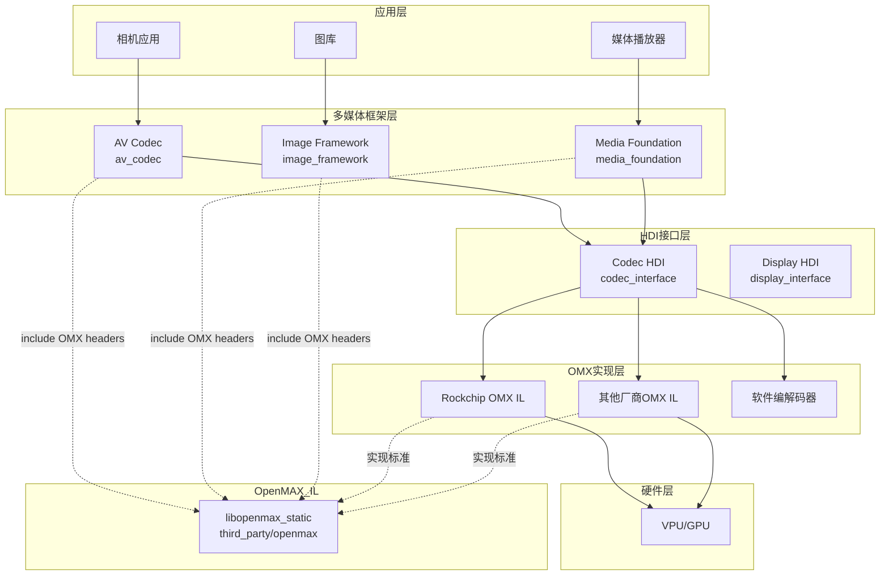

# 04_Usage_in_OH.md - OpenHarmony 中的依赖关系与使用

## 直接依赖者清单

### Foundation - 多媒体子系统

#### 1. AV Codec (av_codec)

| 模块 | BUILD.gn 路径 | 使用方式 |
|------|--------------|----------|
| **hcodec** | foundation/multimedia/av_codec/services/engine/codec/video/hcodec/BUILD.gn | 硬件编解码器核心实现 |

**引用方式**：
```gn
external_deps = [
  "openmax:libopenmax_static",
]
```

**使用场景**：
- H.264/H.265 视频硬件编码
- H.264/H.265 视频硬件解码
- 状态机管理（OMX 标准状态机）
- Buffer 管理（OMX_BUFFERHEADERTYPE）

#### 2. Media Foundation (media_foundation)

| 模块 | BUILD.gn 路径 | 使用方式 |
|------|--------------|----------|
| **codec_adapter** | foundation/multimedia/media_foundation/engine/plugin/plugins/codec_adapter/BUILD.gn | 编解码器适配器 |

**引用方式**：
```gn
public_external_deps = [
  "openmax:libopenmax_static",
]
```

**使用场景**：
- HiStreamer 框架的编解码器插件
- 封装 OMX 接口为 HiStreamer 插件 API
- Buffer 池管理
- 端口配置管理

#### 3. Image Framework (image_framework)

| 模块 | BUILD.gn 路径 | 使用方式 |
|------|--------------|----------|
| **libextplugin** | foundation/multimedia/image_framework/plugins/common/libs/image/libextplugin/BUILD.gn | 图像扩展插件 |
| **heif parser** | frameworks/innerkitsimpl/test/fuzztest/imageheif*/BUILD.gn | HEIF 图像解析 |

**使用场景**：
- HEIF 图像解码（使用 HEVC 硬件解码）
- 图像格式转换

### HDF - 硬件驱动框架

#### Codec HDI 接口

| 模块 | 路径 | 说明 |
|------|------|------|
| **Codec Interface** | drivers/interface/codec/ | Codec HDI 接口定义 |
| **libcodec_proxy** | drivers/peripheral/codec/ | Codec HDI 代理实现 |

**关系**：
- Codec HDI 接口定义使用了 OpenMAX IL 类型
- 但不是直接依赖 `libopenmax_static`，而是直接 include 头文件
- 具体实现由芯片厂商提供

### Device - 芯片厂商实现

#### Rockchip RK3568 示例

| 模块 | BUILD.gn 路径 | 功能 |
|------|--------------|------|
| **libOMXPlugin** | device/soc/rockchip/rk3568/hardware/omx_il/libOMXPlugin/BUILD.gn | OMX 插件加载器 |
| **core** | device/soc/rockchip/rk3568/hardware/omx_il/core/BUILD.gn | OMX 核心实现 |
| **osal** | device/soc/rockchip/rk3568/hardware/omx_il/osal/BUILD.gn | 操作系统抽象层 |
| **video/dec** | device/soc/rockchip/rk3568/hardware/omx_il/component/video/dec/BUILD.gn | 视频解码组件 |
| **video/enc** | device/soc/rockchip/rk3568/hardware/omx_il/component/video/enc/BUILD.gn | 视频编码组件 |
| **component/common** | device/soc/rockchip/rk3568/hardware/omx_il/component/common/BUILD.gn | 组件公共代码 |

**架构说明**：
- 这是芯片厂商的 OMX IL 实现示例
- 实现 OpenMAX IL 标准接口
- 对接 Rockchip VPU (Video Processing Unit)

### Test - 测试模块

#### XTS HATS 测试

| 模块 | BUILD.gn 路径 | 用途 |
|------|--------------|------|
| **hdi_component_additional** | test/xts/hats/hdf/codec/hdi_component_additional/BUILD.gn | HDI 组件附加测试 |
| **benchmarktest** | test/xts/hats/hdf/codec/benchmarktest/BUILD.gn | 性能基准测试 |

#### Fuzz 测试

| 模块 | BUILD.gn 路径 | 用途 |
|------|--------------|------|
| **hwvvcdecoderserver_fuzzer** | foundation/multimedia/av_codec/test/fuzztest/hwvvcdecoderserver_fuzzer/BUILD.gn | VVC 解码 Fuzz 测试 |
| **hwavcencoderserver_fuzzer** | foundation/multimedia/av_codec/test/fuzztest/hwavcencoderserver_fuzzer/BUILD.gn | AVC 编码 Fuzz 测试 |
| **hwhevcdecoderserver_fuzzer** | ... | HEVC 解码 Fuzz 测试 |
| **hwhevcencoderserver_fuzzer** | ... | HEVC 编码 Fuzz 测试 |
| ... | ... | ... |

## 依赖关系图

### 整体架构图



### 典型调用链

#### 视频播放场景

```
媒体播放器 (Media Kit)
    ↓
Media Foundation (HiStreamer)
    ↓
Codec Adapter (OMX IL 包装)
    ↓
Codec HDI (HDI 接口层)
    ↓
Vendor OMX IL 实现 (Rockchip)
    ↓
硬件 VPU
```

#### 相机录像场景

```
相机应用 (Camera Kit)
    ↓
Camera Service
    ↓
AV Codec (HCodec)
    ↓
Codec HDI
    ↓
Vendor OMX IL 实现
    ↓
硬件编码器
```

## 使用方式详解

### 静态链接 / 动态链接

| 方式 | 说明 | 本库情况 |
|------|------|----------|
| **头文件引用** | 直接 include 头文件 | ✅ 主要方式 |
| **静态链接** | 链接 libopenmax_static | ⚠️ 空库，仅传递配置 |
| **动态链接** | 运行时加载 | ❌ 无动态库 |

**本质**：本库是**纯头文件库**，使用时只需 include 头文件，不产生实际链接。

### 头文件引用方式

```c
// 标准 OMX 头文件
#include <OMX_Core.h>       // 核心 API
#include <OMX_Component.h>  // 组件接口
#include <OMX_Video.h>      // 视频编解码器定义
#include <OMX_Index.h>      // 参数索引

// OH 扩展头文件
#include <codec_omx_ext.h>  // OH 特有扩展
```

### 关键使用场景

#### 场景 1：枚举可用编解码器

```c
// 使用 OMX_Core.h 中的 API
OMX_API OMX_ERRORTYPE OMX_APIENTRY OMX_GetHandle(
    OMX_HANDLETYPE* pHandle,
    OMX_STRING cComponentName,
    OMX_PTR pAppData,
    OMX_CALLBACKTYPE* pCallbacks
);
```

**使用者**：
- av_codec 的 HCodec
- media_foundation 的 CodecAdapter

#### 场景 2：配置编解码器参数

```c
// 使用 OMX_Index.h 中的索引
OMX_SetParameter(handle, OMX_IndexParamVideoPortFormat, &format);
OMX_SetParameter(handle, OMX_IndexParamVideoAvc, &avcParams);

// 使用 OH 扩展
OMX_SetParameter(handle, OMX_IndexCodecVideoPortFormat, &codecFormat);
```

**使用者**：
- av_codec 的 type_converter.cpp
- media_foundation 的 hdi_codec_adapter.cpp

#### 场景 3：Buffer 管理

```c
// 标准 OMX Buffer
OMX_BUFFERHEADERTYPE* buffer;
OMX_AllocateBuffer(handle, &buffer, portIndex, pAppPrivate, nSizeBytes);

// 使用 Buffer (填充数据后)
OMX_EmptyThisBuffer(handle, buffer);  // 送解码
OMX_FillThisBuffer(handle, buffer);   // 回收 Buffer
```

**使用者**：
- media_foundation 的 codec_buffer_pool.cpp
- av_codec 的 hcodec.cpp

#### 场景 4：状态机控制

```c
// 状态转换
OMX_SendCommand(handle, OMX_CommandStateSet, OMX_StateIdle, NULL);
OMX_SendCommand(handle, OMX_CommandStateSet, OMX_StateExecuting, NULL);
OMX_SendCommand(handle, OMX_CommandStateSet, OMX_StateLoaded, NULL);
```

**使用者**：
- av_codec 的 state_machine.cpp
- media_foundation 的 codec_cmd_executor.cpp

## 依赖关系统计

### 按子系统统计

| 子系统 | 模块数 | 主要模块 |
|--------|--------|----------|
| **multimedia** | 15+ | av_codec, media_foundation, image_framework |
| **drivers** | 10+ | hdf codec interface, rockchip omx_il |
| **test** | 8+ | xts/hats, fuzzer tests |

### 按芯片平台统计

| 平台 | 实现路径 | 状态 |
|------|---------|------|
| **Rockchip RK3568** | device/soc/rockchip/rk3568/hardware/omx_il/ | 完整实现 |
| **其他平台** | (分散在各 device/soc/) | 待补充 |

## 重要模块详解

### AV Codec (av_codec)

**位置**：foundation/multimedia/av_codec/

**核心文件**：
- services/engine/codec/video/hcodec/hcodec.cpp
- services/engine/codec/video/hcodec/state_machine.cpp
- services/engine/codec/video/hcodec/type_converter.cpp

**功能**：
- 封装 OMX IL 为 OH AV Codec 接口
- 管理 OMX 组件生命周期
- Buffer 队列管理
- 错误处理与恢复

### Media Foundation (media_foundation)

**位置**：foundation/multimedia/media_foundation/

**核心文件**：
- engine/plugin/plugins/codec_adapter/hdi_codec_adapter.cpp
- engine/plugin/plugins/codec_adapter/codec_buffer_pool.cpp
- engine/plugin/plugins/codec_adapter/codec_cmd_executor.cpp

**功能**：
- 将 OMX IL 封装为 HiStreamer 插件
- 支持 GStreamer 风格 Pipeline
- Buffer 池优化

### Codec HDI Interface

**位置**：drivers/interface/codec/

**说明**：
- 定义 Codec 硬件抽象接口
- 使用 OpenMAX IL 类型作为基础
- 通过 HIDL/HDI 进行 IPC 调用

## 使用建议

### 对于多媒体开发者

1. **直接使用场景**：
   - 开发新的硬件编解码器支持
   - 优化 Buffer 管理策略

2. **避免直接使用**：
   - 应用层开发（使用 AV Codec Kit）
   - 通用媒体播放（使用 Media Kit）

### 对于芯片厂商

1. **必须实现**：
   - OMX_IL 标准接口
   - OH 扩展接口（codec_omx_ext.h）

2. **参考实现**：
   - Rockchip RK3568 实现（device/soc/rockchip/rk3568/hardware/omx_il/）

## 总结

| 维度 | 统计 |
|------|------|
| **直接依赖模块** | 20+ |
| **主要子系统** | multimedia, drivers, test |
| **使用方式** | 头文件 include |
| **核心场景** | 硬件视频编解码、图像处理 |
| **关键依赖者** | av_codec, media_foundation, image_framework |
