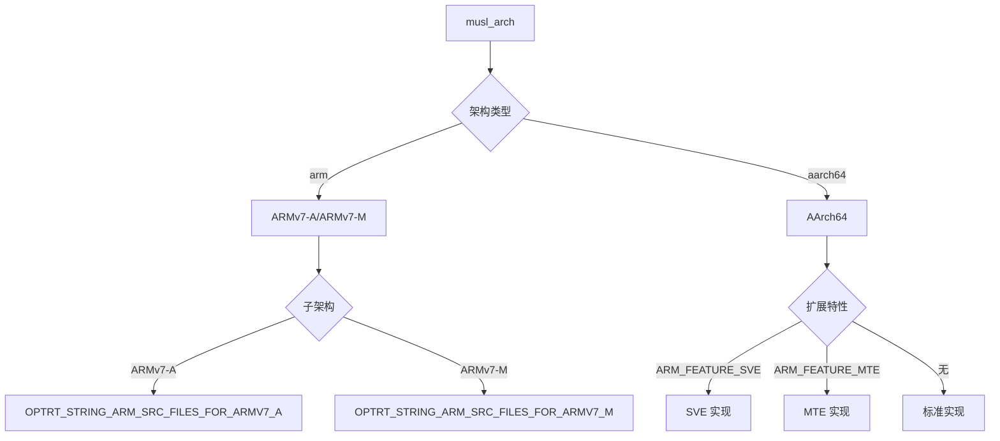

# 02 - OH 适配说明

本文档说明 OpenHarmony 对 optimized-routines 库的适配方式。

**核心结论**: OH 采用**构建系统集成**方式适配，**没有 Patch 文件**。所有适配通过 BUILD.gn 和相关配置文件实现，保持了与上游源码的同步能力。

---

## Patch 分析结果

### 搜索结果

```bash
find . -name "*.patch" -o -name "patches" -type d
# 无匹配结果
```

### 结论

**无 Patch 文件**。

OpenHarmony 不通过传统 Patch 方式修改 optimized-routines 源代码，而是通过以下方式集成：

| 适配类型 | 文件 | 作用 |
|---------|------|------|
| 构建系统配置 | `BUILD.gn` | 定义静态库目标和编译选项 |
| 构建变量定义 | `optimized-routines.gni` | 导出架构源文件列表 |
| 组件元数据 | `bundle.json` | OH 组件声明和依赖配置 |
| 开源审计 | `OAT.xml` | OSS 审计工具配置 |
| 开源声明 | `README.OpenSource` | 开源合规信息 |

---

## OH 适配方式详解

### 1. 构建系统集成

#### BUILD.gn 结构

`BUILD.gn` 定义了两个静态库目标：

```gn
if (!(is_lite_system && current_os == "ohos")) {
  # 主要静态库：字符串 + 数学优化
  ohos_static_library("optimized_static") {
    output_name = "liboptimize"
    sources = [...]
    public_configs = [ ":optimized_routines_config" ]
  }

  # 数学优化库（仅 AArch64）
  ohos_static_library("optimize_math") {
    output_name = "liboptimize_math"
    sources = [...]
  }
}
```

**导出的目标**:
- `optimized_static` (liboptimize.a) - ARMv7/AArch64 字符串 + 数学函数
- `optimize_math` (liboptimize_math.a) - AArch64 数学函数（cosf/sinf/sincosf）

#### 条件编译策略

BUILD.gn 使用多层条件编译选择架构特定实现：

```gn
if (musl_arch == "arm") {
  # ARMv7-A 架构
  sources += [
    "string/arm/memchr.S",
    "string/arm/memcpy.S",
    ...
  ]
  asmflags = [
    "-D__memcpy_arm = memcpy",
    "-D__memchr_arm = memchr",
  ]
} else if (musl_arch == "aarch64") {
  # AArch64 架构
  if (defined(ARM_FEATURE_SVE)) {
    # SVE 实现
    sources += [
      "string/aarch64/memcpy-sve.S",
      "string/aarch64/strlen-sve.S",
      ...
    ]
  } else if (defined(ARM_FEATURE_MTE)) {
    # MTE 实现
    sources += [
      "string/aarch64/memchr-mte.S",
      "string/aarch64/strchr-mte.S",
      ...
    ]
  } else {
    # 标准实现
    sources += [
      "string/aarch64/memcpy.S",
      "string/aarch64/strlen.S",
      ...
    ]
  }
}
```

**关键变量**:
- `musl_arch` - 选择 ARM 或 AArch64 架构
- `ARM_FEATURE_SVE` - 启用 SVE 可伸缩向量扩展
- `ARM_FEATURE_MTE` - 启用 MTE 内存标记扩展

---

### 2. 源码级集成

optimized-routines 采用**源码级集成**到 musl libc，而非独立静态库链接。

#### 集成方式

musl libc 的 BUILD.gn 直接引用 optimized-routines 的源文件：

```gn
# musl libc 的 BUILD.gn
import("//third_party/optimized-routines/optimized-routines.gni")

static_library("musl-c") {
  sources = [
    # musl 原有源文件
    ...

    # 直接添加 optimized-routines 源文件
  ] + OPTRT_STRING_ARM_SRC_FILES_FOR_ARMV7_M
}
```

#### optimized-routines.gni 内容

`.gni` 文件导出架构特定的源文件列表：

```gni
# ARMv7-A 架构源文件
OPTRT_STRING_ARM_SRC_FILES_FOR_ARMV7_A = [
  "$OPTRTDIR/string/arm/memchr.S",
  "$OPTRTDIR/string/arm/memcpy.S",
  "$OPTRTDIR/string/arm/strcmp.S",
  "$OPTRTDIR/string/arm/strcpy.c",
  "$OPTRTDIR/string/arm/strlen-armv6t2.S",
]

# ARMv7-M 架构源文件
OPTRT_STRING_ARM_SRC_FILES_FOR_ARMV7_M = [
  "$OPTRTDIR/string/arm/strcpy.c",
  "$OPTRTDIR/string/arm/strlen-armv6t2.S",
]
```

#### 源码级集成的优势

| 优势 | 说明 |
|------|------|
| **编译器跨模块优化** | 编译器可以跨 musl 和 optimized-routines 进行优化 |
| **避免符号冲突** | 不需要处理符号重名或版本问题 |
| **紧凑的二进制** | 链接器可以优化掉未使用的代码 |
| **简化依赖管理** | 不需要管理独立的库文件 |

---

### 3. 符号别名机制

#### 汇编级别符号映射

optimized-routines 的汇编文件使用符号别名与 musl libc 符号兼容：

```asm
// string/aarch64/memcpy.S
.global memcpy
.type memcpy, %function
memcpy:
  // ... 汇编实现 ...
  .size memcpy, .-memcpy

// 符号别名（用于 musl 引用）
.set __memcpy_aarch64, memcpy

// 其他符号别名
.set __memset_aarch64, memset
.set __memchr_aarch64, memchr
.set __strcmp_aarch64, strcmp
.set __strlen_aarch64, strlen
// ...
```

#### BUILD.gn 中的符号定义

通过汇编标志传递符号别名：

```gn
asmflags = [
  "-D__memcpy_aarch64 = memcpy",
  "-D__memset_aarch64 = memset",
  "-D__memchr_aarch64 = memchr",
  "-D__strcmp_aarch64 = strcmp",
  "-D__strlen_aarch64 = strlen",
  "-D__strcpy_aarch64 = strcpy",
  "-D__stpcpy_aarch64 = stpcpy",
  "-D__strchr_aarch64 = strchr",
  "-D__strrchr_aarch64 = strrchr",
  "-D__strchrnul_aarch64 = strchrnul",
  "-D__strnlen_aarch64 = strnlen",
  "-D__strncmp_aarch64 = strncmp",
]
```

#### 符号别名的作用

1. **兼容 musl libc 引用**
   - musl 可能引用 `__memcpy_aarch64` 等内部符号
   - 别名确保引用正确解析到优化的实现

2. **支持链接时选择**
   - 链接器可以根据别名选择最优实现
   - 避免 `memcpy` 等标准符号的冲突

---

## OH 特定文件清单

### 构建系统文件

| 文件 | 版权 | 作用 | OH 特定内容 |
|------|------|------|-----------|
| `BUILD.gn` | Huawei Device Co., Ltd. | OH 构建系统主配置 | `ohos_static_library`、`import("//build/ohos.gni")`、`subsystem_name = "thirdparty"` |
| `optimized-routines.gni` | Huawei Device Co., Ltd. | GN 构建变量定义 | `OPTRT_STRING_ARM_SRC_FILES_FOR_ARMV7_A`、`OPTRT_STRING_ARM_SRC_FILES_FOR_ARMV7_M`、`optimized_inherited_configs` |

### 组件声明文件

| 文件 | 版权 | 作用 | OH 特定内容 |
|------|------|------|-----------|
| `bundle.json` | Huawei Device Co., Ltd. | OH 组件包描述 | `name: "@ohos/optimized_routines"`、`subsystem: "thirdparty"`、`adapted_system_type: ["mini", "small", "standard"]` |
| `OAT.xml` | Huawei Device Co., Ltd. | OSS 审计工具配置 | 开源软件清单和合规信息 |
| `README.OpenSource` | Huawei Device Co., Ltd. | 开源声明 | 上游版本号、许可证、上游 URL |

### 版权说明

- **OH 特定文件**（BUILD.gn、optimized-routines.gni、bundle.json、OAT.xml）使用华为设备公司版权
- **原始源码**（math/、string/、networking/）保持 ARM Limited 版权
- **许可证**：MIT OR Apache-2.0 WITH LLVM-exception（双许可）

---

## 条件编译与架构支持

### 架构选择逻辑



### 架构支持矩阵

| 架构 | 变量 | 源文件目录 | 文件类型 |
|------|------|-----------|---------|
| ARMv7-A | `musl_arch == "arm"` | `string/arm/` | .S 汇编 |
| ARMv7-M | `musl_arch == "arm"` | `string/arm/` | .S 汇编（子集） |
| AArch64 标准 | `musl_arch == "aarch64"` | `string/aarch64/` | .S 汇编 |
| AArch64 + SVE | `ARM_FEATURE_SVE` | `string/aarch64/experimental/` | .S 汇编 |
| AArch64 + MTE | `ARM_FEATURE_MTE` | `string/aarch64/*-mte.S` | .S 汇编 |

### 扩展特性控制

| 特性 | 控制变量 | 文件后缀 | 说明 |
|------|---------|---------|------|
| SVE | `ARM_FEATURE_SVE` | `-sve.S` | 可伸缩向量扩展（实验性） |
| MTE | `ARM_FEATURE_MTE` | `-mte.S` | 内存标记扩展 |
| MOPS | 默认 | `-mops.S` | 内存操作指令集 |
| AdvSIMD | 默认 | `-advsimd.S` | NEON 128 位向量 |

---

## 与上游的兼容性

### 保持同步能力

**为什么没有 Patch？**
- OH 仅在构建系统层进行适配
- 源代码保持与上游一致
- 升级上游版本只需同步源码

**升级步骤**:
1. 保留 OH 特定文件（BUILD.gn、optimized-routines.gni、bundle.json、OAT.xml）
2. 同步上游源码（git fetch upstream）
3. 验证构建通过
4. 测试关键功能

### 已知的 OH 差异

| 差异类型 | 位置 | 说明 |
|---------|------|------|
| 添加 BUILD.gn | 项目根目录 | OH 构建系统配置 |
| 添加 optimized-routines.gni | 项目根目录 | 导出源文件列表 |
| 添加 bundle.json | 项目根目录 | OH 组件元数据 |
| 添加 OAT.xml | 项目根目录 | OSS 审计配置 |
| 添加 README.OpenSource | 项目根目录 | 开源声明 |

---

## 常见问题

### Q: 为什么不使用静态库链接方式？

A: 源码级集成有以下优势：
- 编译器可以跨模块优化（LTO 可以跨越 musl 和 optimized-routines）
- 避免符号冲突和版本问题
- 链接器可以优化掉未使用的代码
- 减少最终的二进制大小

### Q: 如何在设备上启用 SVE/MTE？

A: 通过 GN 变量在设备配置中定义：
```gni
# 设备配置文件
ARM_FEATURE_SVE = true  # 启用 SVE
ARM_FEATURE_MTE = true  # 启用 MTE
```

### Q: 符号别名是否会影响性能？

A: 不会。符号别名是汇编级别的等价映射，编译期解析，运行时无开销。

### Q: 升级上游版本后如何验证兼容性？

A: 验证步骤：
1. 检查符号别名是否需要更新（查看 .S 文件中的 `.set` 指令）
2. 检查 BUILD.gn 中的源文件路径是否匹配
3. 运行 musl libc 测试套件
4. 运行系统完整性测试

---

## 相关文档

- **[03_Build_Integration.md](03_Build_Integration.md)** - BUILD.gn 配置详解
- **[04_Usage_in_OH.md](04_Usage_in_OH.md)** - 使用情况和依赖
- **[README.md](README.md)** - 库概览和导航

---

**文档版本**: 1.0
**最后更新**: 2026-02-07
